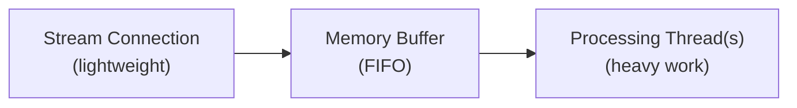

Aprende a construir clientes robustos que consuman datos de los endpoints de streaming de X.

## Descripción general de los endpoints de streaming

Los endpoints de streaming de X se categorizan por volumen:

| Categoría | Endpoints | Descripción |
|:---------|:----------|:------------|
| **Streams de alto volumen** | **Firehose**, [Volume Streams](/x-api/posts/volume-streams/introduction) (muestreados al 1% y 10%) | Entregan grandes volúmenes de datos de Posts sin filtrado. Diseñados para una cobertura completa de la actividad de la plataforma. |
| **Streams de menor volumen** | [Filtered Stream](/x-api/posts/filtered-stream/introduction) | Te permiten especificar palabras clave o criterios para recibir solo los Posts coincidentes. Ideal para monitorización dirigida. |
| **Streams de baja latencia** | [Powerstream](/x-api/powerstream/introduction) | Optimizados para la velocidad con un retraso mínimo. Mejores para casos de uso que requieren entrega de datos en tiempo real. |

## Entrega de datos y latencia

Los endpoints de streaming de la X API priorizan la **hidratación y entrega de datos**. Para asegurar que recibas datos de Posts hidratados con todos los metadatos, estos streams tienen una **latencia P99 de aproximadamente 6-7 segundos**.

### Garantías de entrega

| Métrica | Valor |
|:-------|:------|
| Estrategia de reintento | Backoff exponencial |
| Latencia P99 | ~6-7 segundos |

### Streams de alto volumen

Para los streams de alto volumen como Firehose y Sample (1% y 10%), **el 99% de todos los Posts se entregan dentro de 1 minuto** desde su hora de creación. Esta garantía se basa en la naturaleza continua y de alto volumen del feed completo de datos.

### Streams de menor volumen

Para streams con un volumen potencialmente menor, como Filtered Stream, los tiempos de entrega pueden variar según la especificidad de tus filtros y el volumen resultante de Posts coincidentes.

<Note>
Si tu caso de uso requiere una latencia menor, considera [Powerstream](/x-api/powerstream/introduction), que está optimizado para la velocidad y entrega datos con un retraso mínimo.
</Note>

<Warning>
La latencia y la entrega de datos pueden verse afectadas negativamente durante interrupciones. Consulta la [página de estado](https://developer.x.com/status) para obtener actualizaciones cuando ocurran problemas.
</Warning>

---

## Diseño del cliente

Al construir una solución con endpoints de streaming, tu cliente necesita:

1. **Establecer una conexión de streaming HTTPS** al endpoint de streaming
2. **Manejar volúmenes bajos de datos** — Mantener la conexión, detectando objetos Post y señales keep-alive
3. **Manejar volúmenes altos de datos** — Desacoplar la ingesta del stream del procesamiento usando procesos asíncronos, y asegurarse de que los buffers del lado del cliente se vacíen regularmente
4. **Gestionar el seguimiento del volumen** del lado del cliente
5. **Detectar desconexiones** y reconectarse automáticamente

Para endpoints con reglas (como Filtered Stream y Powerstream), tu cliente también debe enviar de forma asíncrona solicitudes para gestionar reglas sin desconectarse del stream.

---

## Conectarse a un endpoint de streaming

Establecer una conexión a los endpoints de streaming de la X API significa hacer una solicitud HTTP de muy larga duración y parsear la respuesta de forma incremental. Conceptualmente, puedes pensar en ello como descargar un archivo infinitamente largo por HTTP.

Una vez que se establece una conexión, el servidor de X entregará eventos de Post a través de la conexión mientras esta permanezca abierta.

```python
import requests

def connect_to_stream(url, bearer_token):
    headers = {"Authorization": f"Bearer {bearer_token}"}
    
    response = requests.get(url, headers=headers, stream=True)
    
    for line in response.iter_lines():
        if line:
            # Process the Post
            print(line.decode("utf-8"))
```

---

## Consumir datos

Los objetos JSON del stream pueden tener campos en cualquier orden, y no todos los campos estarán presentes en todas las circunstancias. Los Posts no se entregan en orden ordenado, y pueden ocurrir mensajes duplicados. Con el tiempo, se pueden agregar nuevos tipos de mensajes al stream.

Tu cliente debe tolerar:

- Campos que aparezcan en cualquier orden
- Campos inesperados o faltantes
- Posts no ordenados
- Mensajes duplicados
- Nuevos tipos de mensajes que aparezcan en cualquier momento

---

## Buffering

Los endpoints de streaming envían datos tan pronto como estén disponibles, lo que puede dar lugar a volúmenes altos. Si el servidor de X no puede escribir nuevos datos en el stream (por ejemplo, si tu cliente no está leyendo lo suficientemente rápido), almacenará contenido en un buffer de su lado. Sin embargo, cuando este buffer se llena, la conexión se cerrará y los Posts en el buffer se perderán.

Una forma de identificar cuándo tu app se queda atrás es comparar la marca de tiempo de los Posts recibidos con la hora actual y rastrear esto a lo largo del tiempo.

Para minimizar las acumulaciones en el stream:

- **Lee el stream rápidamente** — No hagas trabajo de procesamiento mientras lees. Pasa las actividades a otro hilo/proceso/almacén de datos para el procesamiento asíncrono
- **Asegura un ancho de banda suficiente** — Tu centro de datos necesita ancho de banda entrante para grandes volúmenes sostenidos, así como para picos (5-10 veces el volumen normal)

---

## Responder a mensajes del sistema

### Señales keep-alive

Al menos cada 20 segundos, el stream envía una señal keep-alive (heartbeat) en forma de un retorno de carro `\r\n` a través de la conexión abierta. Esto evita que tu cliente sufra timeout. Tu cliente debe tolerar estos caracteres.

Si tu cliente implementa un timeout de lectura en tu librería HTTP, puede confiar en el protocolo HTTP para lanzar un evento si no se lee ningún dato dentro de este período. Se recomienda envolver los métodos HTTP con manejadores de errores/eventos para detectar estos timeouts y activar una reconexión.

### Mensajes de error

Los endpoints de streaming pueden entregar mensajes de error dentro del stream. Tu cliente debe tolerar cargas útiles de mensajes cambiantes.

Ejemplo de formato de mensaje de error:

```json
{
  "errors": [{
    "title": "operational-disconnect",
    "disconnect_type": "UpstreamOperationalDisconnect",
    "detail": "This stream has been disconnected upstream for operational reasons.",
    "type": "https://api.x.com/2/problems/operational-disconnect"
  }]
}
```

<Note>
Los mensajes de error que indican una desconexión forzada debido a un buffer lleno pueden que nunca lleguen a tu cliente si la acumulación impide la entrega. Tu app no debe depender únicamente de estos mensajes para iniciar la reconexión.
</Note>

---

## Seguimiento del uso

Monitoriza los volúmenes de datos de tu stream para detectar desviaciones inesperadas. Una disminución significativa en el volumen puede indicar un problema distinto a una desconexión — el stream seguiría recibiendo señales keep-alive y algunos datos, pero un volumen reducido de Posts debe motivar una investigación.

Para crear monitorización:

1. Rastrea el número de Posts esperados en un período de tiempo determinado
2. Si el volumen cae por debajo de un umbral y no se recupera, inicia alertas
3. También monitoriza aumentos grandes, especialmente al modificar reglas o durante eventos que disparan la actividad de Posts

<Note>
Los Posts entregados a través de los endpoints de streaming cuentan para tu volumen mensual de Posts. Rastrea y ajusta el consumo para optimizar el uso. Si el volumen es alto, considera añadir un operador `sample:` a las reglas para reducir la coincidencia del 100% a `sample:50` o `sample:25`.
</Note>

---

## Procesamiento multihilo

Construir una aplicación multihilo es clave para manejar streams de alto volumen. Una buena práctica:

1. **Hilo de stream** — Un hilo ligero que establece la conexión y escribe el JSON recibido en una estructura en memoria o en un lector de stream con buffer
2. **Hilo(s) de procesamiento** — Hilos separados que consumen del buffer y hacen el trabajo pesado: parsear JSON, preparar escrituras en la base de datos u otra lógica de la aplicación

Este diseño permite que tu servicio escale eficientemente a medida que cambian los volúmenes de Posts entrantes.



---

## Próximos pasos

<CardGroup cols={2}>
  <Card title="Gestión de desconexiones" icon="plug" href="/x-api/fundamentals/handling-disconnections">
    Reconéctate sin sobresaltos cuando se caigan las conexiones
  </Card>
  <Card title="Capacidad de alto volumen" icon="gauge-high" href="/x-api/fundamentals/high-volume-capacity">
    Maneja streams de alto rendimiento
  </Card>
  <Card title="Recuperación y redundancia" icon="/icons/xds/icon-shield-keyhole.svg" href="/x-api/fundamentals/recovery-and-redundancy">
    Construye aplicaciones de streaming resilientes
  </Card>
</CardGroup>
