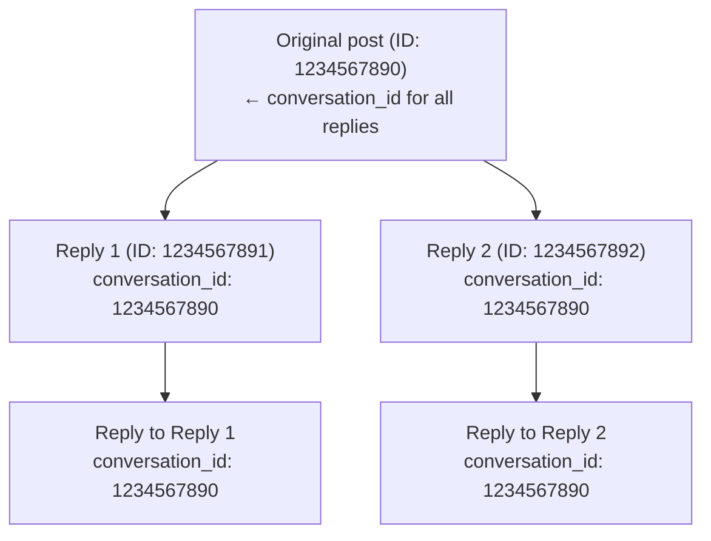

Cada respuesta en X pertenece a un hilo de conversación. El campo `conversation_id` te permite identificar, rastrear y reconstruir árboles completos de conversación.

---

## Cómo funciona

Cuando alguien publica y otros responden, todas las respuestas comparten el mismo `conversation_id`: el ID del post original que inició la conversación.



No importa cuán profundo llegue el hilo, todos los posts comparten el mismo `conversation_id`.

---

## Solicitar conversation_id

Añade `conversation_id` a tus `tweet.fields`:

```bash
curl "https://api.x.com/2/tweets/1234567891?tweet.fields=conversation_id,in_reply_to_user_id,referenced_tweets" \
  -H "Authorization: Bearer $TOKEN"
```

Respuesta:

```json title="Ejemplo de respuesta" lines wrap icon="/icons/xds/icon-brackets.svg"
{
  "data": {
    "id": "1234567891",
    "text": "@user Great point!",
    "conversation_id": "1234567890",
    "in_reply_to_user_id": "2244994945",
    "referenced_tweets": [{
      "type": "replied_to",
      "id": "1234567890"
    }]
  }
}
```

---

## Obtener una conversación completa

Usa `conversation_id` como operador de búsqueda para recuperar todos los posts en un hilo:

```bash
curl "https://api.x.com/2/tweets/search/recent?\
query=conversation_id:1234567890&\
tweet.fields=author_id,created_at,in_reply_to_user_id&\
expansions=author_id" \
  -H "Authorization: Bearer $TOKEN"
```

Esto devuelve todas las respuestas al post original, ordenadas en orden cronológico inverso.

---

## Casos de uso

<Tabs>
  <Tab title="Reconstrucción del hilo">
Construye el árbol completo de la conversación:

```python title="Ejemplo" lines wrap icon="python"
import requests

conversation_id = "1234567890"
url = f"https://api.x.com/2/tweets/search/recent"
params = {
    "query": f"conversation_id:{conversation_id}",
    "tweet.fields": "author_id,in_reply_to_user_id,referenced_tweets,created_at",
    "max_results": 100
}

response = requests.get(url, headers=headers, params=params)
replies = response.json()["data"]

# Sort by created_at to get chronological order
replies.sort(key=lambda x: x["created_at"])
```
  </Tab>
  <Tab title="Monitorización de conversación">
Transmite en tiempo real las respuestas a conversaciones específicas:

```bash
# Add a filtered stream rule for a conversation
curl -X POST "https://api.x.com/2/tweets/search/stream/rules" \
  -H "Authorization: Bearer $TOKEN" \
  -d '{"add": [{"value": "conversation_id:1234567890"}]}'
```
  </Tab>
  <Tab title="Analíticas de conversación">
Cuenta las respuestas en una conversación:

```bash
curl "https://api.x.com/2/tweets/counts/recent?\
query=conversation_id:1234567890" \
  -H "Authorization: Bearer $TOKEN"
```
  </Tab>
</Tabs>

---

## Campos relacionados

| Campo | Descripción |
|:------|:------------|
| `conversation_id` | ID del post original que inició el hilo |
| `in_reply_to_user_id` | ID de usuario del post al que se está respondiendo |
| `referenced_tweets` | Array con `type: "replied_to"` y el ID del post padre |

---

## Ejemplo: Recuperación de un hilo completo

```json title="Ejemplo de respuesta" expandable lines wrap icon="/icons/xds/icon-brackets.svg"
{
  "data": [
    {
      "id": "1234567893",
      "text": "@user2 @user1 I agree with you both!",
      "conversation_id": "1234567890",
      "author_id": "3333333333",
      "created_at": "2024-01-15T12:05:00.000Z",
      "in_reply_to_user_id": "2222222222",
      "referenced_tweets": [{"type": "replied_to", "id": "1234567892"}]
    },
    {
      "id": "1234567892",
      "text": "@user1 That's interesting!",
      "conversation_id": "1234567890",
      "author_id": "2222222222",
      "created_at": "2024-01-15T12:03:00.000Z",
      "in_reply_to_user_id": "1111111111",
      "referenced_tweets": [{"type": "replied_to", "id": "1234567890"}]
    },
    {
      "id": "1234567891",
      "text": "@user1 Great point!",
      "conversation_id": "1234567890",
      "author_id": "4444444444",
      "created_at": "2024-01-15T12:02:00.000Z",
      "in_reply_to_user_id": "1111111111",
      "referenced_tweets": [{"type": "replied_to", "id": "1234567890"}]
    }
  ],
  "meta": {
    "result_count": 3
  }
}
```

---

## Notas

- El `conversation_id` del post original es igual a su propio `id`
- `conversation_id` está disponible en todos los endpoints v2 que devuelven posts
- Úsalo con [filtered stream](/x-api/posts/filtered-stream/introduction) para monitorizar conversaciones en tiempo real
- Combínalo con [paginación](/x-api/fundamentals/pagination) para hilos grandes

---

## Próximos pasos

<CardGroup cols={2}>
  <Card title="Buscar posts" icon="/icons/xds/icon-search.svg" href="/x-api/posts/search/introduction">
    Busca por conversation_id.
  </Card>
  <Card title="Filtered stream" icon="signal-stream" href="/x-api/posts/filtered-stream/introduction">
    Monitoriza conversaciones en tiempo real.
  </Card>
</CardGroup>
