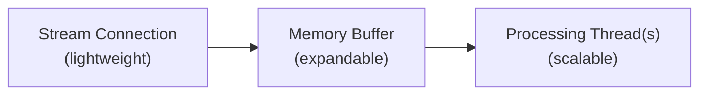

Aprende a prepararte para eventos de alto volumen al usar los endpoints de streaming de X, incluidos [Filtered Stream](/x-api/posts/filtered-stream/introduction), [Volume Streams](/x-api/posts/volume-streams/introduction), [Powerstream](/x-api/powerstream/introduction) y [Compliance Streams](/x-api/compliance/streams/introduction).

## Planificación para eventos de alto volumen

Los grandes eventos nacionales y globales a menudo van acompañados de dramáticos picos en la actividad de usuarios en redes sociales. A veces estos eventos se conocen con antelación:

- Super Bowl
- Elecciones políticas
- Celebraciones de Año Nuevo en todo el mundo

Otras veces, los picos son inesperados:

- Desastres naturales
- Eventos políticos no planificados
- Momentos de la cultura pop
- Emergencias de salud

Estas ráfagas pueden ser de corta duración (segundos) o sostenerse durante varios minutos. Una preparación adecuada ayuda a tus aplicaciones a manejar estos picos.

---

## Revisa tus reglas de stream

Antes de eventos de alto volumen:

- Ciertas palabras clave pueden dispararse durante eventos (por ejemplo, menciones de marca cuando una marca patrocina un evento deportivo importante)
- Elimina reglas innecesarias o demasiado genéricas que puedan generar volúmenes de actividad excesivos
- Comunícate con los stakeholders antes de eventos conocidos de alto volumen para ayudarlos a planificar adecuadamente

---

## Realiza pruebas de estrés en tu aplicación

Anticipa que los volúmenes de ráfaga pueden alcanzar **5-10 veces los niveles de consumo diario promedio**. Dependiendo de tus reglas, el aumento puede ser mucho mayor.

Prueba tu aplicación con volúmenes altos simulados para identificar cuellos de botella antes de que ocurran eventos reales.

---

## Comprende los límites de entrega

Los límites de flujo y entrega se basan en tu nivel de acceso:

| Nivel de acceso | Límite de entrega |
|:-------------|:-------------|
| Academic | 250 Posts/segundo |
| Enterprise | Posts/segundo establecidos según el nivel de acceso |

---

## Mantente conectado

Con los streams, mantenerse conectado es esencial para evitar perder datos.

Tu aplicación cliente debe:

1. **Detectar desconexiones** inmediatamente
2. **Reintentar conexiones** usando estrategias de backoff apropiadas
3. **Usar backoff exponencial** si los intentos de reconexión fallan

Consulta [Gestión de desconexiones](/x-api/fundamentals/handling-disconnections) para estrategias detalladas de reconexión.

---

## Implementa buffering del lado del cliente

Construir una aplicación multihilo es clave para gestionar streams de alto volumen:

### Arquitectura recomendada

1. **Hilo de stream** (ligero)
   - Establece la conexión de streaming
   - Escribe el JSON recibido en una estructura en memoria o en un lector de stream con buffer
   - Solo maneja los datos entrantes — sin procesamiento

2. **Buffer en memoria**
   - Crece y se contrae según sea necesario
   - Actúa como un amortiguador para los picos de volumen

3. **Hilo(s) de procesamiento** (trabajo pesado)
   - Consume del buffer
   - Parsea JSON
   - Prepara escrituras en base de datos
   - Maneja la lógica de la aplicación

---

## Considera las zonas horarias

Los eventos globales ocurren en zonas horarias globales. Los eventos pueden ocurrir:

- Después del horario laboral
- Durante fines de semana
- Durante días festivos

Asegúrate de que tu equipo esté preparado para picos fuera del horario laboral normal. Considera:

- Sistemas de alertas automatizados
- Rotaciones de guardia
- Respuestas de escalado automatizadas

---

## Recomendaciones de monitorización

1. **Rastrea el volumen de Posts** en tiempo real
2. **Configura alertas** para umbrales de volumen (tanto aumentos como disminuciones)
3. **Monitoriza los tamaños del buffer** para detectar cuándo tu procesamiento se retrasa
4. **Compara las marcas de tiempo de los Posts** con la hora actual para identificar retrasos

---

## Medidas de emergencia

Implementa salvaguardas para circunstancias extremas:

- **Alertas automatizadas** cuando el volumen supera umbrales preestablecidos
- **Eliminación automatizada de reglas** para reglas que traen datos excesivos
- **Desconexión del stream** en circunstancias extremas para proteger tus sistemas
- **Operadores de muestreo** — añade `sample:` a las reglas para reducir el volumen coincidente

---

## Próximos pasos

<CardGroup cols={2}>
  <Card title="Consumo de datos de streaming" icon="stream" href="/x-api/fundamentals/consuming-streaming-data">
    Construye clientes de streaming robustos
  </Card>
  <Card title="Gestión de desconexiones" icon="plug" href="/x-api/fundamentals/handling-disconnections">
    Reconéctate sin sobresaltos
  </Card>
  <Card title="Recuperación y redundancia" icon="/icons/xds/icon-shield-keyhole.svg" href="/x-api/fundamentals/recovery-and-redundancy">
    Construye aplicaciones resilientes
  </Card>
</CardGroup>
