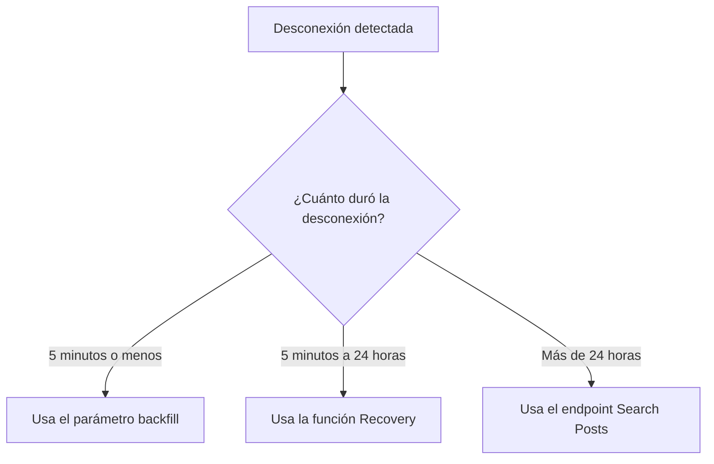

Aprende a maximizar el tiempo de conexión y recuperar los datos perdidos al usar los endpoints de streaming de X, incluidos [Filtered Stream](/x-api/posts/filtered-stream/introduction), [Firehose Streams](/x-api/stream/stream-all-posts), [Volume Streams](/x-api/posts/volume-streams/introduction), [Powerstream](/x-api/powerstream/introduction) y [Compliance Streams](/x-api/compliance/streams/introduction).

## Descripción general

Al consumir datos de streaming, maximizar el tiempo de conexión y recibir todos los datos coincidentes es un objetivo fundamental. Esto requiere:

- Aprovechar las conexiones redundantes
- Detectar desconexiones automáticamente
- Reconectarse rápidamente
- Tener un plan para recuperar los datos perdidos

---

## Conexiones redundantes

Una conexión redundante te permite establecer más de una conexión simultánea a un stream. Esto proporciona redundancia al conectarte con dos consumidores separados, recibiendo los mismos datos a través de ambas conexiones.

Beneficios:
- Hot failover si un stream se desconecta
- Protección si tu servidor principal falla
- Entrega continua de datos durante la reconexión

### Cómo usarlo

Simplemente conéctate a la misma URL del stream con un segundo cliente. Los datos se enviarán a través de ambas conexiones.

<Note>
Las conexiones redundantes están disponibles con acceso Enterprise. Filtered Stream permite hasta dos conexiones redundantes para proyectos Enterprise. Firehose Streams usan un parámetro `partition` para admitir hasta 20 conexiones concurrentes, mientras que Sample10 (Decahose) admite hasta 2 particiones. Consulta la documentación específica de tu endpoint para conocer los límites de conexión.
</Note>

---

## Backfill

Después de detectar una desconexión, tu sistema debe rastrear cuánto duró la desconexión para determinar el método de recuperación apropiado.

### Para desconexiones de 5 minutos o menos

Usa el **parámetro backfill** al reconectarte para recibir los Posts que coincidieron durante el período de desconexión.

| Endpoint | Parámetro | Ejemplo |
|:---------|:----------|:--------|
| Filtered Stream | `backfill_minutes` | `?backfill_minutes=5` |
| Firehose Stream | `backfill_minutes` | `?backfill_minutes=5` |
| Sample Stream (1%) | `backfill_minutes` | `?backfill_minutes=5` |
| Sample10 Stream (Decahose) | `backfill_minutes` | `?backfill_minutes=5` |
| Powerstream | `backfillMinutes` | `?backfillMinutes=5` |

Ejemplos de solicitudes:

**Filtered Stream:**

```bash
curl 'https://api.x.com/2/tweets/search/stream?backfill_minutes=5' \
  -H "Authorization: Bearer $ACCESS_TOKEN"
```

**Firehose Stream:**

```bash
curl 'https://api.x.com/2/tweets/firehose/stream?backfill_minutes=5&partition=1' \
  -H "Authorization: Bearer $ACCESS_TOKEN"
```

<Note>
**Consideraciones importantes:**
- Los Posts más antiguos generalmente se entregan primero, antes de los Posts recién coincidentes
- Los Posts **no** están deduplicados — si estuviste desconectado durante 90 segundos pero solicitas 2 minutos de backfill, recibirás 30 segundos de Posts duplicados
- Tu sistema debe tolerar duplicados
- El backfill está disponible con acceso Enterprise
</Note>

---

## Recuperación

Para desconexiones que duren **más de 5 minutos**, usa la función de Recuperación para reproducir los datos perdidos dentro de las últimas 24 horas.

### Cómo funciona la Recuperación

1. Realiza una solicitud de conexión con los parámetros `start_time` y `end_time`
2. La recuperación vuelve a transmitir el período de tiempo especificado
3. Una vez completada, la conexión se desconecta

### Parámetros

| Parámetro | Tipo | Descripción |
|:----------|:-----|:------------|
| `start_time` | Fecha ISO 8601 | Hora de inicio desde la que recuperar (UTC) |
| `end_time` | Fecha ISO 8601 | Hora de fin hasta la que recuperar (UTC) |

### Ejemplo de solicitud

**Filtered Stream:**

```bash
curl 'https://api.x.com/2/tweets/search/stream?start_time=2022-07-12T15:10:00Z&end_time=2022-07-12T15:20:00Z' \
  -H "Authorization: Bearer $ACCESS_TOKEN"
```

**Firehose Stream:**

```bash
curl 'https://api.x.com/2/tweets/firehose/stream?start_time=2022-07-12T15:10:00Z&end_time=2022-07-12T15:20:00Z&partition=1' \
  -H "Authorization: Bearer $ACCESS_TOKEN"
```

**Powerstream:**

```bash
curl 'https://api.x.com/2/powerstream?startTime=2022-07-12T15:10:00Z&endTime=2022-07-12T15:20:00Z' \
  -H "Authorization: Bearer $ACCESS_TOKEN"
```

<Note>
**Límites de recuperación:**
- Disponible con acceso Enterprise
- Ventana de recuperación: hasta 24 horas en el pasado
- Filtered Stream permite 2 trabajos de recuperación concurrentes
- Firehose, Sample10 (Decahose) y los streams firehose específicos por idioma también admiten recuperación
- El Sample Stream básico del 1% no admite recuperación; usa el endpoint Search en su lugar
</Note>

---

## Recuperación alternativa: Search

Si no tienes acceso a las funciones de backfill o recuperación, o si la desconexión superó las 24 horas, puedes usar el [endpoint Search Posts](/x-api/posts/search/introduction) para solicitar los datos perdidos.

<Warning>
**Diferencias de coincidencia:**
El endpoint Search Posts no incluye los operadores `sample:`, `bio:`, `bio_name:` ni `bio_location:`, y tiene ciertas diferencias en el comportamiento de coincidencia con acentos y diacríticos. Esto significa que es posible que no recuperes por completo todos los Posts que se habrían recibido a través de los endpoints de streaming.
</Warning>

---

## Árbol de decisión de recuperación



---

## Buenas prácticas

1. **Rastrea la duración de la desconexión** — Tu sistema debe anotar cuándo ocurren las desconexiones y cuánto duran

2. **Implementa recuperación automática** — Según la duración de la desconexión, elige automáticamente el método de recuperación apropiado

3. **Gestiona los duplicados** — Tanto backfill como recovery pueden entregar Posts duplicados; implementa lógica de deduplicación

4. **Usa conexiones redundantes** — Evita la pérdida de datos manteniendo múltiples conexiones cuando estén disponibles

5. **Monitoriza los trabajos de recuperación** — Rastrea el estado y la finalización de las operaciones de recuperación

---

## Próximos pasos

<CardGroup cols={2}>
  <Card title="Gestión de desconexiones" icon="plug" href="/x-api/fundamentals/handling-disconnections">
    Detecta y gestiona desconexiones
  </Card>
  <Card title="Consumo de datos de streaming" icon="stream" href="/x-api/fundamentals/consuming-streaming-data">
    Construye clientes de streaming robustos
  </Card>
  <Card title="Capacidad de alto volumen" icon="gauge-high" href="/x-api/fundamentals/high-volume-capacity">
    Maneja streams de alto rendimiento
  </Card>
</CardGroup>
