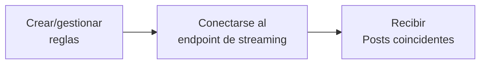

import { Button } from '/snippets/button.mdx';

Los endpoints de Filtered Stream te permiten recibir Posts casi en tiempo real que coincidan con tus reglas de filtrado. Crea reglas usando operadores potentes y luego conéctate a un stream persistente para recibir Posts coincidentes a medida que se publican.

<Note>
Filtered Stream prioriza la hidratación y entrega de datos, con aproximadamente 6-7 segundos de latencia P99. Para requisitos de latencia más baja, consulta [Powerstream](/x-api/powerstream/introduction).
</Note>

## Descripción general

<CardGroup cols={2}>
  <Card title="Entrega casi en tiempo real" icon="bolt">
    Recibe Posts en segundos tras su publicación
  </Card>
  <Card title="Reglas persistentes" icon="/icons/xds/icon-filter.svg">
    Añade y elimina reglas sin desconectarte
  </Card>
  <Card title="Operadores potentes" icon="/icons/xds/icon-search.svg">
    Coincide con palabras clave, hashtags, usuarios y más
  </Card>
  <Card title="Entrega por webhook" icon="webhook">
    Opcionalmente recibe Posts a través de webhooks
  </Card>
</CardGroup>

---

## Cómo funciona

1. **Crear reglas** — define reglas de filtrado usando operadores
2. **Conectarse al stream** — establece una conexión HTTP persistente
3. **Recibir Posts** — obtén Posts coincidentes casi en tiempo real



---

## Endpoints

| Method | Endpoint | Description |
|:-------|:---------|:------------|
| GET | [`/2/tweets/search/stream`](/x-api/stream/stream-filtered-posts) | Conéctate al stream |
| POST | [`/2/tweets/search/stream/rules`](/x-api/stream/update-stream-rules) | Añade o elimina reglas |
| GET | [`/2/tweets/search/stream/rules`](/x-api/stream/get-stream-rules) | Lista las reglas actuales |

---

## Niveles de acceso

| Feature | Pay-per-use | Enterprise |
|:--------|:------------|:-----------|
| Reglas por proyecto | 1,000 | 25,000+ |
| Longitud de regla | 1,024 caracteres | 2,048 caracteres |
| Conexiones | 1 | Múltiples |
| Operadores Core | ✓ | ✓ |
| Operadores de embedding semántico | — | ✓ (requiere Embedding tier) |

<Card title="Contáctanos para Enterprise" icon="/icons/xds/icon-bank.svg" href="https://developer.x.com/en/products/x-api/enterprise/enterprise-api-interest-form">
  Obtén límites más altos y funciones adicionales
</Card>

<Note>
Algunos operadores requieren niveles específicos. El operador semántico `embedding:` está disponible **solo para Filtered Stream** en planes Enterprise con acceso al Embedding tier. El acceso Pay-per-use estándar incluye solo operadores core.
</Note>

---

## Construir reglas

Las reglas usan los mismos operadores que las consultas de búsqueda:

```
(AI OR "machine learning") lang:en -is:retweet
```

### Ejemplos de reglas

| Rule | Matches |
|:-----|:--------|
| `#python` | Posts con el hashtag #python |
| `from:elonmusk` | Posts de @elonmusk |
| `"breaking news" has:images` | Posts con la frase e imágenes |
| `(@XDevelopers OR @X) -is:retweet` | Menciones, excluyendo retweets |
| `embedding:"climate change policy"` | Posts sobre política climática de forma semántica (Enterprise + Embedding tier) |

<Card title="Construir una regla" icon="/icons/xds/icon-filter.svg" href="/x-api/posts/filtered-stream/integrate/build-a-rule">
  Aprende la sintaxis y los operadores de las reglas
</Card>

---

## Conectarse al stream

Establece una conexión HTTP persistente para recibir Posts:

```python
import requests

def stream_posts(bearer_token):
    url = "https://api.x.com/2/tweets/search/stream"
    headers = {"Authorization": f"Bearer {bearer_token}"}
    
    response = requests.get(url, headers=headers, stream=True)
    
    for line in response.iter_lines():
        if line:
            print(line.decode("utf-8"))
```

### Señales de keep-alive

El stream envía líneas en blanco (`\r\n`) cada 20 segundos para mantener la conexión. Si no recibes datos o un keep-alive durante 20 segundos, vuelve a conectarte.

<CardGroup cols={2}>
  <Card title="Manejo de desconexiones" icon="plug" href="/x-api/fundamentals/handling-disconnections">
    Reconéctate de forma controlada
  </Card>
  <Card title="Consumo de datos en streaming" icon="stream" href="/x-api/fundamentals/consuming-streaming-data">
    Procesa Posts de forma eficiente
  </Card>
</CardGroup>

---

## Entrega por webhook

En lugar de mantener una conexión persistente, puedes recibir Posts a través de webhooks:

<Card title="Entrega por webhook" icon="webhook" href="/x-api/webhooks/stream/introduction">
  Configura la entrega por webhook para filtered stream
</Card>

---

## Ediciones de Post

El stream entrega Posts editados con su historial de edición. Cada edición crea un nuevo ID de Post:

```json
{
  "data": {
    "id": "1234567893",
    "text": "Hello world! (edited)",
    "edit_history_tweet_ids": ["1234567890", "1234567891", "1234567893"]
  }
}
```

<Card title="Fundamentos de edición de Posts" icon="/icons/xds/icon-history.svg" href="/x-api/fundamentals/edit-posts">
  Aprende más sobre las ediciones de Posts
</Card>

---

## Cómo empezar

<Note>
**Requisitos previos**

- Una [cuenta de desarrollador](https://developer.x.com/en/portal/petition/essential/basic-info) aprobada
- Un [Project y App](/resources/fundamentals/developer-apps) en la Developer Console
- El [Bearer Token](/resources/fundamentals/authentication) de tu App
</Note>

<CardGroup cols={2}>
  <Card title="Quickstart" icon="/icons/xds/icon-rocket.svg" href="/x-api/posts/filtered-stream/quickstart">
    Conéctate al stream en minutos
  </Card>
  <Card title="Construir una regla" icon="/icons/xds/icon-filter.svg" href="/x-api/posts/filtered-stream/integrate/build-a-rule">
    Aprende la sintaxis de las reglas
  </Card>
  <Card title="Referencia de operadores" icon="list-check" href="/x-api/posts/filtered-stream/integrate/operators">
    Todos los operadores disponibles
  </Card>
  <Card title="Código de ejemplo" icon="github" href="https://github.com/xdevplatform/Twitter-API-v2-sample-code">
    Ejemplos de código funcional
  </Card>
</CardGroup>

---

## Temas avanzados

<CardGroup cols={2}>
  <Card title="Manejo de desconexiones" icon="plug" href="/x-api/fundamentals/handling-disconnections">
    Reconéctate de forma controlada
  </Card>
  <Card title="Capacidad de alto volumen" icon="gauge-high" href="/x-api/fundamentals/high-volume-capacity">
    Maneja un alto rendimiento
  </Card>
  <Card title="Recuperación y redundancia" icon="/icons/xds/icon-shield-keyhole.svg" href="/x-api/fundamentals/recovery-and-redundancy">
    Construye aplicaciones resilientes
  </Card>
  <Card title="Coincidencia de Posts devueltos" icon="crosshairs" href="/x-api/posts/filtered-stream/integrate/matching-returned-tweets">
    Identifica qué reglas coincidieron
  </Card>
</CardGroup>
