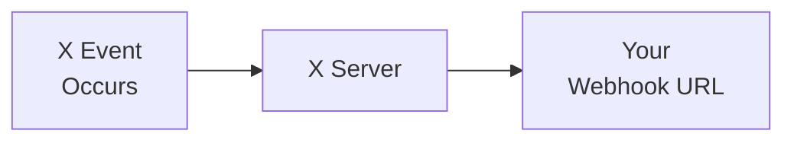

import { Button } from '/snippets/button.mdx';

La V2 Webhooks API permite a los desarrolladores recibir notificaciones de eventos en tiempo real desde cuentas de X mediante mensajes JSON basados en webhooks. Estas APIs te permiten registrar y gestionar webhooks, desarrollar aplicaciones consumidoras para procesar eventos y garantizar comunicación segura mediante challenge-response checks (CRC) y cabeceras de firma.

## Descripción general

<CardGroup cols={2}>
  <Card title="Entrega en tiempo real" icon="bolt">
    Recibe eventos al instante cuando ocurren
  </Card>
  <Card title="Basado en push" icon="/icons/xds/icon-arrow-right.svg">
    Los datos se envían directamente a tu servidor — sin polling
  </Card>
  <Card title="Seguro" icon="/icons/xds/icon-shield-keyhole.svg">
    Validación CRC y verificación de firma
  </Card>
  <Card title="Confiable" icon="gauge">
    Soporte de reintentos y recuperación
  </Card>
</CardGroup>

---

## Productos que soportan webhooks

Estos son los productos que actualmente soportan la entrega de eventos vía webhook:

| Producto | Descripción |
|:--------|:------------|
| [X Activity API (XAA)](/x-api/activity/introduction) | Recibe eventos en tiempo real de la actividad que ocurre en X |
| [Account Activity API (AAA)](/x-api/account-activity/introduction) | Recibe eventos en tiempo real vinculados a cuentas de usuario específicas |
| [Filtered Stream Webhooks](/x-api/webhooks/stream/introduction) | Recibe Posts de filtered stream mediante entrega por webhook |

---

## Cómo funcionan los webhooks

1. **Ocurre un evento** — Un usuario publica, envía un DM, es seguido, etc.
2. **X envía una solicitud POST** — Payload JSON del evento enviado a tu URL de webhook registrada
3. **Procesas el evento** — Tu servidor maneja los datos del evento
4. **Responde con 200 OK** — Devuelve un estado 200 para confirmar la recepción

---

## Requisitos del webhook

| Requisito | Descripción |
|:------------|:------------|
| **HTTPS** | La URL del webhook debe usar HTTPS |
| **Accesible públicamente** | La URL debe ser alcanzable desde internet |
| **Sin especificación de puerto** | La URL no puede incluir un puerto (por ejemplo, `https://mydomain.com:5000/webhook` no funcionará) |
| **Respuesta rápida** | Responder en menos de 10 segundos |
| **200 OK** | Devolver estado 200 para confirmar la recepción |
| **Soporte CRC** | Debe responder a solicitudes GET de Challenge-Response Check ([más información](/x-api/webhooks/quickstart#2-the-crc-check)) |

---

## Endpoints

| Método | Endpoint | Descripción |
|:-------|:---------|:------------|
| POST | [`/2/webhooks`](/x-api/webhooks/create-webhook) | Registrar un nuevo webhook |
| GET | [`/2/webhooks`](/x-api/webhooks/get-webhook) | Listar webhooks registrados |
| DELETE | [`/2/webhooks/:webhook_id`](/x-api/webhooks/delete-webhook) | Eliminar un webhook |
| POST | [`/2/webhooks/replay`](/x-api/webhooks/create-replay-job-for-webhook) | Crear un replay job para el webhook |
| PUT | [`/2/webhooks/:webhook_id`](/x-api/webhooks/validate-webhook) | Disparar la verificación CRC y volver a habilitar un webhook |

Todos los endpoints requieren autenticación con **OAuth2 App Only Bearer Token**.

---

## Seguridad

Las APIs basadas en webhooks de X proporcionan dos métodos para confirmar la seguridad de tu servidor de webhook:

1. **Challenge-Response Check (CRC)** — X envía solicitudes GET periódicas a la URL de tu webhook. Respondes con un hash HMAC-SHA256 para demostrar que controlas el endpoint. Las verificaciones CRC ocurren en el registro inicial, cada hora y ante una revalidación manual.

2. **Verificación de firma** — Cada solicitud POST de X incluye una cabecera `x-twitter-webhooks-signature`. Puedes verificar esta firma para confirmar que X es la fuente de los eventos entrantes.

<Card title="Consulta los detalles completos de la implementación" icon="/icons/xds/icon-code.svg" href="/x-api/webhooks/quickstart">
  Configuración de CRC paso a paso, ejemplos de código y verificación de firma
</Card>

---

## Validación de webhook

Se envía una verificación CRC a tu webhook en los siguientes casos:

- Inmediatamente al crearse
- Ante una solicitud PUT explícita (`PUT /2/webhooks/{id}`)
- Periódicamente cada 30 minutos, pero solo si el webhook no ha sido validado con éxito en las últimas 24 horas

Un webhook se marca como **inválido** cuando:

- Devuelve una respuesta inválida a una verificación CRC
  - Devuelve un código de estado 2XX pero el `response_token` es incorrecto
  - Devuelve un código de estado 3XX
  - Provoca una excepción SSL
- Experimenta errores transitorios persistentes de modo que no ha validado con éxito por más de 28 horas (incluye un período de gracia de 4 horas para problemas transitorios)
  - Las siguientes respuestas se tratan como errores transitorios:
    - Código de estado 4XX
    - Código de estado 5XX
    - Tiempo de espera de solicitud
    - Canal cerrado

Puedes verificar el estado válido/inválido de un webhook usando el endpoint `GET /2/webhooks` o mediante la toolbox en el Developer Console.

---

## Primeros pasos

<Note>
**Requisitos previos**

- Una [cuenta de desarrollador](https://developer.x.com/en/portal/petition/essential/basic-info) aprobada
- Un [Project y App](/resources/fundamentals/developer-apps) en el Developer Console
- Un endpoint HTTPS accesible públicamente
- El **consumer secret** de tu app (API secret key) para la validación CRC
</Note>

<CardGroup cols={2}>
  <Card title="Inicio rápido" icon="/icons/xds/icon-rocket.svg" href="/x-api/webhooks/quickstart">
    Configura tu webhook de principio a fin
  </Card>
  <Card title="Filtered Stream Webhooks" icon="/icons/xds/icon-filter.svg" href="/x-api/webhooks/stream/introduction">
    Recibe Posts filtrados vía webhook
  </Card>
  <Card title="Account Activity API" icon="/icons/xds/icon-bell.svg" href="/x-api/account-activity/introduction">
    Recibe eventos de cuenta vía webhook
  </Card>
  <Card title="Apps de ejemplo" icon="github" href="/x-api/webhooks/quickstart#sample-apps">
    Ejemplos de código funcionales
  </Card>
</CardGroup>
