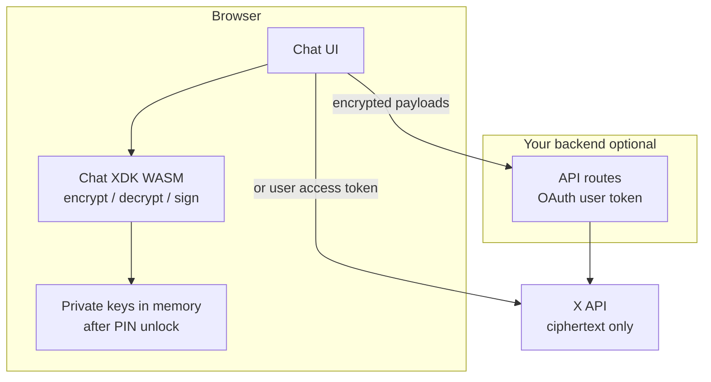

Para **UI de chat orientadas al usuario**, ejecuta el [Chat XDK](/xchat/xchat-xdk) **en el navegador** mediante su paquete de JavaScript/WASM (`@xdevplatform/chat-xdk`). Las claves privadas de identidad y de firma permanecen en el dispositivo del usuario. Tus servidores (y X) solo llegan a ver **texto cifrado**, claves públicas y tokens de OAuth: nunca el PIN ni el material de clave privada usado para cifrar y firmar mensajes.

Esta página describe la arquitectura recomendada para apps cliente. Para las reglas de PIN y manejo de claves que aplican a cualquier tipo de app, consulta [Manejo de claves privadas](/xchat/handling-private-keys).

---

## Por qué WASM para apps de UI

| Enfoque | Dónde se ejecuta la criptografía | Claves privadas | Encaje |
|:--------|:---------------------------------|:----------------|:-------|
| **WASM en el navegador** (`createChat`) | Dispositivo del usuario | Recuperadas con el PIN en la memoria de WASM; no se envían a tu backend | **Recomendado para UI de chat** |
| **Chat XDK nativo en un servidor** | Tus servidores | Blob de claves o recuperación con código de acceso en el servidor | Bots y automatización, no clientes de chat de usuario final |

Los usuarios finales **nunca** deben pegar su PIN de cifrado en tu backend, y tu backend **nunca** debe guardar sus claves privadas de identidad. Si un servidor de terceros recibe el PIN o las claves privadas raíz de un usuario, esa parte puede descifrar las claves de conversación envueltas para esa identidad **incluso después de que el usuario revoque el acceso OAuth**. El WASM del lado del cliente evita esa clase de fallo en apps legítimas.

<Warning>
Compartir un PIN o una clave privada con un tercero es como compartir la contraseña de tus DM cifrados. Desconectar OAuth **no** revoca las claves que la app ya obtuvo. Prefiere WASM para que las claves nunca salgan del navegador; documenta claramente los riesgos cuando no puedas. Consulta [Manejo de claves privadas](/xchat/handling-private-keys).
</Warning>

---

## Arquitectura recomendada

Separa la **criptografía** (navegador) del **transporte de la API** (tu backend o la X API directa con un token de usuario):



| Capa | Responsabilidad |
|:-----|:----------------|
| **UI del navegador** | Renderizar conversaciones; recoger el PIN **solo en el cliente**; llamar al Chat XDK WASM para cifrar/descifrar/firmar |
| **Chat XDK WASM** | Generación de claves, copia de seguridad segura de claves (`setup` / `unlock`), criptografía de mensajes |
| **Tu backend (opcional)** | Guardar el token de acceso OAuth, hacer de proxy para la REST de X Chat, emitir tokens de auth de realm de Juicebox: **nunca** recibir el PIN ni claves privadas |
| **X API** | Claves públicas, claves de conversación envueltas, eventos cifrados y multimedia |

Un patrón común (usado por demos internas como clientes de chat en el navegador) es: **WASM + React (o similar) en el frontend**, **[XDK](/xdks/typescript/overview) de TypeScript en rutas de API de Next.js (u otras)** para que el navegador no hable con `api.x.com` con un secreto de larga vida si prefieres no hacerlo. La criptografía sigue ejecutándose únicamente en el navegador.

---

## Instala el paquete para navegador

```bash
npm install @xdevplatform/chat-xdk
npm install juicebox-sdk   # required for setup() / unlock() secure key backup
```

El motor WASM compilado se distribuye dentro de `@xdevplatform/chat-xdk`; no hay una toolchain de Rust separada para los consumidores. Requiere un navegador moderno (y Node.js 18+ si compartes código con SSR: ejecuta la criptografía solo en el cliente).

---

## Flujo de sesión (PIN una vez, claves en memoria)

**No** pidas el PIN en cada mensaje. Desbloquea **una vez por sesión del navegador**, mantén la instancia de `Chat` en memoria (singleton de módulo, contexto de React, etc.), y luego cifra y descifra contra esa instancia desbloqueada.

```typescript
import { createChat } from '@xdevplatform/chat-xdk';

// 1) Create once per page load (client component / browser only)
const chat = await createChat({
  juiceboxConfig: JSON.stringify(record.juicebox_config), // from GET public keys for the user
  getAuthToken: async (realmId) => {
    // Your backend mints a Juicebox realm token for this user + key version.
    // Do not send the user's PIN here—only realm auth for secure key backup.
    const res = await fetch(`/api/juicebox/token?realm=${encodeURIComponent(realmId)}`);
    if (!res.ok) throw new Error('Juicebox token fetch failed');
    return res.text();
  },
});

// 2) First-time identity: generate → register public keys with X → backup with PIN
// const payload = chat.generateKeypairs();
// await registerPublicKeysWithX(payload);  // POST /2/users/:id/public_keys
// await chat.setup(pin);                   // PIN never leaves the browser

// 3) Returning session: recover keys with PIN (once)
await chat.unlock(pin);
chat.setIdentity(userId, signingKeyVersion);
chat.setCacheKeys(true);
// Fetch participants' public keys from X, then:
chat.setSigningKeys(signingKeys);

// 4) Use for the whole SPA session—no more PIN prompts
const result = chat.decryptEvents(rawEvents);
const sendBody = chat.encryptMessage({ conversationId, text: 'Hello' });
// POST sendBody to your backend or X Chat send-message endpoint

// 5) On logout or "lock chat"
chat.lock(); // clears key material from the WASM instance
// chat.free(); // if you will not reuse this instance
```

### Expectativas de UX

| Evento | Qué hacer |
|:-------|:----------|
| **Apertura de la app / recarga completa** | El usuario introduce el PIN → `unlock` → mantén la instancia para la navegación dentro de la SPA |
| **Enviar / recibir / multimedia** | Llama a encrypt/decrypt sobre la instancia **ya desbloqueada** |
| **Logout / cambio de cuenta** | `lock()` o `free()`; descarta referencias; limpia cualquier estado de sesión |
| **PIN olvidado / bloqueo** | La copia de seguridad segura de claves impone un límite de intentos; la recuperación puede requerir un reset de claves (nuevos pares + volver a registrar). Consulta el [Manual básico de criptografía](/xchat/cryptography-primer#secure-key-backup-distributed-key-storage) |

<Tip>
**Evita volver a pedir el PIN en cada acción.** Las apps de demo a veces llaman a `unlock` repetidamente por simplicidad. Las UI en producción deberían desbloquear una vez, mantener la instancia en memoria y solo volver a pedir el PIN tras una recarga, logout o `lock()`.
</Tip>

---

## Lo que tu servidor puede ver

| Permitido en el servidor | Nunca envíes al servidor |
|:-------------------------|:-------------------------|
| Token de acceso de usuario OAuth 2.0 | PIN / código de acceso de cifrado |
| **Tokens de auth de realm** de Juicebox (de corta duración, para el protocolo de backup) | Claves **privadas** de identidad o de firma |
| Payloads de registro de claves públicas | Blobs crudos de `export_keys` para identidades de usuario final (apps de navegador) |
| Payloads de mensajes y multimedia cifrados | Cuerpos de mensaje en texto plano (a menos que el usuario los esté redactando solo en la UI) |
| IDs de conversación, IDs de evento, metadatos que X ya almacena | Cualquier cosa que reconstruya el material de clave raíz del usuario |

Los tokens de realm para Juicebox **no** son el PIN del usuario. Autorizan el protocolo de backup para ese usuario y esa versión de clave. Sigue emitiéndolos desde un backend que ya tenga el contexto OAuth del usuario.

---

## Copia de seguridad segura de claves en el navegador

Las apps cliente deberían usar **copia de seguridad segura de claves** (`setup` / `unlock` con un código de acceso), no un archivo de claves crudo:

1. Carga `juicebox_config` desde el registro de clave pública del usuario (`public_key.fields=juicebox_config`).
2. `createChat({ juiceboxConfig, getAuthToken })`.
3. La primera vez: `generateKeypairs` → registra las claves públicas con X → `setup(pin)`.
4. Después: `unlock(pin)` en este dispositivo (o en uno nuevo con el mismo PIN).

La ruta de navegador del Chat XDK recupera las claves dentro de WASM y **no expone la exportación cruda de la clave privada en la superficie pública de `createChat`**, por lo que no se anima al JavaScript de la aplicación a extraer los bytes de la clave raíz a la página. Prefiere ese modelo antes que volcados de claves artesanales en `localStorage`.

Pasos completos de registro y desbloqueo: [Primeros pasos](/xchat/getting-started). Conceptos: [Manual básico de criptografía](/xchat/cryptography-primer).

---

## Lista de verificación de endurecimiento del navegador

- Ejecuta el Chat XDK solo en bundles **de cliente** (sin SSR de claves desbloqueadas).
- Trata la instancia desbloqueada de `Chat` como un secreto vivo de sesión: no la pongas en `window`, no la registres en logs, no la envíes a analítica.
- Defiéndete de **XSS**: CSP, cuidado con `dangerouslySetInnerHTML` / renderizado de markdown, higiene de dependencias. Un XSS en una app de chat puede llegar a las claves en memoria aunque las claves nunca toquen la red.
- Usa **HTTPS** en todas partes; nunca mezcles páginas de criptografía con scripts inseguros.
- Prefiere **scopes de OAuth mínimos**; solicita scopes de DM solo cuando sean necesarios y explícalos en la UI de tu producto.
- En el logout, llama a **`lock()`** / **`free()`** y descarta la instancia.

Las recomendaciones de almacenamiento (qué no poner en `localStorage`, cómo pensar la persistencia de sesión) están en [Manejo de claves privadas](/xchat/handling-private-keys#browser-session-persistence).

---

## Próximos pasos

1. [Manejo de claves privadas](/xchat/handling-private-keys) — advertencias sobre el PIN, almacenamiento, bots vs. apps de UI  
2. [Primeros pasos](/xchat/getting-started) — registro completo de claves y primer mensaje  
3. [Chat XDK](/xchat/xchat-xdk) — referencia de API para `createChat`, encrypt, decrypt  
4. [Eventos en tiempo real](/xchat/real-time-events) — entrega texto cifrado al cliente para descifrar localmente  
