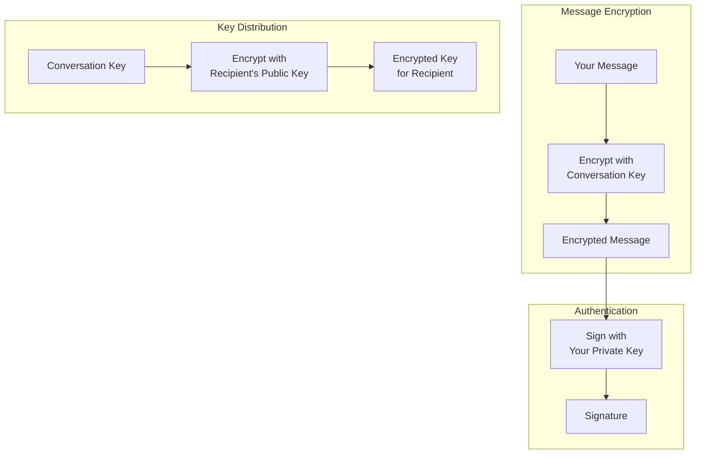
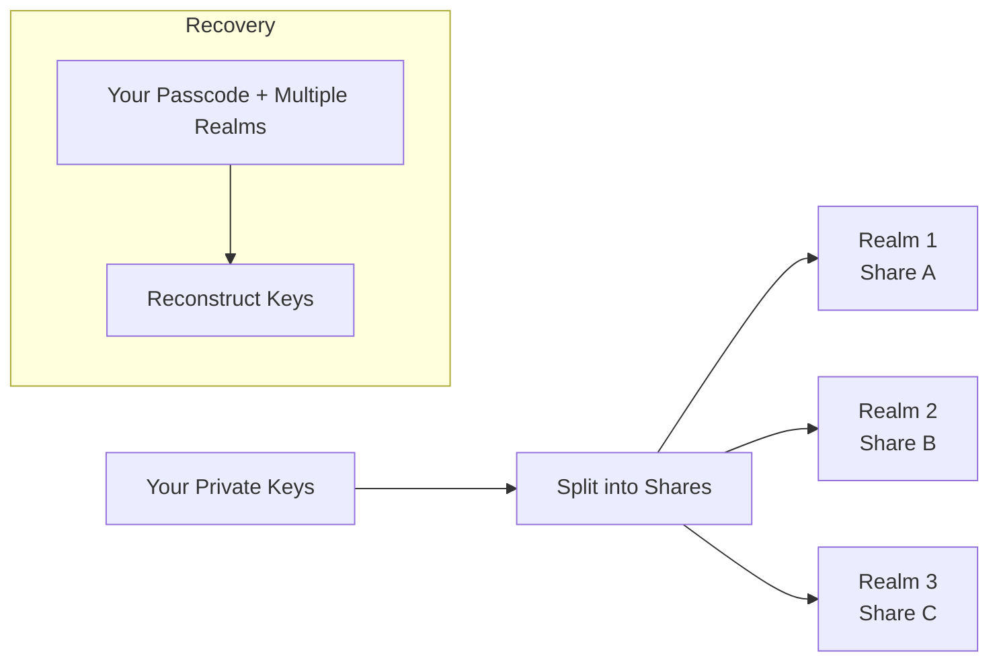

import { Button } from '/snippets/button.mdx';

Esta introducción explica las ideas criptográficas detrás de X Chat a nivel conceptual. No necesitas esta profundidad para construir—el [Chat XDK](/es/xchat/xchat-xdk) realiza el cifrado, descifrado, firma y almacenamiento de claves por ti—pero el modelo mental ayuda cuando diseñas tu app o depuras su comportamiento.

Cuando estés listo para implementarlo, usa [Primeros pasos](/es/xchat/getting-started) para un recorrido completo y la [referencia de la API](/x-api/chat/get-chat-conversations) en la barra lateral para las rutas individuales.

<Note>
**Tú no implementas esta criptografía por tu cuenta.** El Chat XDK se encarga. Esta página es para entender, no una lista de verificación de la API.
</Note>

---

## El panorama general

X Chat usa un sistema de cifrado por capas donde:

1. Los **mensajes** se cifran con una **clave de conversación** (cifrado simétrico rápido)
2. Las **claves de conversación** se cifran para cada participante usando su **clave pública de identidad** (intercambio de claves asimétrico)
3. Los **mensajes se firman** con la **clave de firma** para que los destinatarios puedan verificar quién los envió y que nada fue alterado

El cifrado simétrico es eficiente para grandes volúmenes de tráfico de mensajes; el cifrado asimétrico se usa principalmente para **distribuir** claves de conversación de manera segura.

En el flujo del producto, X transporta **texto cifrado y sobres de clave**—no contenido legible del mensaje ni la clave de conversación en bruto. Tu app usa el Chat XDK para la criptografía y la [Chat API](/es/xchat/introduction) (a través del XDK en Python/TypeScript, o HTTPS) para registrar claves y enviar o recibir esos payloads cifrados. Consulta [Primeros pasos](/es/xchat/getting-started) para ver cómo encajan estas piezas.

---

## Tipos de claves explicados

X Chat usa tres tipos de material de clave, cada uno con un propósito específico.

### 1. Par de claves de identidad

**Propósito:** Intercambiar de manera segura claves de conversación entre usuarios

| Componente | Descripción |
|:----------|:------------|
| **Clave pública de identidad** | Se comparte con otros; se usa para cifrar claves de conversación *dirigidas a* ti |
| **Clave privada de identidad** | Se mantiene en secreto; se usa para descifrar claves de conversación enviadas *a* ti |

Cuando alguien te añade a una conversación, cifra la clave de conversación usando tu clave pública de identidad. Solo tu clave privada de identidad puede descifrarla.

Las mitades públicas se registran y se descubren a través de las APIs de **public-key** de la plataforma (consulta Claves de cifrado en la referencia de la API). Las mitades privadas permanecen en el Chat XDK (por ejemplo, mediante [copia de seguridad segura de claves](#secure-key-backup-distributed-key-storage) o un blob de claves cuidadosamente protegido).

### 2. Par de claves de firma

**Propósito:** Demostrar que fuiste el autor de un mensaje

| Componente | Descripción |
|:----------|:------------|
| **Clave pública de firma** | Se comparte con otros; se usa para verificar tus firmas |
| **Clave privada de firma** | Se mantiene en secreto; se usa para firmar tus mensajes |

Cuando envías un mensaje, se firma con tu clave privada de firma. Los destinatarios lo verifican usando tu clave pública de firma (también publicada a través de las APIs de public-key). El Chat XDK firma como parte del cifrado de un mensaje y puede verificar al descifrar cuando proporcionas el material de clave pública del remitente.

### 3. Clave de conversación

**Propósito:** Cifrar y descifrar mensajes (y [contenido multimedia](/es/xchat/media)) dentro de una conversación específica

| Propiedad | Descripción |
|:---------|:------------|
| **Simétrica** | La misma clave cifra y descifra |
| **Por conversación** | Cada conversación tiene su propia clave |
| **Compartida entre participantes** | Todos los participantes que deban leer la conversación tienen una copia |
| **Versionada** | Las claves pueden rotarse; las apps deben rastrear las versiones a lo largo del tiempo |

Las claves de conversación se generan cuando se configura una conversación o cuando las claves rotan. Cada participante recibe una **copia cifrada** de la clave, generada con su clave pública de identidad. Después de descifrar tu copia una vez, guardas la clave de conversación en **bruto** y la usas para el cifrado rápido de mensajes (y [contenido multimedia](/es/xchat/media)). La configuración de esas copias para una conversación se realiza mediante el Chat XDK junto con los endpoints de **key** de conversación—se recorre en [Primeros pasos](/es/xchat/getting-started#4-set-up-conversation-keys).

---

## Cómo funciona el cifrado (conceptualmente)

### Enviar un mensaje

<Steps>
  <Step title="Empieza con texto plano">
    Escribes: "Hola, ¿cómo estás?"
  </Step>
  <Step title="Obtén la clave de conversación">
    Tu app usa la clave de conversación en bruto para este chat (de la configuración o de un evento anterior de distribución de claves), para la versión de clave correcta.
  </Step>
  <Step title="Cifra el mensaje">
    El Chat XDK cifra tu mensaje con la clave de conversación. El resultado es texto cifrado que es inútil sin esa clave.
  </Step>
  <Step title="Firma el mensaje">
    El Chat XDK firma el payload cifrado con tu clave privada de firma, demostrando que fuiste el autor de este contenido exacto.
  </Step>
  <Step title="Envía a X">
    Tu app envía el payload cifrado y la firma a X a través del endpoint **send message** de la Chat API. X almacena y entrega bytes que no puede leer como texto plano.
  </Step>
</Steps>

### Recibir un mensaje

<Steps>
  <Step title="Recibe datos cifrados">
    Tu app recibe texto cifrado de X—a través de [webhooks o un activity stream](/es/xchat/real-time-events), o al leer **events** de conversación para el historial.
  </Step>
  <Step title="Obtén la clave de conversación">
    Usa tu clave en bruto en caché, u obténla descifrando tu copia desde un evento de distribución de claves (cambio de clave) si es nueva o rotada.
  </Step>
  <Step title="Verifica la firma">
    El Chat XDK comprueba la firma usando la clave pública de firma del remitente (y el enlace de identidad asociado), para que sepas quién lo envió y que no fue modificado.
  </Step>
  <Step title="Descifra el mensaje">
    El Chat XDK descifra con la clave de conversación. Ahora puedes leer: "Hola, ¿cómo estás?"
  </Step>
</Steps>

La implementación de cifrar, enviar, recibir y descifrar está en [Primeros pasos](/es/xchat/getting-started) y en la referencia del [Chat XDK](/es/xchat/xchat-xdk).

---

## Distribución de claves explicada

Un desafío central en el cifrado de extremo a extremo es la **distribución de claves**: cómo los participantes obtienen la clave de conversación **sin** que X (o un observador) vea esa clave en claro.

### Configuración inicial de la clave

Cuando se prepara una conversación para mensajería:

1. El Chat XDK genera una clave de conversación aleatoria
2. El Chat XDK cifra esa clave para **la clave pública de identidad de cada participante**
3. Tu app publica esas copias cifradas a través de las Chat APIs de X
4. Cada participante descifra **su** copia con su clave privada de identidad (en el Chat XDK)

X solo maneja las copias **envueltas**, nunca la clave de conversación en bruto.

### Eventos de cambio de clave

Cuando la clave de conversación rota (por ejemplo cuando cambia la membresía), los participantes reciben un evento de **cambio de clave** con nuevas copias cifradas para cada miembro.

Tu app debe:

1. Detectar material de cambio de clave en eventos en vivo o en el historial de la conversación
2. Descifrar y almacenar la nueva clave de conversación (y versión)
3. Usar la versión más reciente para los envíos posteriores

[Primeros pasos](/es/xchat/getting-started#6-receive-and-decrypt) y [Eventos en tiempo real](/es/xchat/real-time-events) describen dónde aparecen esos eventos en la práctica.

---

## Copia de seguridad segura de claves: almacenamiento distribuido de claves

Tus claves **privadas** de identidad y de firma deben almacenarse con cuidado. X Chat incluye un sistema de **copia de seguridad segura de claves** para que las claves puedan recuperarse con un código de acceso en distintos dispositivos sin darle a un solo servidor el secreto completo.

### El problema con el almacenamiento tradicional de claves

| Enfoque | Problema |
|:---------|:--------|
| Almacenar solo en el dispositivo | Perder el dispositivo = perder las claves = perder acceso al historial de mensajes |
| Almacenar en una copia de seguridad en la nube común | El proveedor podría acceder al material de la clave |
| Recordar una clave larga | Las personas no pueden memorizar de forma confiable claves de alta entropía |

### Cómo lo resuelve la copia de seguridad segura de claves

La copia de seguridad segura de claves combina **compartición de secretos** con **protección por código de acceso**:

1. Las claves privadas se **dividen en shares**
2. Los shares los guardan **realms independientes** (servidores separados)
3. **Ningún realm** tiene por sí solo información suficiente para reconstruir las claves
4. La recuperación requiere tu **código de acceso** y la cooperación de **suficientes realms**
5. Los códigos de acceso incorrectos están **limitados por tasa** para ralentizar las conjeturas

Obtienes capacidad de recuperación (nuevo dispositivo + código de acceso) sin que una sola parte guarde todo el secreto.

<Note>
No configuras servidores de copia de seguridad de claves manualmente para el flujo normal. El Chat XDK incluye el cliente de copia de seguridad; la configuración de los realms viene de la X API como el campo **`juicebox_config`** en tu registro de public-key. El almacenamiento inicial del código de acceso y el desbloqueo posterior son llamadas del Chat XDK—consulta [inicializar con claves existentes](/es/xchat/getting-started#2-initialize-the-chat-xdk-with-existing-keys) y [crear y registrar claves](/es/xchat/getting-started#3-create-and-register-keys-first-time-setup) en Primeros pasos. Algunas apps (especialmente servidores y bots) usan un blob de claves exportado en lugar de la copia de seguridad segura de claves; protege ese material como si fuera una contraseña.
</Note>

---

## Firmas explicadas

Cada mensaje de X Chat incluye una **firma digital** que aporta:

1. **Autenticidad** — se produjo con la clave privada de firma del remitente  
2. **Integridad** — el contenido cifrado no se modificó después de firmarse  

### Cómo funcionan las firmas (conceptualmente)

| Acción | Clave utilizada | Resultado |
|:-------|:---------|:-------|
| **Firmar** | Clave privada de firma del remitente | Una firma vinculada a este mensaje cifrado exacto |
| **Verificar** | Clave pública de firma del remitente | Confirma que la firma coincide con el mensaje y la clave |

Si algo en el material firmado cambia, la verificación falla. Solo alguien con la clave privada de firma puede producir una firma válida para esa clave.

### En tu app

El Chat XDK firma cuando cifras mensajes salientes y verifica cuando descifras los entrantes contra el material de clave pública del remitente (obtenido de las APIs de public-key). La verificación es **obligatoria por defecto**: el SDK rechaza eventos firmados no verificados a menos que desactives explícitamente la comprobación (no recomendado). Los detalles están en la referencia del [Chat XDK](/es/xchat/xchat-xdk).

Las firmas también cubren el contenido citado. Una respuesta incrusta el mensaje original **firmado** en bruto que cita; cuando el Chat XDK descifra la respuesta, verifica ese original incrustado y compara la cita contra él, reportando el resultado como `reply_preview_validation` (`Valid` / `Invalid`). Un resultado `Invalid` significa que la cita no coincide con el original firmado—trata el material citado como no confiable, aunque la respuesta en sí se verifique por separado—de modo que ningún participante pueda atribuir palabras inventadas a otro.

### Cambios de estado firmados (firmas de acción)

Los mensajes no son el único material firmado. Cada llamada que cambia el estado de una conversación—añadir o rotar claves de conversación, crear un grupo, añadir miembros—debe llevar una o más **firmas de acción**: el remitente firma un payload que describe exactamente lo que hace el cambio (para un cambio de clave, ese payload incluye la nueva clave de conversación en sí), y la API rechaza la solicitud si las firmas faltan o están mal formadas.

Como el servidor nunca posee la clave de conversación en texto plano, no puede comprobar criptográficamente la firma de un cambio de clave; valida que la descripción firmada y codificada del cambio coincida con la solicitud que recibió. La comprobación **criptográfica** ocurre en los extremos: el Chat XDK de cada destinatario verifica la firma contra la clave pública de firma del remitente cuando descifra el evento de cambio de clave. Los métodos `prepare` del Chat XDK producen estas firmas por ti—las creaciones de grupo y las adiciones de miembros devuelven **dos** (el cambio de clave más la acción del grupo), y ambas deben enviarse.

Las firmas están vinculadas al contenido del evento y son inmutables: un evento cuya firma no se verifica nunca podrá volverse válido más tarde. Consulta [Solución de problemas](/es/xchat/troubleshooting) para saber cómo tratarlos.

---

## Propiedades de seguridad

### Contra qué protege X Chat

| Amenaza | Protección |
|:-------|:-----------|
| **X lee los cuerpos de los mensajes** | El contenido se cifra antes de enviarse a X |
| **Espías de la red** | Seguridad del transporte más contenido cifrado de extremo a extremo |
| **Manipulación de mensajes** | Las firmas detectan la modificación |
| **Suplantación trivial del remitente** | Las firmas válidas requieren la clave privada de firma del remitente |
| **Robo de claves en un solo servidor (con copia de seguridad segura de claves)** | Los shares se dividen entre realms y están protegidos por código de acceso |

### Contra qué **no** protege X Chat

| Amenaza | Por qué no |
|:-------|:--------|
| **Dispositivo comprometido** | El texto plano y las claves pueden quedar expuestos en un cliente desbloqueado |
| **Metadatos** | X puede saber quién envió mensajes a quién y cuándo—no el texto del mensaje |
| **Confidencialidad hacia adelante** | El compromiso de las claves de identidad puede exponer las claves de conversación que se envolvieron con esas claves |
| **Seguridad post-compromiso** | Rotar las claves no reescribe el historial |

---

## Glosario

| Término | Definición |
|:-----|:-----------|
| **Cifrado simétrico** | La misma clave cifra y descifra (usado para mensajes y streams de multimedia) |
| **Cifrado asimétrico** | Claves diferentes para cifrar y descifrar (usado para intercambiar claves de conversación) |
| **Clave pública** | Se puede compartir con seguridad; se usa para cifrar *a* alguien o verificar sus firmas |
| **Clave privada** | Debe permanecer secreta; se usa para descifrar o firmar |
| **Par de claves** | Una clave pública y una clave privada vinculadas |
| **ECDH / ECIES** | Algoritmos usados al intercambiar claves de conversación mediante claves de identidad |
| **ECDSA** | Algoritmo de firma usado para la autoría de mensajes |
| **P-256** | Curva elíptica usada en X Chat (secp256r1) |
| **Clave de conversación** | Clave simétrica compartida por los participantes de una conversación (versionada en el tiempo) |
| **Compartición de secretos** | Dividir un secreto de forma que se necesiten varias piezas para reconstruirlo |
| **Realm** | Un servidor independiente de copia de seguridad segura de claves que guarda un share de tu material de clave |

---

## Próximos pasos

<CardGroup cols={2}>
  <Card title="Primeros pasos" icon="rocket" href="/es/xchat/getting-started">
    Implementa claves, envío y recepción paso a paso
  </Card>
  <Card title="Referencia del Chat XDK" icon="code" href="/es/xchat/xchat-xdk">
    Métodos y tipos del SDK de cifrado
  </Card>
  <Card title="Introducción" icon="book" href="/es/xchat/introduction">
    Descripción general del producto y arquitectura
  </Card>
  <Card title="Eventos en tiempo real" icon="bolt" href="/es/xchat/real-time-events">
    Cómo se entregan los eventos cifrados
  </Card>
</CardGroup>
