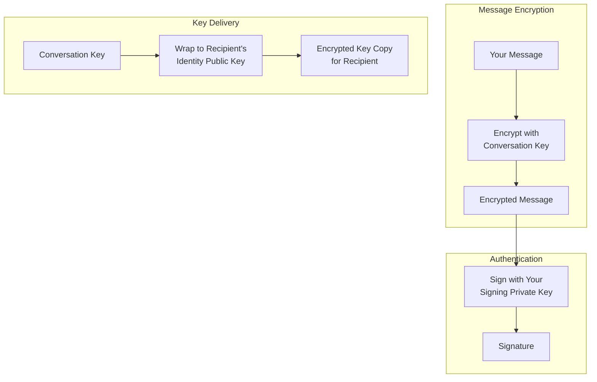
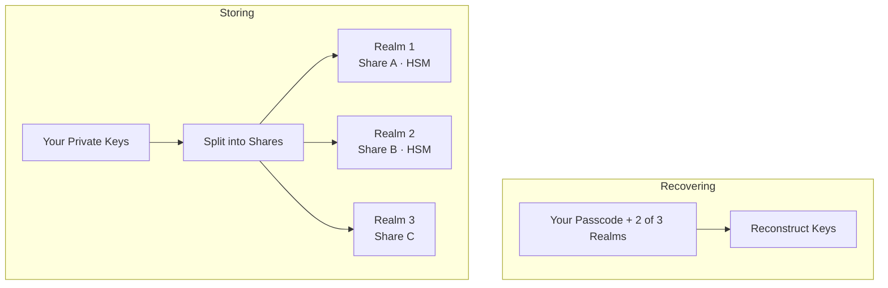

X Chat está cifrado de extremo a extremo: los mensajes de un usuario, en texto plano, solo existen en sus dispositivos. Esta página explica cómo funciona.

<Note>
**Esta página es informativa. No necesitas este conocimiento para construir (el [Chat XDK](/xchat/xchat-xdk) realiza cada operación aquí por ti).**
</Note>

---

## El panorama general

Veamos el flujo completo desde la creación de la cuenta hasta el envío y recepción de mensajes.

<Steps>
  <Step title="Creación de la cuenta">
    Aquí el Chat XDK genera dos pares de claves en tu dispositivo:

    - un **par de claves de identidad**, para recibir secretos
    - un **par de claves de firma**, para demostrar la autoría

    Las mitades privadas van a la [copia de seguridad segura de claves](#secure-key-backup-distributed-key-storage), que detallaremos más adelante. Lo importante aquí es que solo son recuperables con tu código de acceso; X no puede recuperarlas.

    Las mitades públicas se publican al backend de X a través de la API de **public key**, con una firma que vincula las claves de identidad y de firma entre sí.
  </Step>
  <Step title="Creación de la conversación">
    Para enviarte un mensaje, el remitente genera una nueva **clave de conversación**, una clave simétrica que cifrará los mensajes.

    Descarga tu clave pública desde el backend de X, verifica la firma que la acompaña y cifra la clave de conversación con tu clave de identidad.

    Esta es una propiedad crucial de la criptografía de clave pública: cualquiera puede cifrar hacia tu clave pública; **solo tu clave privada puede descifrar, y solo tú la tienes**. Así que X puede almacenar y entregar la copia cifrada, pero nunca abrirla. (Para los esquemas exactos utilizados, consulta el [glosario](#glossary).)

    ¿Por qué no ciframos los mensajes directamente con tu clave pública? Por velocidad: el cifrado de clave pública es mucho más costoso que el cifrado de clave simétrica, por lo que intercambiar una clave permite una mejor eficiencia para los mensajes posteriores.
  </Step>
  <Step title="Mensajería">
    Cuando alguien te envía un mensaje, recibirás la clave de conversación, cifrada con tu clave pública de identidad, y los mensajes cifrados con la clave de conversación.

    Usas tu clave privada de identidad para descifrar la clave de conversación (de nuevo, solo tú tienes esta clave) y luego usas la clave de conversación resultante para descifrar los mensajes.

    De vez en cuando, las claves en una conversación rotan (se comparte una nueva clave simétrica), por diferentes motivos. Por eso, cada clave de conversación tiene una versión para que los participantes siempre sepan que están usando la clave correcta.
  </Step>
  <Step title="Firma">
    El cifrado permite que cualquiera te envíe un mensaje que solo tú puedes descifrar. La firma es, en cierto sentido, lo contrario: te permite (y solo a ti) firmar un mensaje, y a cualquiera verificar la firma. En la práctica, la clave privada es necesaria para firmar, y la clave pública puede usarse para verificar.

    En X Chat, cada remitente firma su mensaje. Las firmas prueban tanto quién firmó el mensaje como los bytes exactos firmados, así todos los destinatarios pueden verificar que este mensaje exacto es lo que el remitente escribió. Nuevamente, el XDK se encarga de esto por ti; cubrimos los detalles en [Firmas explicadas](#signatures-explained).
  </Step>
</Steps>

---

## Poniéndolo todo junto

X Chat combina tres herramientas criptográficas estándar, cada una haciendo el trabajo en el que es buena:

1. Una **clave de conversación** cifra los mensajes: simétrica, lo bastante rápida para todo el tráfico de mensajes y multimedia.
2. Un **par de claves de identidad** entrega las claves de conversación a cada participante sin que nadie más (incluido X) las vea.
3. Un **par de claves de firma** demuestra la autoría: cada mensaje lleva una firma que los destinatarios verifican.

X transporta y almacena únicamente **texto cifrado y claves envueltas**, nada que pueda abrir. El XDK hace la criptografía; la [Chat API](/xchat/introduction) registra las claves y mueve las cargas cifradas ([Primeros pasos](/xchat/getting-started)).

El elenco completo:

| Clave | Quién la tiene | Qué hace |
|:------|:---------------|:---------|
| **Identity keypair** | Mitad privada: solo tú. Mitad pública: publicada | Recibe claves de conversación envueltas |
| **Signing keypair** | Mitad privada: solo tú. Mitad pública: publicada | Firma mensajes y cambios de estado; otros verifican |
| **Conversation key** | Cada participante de una conversación | Cifra mensajes y multimedia; con versión, rota |

---

## Un ejemplo práctico

Veamos qué sucede en realidad cuando creas un grupo con Bob y Carol.

<Steps>
  <Step title="Generar la clave de conversación">
    El XDK genera una nueva clave de conversación aleatoria. Hasta ahora existe solo en memoria en tu dispositivo.
  </Step>
  <Step title="Descargar y verificar las claves de los participantes">
    Tu app descarga las claves públicas de Bob y Carol desde el backend de X y verifica la firma de cada una. Si una firma no cuadra, te detienes; nunca cifres hacia una clave que no pudiste verificar.
  </Step>
  <Step title="Envolver la clave para cada participante">
    El XDK envuelve la clave de conversación tres veces: para la clave pública de identidad de Bob, la de Carol y la tuya (para que tus otros dispositivos también puedan leerla).
  </Step>
  <Step title="Firmar el cambio">
    El XDK firma una carga que describe exactamente este cambio: el grupo, sus miembros, las claves envueltas. Crear un grupo necesita **dos** [firmas de acción](#signed-state-changes-action-signatures); el XDK produce ambas por ti.
  </Step>
  <Step title="Publicar">
    Tu app hace POST de las copias envueltas y las firmas a X. El servidor almacena tres blobs cifrados que no puede abrir. ¡En ningún momento la clave de conversación en bruto salió de tu dispositivo!
  </Step>
  <Step title="Bob lee">
    El XDK de Bob desenvuelve su copia con su clave privada de identidad, verifica que el cambio de clave provino de ti y guarda la clave de conversación en bruto.
  </Step>
</Steps>

Esa es la configuración única. A partir de aquí, cada mensaje sigue los mismos dos flujos:

**Envío.** El XDK cifra tu mensaje con la clave de conversación actual, lo firma, y tu app hace POST de ambos al endpoint **send message**. X almacena y entrega bytes que no puede leer.

**Recepción.** El texto cifrado llega a través de [webhooks o un activity stream](/xchat/real-time-events), o leyendo los **events** de la conversación para el historial. El XDK verifica primero la firma del remitente, luego descifra con tu clave de conversación almacenada (si la clave rotó, un evento **key change** entrega tu nueva copia envuelta). Si la verificación falla, el mensaje se rechaza.

La implementación vive en [Primeros pasos](/xchat/getting-started) y en la referencia del [Chat XDK](/xchat/xchat-xdk).

---

## Copia de seguridad segura de claves: almacenamiento distribuido de claves

Antes dijimos que tus claves privadas se guardan en la **copia de seguridad segura de claves**, recuperables solo con tu código de acceso. Veamos cómo funciona, porque es la parte sobre la que la gente es más escéptica: ¿cómo pueden las claves respaldarse sin que X pueda leerlas?

### El problema del almacenamiento tradicional de claves

| Enfoque | Problema |
|:--------|:---------|
| Guardar solo en el dispositivo | Perder el dispositivo = perder las claves = perder acceso al historial de mensajes |
| Guardar en un backup en la nube común | El proveedor puede acceder al material de la clave |
| Recordar una clave larga | Las personas no pueden memorizar secretos de alta entropía |

### Cómo lo resuelve la copia de seguridad segura de claves

X Chat usa el protocolo de código abierto [**Juicebox**](https://juicebox.xyz), que combina **compartición de secretos con umbral** con protección por código de acceso. El protocolo completo está especificado allí; la versión corta:

**Almacenar (una sola vez, al crear la cuenta).** El XDK divide tus claves privadas en fragmentos y los distribuye a tres **realms**, servicios separados aislados entre sí. Los tres son operados por X, así que el aislamiento por sí solo no significaría gran cosa. Ahí es donde entra el hardware: dos de los realms viven dentro de **módulos de seguridad de hardware** (HSM), hardware resistente a manipulación que no entregará su fragmento a nadie, ni siquiera a un administrador de X con acceso completo al servidor. Un fragmento por sí solo no revela nada, y la recuperación requiere fragmentos de **dos de los tres** realms, por lo que cada recuperación posible pasa por al menos un HSM: no hay un camino solo por software hacia tus claves. El software del HSM y la **key ceremony** que lo aprovisionó están documentados públicamente.

**Recuperar (nuevo dispositivo).** Ingresas tu código de acceso, y el XDK demuestra a cada realm que lo conoces. El protocolo Juicebox hace esto posible sin que el código de acceso salga jamás de tu dispositivo. Cada realm que te verifica libera su fragmento de tus claves, y una vez que dos de los tres responden, el XDK reconstruye tus claves en tu dispositivo.

**Límites de intentos.** Cada realm permite como máximo **20 intentos incorrectos de código de acceso**. En el vigésimo intento incorrecto, tu fragmento de clave se elimina del realm. Esto se aplica por hardware mediante los HSM y protege contra cualquier ataque de fuerza bruta.

El resultado: puedes recuperar tus claves en un dispositivo nuevo solo con tu código de acceso, ningún realm por sí solo contiene el secreto completo, y los realms respaldados por hardware imponen sus límites incluso contra el propio X.

<Note>
No configuras nada de esto a mano. El Chat XDK incluye el cliente de copia de seguridad, y la configuración del realm llega desde el backend de X con tu registro de clave pública. El almacenamiento del código de acceso y el desbloqueo son llamadas del Chat XDK; consulta [initialize with existing keys](/xchat/getting-started#2-initialize-the-chat-xdk-with-existing-keys) y [create and register keys](/xchat/getting-started#3-create-and-register-keys-first-time-setup). Los servidores y bots suelen omitir la copia de seguridad y usan un blob de claves exportado; protégelo como si fuera una contraseña.
</Note>

---

## Firmas explicadas

La firma de cada mensaje ofrece a los destinatarios dos garantías:

1. **Autenticidad**: producida por el titular de la clave privada de firma del remitente
2. **Integridad**: el contenido cifrado no se modificó después de firmar

Si algo en el contenido firmado cambia, la verificación falla. Por supuesto, esta garantía es tan fuerte como el secreto de la clave de firma, por lo que el [almacenamiento de claves](#secure-key-backup-distributed-key-storage) importa tanto.

**En tu app.** El XDK firma cuando ciframos y verifica cuando desciframos. El rechazo ocurre en ambos extremos: X Chat mismo rechaza eventos que no puede verificar, y el XDK hace lo mismo al recibirlos, **obligatorio por defecto** (deshabilitar esto no se recomienda). Detalles: [Chat XDK](/xchat/xchat-xdk).

Las firmas también cubren el contenido citado. Una respuesta incrusta el mensaje original **firmado** en bruto que cita; cuando el Chat XDK descifra la respuesta, verifica ese original incrustado y compara la cita con él, reportando el resultado como `reply_preview_validation` (`Valid` / `Invalid`). Un resultado `Invalid` significa que la cita no coincide con el original firmado—trata el material citado como no confiable, aunque la respuesta en sí se verifique por separado—de modo que ningún participante pueda atribuir palabras inventadas a otro.

### Cambios de estado firmados (firmas de acción)

Los mensajes no son lo único que se firma. Todo cambio en una conversación (crear un grupo, agregar miembros, rotar una clave) también debe llevar **firmas de acción**: el remitente firma una carga que describe exactamente qué hace el cambio, y la API rechaza las solicitudes donde estas faltan o están mal formadas. El XDK las produce por ti.

**Por qué el servidor no puede verificar completamente un cambio de clave.** El servidor nunca tiene la clave de conversación en bruto (esa es la idea), por lo que no puede comprobar una firma sobre material que no puede ver. Verifica lo que puede—que la descripción firmada coincida con la solicitud—y los destinatarios hacen la verificación criptográfica real cuando desenvuelven el cambio de clave.

Los eventos son inmutables: uno que falle la verificación es permanentemente inválido. Consulta [Solución de problemas](/xchat/troubleshooting).

---

## Propiedades de seguridad

Esto es contra lo que X Chat protege, y —igual de importante— contra lo que no.

### Contra lo que X Chat protege

| Amenaza | Protección | Se apoya en |
|:--------|:-----------|:------------|
| **X leyendo los cuerpos de los mensajes** | El contenido se cifra antes de llegar a X | Las claves de conversación nunca salen de los dispositivos de los participantes sin envolver |
| **Espías en la red** | Seguridad de transporte más contenido cifrado de extremo a extremo | TLS estándar, más todo lo anterior |
| **Manipulación de mensajes** | Las firmas detectan cualquier modificación | Verificación de firma en cada evento |
| **Suplantación del remitente** | Una firma válida requiere la clave privada de firma del remitente | Secreto de la clave de firma, más la vinculación de claves que verificaste |
| **Robo de claves desde un servidor de copia de seguridad** | Los fragmentos se dividen entre realms y están protegidos por código de acceso, con un límite estricto de intentos | Ningún realm por sí solo puede reconstruir las claves; los HSM imponen el límite de intentos por hardware |

### Contra lo que X Chat no protege, y por qué

| Limitación | La versión honesta |
|:-----------|:-------------------|
| **Un dispositivo comprometido** | Un cliente desbloqueado contiene texto plano y claves en bruto. Ningún diseño de extremo a extremo sobrevive a un endpoint comprometido. |
| **Metadatos** | X debe saber quién envió un mensaje a quién, y cuándo, para enrutar el texto cifrado. El cifrado oculta el *qué*, no el *quién* ni el *cuándo*. |
| **Sin forward secrecy** | Las claves de conversación se envuelven con claves de identidad de larga duración: un atacante con tu clave privada de identidad puede desenvolver sobres capturados previamente y, con ellos, texto cifrado pasado. |
| **Sin recuperación automática tras compromiso** | La recuperación funciona, pero es deliberada en lugar de automática: expulsar a un atacante rota la clave de conversación, y recuperar un dispositivo comprometido normalmente incluye generar una nueva clave de identidad y nuevas claves de conversación, de modo que incluso las claves robadas no lean nada nuevo. Lo que ninguna rotación puede hacer es reescribir el pasado, o protegerte en la ventana antes de que se atienda el compromiso. |

---

## Glosario

| Término | Definición |
|:--------|:-----------|
| **Cifrado simétrico** | La misma clave cifra y descifra (usado para mensajes y multimedia) |
| **Cifrado asimétrico** | Clave pública para cifrar, clave privada para descifrar (usado para entregar claves de conversación) |
| **Clave pública** | Se puede publicar sin riesgo; se usa para cifrar *hacia* alguien o verificar sus firmas |
| **Clave privada** | Debe mantenerse en secreto; se usa para descifrar o firmar |
| **ECDH** | *Acuerdo* de claves: dos partes derivan un secreto compartido a partir de la clave privada de una y la clave pública de la otra |
| **ECIES** | Cifrado híbrido construido sobre ECDH: derivar un secreto compartido, cifrar simétricamente con él. Así se envuelven las claves de conversación |
| **ECDSA** | El algoritmo de firma de curva elíptica usado para mensajes y firmas de acción |
| **P-256** | La curva elíptica (secp256r1) que usan todos los pares de claves de X Chat |
| **Vinculación de claves** | La firma publicada que une la clave de identidad de un usuario con su clave de firma; se verifica antes de envolver cualquier cosa hacia un registro descargado |
| **Clave de conversación** | Clave simétrica compartida por los participantes de una conversación, con versión a lo largo del tiempo |
| **Envoltura** | Cifrar una clave con otra; aquí, una clave de conversación con una clave pública de identidad |
| **Compartición de secretos con umbral** | Dividir un secreto en fragmentos de modo que solo un subconjunto suficiente pueda reconstruirlo; menos del umbral no aprende nada |
| **Juicebox** | El protocolo de código abierto detrás de la copia de seguridad segura de claves: recuperación con umbral protegida por código de acceso con límites estrictos de intentos |
| **HSM** | Hardware security module: hardware resistente a manipulación que contiene el fragmento de un realm y hace cumplir su límite de intentos |
| **Realm** | Un servicio de copia de seguridad segura de claves separado y aislado que contiene un fragmento de tu material de claves |

---

## Próximos pasos

<CardGroup cols={2}>
  <Card title="Primeros pasos" icon="rocket" href="/xchat/getting-started">
    Implementa claves, envía y recibe paso a paso
  </Card>
  <Card title="Referencia del Chat XDK" icon="code" href="/xchat/xchat-xdk">
    Métodos y tipos del SDK de cifrado
  </Card>
  <Card title="Introducción" icon="book" href="/xchat/introduction">
    Descripción general del producto y arquitectura
  </Card>
  <Card title="Eventos en tiempo real" icon="bolt" href="/xchat/real-time-events">
    Cómo se entregan los eventos cifrados
  </Card>
</CardGroup>
