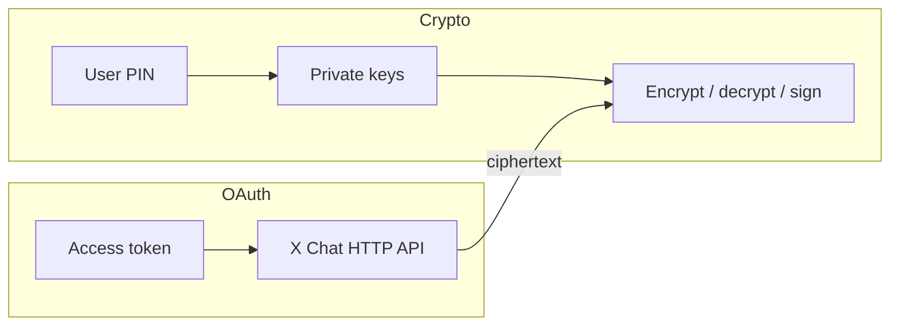

Las **claves privadas** de identidad y de firma de X Chat son la raíz de la identidad de mensajería cifrada de un usuario. Cualquiera que las posea puede desenvolver las claves de conversación entregadas a esa identidad y firmar como ese usuario para el chat. Trata el **PIN / código de acceso** de cifrado de la misma forma: recupera esas claves desde la copia de seguridad segura de claves.

Esta página cubre reglas para cualquier tipo de app. Para la arquitectura de cliente recomendada, consulta [Crear apps de UI con WASM](/xchat/building-ui-apps-with-wasm).

---

## Advertencia crítica para usuarios y desarrolladores de apps

<Warning>
**Nunca pidas a los usuarios finales que compartan su PIN de cifrado o sus claves privadas con un servidor de terceros, un agente de soporte o una app “de ayuda”.**

El PIN desbloquea las **claves raíz de identidad**. Una parte que obtenga el PIN (o el blob de la clave privada) puede:

- Descifrar las claves de conversación envueltas para esa identidad (y por tanto el historial de mensajes que pueda obtener como texto cifrado)
- Seguir enviando y recibiendo como esa identidad criptográfica
- Mantener esa capacidad **incluso si el usuario después revoca OAuth** para la app

Revocar OAuth detiene el acceso a la API para los tokens de esa app. **No** invalida las claves privadas que el usuario ya haya entregado. Prefiere arquitecturas donde el PIN solo se introduzca en criptografía **en el dispositivo** ([WASM en el navegador](/xchat/building-ui-apps-with-wasm) o un cliente nativo usando el Chat XDK).
</Warning>

### Texto de producto y de documentación que deberías mostrar

Si tu app solicita scopes de OAuth relacionados con DM (`dm.read`, `dm.write` y scopes relacionados), acompaña la pantalla de consentimiento OAuth con lenguaje claro en el producto:

- Las claves de cifrado permanecen en el dispositivo del usuario cuando usas la ruta oficial del SDK cliente.
- Los usuarios nunca deben teclear su PIN de X Chat en un sitio web que lo reenvíe a un backend.
- Las integraciones legítimas usan el [Chat XDK](/xchat/xchat-xdk) para que la recuperación con PIN y la criptografía se ejecuten localmente (para navegadores: WASM + copia de seguridad segura de claves).
- Una app maliciosa que obtenga claves privadas puede exfiltrarlas; hoy no existe un “revocar esta clave” del lado del servidor para una clave raíz puramente en cliente: diseña de forma que los usuarios nunca necesiten entregarte claves raíz.

---

## Qué cuenta como material de clave sensible

| Material | Sensibilidad | Notas |
|:---------|:-------------|:------|
| **PIN / código de acceso de cifrado** | Crítica | Recupera las claves privadas desde la [copia de seguridad segura de claves](/xchat/cryptography-primer#secure-key-backup-distributed-key-storage) |
| **Clave privada de identidad** | Crítica | Desenvuelve las claves de conversación de este usuario |
| **Clave privada de firma** | Crítica | Prueba la autoría de mensajes y cambios de estado |
| **Blob de `export_keys`** | Crítica | Estado completo de la clave privada opaco del Chat XDK; trátalo como un archivo de contraseñas |
| **Claves de conversación desenvueltas** | Alta | Descifran mensajes en una conversación (versionadas; siguen siendo sensibles) |
| **Tokens de acceso / refresh de OAuth** | Alta | Solo acceso a la API: no sustituyen a las claves privadas del chat, y no se revocan al borrar claves |
| **Tokens de auth de realm de Juicebox** | Media | Autorizan el protocolo de backup para un usuario/versión de clave; no son el PIN |
| **Claves públicas** | Pública | Es seguro obtenerlas y almacenarlas |

---

## Elige la ruta de claves correcta según el tipo de app

| Tipo de app | Ruta de claves recomendada | No hagas esto |
|:------------|:---------------------------|:--------------|
| **UI web orientada al usuario** | [Chat XDK WASM](/xchat/building-ui-apps-with-wasm) en el navegador + `setup` / `unlock` (copia de seguridad segura de claves) | Enviar el PIN o claves privadas a tus servidores; almacenar blobs crudos de claves en `localStorage` |
| **Cliente nativo móvil / de escritorio** | Chat XDK en el dispositivo + copia de seguridad segura de claves o blob respaldado por el keystore del SO | Sincronizar blobs de clave sin cifrar a tu nube |
| **Bot / automatización en tu infraestructura** | Blob de `export_keys` en un **gestor de secretos** o HSM; carga con `import_keys` | Committear blobs a git; loguearlos; incrustarlos en JS del lado del cliente |
| **Servidor que solo mueve texto cifrado** | Ninguna clave privada: hace de proxy para payloads cifrados | Descifrar “por comodidad” en el servidor para usuarios de UI |

Las apps cliente deberían preferir **copia de seguridad segura de claves**. Los servidores y bots suelen usar un blob de claves exportado. Detalles: [Primeros pasos](/xchat/getting-started#2-initialize-the-chat-xdk-with-existing-keys).

---

## Reglas para claves privadas y PIN

### Sí

- **Recoge el PIN solo en una UI cliente confiable** que alimente al Chat XDK (`unlock` / `setup`) en el mismo dispositivo.
- **Mantén las claves en memoria solo mientras sea necesario.** Tras el unlock, reutiliza la misma instancia de Chat durante la sesión; llama a `lock()` o `free()` en el logout.
- **Limpia los búferes del PIN cuando la API lo permita** (por ejemplo, pasa un PIN como `Uint8Array` en JS para poder borrarlo tras `unlock`).
- **Almacena los blobs de claves de bots en un gestor de secretos** (o HSM), cifra en reposo, restringe IAM y rota las credenciales del proceso con frecuencia.
- **Registra con cuidado en logs:** nunca loguees PIN, claves privadas, blobs de claves, claves de conversación desenvueltas ni respuestas completas del backup seguro.
- **Defiende al cliente:** XSS, extensiones maliciosas y dependencias comprometidas pueden leer las claves en memoria aunque la ruta de red esté limpia.

### No

- **No** envíes por correo, no captures ni pases por ticket un PIN o un blob de claves.
- **No** pongas claves privadas ni PIN en query strings, analítica, trackers de errores o logs de CDN.
- **No** envíes claves privadas de usuario final para “simplificar el backend”.
- **No** confundas **revocar OAuth** con **revocar claves**. Desconectar una app no borra las claves que un usuario ya exportó o tecleó en un cliente hostil.
- **No** almacenes la salida cruda de `export_keys` en `localStorage` ni en IndexedDB sin cifrar para apps de UI en producción.

---

## Persistencia de sesión en el navegador

Las apps de navegador en producción deben optimizar la **seguridad primero** y luego la UX:

| Estrategia | Seguridad | UX | Recomendación |
|:-----------|:----------|:---|:--------------|
| **Desbloqueo una vez por carga de página; mantener Chat en memoria** | Fuerte | PIN tras cada recarga completa; sin PIN por mensaje | **Recomendación por defecto** |
| **Volver a pedir el PIN en cada mensaje** | Fuerte pero ruidosa | Mala | Evítalo (antipatrón solo para demos) |
| **Blob de claves en texto plano o base64 en `localStorage`** | Débil (cualquier XSS o dispositivo compartido lee las claves) | Cómodo | **No usar en producción** |
| **Solo copia de seguridad segura de claves protegida por PIN** (Juicebox) | Fuerte; recuperación con límite de intentos | PIN en dispositivo nuevo / recarga | **Almacenamiento duradero preferido** |

Las demos internas a veces exportan claves a `localStorage` por comodidad. Está bien para prototipos desechables; **no** es un patrón de producción. Prefiere:

1. `createChat` + `unlock(pin)` tras la recarga.
2. Un contexto a nivel de módulo o framework que mantenga la instancia desbloqueada para la navegación en la SPA.
3. `lock()` cuando la pestaña cierre sesión o el usuario bloquee la app.

Si añades un comportamiento extra de tipo “mantener desbloqueado en este dispositivo”, envuelve cualquier material persistido con **Web Crypto** (claves no exportables cuando sea posible), enlázalo a la sesión del usuario y aun así nunca subas ese material a tus servidores. La ruta de recuperación duradera sigue siendo el PIN del usuario y la copia de seguridad segura de claves, no una segunda copia de la clave raíz en tu infraestructura.

---

## Scopes de OAuth vs claves de cifrado

Son planos de control separados:

- **OAuth** autoriza llamadas a la API (listar conversaciones, publicar texto cifrado, obtener eventos).
- **Las claves privadas** autorizan el acceso criptográfico al contenido de los mensajes.

Un producto completo debería:

1. Solicitar solo los scopes de DM que necesite.
2. Explicar por qué se requiere acceso a DM.
3. Ejecutar la criptografía **en el dispositivo** para que OAuth nunca se convierta en un canal para recoger PIN.
4. Dejar de guardar tokens en el logout; llama por separado a `lock()` sobre las claves del chat.

---

## Lista de verificación operativa

- [ ] Sin campos de PIN o clave privada en cuerpos de request al servidor para flujos de UI  
- [ ] Copia de seguridad segura de claves (`setup` / `unlock`) para clientes; gestor de secretos para blobs de bots  
- [ ] Instancia desbloqueada de Chat con alcance de una sola sesión de usuario; limpiada en el logout  
- [ ] Logs y APM depurados de secretos  
- [ ] Controles de CSP y XSS en cualquier página que pueda desbloquear el chat  
- [ ] Texto orientado al usuario: nunca compartas el PIN con terceros  
- [ ] Plan de incidentes: si un blob de bot se filtra, rota las claves / vuelve a registrar y considera el texto cifrado histórico como expuesto al poseedor de la clave antigua  

---

## Lecturas relacionadas

- [Crear apps de UI con WASM](/xchat/building-ui-apps-with-wasm) — arquitectura de cliente  
- [Manual básico de criptografía](/xchat/cryptography-primer) — claves de identidad, claves de conversación, copia de seguridad segura de claves  
- [Primeros pasos](/xchat/getting-started) — registra claves y envía un mensaje  
- [Chat XDK](/xchat/xchat-xdk) — referencia de API  
- [Fundamentos: Seguridad](/fundamentals/security) — higiene de OAuth y credenciales de API  
