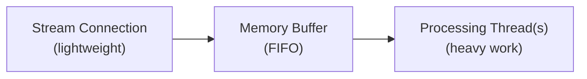

X のストリーミングエンドポイントからデータを利用する堅牢なクライアントを構築する方法を学びます。

## ストリーミングエンドポイントの概要

X のストリーミングエンドポイントは volume で分類されます。

| Category | Endpoints | Description |
|:---------|:----------|:------------|
| **High-volume streams** | **Firehose**、[Volume Streams](/x-api/posts/volume-streams/introduction)（1% および 10% サンプル） | フィルタなしで大量の Post データを配信します。プラットフォーム活動の網羅的なカバレッジを目的として設計されています。 |
| **Lower-volume streams** | [Filtered Stream](/x-api/posts/filtered-stream/introduction) | キーワードや条件を指定して、マッチする Post のみを受信します。ターゲットを絞ったモニタリングに最適です。 |
| **Low-latency streams** | [Powerstream](/x-api/powerstream/introduction) | 遅延を最小化するよう最適化されています。リアルタイムのデータ配信を必要とするユースケースに最適です。 |

## データ配信とレイテンシ

X API のストリーミングエンドポイントは、**データの hydration と配信** を優先します。すべてのメタデータが付与された Post データを確実に受信できるように、これらのストリームの **P99 レイテンシは約 6～7 秒** です。

### 配信の保証

| Metric | Value |
|:-------|:------|
| リトライ戦略 | 指数バックオフ |
| P99 レイテンシ | 約 6～7 秒 |

### High-volume streams

Firehose や Sample（1% および 10%）のような high-volume streams では、作成時刻から **1 分以内にすべての Post の 99%** が配信されます。この保証は、フルデータフィードの高ボリュームかつ継続的な性質に基づいています。

### Lower-volume streams

Filtered Stream のように潜在的により低ボリュームなストリームでは、フィルタの具体性と該当する Post のボリュームによって配信時間が変わることがあります。

<Note>
低レイテンシが必要なユースケースでは、速度に最適化され最小遅延でデータを配信する [Powerstream](/x-api/powerstream/introduction) の利用を検討してください。
</Note>

<Warning>
障害発生時、レイテンシやデータ配信に悪影響が生じる可能性があります。問題が発生した際の最新情報は [status page](https://developer.x.com/status) を参照してください。
</Warning>

---

## クライアント設計

ストリーミングエンドポイントでソリューションを構築する場合、クライアントは以下を行う必要があります。

1. ストリーミングエンドポイントへ **HTTPS ストリーミング接続を確立** する
2. **低ボリュームデータの処理** — 接続を維持し、Post オブジェクトと keep-alive シグナルを検出する
3. **高ボリュームデータの処理** — 非同期プロセスを使用してストリーム取り込みと処理を分離し、クライアント側バッファを定期的にフラッシュする
4. クライアント側で **ボリュームトラッキングを管理** する
5. **切断を検出** し、自動的に再接続する

ルールを持つエンドポイント（Filtered Stream や Powerstream など）の場合、クライアントはストリームから切断せずに非同期でルール管理のリクエストも送信する必要があります。

---

## ストリーミングエンドポイントへの接続

X API のストリーミングエンドポイントへの接続とは、非常に長時間の HTTP リクエストを行い、レスポンスを逐次的にパースすることを意味します。概念的には、HTTP 経由で無限に長いファイルをダウンロードすると考えることができます。

接続が確立されると、その接続が開いている限り X サーバーは Post イベントを配信し続けます。

```python
import requests

def connect_to_stream(url, bearer_token):
    headers = {"Authorization": f"Bearer {bearer_token}"}
    
    response = requests.get(url, headers=headers, stream=True)
    
    for line in response.iter_lines():
        if line:
            # Post を処理
            print(line.decode("utf-8"))
```

---

## データの利用

ストリームからの JSON オブジェクトは、フィールドの順序が任意で、すべてのフィールドがすべての状況で存在するとは限りません。Post はソートされた順序で配信されず、重複メッセージが発生することもあります。時間が経つにつれ、新しいメッセージタイプがストリームに追加される可能性があります。

クライアントは以下に耐性を持つ必要があります。

- フィールドが任意の順序で現れる
- 予期しないフィールドや欠落しているフィールド
- ソートされていない Post
- 重複メッセージ
- いつでも新しいメッセージタイプが登場する可能性

---

## バッファリング

ストリーミングエンドポイントは、利用可能になり次第データを送信するため、高いボリュームになる可能性があります。X サーバーが新しいデータをストリームに書き込めない場合（例えばクライアントの読み取りが十分速くない場合）、サーバー側でコンテンツをバッファします。ただし、このバッファが満杯になると接続は切断され、バッファされた Post は失われます。

アプリが遅れているかを検出する 1 つの方法は、受信した Post のタイムスタンプを現在時刻と比較し、これを時間経過とともに追跡することです。

ストリームのバックログを最小化するには、

- **ストリームを素早く読み取る** — 読み取り時に処理作業を行わないでください。アクティビティは非同期処理のために別のスレッド/プロセス/データストアに渡します
- **十分な帯域幅を確保する** — 大規模で持続的なボリュームおよびスパイク（通常量の 5～10 倍）に対応するため、データセンターへの受信帯域幅が必要です

---

## システムメッセージへの応答

### Keep-alive シグナル

少なくとも 20 秒ごとに、ストリームは開いた接続を通じて `\r\n` キャリッジリターン形式の keep-alive シグナル（heartbeat）を送信します。これにより、クライアントのタイムアウトを防ぎます。クライアントはこれらの文字に対して耐性がある必要があります。

HTTP ライブラリで読み取りタイムアウトを実装している場合、その期間内にデータが読み取られないと HTTP プロトコルにイベントを発生させることができます。これらのタイムアウトを検出して再接続をトリガーするために、HTTP メソッドをエラー/イベントハンドラでラップすることを推奨します。

### エラーメッセージ

ストリーミングエンドポイントはストリーム内エラーメッセージを配信することがあります。クライアントは変化するメッセージペイロードに対して耐性を持つ必要があります。

エラーメッセージ形式の例:

```json
{
  "errors": [{
    "title": "operational-disconnect",
    "disconnect_type": "UpstreamOperationalDisconnect",
    "detail": "This stream has been disconnected upstream for operational reasons.",
    "type": "https://api.x.com/2/problems/operational-disconnect"
  }]
}
```

<Note>
バッファ満杯による強制切断を示すエラーメッセージは、バックログのために配信できずクライアントに届かない場合があります。アプリはこれらのメッセージのみに依存して再接続を開始してはいけません。
</Note>

---

## 利用状況の追跡

予期しない乖離を検出するため、ストリームのデータボリュームを監視してください。ボリュームの大幅な減少は、切断以外の問題を示している可能性があります。ストリームは keep-alive シグナルと一部のデータを引き続き受信しますが、Post ボリュームの低下は調査を促すはずです。

モニタリングを作成するには、

1. 一定期間に予想される Post 数を追跡する
2. ボリュームが閾値を下回り回復しない場合、アラートを開始する
3. 特にルール変更時や Post アクティビティが急増するイベント時に、大幅な増加も監視する

<Note>
ストリーミングエンドポイントを通じて配信された Post は、月間 Post ボリュームにカウントされます。使用量を最適化するために消費を追跡し調整してください。ボリュームが高い場合、ルールに `sample:` オペレーターを追加してマッチング率を 100% から `sample:50` や `sample:25` に減らすことを検討してください。
</Note>

---

## マルチスレッド処理

マルチスレッドアプリケーションを構築することは、高ボリュームなストリームを扱う鍵となります。ベストプラクティス:

1. **Stream thread** — 接続を確立し、受信した JSON をメモリ構造やバッファ付きストリームリーダーに書き込む軽量スレッド
2. **Processing thread(s)** — バッファから消費し、JSON のパース、データベース書き込みの準備、その他のアプリケーションロジックといった重たい作業を行う別のスレッド

この設計により、受信する Post ボリュームの変化に応じてサービスを効率的にスケールできます。



---

## 次のステップ

<CardGroup cols={2}>
  <Card title="切断の処理" icon="plug" href="/x-api/fundamentals/handling-disconnections">
    接続が切れた際にグレースフルに再接続
  </Card>
  <Card title="大容量キャパシティ" icon="gauge-high" href="/x-api/fundamentals/high-volume-capacity">
    高スループットのストリームを処理
  </Card>
  <Card title="復旧と冗長化" icon="/icons/xds/icon-shield-keyhole.svg" href="/x-api/fundamentals/recovery-and-redundancy">
    レジリエントなストリーミングアプリケーションを構築
  </Card>
</CardGroup>
