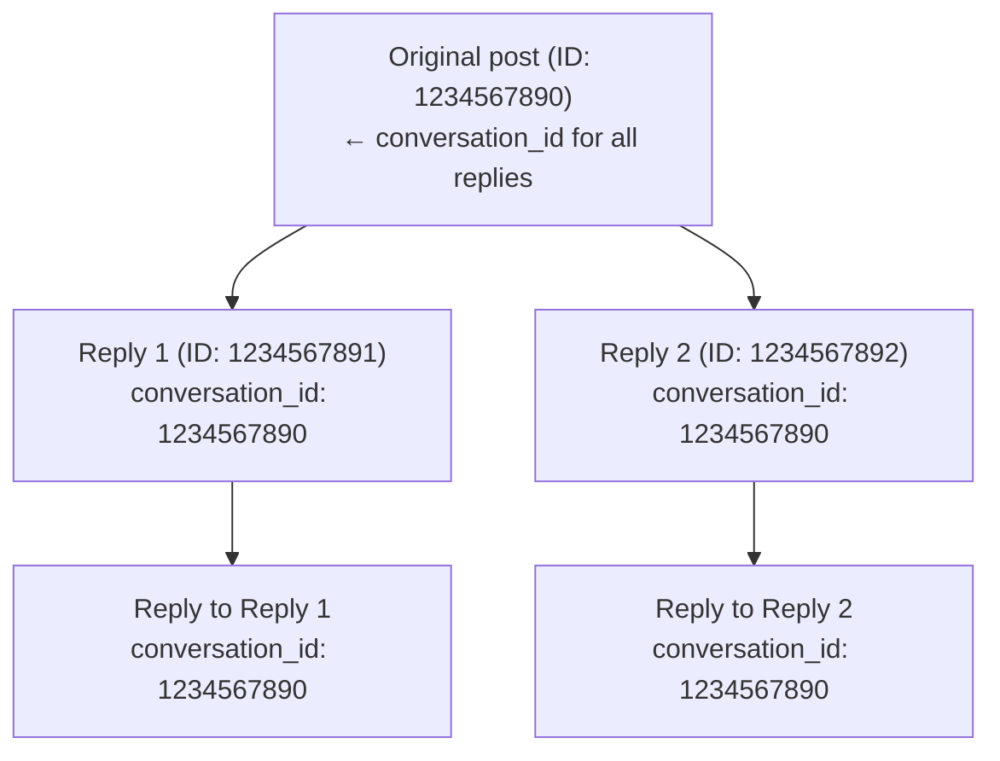

X 上のすべての返信は会話スレッドに属します。`conversation_id` フィールドによって、会話ツリー全体を特定、追跡、再構築できます。

---

## 仕組み

誰かが投稿し、他のユーザーが返信すると、すべての返信は同じ `conversation_id`（会話を開始した元の post の ID）を共有します。



スレッドの階層がどれだけ深くなっても、すべての post は同じ `conversation_id` を共有します。

---

## conversation_id のリクエスト

`conversation_id` を `tweet.fields` に追加します。

```bash
curl "https://api.x.com/2/tweets/1234567891?tweet.fields=conversation_id,in_reply_to_user_id,referenced_tweets" \
  -H "Authorization: Bearer $TOKEN"
```

レスポンス:

```json title="Example response" lines wrap icon="/icons/xds/icon-brackets.svg"
{
  "data": {
    "id": "1234567891",
    "text": "@user Great point!",
    "conversation_id": "1234567890",
    "in_reply_to_user_id": "2244994945",
    "referenced_tweets": [{
      "type": "replied_to",
      "id": "1234567890"
    }]
  }
}
```

---

## 会話全体の取得

`conversation_id` を検索オペレーターとして使用して、スレッド内のすべての post を取得します。

```bash
curl "https://api.x.com/2/tweets/search/recent?\
query=conversation_id:1234567890&\
tweet.fields=author_id,created_at,in_reply_to_user_id&\
expansions=author_id" \
  -H "Authorization: Bearer $TOKEN"
```

これは元の post に対するすべての返信を、新しい順で返します。

---

## ユースケース

<Tabs>
  <Tab title="スレッドの再構築">
会話ツリー全体を構築します。

```python title="Example" lines wrap icon="python"
import requests

conversation_id = "1234567890"
url = f"https://api.x.com/2/tweets/search/recent"
params = {
    "query": f"conversation_id:{conversation_id}",
    "tweet.fields": "author_id,in_reply_to_user_id,referenced_tweets,created_at",
    "max_results": 100
}

response = requests.get(url, headers=headers, params=params)
replies = response.json()["data"]

# created_at でソートして時系列順にする
replies.sort(key=lambda x: x["created_at"])
```
  </Tab>
  <Tab title="会話のモニタリング">
特定の会話への返信をリアルタイムでストリームします。

```bash
# 会話用の filtered stream ルールを追加
curl -X POST "https://api.x.com/2/tweets/search/stream/rules" \
  -H "Authorization: Bearer $TOKEN" \
  -d '{"add": [{"value": "conversation_id:1234567890"}]}'
```
  </Tab>
  <Tab title="会話の分析">
会話内の返信をカウントします。

```bash
curl "https://api.x.com/2/tweets/counts/recent?\
query=conversation_id:1234567890" \
  -H "Authorization: Bearer $TOKEN"
```
  </Tab>
</Tabs>

---

## 関連フィールド

| Field | Description |
|:------|:------------|
| `conversation_id` | スレッドを開始した元の post の ID |
| `in_reply_to_user_id` | 返信対象の post のユーザー ID |
| `referenced_tweets` | `type: "replied_to"` と親 post の ID を含む配列 |

---

## 例: スレッド全体の取得

```json title="Example response" expandable lines wrap icon="/icons/xds/icon-brackets.svg"
{
  "data": [
    {
      "id": "1234567893",
      "text": "@user2 @user1 I agree with you both!",
      "conversation_id": "1234567890",
      "author_id": "3333333333",
      "created_at": "2024-01-15T12:05:00.000Z",
      "in_reply_to_user_id": "2222222222",
      "referenced_tweets": [{"type": "replied_to", "id": "1234567892"}]
    },
    {
      "id": "1234567892",
      "text": "@user1 That's interesting!",
      "conversation_id": "1234567890",
      "author_id": "2222222222",
      "created_at": "2024-01-15T12:03:00.000Z",
      "in_reply_to_user_id": "1111111111",
      "referenced_tweets": [{"type": "replied_to", "id": "1234567890"}]
    },
    {
      "id": "1234567891",
      "text": "@user1 Great point!",
      "conversation_id": "1234567890",
      "author_id": "4444444444",
      "created_at": "2024-01-15T12:02:00.000Z",
      "in_reply_to_user_id": "1111111111",
      "referenced_tweets": [{"type": "replied_to", "id": "1234567890"}]
    }
  ],
  "meta": {
    "result_count": 3
  }
}
```

---

## 注意事項

- 元の post の `conversation_id` はその post 自身の `id` と等しくなります
- `conversation_id` は post を返すすべての v2 エンドポイントで利用可能です
- 会話をリアルタイムでモニタリングするために [filtered stream](/x-api/posts/filtered-stream/introduction) と組み合わせて使用できます
- 大きなスレッドの場合は [pagination](/x-api/fundamentals/pagination) と組み合わせてください

---

## 次のステップ

<CardGroup cols={2}>
  <Card title="post を検索" icon="/icons/xds/icon-search.svg" href="/x-api/posts/search/introduction">
    conversation_id で検索。
  </Card>
  <Card title="Filtered stream" icon="signal-stream" href="/x-api/posts/filtered-stream/introduction">
    会話をリアルタイムでモニタリング。
  </Card>
</CardGroup>
