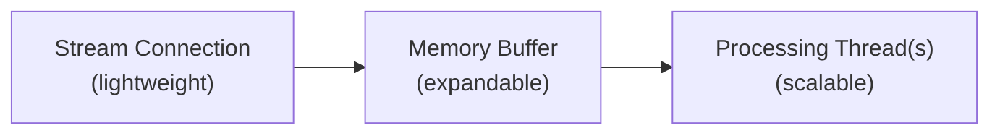

[Filtered Stream](/x-api/posts/filtered-stream/introduction)、[Volume Streams](/x-api/posts/volume-streams/introduction)、[Powerstream](/x-api/powerstream/introduction)、[Compliance Streams](/x-api/compliance/streams/introduction) など、X のストリーミングエンドポイントを利用する際に、高ボリュームイベントに備える方法を学びます。

## 高ボリュームイベントの計画

主要な国内・世界的イベントでは、ソーシャルメディア上のユーザー活動が急増することがよくあります。これらのイベントが事前にわかっている場合もあります。

- Super Bowl
- 政治選挙
- 世界各地の新年のお祝い

一方、スパイクが予期せず発生することもあります。

- 自然災害
- 予期しない政治的イベント
- ポップカルチャーの瞬間
- 健康上の緊急事態

これらのバースト期間は短時間（秒単位）の場合もあれば、数分にわたって持続することもあります。適切な準備により、これらのスパイクに対応できるようになります。

---

## ストリームルールを見直す

高ボリュームイベントの前に:

- イベント中、特定のキーワードが急増することがあります（例: ブランドが主要スポーツイベントをスポンサーする際のブランドメンション）
- 過剰な活動量を生成する可能性がある不要または過度に一般的なルールを削除してください
- 既知の高ボリュームイベントの前に関係者と連絡を取り、適切に計画できるようにしてください

---

## アプリケーションのストレステスト

バースト時のボリュームが **平均日次消費レベルの 5～10 倍** に達する可能性があると想定してください。ルールによっては、増加はさらに大きくなることがあります。

実際のイベントが発生する前にボトルネックを特定するため、シミュレートした高ボリュームでアプリケーションをテストしてください。

---

## 配信キャップを理解する

フローと配信のキャップはアクセスレベルに基づきます。

| Access Level | Delivery Cap |
|:-------------|:-------------|
| Academic | 250 Posts/second |
| Enterprise | Posts/second set at access level |

---

## 接続を維持する

ストリームでは、データを失わないために接続を維持することが不可欠です。

クライアントアプリケーションは以下を行うべきです。

1. 切断を **即座に検出** する
2. 適切なバックオフ戦略を用いて **再接続を試行** する
3. 再接続の試行が失敗する場合は **指数バックオフを使用** する

詳細な再接続戦略については [切断の処理](/x-api/fundamentals/handling-disconnections) を参照してください。

---

## クライアント側バッファリングを構築する

マルチスレッドアプリケーションを構築することは、高ボリュームなストリームを扱う鍵となります。

### 推奨アーキテクチャ

1. **Stream thread**（軽量）
   - ストリーミング接続を確立
   - 受信した JSON をメモリ構造やバッファ付きストリームリーダーに書き込む
   - 受信データのみを処理（処理は行わない）

2. **Memory buffer**
   - 必要に応じて拡大・縮小
   - ボリュームスパイクの緩衝材として機能

3. **Processing thread(s)**（重い処理）
   - バッファから消費
   - JSON をパース
   - データベース書き込みを準備
   - アプリケーションロジックを処理

---

## タイムゾーンを考慮する

グローバルイベントはグローバルタイムゾーンで発生します。イベントは以下で発生する可能性があります。

- 業務時間外
- 週末
- 休日

通常の業務時間外のスパイクにもチームが備えられるようにしてください。以下を検討してください。

- 自動アラートシステム
- オンコールローテーション
- 自動スケーリングの応答

---

## モニタリングの推奨事項

1. **Post ボリューム** をリアルタイムで追跡
2. ボリューム閾値（増加と減少の両方）に **アラートを設定**
3. **バッファサイズを監視** して、処理が遅れ始めた時点を検出
4. Post のタイムスタンプを現在時刻と **比較** して遅延を特定

---

## 緊急対応策

極端な状況に対する保護策を実装してください。

- ボリュームが事前に設定した閾値を超えた場合の **自動アラート**
- 過剰なデータをもたらすルールの **自動削除**
- 極端な状況ではシステムを保護するための **ストリームの切断**
- **サンプリングオペレーター** — ルールに `sample:` を追加してマッチング量を減らす

---

## 次のステップ

<CardGroup cols={2}>
  <Card title="ストリーミングデータの利用" icon="stream" href="/x-api/fundamentals/consuming-streaming-data">
    堅牢なストリーミングクライアントを構築
  </Card>
  <Card title="切断の処理" icon="plug" href="/x-api/fundamentals/handling-disconnections">
    グレースフルに再接続
  </Card>
  <Card title="復旧と冗長化" icon="/icons/xds/icon-shield-keyhole.svg" href="/x-api/fundamentals/recovery-and-redundancy">
    レジリエントなアプリケーションを構築
  </Card>
</CardGroup>
