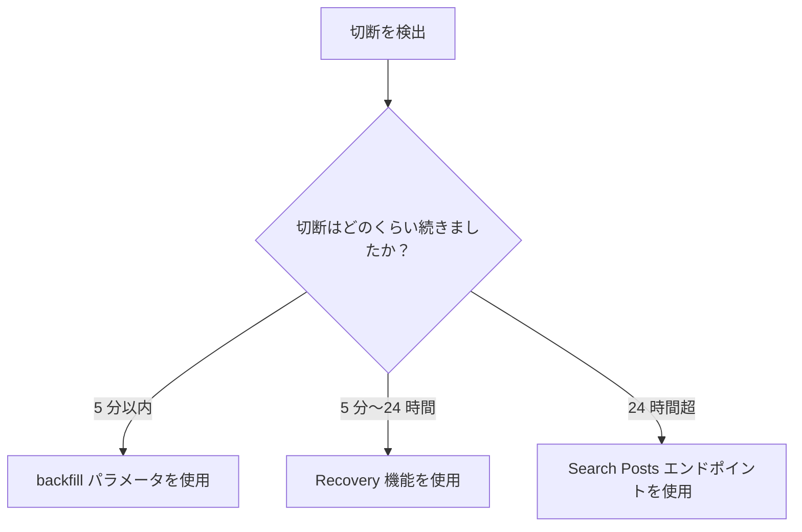

[Filtered Stream](/x-api/posts/filtered-stream/introduction)、[Firehose Streams](/x-api/stream/stream-all-posts)、[Volume Streams](/x-api/posts/volume-streams/introduction)、[Powerstream](/x-api/powerstream/introduction)、[Compliance Streams](/x-api/compliance/streams/introduction) など、X のストリーミングエンドポイントを利用する際に、接続時間を最大化し、欠落したデータを復旧する方法を学びます。

## 概要

ストリーミングデータを利用する際、接続時間を最大化し、マッチしたすべてのデータを受信することが基本目標です。これには以下が必要です。

- 冗長接続を活用する
- 切断を自動的に検出する
- 迅速に再接続する
- 失われたデータを復旧する計画を持つ

---

## 冗長接続

冗長接続を使用すると、同じストリームに複数の同時接続を確立できます。これは 2 つの別々のコンシューマで接続し、両方の接続を通じて同じデータを受信することで冗長性を提供します。

利点:
- いずれか一方のストリームが切断された場合のホットフェイルオーバー
- プライマリサーバーが停止した場合の保護
- 再接続中の継続的なデータ配信

### 使い方

同じストリーム URL に別のクライアントで接続するだけです。データは両方の接続を通じて送信されます。

<Note>
冗長接続は Enterprise アクセスで利用可能です。Filtered Stream は Enterprise プロジェクトで最大 2 つの冗長接続を許可します。Firehose Streams は `partition` パラメータを使用して最大 20 の同時接続をサポートし、Sample10（Decahose）は最大 2 パーティションをサポートします。接続数の上限については、各エンドポイントのドキュメントを確認してください。
</Note>

---

## Backfill

切断を検出した後、切断がどの程度続いたかを追跡し、適切な復旧方法を判断する必要があります。

### 5 分以内の切断

再接続時に **backfill パラメータ** を使用して、切断期間中にマッチした Post を受信します。

| Endpoint | Parameter | Example |
|:---------|:----------|:--------|
| Filtered Stream | `backfill_minutes` | `?backfill_minutes=5` |
| Firehose Stream | `backfill_minutes` | `?backfill_minutes=5` |
| Sample Stream (1%) | `backfill_minutes` | `?backfill_minutes=5` |
| Sample10 Stream (Decahose) | `backfill_minutes` | `?backfill_minutes=5` |
| Powerstream | `backfillMinutes` | `?backfillMinutes=5` |

リクエスト例:

**Filtered Stream:**

```bash
curl 'https://api.x.com/2/tweets/search/stream?backfill_minutes=5' \
  -H "Authorization: Bearer $ACCESS_TOKEN"
```

**Firehose Stream:**

```bash
curl 'https://api.x.com/2/tweets/firehose/stream?backfill_minutes=5&partition=1' \
  -H "Authorization: Bearer $ACCESS_TOKEN"
```

<Note>
**重要な考慮事項:**
- 一般的に、新しくマッチした Post よりも古い Post が先に配信されます
- Post は **重複排除されません** — 90 秒間切断していて 2 分間の backfill をリクエストすると、30 秒分の重複した Post を受信します
- システムは重複に対して耐性を持つ必要があります
- Backfill は Enterprise アクセスで利用可能です
</Note>

---

## Recovery

**5 分を超える** 切断の場合、Recovery 機能を使用して過去 24 時間以内の欠落データを再生します。

### Recovery の仕組み

1. `start_time` と `end_time` パラメータを付けて接続リクエストを行う
2. Recovery が指定期間を再ストリームする
3. 完了すると接続が切断される

### パラメータ

| Parameter | Type | Description |
|:----------|:-----|:------------|
| `start_time` | ISO 8601 date | 復旧開始時刻（UTC） |
| `end_time` | ISO 8601 date | 復旧終了時刻（UTC） |

### リクエスト例

**Filtered Stream:**

```bash
curl 'https://api.x.com/2/tweets/search/stream?start_time=2022-07-12T15:10:00Z&end_time=2022-07-12T15:20:00Z' \
  -H "Authorization: Bearer $ACCESS_TOKEN"
```

**Firehose Stream:**

```bash
curl 'https://api.x.com/2/tweets/firehose/stream?start_time=2022-07-12T15:10:00Z&end_time=2022-07-12T15:20:00Z&partition=1' \
  -H "Authorization: Bearer $ACCESS_TOKEN"
```

**Powerstream:**

```bash
curl 'https://api.x.com/2/powerstream?startTime=2022-07-12T15:10:00Z&endTime=2022-07-12T15:20:00Z' \
  -H "Authorization: Bearer $ACCESS_TOKEN"
```

<Note>
**Recovery の制限:**
- Enterprise アクセスで利用可能
- Recovery ウィンドウ: 過去最大 24 時間
- Filtered Stream は 2 つの同時 Recovery ジョブを許可
- Firehose、Sample10（Decahose）、言語別 firehose ストリームも Recovery をサポート
- 基本的な 1% Sample Stream は Recovery をサポートしていません。代わりに Search エンドポイントを使用してください
</Note>

---

## 代替の復旧方法: Search

backfill や Recovery 機能にアクセスできない場合、または切断が 24 時間を超えた場合は、[Search Posts エンドポイント](/x-api/posts/search/introduction) を使用して欠落データをリクエストできます。

<Warning>
**マッチング動作の相違:**
Search Posts エンドポイントは `sample:`、`bio:`、`bio_name:`、`bio_location:` オペレーターをサポートせず、アクセントや発音区別符号のマッチング動作にも違いがあります。つまり、ストリーミングエンドポイントで受信できたであろうすべての Post を完全に復旧できるとは限りません。
</Warning>

---

## Recovery 判断ツリー



---

## ベストプラクティス

1. **切断時間を追跡** — 切断が発生した時刻とその継続時間を記録しましょう

2. **自動復旧を実装** — 切断時間に基づき、適切な復旧方法を自動的に選択します

3. **重複を処理** — backfill と Recovery のいずれも重複した Post を配信する可能性があります。重複排除ロジックを実装してください

4. **冗長接続を使用** — 利用可能な場合は複数の接続を維持してデータの損失を防ぎます

5. **Recovery ジョブを監視** — Recovery 操作のステータスと完了を追跡します

---

## 次のステップ

<CardGroup cols={2}>
  <Card title="切断の処理" icon="plug" href="/x-api/fundamentals/handling-disconnections">
    切断を検出して処理
  </Card>
  <Card title="ストリーミングデータの利用" icon="stream" href="/x-api/fundamentals/consuming-streaming-data">
    堅牢なストリーミングクライアントを構築
  </Card>
  <Card title="大容量キャパシティ" icon="gauge-high" href="/x-api/fundamentals/high-volume-capacity">
    高スループットのストリームを処理
  </Card>
</CardGroup>
