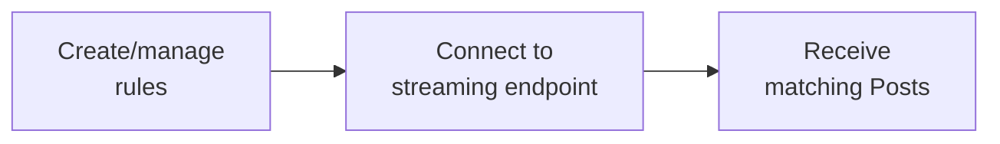

import { Button } from '/snippets/button.mdx';

Filtered Stream エンドポイントを使用すると、フィルタルールに一致する投稿をほぼリアルタイムで受信できます。強力な演算子を使ってルールを作成し、永続接続のストリームに接続して、投稿が公開された時点で一致する投稿を受信します。

<Note>
Filtered Stream はデータのハイドレーションと配信を優先しており、P99 レイテンシは約 6〜7 秒です。より低いレイテンシが必要な場合は、[Powerstream](/x-api/powerstream/introduction) を参照してください。
</Note>

## 概要

<CardGroup cols={2}>
  <Card title="ニアリアルタイム配信" icon="bolt">
    公開後数秒以内に投稿を受信
  </Card>
  <Card title="永続ルール" icon="/icons/xds/icon-filter.svg">
    切断せずにルールを追加・削除
  </Card>
  <Card title="強力な演算子" icon="/icons/xds/icon-search.svg">
    キーワード、ハッシュタグ、ユーザーなどでマッチ
  </Card>
  <Card title="Webhook 配信" icon="webhook">
    オプションで Webhook 経由で投稿を受信
  </Card>
</CardGroup>

---

## しくみ

1. **ルールを作成** — 演算子を使ってフィルタルールを定義
2. **ストリームに接続** — 永続 HTTP 接続を確立
3. **投稿を受信** — 一致する投稿をほぼリアルタイムで取得



---

## エンドポイント

| Method | Endpoint | Description |
|:-------|:---------|:------------|
| GET | [`/2/tweets/search/stream`](/x-api/stream/stream-filtered-posts) | ストリームに接続 |
| POST | [`/2/tweets/search/stream/rules`](/x-api/stream/update-stream-rules) | ルールの追加または削除 |
| GET | [`/2/tweets/search/stream/rules`](/x-api/stream/get-stream-rules) | 現在のルールを一覧表示 |

---

## アクセスレベル

| Feature | Pay-per-use | Enterprise |
|:--------|:------------|:-----------|
| Project あたりのルール数 | 1,000 | 25,000+ |
| ルール長 | 1,024 文字 | 2,048 文字 |
| 接続数 | 1 | 複数 |
| Core 演算子 | ✓ | ✓ |
| セマンティックエンベディング演算子 | — | ✓ (Embedding ティアが必要) |

<Card title="Enterprise のお問い合わせ" icon="/icons/xds/icon-bank.svg" href="https://developer.x.com/en/products/x-api/enterprise/enterprise-api-interest-form">
  上限の引き上げと追加機能を利用
</Card>

<Note>
特定のティアが必要な演算子があります。`embedding:` セマンティック演算子は、Embedding ティアアクセスを持つ Enterprise プランでの **Filtered Stream のみ** で利用可能です。標準の従量課金アクセスには core 演算子のみが含まれます。
</Note>

---

## ルールの構築

ルールは検索クエリと同じ演算子を使用します:

```
(AI OR "machine learning") lang:en -is:retweet
```

### ルール例

| Rule | Matches |
|:-----|:--------|
| `#python` | #python ハッシュタグを含む投稿 |
| `from:elonmusk` | @elonmusk の投稿 |
| `"breaking news" has:images` | フレーズと画像を含む投稿 |
| `(@XDevelopers OR @X) -is:retweet` | メンション、リツイートを除く |
| `embedding:"climate change policy"` | 気候政策について意味的に一致する投稿 (Enterprise + Embedding ティア) |

<Card title="ルールを組み立てる" icon="/icons/xds/icon-filter.svg" href="/x-api/posts/filtered-stream/integrate/build-a-rule">
  ルール構文と演算子を学ぶ
</Card>

---

## ストリームへの接続

永続 HTTP 接続を確立して投稿を受信します:

```python
import requests

def stream_posts(bearer_token):
    url = "https://api.x.com/2/tweets/search/stream"
    headers = {"Authorization": f"Bearer {bearer_token}"}
    
    response = requests.get(url, headers=headers, stream=True)
    
    for line in response.iter_lines():
        if line:
            print(line.decode("utf-8"))
```

### Keep-alive シグナル

ストリームは接続を維持するため、20 秒ごとに空行 (`\r\n`) を送信します。20 秒間データや keep-alive を受信しない場合は再接続してください。

<CardGroup cols={2}>
  <Card title="切断の処理" icon="plug" href="/x-api/fundamentals/handling-disconnections">
    グレースフルに再接続
  </Card>
  <Card title="ストリーミングデータの消費" icon="stream" href="/x-api/fundamentals/consuming-streaming-data">
    投稿を効率的に処理
  </Card>
</CardGroup>

---

## Webhook 配信

永続接続を維持する代わりに、Webhook 経由で投稿を受信できます:

<Card title="Webhook 配信" icon="webhook" href="/x-api/webhooks/stream/introduction">
  Filtered stream の Webhook 配信を設定
</Card>

---

## 投稿の編集

ストリームは編集された投稿を編集履歴と共に配信します。各編集は新しい投稿 ID を作成します:

```json
{
  "data": {
    "id": "1234567893",
    "text": "Hello world! (edited)",
    "edit_history_tweet_ids": ["1234567890", "1234567891", "1234567893"]
  }
}
```

<Card title="Edit Posts の基礎" icon="/icons/xds/icon-history.svg" href="/x-api/fundamentals/edit-posts">
  投稿の編集について詳しく学ぶ
</Card>

---

## はじめる

<Note>
**前提条件**

- 承認済みの[開発者アカウント](https://developer.x.com/en/portal/petition/essential/basic-info)
- 開発者コンソール内の [Project と App](/resources/fundamentals/developer-apps)
- App の [Bearer Token](/resources/fundamentals/authentication)
</Note>

<CardGroup cols={2}>
  <Card title="クイックスタート" icon="/icons/xds/icon-rocket.svg" href="/x-api/posts/filtered-stream/quickstart">
    数分でストリームに接続
  </Card>
  <Card title="ルールを組み立てる" icon="/icons/xds/icon-filter.svg" href="/x-api/posts/filtered-stream/integrate/build-a-rule">
    ルール構文を学ぶ
  </Card>
  <Card title="演算子リファレンス" icon="list-check" href="/x-api/posts/filtered-stream/integrate/operators">
    すべての利用可能な演算子
  </Card>
  <Card title="サンプルコード" icon="github" href="https://github.com/xdevplatform/Twitter-API-v2-sample-code">
    動作するコード例
  </Card>
</CardGroup>

---

## 高度なトピック

<CardGroup cols={2}>
  <Card title="切断の処理" icon="plug" href="/x-api/fundamentals/handling-disconnections">
    グレースフルに再接続
  </Card>
  <Card title="ハイボリューム容量" icon="gauge-high" href="/x-api/fundamentals/high-volume-capacity">
    高スループットを処理
  </Card>
  <Card title="リカバリと冗長性" icon="/icons/xds/icon-shield-keyhole.svg" href="/x-api/fundamentals/recovery-and-redundancy">
    レジリエントなアプリを構築
  </Card>
  <Card title="返された投稿とのマッチング" icon="crosshairs" href="/x-api/posts/filtered-stream/integrate/matching-returned-tweets">
    どのルールが一致したかを識別
  </Card>
</CardGroup>
