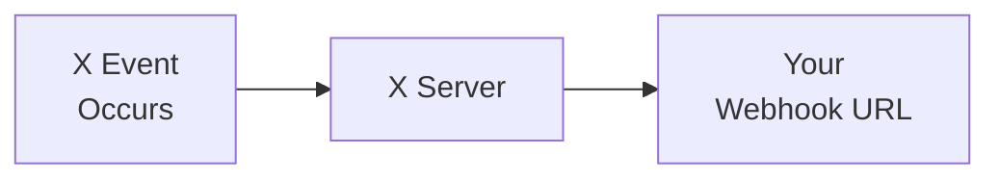

import { Button } from '/snippets/button.mdx';

V2 Webhooks API を使用すると、開発者は webhook ベースの JSON メッセージを介して X アカウントからリアルタイムのイベント通知を受信できます。これらの API により、Webhook の登録と管理、イベントを処理するコンシューマーアプリケーションの開発、Challenge-Response Check (CRC) と署名ヘッダーによるセキュアな通信の確保が可能になります。

## 概要

<CardGroup cols={2}>
  <Card title="リアルタイム配信" icon="bolt">
    発生と同時にイベントを受信
  </Card>
  <Card title="プッシュベース" icon="/icons/xds/icon-arrow-right.svg">
    データをサーバーに直接送信 — ポーリング不要
  </Card>
  <Card title="セキュア" icon="/icons/xds/icon-shield-keyhole.svg">
    CRC 検証と署名検証
  </Card>
  <Card title="信頼性" icon="gauge">
    再試行とリカバリのサポート
  </Card>
</CardGroup>

---

## Webhook をサポートする製品

現在 Webhook 経由でイベント配信をサポートしている製品は次のとおりです:

| Product | 説明 |
|:--------|:------------|
| [X Activity API (XAA)](/x-api/activity/introduction) | X 上で発生するアクティビティのリアルタイムイベントを受信 |
| [Account Activity API (AAA)](/x-api/account-activity/introduction) | 特定のユーザーアカウントに関連するリアルタイムイベントを受信 |
| [Filtered Stream Webhooks](/x-api/webhooks/stream/introduction) | Webhook 配信で Filtered Stream の Post を受信 |

---

## Webhook の仕組み

1. **イベントが発生** — ユーザーが Post、DM の送信、フォローなど
2. **X が POST リクエストを送信** — JSON イベントペイロードを登録済み Webhook URL に送信
3. **イベントを処理** — サーバーがイベントデータを処理
4. **200 OK で応答** — 受信確認のために 200 ステータスを返す

---

## Webhook の要件

| Requirement | 説明 |
|:------------|:------------|
| **HTTPS** | Webhook URL は HTTPS を使用する必要があります |
| **公開アクセス可能** | インターネットから URL に到達可能である必要があります |
| **ポート指定不可** | URL にポートを含めることはできません(例: `https://mydomain.com:5000/webhook` は機能しません) |
| **迅速な応答** | 10 秒以内に応答する必要があります |
| **200 OK** | 受信確認のために 200 ステータスを返す必要があります |
| **CRC サポート** | Challenge-Response Check の GET リクエストに応答する必要があります([詳しくはこちら](/x-api/webhooks/quickstart#2-the-crc-check)) |

---

## エンドポイント

| Method | Endpoint | 説明 |
|:-------|:---------|:------------|
| POST | [`/2/webhooks`](/x-api/webhooks/create-webhook) | 新規 Webhook を登録 |
| GET | [`/2/webhooks`](/x-api/webhooks/get-webhook) | 登録済み Webhook を一覧表示 |
| DELETE | [`/2/webhooks/:webhook_id`](/x-api/webhooks/delete-webhook) | Webhook を削除 |
| POST | [`/2/webhooks/replay`](/x-api/webhooks/create-replay-job-for-webhook) | Webhook のリプレイジョブを作成 |
| PUT | [`/2/webhooks/:webhook_id`](/x-api/webhooks/validate-webhook) | CRC チェックをトリガーし、Webhook を再有効化 |

すべてのエンドポイントには **OAuth2 App Only Bearer Token** 認証が必要です。

---

## セキュリティ

X の Webhook ベース API は、Webhook サーバーのセキュリティを確認するための 2 つの方法を提供します:

1. **Challenge-Response Check (CRC)** — X は定期的に Webhook URL に GET リクエストを送信します。エンドポイントを制御していることを証明するために HMAC-SHA256 ハッシュで応答します。CRC チェックは、初回登録時、毎時、および手動での再検証時に行われます。

2. **署名検証** — X からの各 POST リクエストには `x-twitter-webhooks-signature` ヘッダーが含まれます。この署名を検証することで、着信イベントの送信元が X であることを確認できます。

<Card title="完全な実装詳細を見る" icon="/icons/xds/icon-code.svg" href="/x-api/webhooks/quickstart">
  ステップバイステップの CRC 設定、コード例、署名検証
</Card>

---

## Webhook の検証

CRC チェックは、次のケースで Webhook に送信されます:

- 作成直後
- 明示的な PUT リクエスト時 (`PUT /2/webhooks/{id}`)
- 30 分ごとに定期的に(ただし、Webhook が過去 24 時間以内に正常に検証されていない場合のみ)

Webhook は次の場合に **無効** としてマークされます:

- CRC チェックへの応答が無効
  - 2XX ステータスコードを返すが `response_token` が正しくない
  - 3XX ステータスコードを返す
  - SSL 例外が発生
- 一時的なエラーが持続し、28 時間を超えて正常に検証されない(一時的な問題に対する 4 時間の猶予期間を含む)
  - 次の応答は一時的なエラーとして扱われます:
    - 4XX ステータスコード
    - 5XX ステータスコード
    - リクエストのタイムアウト
    - チャンネル切断

`GET /2/webhooks` エンドポイント、または Developer Console のツールボックスを使用して、Webhook の有効/無効状態を確認できます。

---

## はじめに

<Note>
**前提条件**

- 承認済みの[開発者アカウント](https://developer.x.com/en/portal/petition/essential/basic-info)
- Developer Console の[プロジェクトとアプリ](/resources/fundamentals/developer-apps)
- 公開アクセス可能な HTTPS エンドポイント
- CRC 検証用のアプリの **consumer secret** (API secret key)
</Note>

<CardGroup cols={2}>
  <Card title="クイックスタート" icon="/icons/xds/icon-rocket.svg" href="/x-api/webhooks/quickstart">
    Webhook をエンドツーエンドで設定
  </Card>
  <Card title="Filtered Stream Webhooks" icon="/icons/xds/icon-filter.svg" href="/x-api/webhooks/stream/introduction">
    Webhook 経由でフィルタリングされた Post を受信
  </Card>
  <Card title="Account Activity API" icon="/icons/xds/icon-bell.svg" href="/x-api/account-activity/introduction">
    Webhook 経由でアカウントイベントを受信
  </Card>
  <Card title="サンプルアプリ" icon="github" href="/x-api/webhooks/quickstart#sample-apps">
    動作するコード例
  </Card>
</CardGroup>
