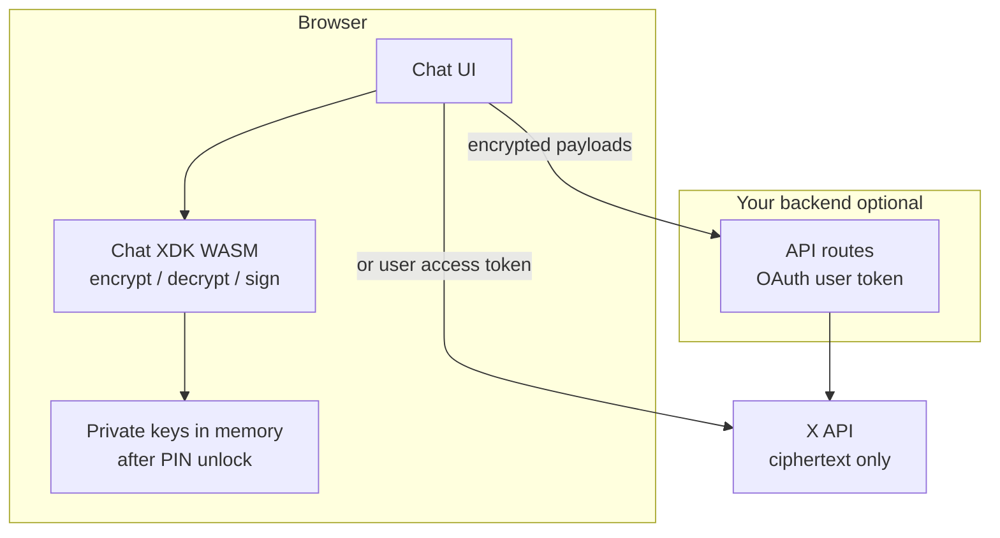

**ユーザー向けチャット UI** では、[Chat XDK](/xchat/xchat-xdk) を **JavaScript/WASM パッケージ**(`@xdevplatform/chat-xdk`)経由で**ブラウザー内で**実行してください。アイデンティティと署名の秘密鍵はユーザーの端末に留まります。あなたのサーバー(および X)が目にするのは**暗号文**、公開鍵、OAuth トークンだけであり、メッセージの暗号化・署名に使う PIN や秘密鍵の素材ではありません。

このページはクライアントアプリ向けの推奨アーキテクチャです。あらゆるアプリ種別に共通する PIN と鍵の取り扱いルールについては、[秘密鍵の取り扱い](/xchat/handling-private-keys) を参照してください。

---

## なぜ UI アプリで WASM なのか

| アプローチ | 暗号処理の実行場所 | 秘密鍵 | 適合ケース |
|:---------|:------------------|:-------------|:----|
| **ブラウザー内の WASM**(`createChat`) | ユーザーの端末 | PIN で WASM メモリに復元。バックエンドには送信されない | **チャット UI に推奨** |
| **サーバー上のネイティブ Chat XDK** | あなたのサーバー | サーバー上の鍵ブロブまたはパスコードによる復元 | ボットや自動化。エンドユーザー向けチャットクライアントには不向き |

エンドユーザーは自分の暗号化 PIN をあなたのバックエンドに貼り付けるべきでは**決してなく**、あなたのバックエンドはユーザーのアイデンティティ秘密鍵を保持すべきでは**決してありません**。サードパーティのサーバーがユーザーの PIN やルート秘密鍵を受け取ってしまうと、その相手は**ユーザーが後に OAuth アクセスを取り消したあとでも**、そのアイデンティティ宛にラップされた会話鍵を復号できます。クライアントサイドの WASM は、正当なアプリからこの種の失敗を避けられます。

<Warning>
サードパーティに PIN や秘密鍵を渡すことは、暗号化 DM のパスワードを共有するのと同じです。OAuth の切断は、アプリがすでに取得した鍵を**取り消しません**。可能な限り WASM を選んで鍵をブラウザーの外に出さないようにし、それができない場合はリスクを明示してください。[秘密鍵の取り扱い](/xchat/handling-private-keys) を参照してください。
</Warning>

---

## 推奨アーキテクチャ

**暗号処理**(ブラウザー)と **API トランスポート**(あなたのバックエンド、またはユーザートークンを使った直接の X API 呼び出し)を分離します。



| レイヤー | 役割 |
|:------|:---------------|
| **ブラウザー UI** | 会話を描画;PIN の入力は**クライアント内でのみ**受け付け;暗号化/復号/署名は Chat XDK WASM を呼び出す |
| **Chat XDK WASM** | 鍵生成、セキュアキーバックアップ(`setup` / `unlock`)、メッセージ暗号処理 |
| **あなたのバックエンド(オプション)** | OAuth アクセストークンの保持、X Chat REST のプロキシ、Juicebox レルム認証トークンの発行。PIN や秘密鍵は**決して**受け取らない |
| **X API** | 公開鍵、ラップ済みの会話鍵、暗号化されたイベントとメディア |

一般的なパターン(社内デモのブラウザーチャットクライアントなどで使われているもの)は次のようになります:**フロントエンドで WASM + React(または類似)**、そして必要に応じてブラウザーが長寿命のシークレットで `api.x.com` を直接叩かなくても済むよう、**Next.js(または他)の API ルート内で TypeScript [XDK](/xdks/typescript/overview)** を使用します。暗号処理は依然としてブラウザー内でのみ実行されます。

---

## ブラウザー用パッケージのインストール

```bash
npm install @xdevplatform/chat-xdk
npm install juicebox-sdk   # required for setup() / unlock() secure key backup
```

コンパイル済みの WASM エンジンは `@xdevplatform/chat-xdk` に同梱されており、利用者側に Rust ツールチェーンは不要です。モダンなブラウザー(SSR とコードを共有する場合は Node.js 18 以上。暗号処理はクライアントでのみ実行してください)が必要です。

---

## セッションの流れ(PIN は一度だけ、鍵はメモリに留める)

メッセージごとに PIN を要求しては**いけません**。**ブラウザーセッションごとに一度だけ**アンロックし、`Chat` インスタンスをメモリ内に保持(モジュールシングルトン、React コンテキストなど)し、そのアンロック済みインスタンスに対して暗号化と復号を実行してください。

```typescript
import { createChat } from '@xdevplatform/chat-xdk';

// 1) Create once per page load (client component / browser only)
const chat = await createChat({
  juiceboxConfig: JSON.stringify(record.juicebox_config), // from GET public keys for the user
  getAuthToken: async (realmId) => {
    // Your backend mints a Juicebox realm token for this user + key version.
    // Do not send the user's PIN here—only realm auth for secure key backup.
    const res = await fetch(`/api/juicebox/token?realm=${encodeURIComponent(realmId)}`);
    if (!res.ok) throw new Error('Juicebox token fetch failed');
    return res.text();
  },
});

// 2) First-time identity: generate → register public keys with X → backup with PIN
// const payload = chat.generateKeypairs();
// await registerPublicKeysWithX(payload);  // POST /2/users/:id/public_keys
// await chat.setup(pin);                   // PIN never leaves the browser

// 3) Returning session: recover keys with PIN (once)
await chat.unlock(pin);
chat.setIdentity(userId, signingKeyVersion);
chat.setCacheKeys(true);
// Fetch participants' public keys from X, then:
chat.setSigningKeys(signingKeys);

// 4) Use for the whole SPA session—no more PIN prompts
const result = chat.decryptEvents(rawEvents);
const sendBody = chat.encryptMessage({ conversationId, text: 'Hello' });
// POST sendBody to your backend or X Chat send-message endpoint

// 5) On logout or "lock chat"
chat.lock(); // clears key material from the WASM instance
// chat.free(); // if you will not reuse this instance
```

### UX 上の期待値

| イベント | 対応 |
|:------|:-----------|
| **アプリ起動 / ハードリロード** | ユーザーが PIN を入力 → `unlock` → SPA 内のナビゲーションではインスタンスを保持 |
| **送信 / 受信 / メディア** | **すでにアンロック済み**のインスタンスに対して暗号化/復号を呼び出す |
| **ログアウト / アカウント切り替え** | `lock()` または `free()`;参照を破棄し、あらゆるセッション状態をクリア |
| **PIN を忘れた / ロックアウト** | セキュアキーバックアップには推測回数制限があり、リカバリーには鍵のリセット(新しい鍵ペアと再登録)が必要になる場合があります。[暗号化入門](/xchat/cryptography-primer#secure-key-backup-distributed-key-storage) を参照 |

<Tip>
**アクションごとに PIN を再入力させないでください。** デモアプリでは簡便さのために `unlock` を繰り返し呼ぶことがあります。本番の UI では一度だけアンロックし、インスタンスをメモリに保持し、リロード、ログアウト、または `lock()` の後にのみ PIN を再入力させてください。
</Tip>

---

## サーバーが見てよいもの

| サーバーに送ってよい | サーバーに絶対に送らない |
|:----------------------|:-------------------------|
| OAuth 2.0 ユーザーアクセストークン | 暗号化 PIN / パスコード |
| Juicebox の**レルム認証トークン**(短命、バックアッププロトコル用) | アイデンティティまたは署名の**秘密**鍵 |
| 公開鍵登録ペイロード | エンドユーザーアイデンティティの生の `export_keys` ブロブ(ブラウザーアプリの場合) |
| 暗号化されたメッセージとメディアのペイロード | メッセージ本文の平文(UI 内で編集中のものを除く) |
| X がすでに保存している会話 ID、イベント ID、メタデータ | ユーザーのルート鍵素材を再構築できるあらゆるもの |

Juicebox 用のレルムトークンはユーザーの PIN では**ありません**。それは、特定のユーザーと鍵バージョンに対してバックアッププロトコルを認可します。すでにユーザーの OAuth コンテキストを保持しているバックエンドで発行し続けてください。

---

## ブラウザーでのセキュアキーバックアップ

クライアントアプリは、生の鍵ファイルではなく**セキュアキーバックアップ**(パスコードを使う `setup` / `unlock`)を使うべきです。

1. ユーザーの公開鍵レコード(`public_key.fields=juicebox_config`)から `juicebox_config` をロードします。
2. `createChat({ juiceboxConfig, getAuthToken })` を呼び出します。
3. 初回:`generateKeypairs` → X に公開鍵を登録 → `setup(pin)`。
4. その後:この端末で `unlock(pin)`(または同じ PIN で新しい端末で)。

Chat XDK のブラウザー経路は鍵を WASM に復元し、**`createChat` の公開サーフェスでは生の秘密鍵エクスポートを露出しません**。そのため、アプリケーションの JavaScript がルート鍵バイトをページに引き出すのは推奨されません。手作りの `localStorage` への鍵ダンプよりも、このモデルを優先してください。

登録とアンロックの完全な手順は [はじめに](/xchat/getting-started)、概念は [暗号化入門](/xchat/cryptography-primer) を参照してください。

---

## ブラウザーのハードニングチェックリスト

- Chat XDK は**クライアント**バンドルでのみ実行してください(アンロック済み鍵の SSR は不可)。
- アンロック済み `Chat` インスタンスをライブセッションのシークレットとして扱ってください:`window` に置かない、ログに出さない、アナリティクスに送らない。
- **XSS に対策**してください:CSP、`dangerouslySetInnerHTML` や Markdown レンダリングの慎重な扱い、依存関係の衛生管理。チャットアプリでの XSS は、鍵がネットワークに乗らなくてもメモリ内の鍵に到達できます。
- どこでも **HTTPS** を使い、暗号処理を含むページを安全でないスクリプトと絶対に混在させないでください。
- **OAuth スコープは最小限**を優先し、DM スコープは必要なときにのみ要求し、プロダクト UI で理由を説明してください。
- ログアウト時には **`lock()`** / **`free()`** を呼び、インスタンスを破棄してください。

ストレージ関連の推奨事項(`localStorage` に置くべきでないもの、セッション永続化の考え方)は [秘密鍵の取り扱い](/xchat/handling-private-keys#browser-session-persistence) にあります。

---

## 次のステップ

1. [秘密鍵の取り扱い](/xchat/handling-private-keys) — PIN に関する警告、保管、ボットと UI アプリの比較
2. [はじめに](/xchat/getting-started) — 完全な鍵登録と最初のメッセージ
3. [Chat XDK](/xchat/xchat-xdk) — `createChat`、暗号化、復号の API リファレンス
4. [リアルタイムイベント](/xchat/real-time-events) — 暗号文をクライアントに配信してローカルで復号する
