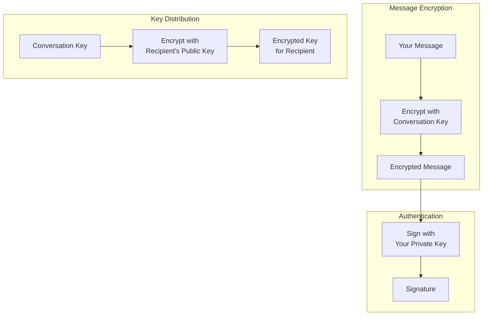
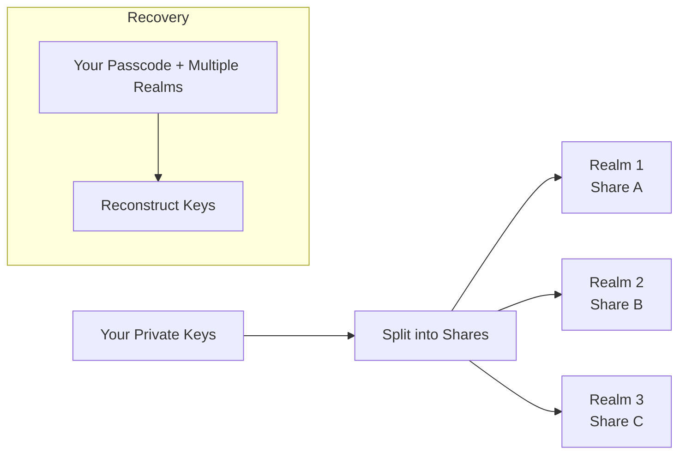

import { Button } from '/snippets/button.mdx';

この入門記事では、X Chat の背後にある暗号技術のアイデアを概念レベルで説明します。実装するにあたってこれほどの深さを理解する必要はありません——[Chat XDK](/ja/xchat/xchat-xdk) が暗号化、復号、署名、鍵の保管を代わりに行います——が、この考え方はアプリを設計したり動作をデバッグしたりする際に役立ちます。

実装の準備ができたら、フル解説の[はじめに](/ja/xchat/getting-started)と、サイドバーの各ルートに関する [API リファレンス](/x-api/chat/get-chat-conversations)を参照してください。

<Note>
**この暗号処理を自分で実装する必要はありません。** Chat XDK が処理します。このページは理解のためのものであり、API のチェックリストではありません。
</Note>

---

## 全体像

X Chat は階層的な暗号化システムを採用しており、次のように動作します。

1. **メッセージ**は**会話鍵**で暗号化されます(高速な対称鍵暗号)
2. **会話鍵**は各参加者の**アイデンティティ公開鍵**を使って暗号化されます(非対称鍵交換)
3. **メッセージは署名鍵で署名**されるため、受信者は送信者と改ざんがないことを検証できます

対称鍵暗号は大量のメッセージ通信に効率的です。非対称鍵暗号は主に会話鍵を安全に**配布**するために使われます。

プロダクトのフローでは、X が伝送するのは**暗号文と鍵のエンベロープ**であり、読み取り可能なメッセージ内容や生の会話鍵ではありません。あなたのアプリは暗号処理に Chat XDK を用い、鍵の登録や暗号化ペイロードの送受信に [Chat API](/ja/xchat/introduction)(Python/TypeScript の XDK、または HTTPS 経由)を使います。これらがどのように組み合わさるかは[はじめに](/ja/xchat/getting-started)を参照してください。

---

## 鍵の種類の解説

X Chat は 3 種類の鍵素材を用い、それぞれに特定の目的があります。

### 1. アイデンティティ鍵ペア

**目的:** ユーザー間で会話鍵を安全にやり取りするため

| コンポーネント | 説明 |
|:----------|:------------|
| **アイデンティティ公開鍵** | 他者と共有し、会話鍵をあなた宛に暗号化するために使われる |
| **アイデンティティ秘密鍵** | 秘密に保持し、あなた宛に送られた会話鍵を復号するために使われる |

誰かがあなたを会話に追加すると、その相手はあなたのアイデンティティ公開鍵を用いて会話鍵を暗号化します。それを復号できるのはあなたのアイデンティティ秘密鍵だけです。

公開部分はプラットフォームの **public-key** API を通じて登録・検索されます(API リファレンスの「Encryption keys」を参照)。秘密部分は Chat XDK 内に保持されます(たとえば[セキュアキーバックアップ](#secure-key-backup-distributed-key-storage)や慎重に保護された鍵ブロブとして)。

### 2. 署名鍵ペア

**目的:** メッセージの作者があなたであることを証明するため

| コンポーネント | 説明 |
|:----------|:------------|
| **署名公開鍵** | 他者と共有し、あなたの署名を検証するために使われる |
| **署名秘密鍵** | 秘密に保持し、メッセージへの署名に使われる |

メッセージを送信すると、あなたの署名秘密鍵で署名されます。受信者はあなたの署名公開鍵(これも public-key API を通じて公開されます)を用いて検証します。Chat XDK はメッセージを暗号化するのと同時に署名し、送信者の公開鍵素材を渡せば復号時に検証も行えます。

### 3. 会話鍵

**目的:** 特定の会話内でメッセージ(および[メディア](/ja/xchat/media))を暗号化・復号するため

| プロパティ | 説明 |
|:---------|:------------|
| **対称鍵** | 同じ鍵で暗号化と復号を行う |
| **会話ごと** | 各会話は独自の鍵を持つ |
| **参加者間で共有** | 会話を読めるべきすべての参加者がコピーを持つ |
| **バージョン管理** | 鍵はローテーション可能。アプリは時系列でバージョンを追跡すべき |

会話鍵は会話がセットアップされる時や鍵がローテーションされる時に生成されます。各参加者は自分のアイデンティティ公開鍵で作られた鍵の**暗号化されたコピー**を受け取ります。自分のコピーを一度復号したあと、**生の**会話鍵を保持し、高速なメッセージ(および[メディア](/ja/xchat/media))暗号化に使用します。会話のためにこれらのコピーをセットアップする処理は Chat XDK と会話の **key** エンドポイントの組み合わせで行います——手順は[はじめに](/ja/xchat/getting-started#4-set-up-conversation-keys)で解説しています。

---

## 暗号化の仕組み(概念)

### メッセージの送信

<Steps>
  <Step title="平文から開始">
    あなたは「Hello, how are you?」と入力します。
  </Step>
  <Step title="会話鍵を取得">
    アプリはこのチャット用の生の会話鍵(セットアップ時、または以前の鍵配布イベントから取得したもの)を、正しい鍵バージョンで使用します。
  </Step>
  <Step title="メッセージを暗号化">
    Chat XDK が会話鍵でメッセージを暗号化します。結果はその鍵なしでは無意味な暗号文となります。
  </Step>
  <Step title="メッセージに署名">
    Chat XDK が暗号化されたペイロードにあなたの署名秘密鍵で署名し、まさにこの内容の作者があなたであることを証明します。
  </Step>
  <Step title="X に送信">
    アプリは Chat API の **send message** エンドポイントを介して、暗号化ペイロードと署名を X に送信します。X は平文として読めないバイト列を保存・配信します。
  </Step>
</Steps>

### メッセージの受信

<Steps>
  <Step title="暗号化データの受信">
    アプリは X から暗号文を受信します——[Webhook またはアクティビティストリーム](/ja/xchat/real-time-events)経由、または履歴用に会話の **events** を読み取ることで受信します。
  </Step>
  <Step title="会話鍵を取得">
    キャッシュした生の鍵を使うか、新規または新しくローテーションされた会話の場合は鍵配布(key change)イベントから自分のコピーを復号して取得します。
  </Step>
  <Step title="署名を検証">
    Chat XDK が送信者の署名公開鍵(および関連するアイデンティティ束縛)を使って署名を検証するので、誰が送ったか、そして改ざんされていないかがわかります。
  </Step>
  <Step title="メッセージを復号">
    Chat XDK が会話鍵で復号します。これで「Hello, how are you?」と読めるようになります。
  </Step>
</Steps>

暗号化、送信、受信、復号の実装は[はじめに](/ja/xchat/getting-started)と [Chat XDK](/ja/xchat/xchat-xdk) リファレンスで確認できます。

---

## 鍵配布の解説

エンドツーエンド暗号化の中心的な課題は**鍵配布**です。X(または観察者)に会話鍵を平文で見せることなく、いかにして参加者に配るかという問題です。

### 初回の鍵セットアップ

会話でメッセージのやり取りができるように準備される時:

1. Chat XDK がランダムな会話鍵を生成します
2. Chat XDK が**各参加者のアイデンティティ公開鍵**でその鍵を暗号化します
3. あなたのアプリは X の Chat API を通じてこれらの暗号化コピーを公開します
4. 各参加者は自分のアイデンティティ秘密鍵で**自分の**コピーを復号します(Chat XDK 内で)

X が扱うのは**ラップされた**コピーのみで、生の会話鍵ではありません。

### 鍵変更イベント

会話鍵がローテーションされると(たとえばメンバーが変更された時)、参加者は各メンバー向けの新しい暗号化コピーを含む **key change** イベントを受け取ります。

アプリは次の処理を行うべきです。

1. ライブイベントや会話履歴で鍵変更素材に気付く
2. 新しい会話鍵(とバージョン)を復号して保存する
3. 以降の送信で最新のバージョンを使用する

[はじめに](/ja/xchat/getting-started#6-receive-and-decrypt)と[リアルタイムイベント](/ja/xchat/real-time-events)で、実際にこれらのイベントがどこに現れるかを説明しています。

---

## セキュアキーバックアップ:分散型鍵ストレージ

**秘密の**アイデンティティ鍵と署名鍵は慎重に保管する必要があります。X Chat には**セキュアキーバックアップ**の仕組みが含まれており、単一のサーバーに完全な秘密を渡すことなく、パスコードを使って複数デバイス間で鍵を復元できます。

### 従来の鍵ストレージの問題

| 手法 | 問題 |
|:---------|:--------|
| デバイスにのみ保存 | デバイスを失う = 鍵を失う = メッセージ履歴へのアクセスを失う |
| 通常のクラウドバックアップに保存 | プロバイダーが鍵素材にアクセスできる可能性がある |
| 長い鍵を暗記 | 高エントロピーな鍵を確実に暗記することは難しい |

### セキュアキーバックアップによる解決

セキュアキーバックアップは**秘密分散**と**パスコード保護**を組み合わせます。

1. 秘密鍵を**シェアに分割**します
2. シェアは**独立したレルム**(別々のサーバー)に保管されます
3. **単一のレルム**だけでは鍵を再構成するのに十分な情報を持ちません
4. 復元にはあなたの**パスコード**と**十分な数のレルム**の協力が必要です
5. 誤ったパスコード試行は**レート制限**され、総当たり攻撃を遅らせます

これにより、単一の当事者が完全な秘密を保持することなく、復元可能性(新しいデバイス + パスコード)を実現できます。

<Note>
通常のパスでは、鍵バックアップサーバーを手作業で構成する必要はありません。Chat XDK にはバックアップクライアントが含まれており、レルム構成はあなたの public-key レコードの **`juicebox_config`** フィールドとして X API から取得します。初回のパスコード保存と以降のアンロックは Chat XDK の呼び出しで行います——はじめにの [既存の鍵で初期化する](/ja/xchat/getting-started#2-initialize-the-chat-xdk-with-existing-keys) と [鍵を作成して登録する](/ja/xchat/getting-started#3-create-and-register-keys-first-time-setup) を参照してください。一部のアプリ(特にサーバーやボット)はセキュアキーバックアップではなくエクスポートした鍵ブロブを使用します。その素材はパスワードのように保護してください。
</Note>

---

## 署名の解説

すべての X Chat メッセージには**デジタル署名**が含まれ、次の 2 つを支えます。

1. **真正性** — 送信者の署名秘密鍵で作成されたこと
2. **完全性** — 暗号化された内容が署名後に改変されていないこと

### 署名の仕組み(概念)

| 操作 | 使用する鍵 | 結果 |
|:-------|:---------|:-------|
| **署名** | 送信者の署名秘密鍵 | この暗号化メッセージにひもづく署名 |
| **検証** | 送信者の署名公開鍵 | 署名がメッセージおよび鍵と一致することを確認 |

署名された素材の一部でも変更されると検証は失敗します。その鍵に対する有効な署名を作成できるのは、署名秘密鍵を持つ者だけです。

### アプリでの動作

Chat XDK は送信メッセージを暗号化する際に署名し、受信メッセージを復号する際に送信者の公開鍵素材(public-key API から取得)に対して検証を行います。検証は**デフォルトで必須**です:SDK は明示的にチェックを無効化しない限り、検証されていない署名付きイベントを拒否します(推奨されません)。詳細は [Chat XDK](/ja/xchat/xchat-xdk) リファレンスにあります。

署名は引用された内容もカバーします。返信は引用している生の**署名済み**元メッセージを埋め込みます。Chat XDK が返信を復号する際、埋め込まれた元メッセージを検証し、引用と比較して、結果を `reply_preview_validation`(`Valid` / `Invalid`)として報告します。`Invalid` の結果は、引用が署名済みの元メッセージと一致しないことを意味します——返信自体は別途検証されていますが、引用素材は信頼できないものとして扱ってください——これにより、いかなる参加者も他者に捏造した発言を帰属させることはできません。

### 署名付きの状態変更(アクション署名)

署名される素材はメッセージだけではありません。会話の状態を変える呼び出し(会話鍵の追加やローテーション、グループの作成、メンバーの追加)はすべて、1 つ以上の**アクション署名**を伴う必要があります。送信者は変更内容を厳密に記述するペイロードに署名し(鍵変更の場合、そのペイロードには新しい会話鍵そのものが含まれます)、署名がない、または不正な形式の場合、API はリクエストを拒否します。

サーバーは平文の会話鍵を保持しないため、鍵変更の署名を暗号学的に検証することはできません。サーバーは変更の署名済みエンコード記述が受信したリクエストと一致することを検証します。**暗号学的**な検証はエッジで行われます:各受信者の Chat XDK が鍵変更イベントを復号する際に、送信者の署名公開鍵に対して署名を検証します。Chat XDK の `prepare` メソッドはこれらの署名を代わりに生成します——グループ作成とメンバー追加は**2 つ**の署名(鍵変更とグループアクション)を返し、両方を送信する必要があります。

署名はイベントの内容と結び付いており、不変です:署名が検証されないイベントが後から有効になることはありません。それらの扱いは[トラブルシューティング](/ja/xchat/troubleshooting)を参照してください。

---

## セキュリティ特性

### X Chat が保護するもの

| 脅威 | 保護 |
|:-------|:-----------|
| **X がメッセージ本文を読むこと** | コンテンツは X に送信される前に暗号化される |
| **ネットワーク盗聴者** | トランスポートセキュリティに加えてエンドツーエンド暗号化されたコンテンツ |
| **メッセージの改ざん** | 署名により改変を検出 |
| **単純な送信者なりすまし** | 有効な署名には送信者の署名秘密鍵が必要 |
| **単一サーバーからの鍵の盗難(セキュアキーバックアップ使用時)** | シェアは複数のレルムに分散されパスコードで保護される |

### X Chat が保護**しない**もの

| 脅威 | 理由 |
|:-------|:--------|
| **侵害されたデバイス** | アンロックされたクライアント上では平文や鍵が露出する可能性がある |
| **メタデータ** | X は誰と誰がいつやり取りしたかを知ることができる——ただしメッセージのテキストは知らない |
| **前方秘匿性** | アイデンティティ鍵の侵害により、それらの鍵にラップされた会話鍵が露出する可能性がある |
| **侵害後のセキュリティ** | 鍵をローテーションしても履歴は書き換えられない |

---

## 用語集

| 用語 | 定義 |
|:-----|:-----------|
| **対称鍵暗号** | 同じ鍵で暗号化と復号を行う(メッセージやメディアストリームに使用) |
| **非対称鍵暗号** | 暗号化と復号で異なる鍵を使う(会話鍵の交換に使用) |
| **公開鍵** | 共有して安全。誰かに暗号化して送るとき、または署名の検証に使う |
| **秘密鍵** | 秘密に保つ必要がある。復号や署名に使用 |
| **鍵ペア** | 関連付けられた公開鍵と秘密鍵 |
| **ECDH / ECIES** | アイデンティティ鍵を介して会話鍵をやり取りする際に使われるアルゴリズム |
| **ECDSA** | メッセージの作者性に使われる署名アルゴリズム |
| **P-256** | X Chat で使われる楕円曲線(secp256r1) |
| **会話鍵** | 1 つの会話の参加者が共有する対称鍵(時系列でバージョン管理される) |
| **秘密分散** | 秘密を分割し、再構成に複数のピースを必要とすること |
| **レルム** | 鍵素材のシェアを 1 つ保持する独立したセキュアキーバックアップサーバー |

---

## 次のステップ

<CardGroup cols={2}>
  <Card title="はじめに" icon="rocket" href="/ja/xchat/getting-started">
    鍵、送信、受信をステップバイステップで実装
  </Card>
  <Card title="Chat XDK リファレンス" icon="code" href="/ja/xchat/xchat-xdk">
    暗号化 SDK のメソッドと型
  </Card>
  <Card title="紹介" icon="book" href="/ja/xchat/introduction">
    プロダクトの概要とアーキテクチャ
  </Card>
  <Card title="リアルタイムイベント" icon="bolt" href="/ja/xchat/real-time-events">
    暗号化イベントの配信方法
  </Card>
</CardGroup>
