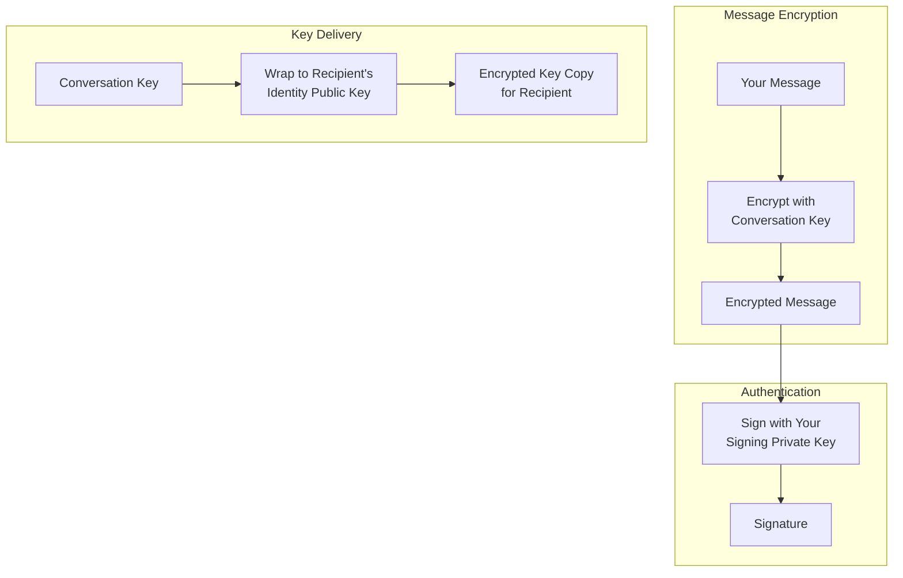
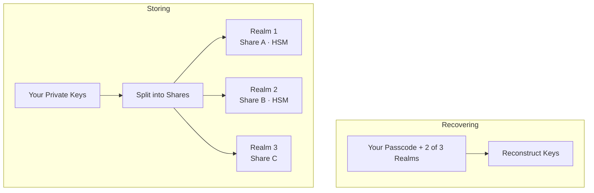

X Chat はエンドツーエンドで暗号化されています。ユーザーのメッセージは、平文の状態ではそのユーザーのデバイス上にしか存在しません。このページでは、その仕組みを説明します。

<Note>
**このページは情報提供を目的としたものです。実装にあたってこの知識は必要ありません（[Chat XDK](/xchat/xchat-xdk) がここに書かれた全ての処理を代わりに実行します）。**
</Note>

---

## 全体像

アカウント作成からメッセージの送受信までのフロー全体を見てみましょう。

<Steps>
  <Step title="アカウント作成">
    ここで Chat XDK は、あなたのデバイス上で 2 組のキーペアを生成します。

    - **identity キーペア** — シークレットを受け取るためのもの
    - **signing キーペア** — 作者であることを証明するためのもの

    秘密鍵側は [secure key backup](#secure-key-backup-distributed-key-storage) に送られます。詳しくは後述しますが、ここで重要なのは、これらはあなたのパスコードによってのみ復元可能であり、X が復元することはできないということです。

    公開鍵側は、identity 鍵と signing 鍵を結び付ける署名とともに、**public key** API を通じて X バックエンドに公開されます。
  </Step>
  <Step title="会話の作成">
    あなたにメッセージを送るには、送信者は新しい**会話鍵**（メッセージを暗号化する対称鍵）を生成します。

    送信者は X バックエンドからあなたの公開鍵を取得し、その署名を検証し、あなたの identity 鍵に対して会話鍵を暗号化します。

    これは公開鍵暗号の重要な特性です。誰でもあなたの公開鍵に対して暗号化できますが、**復号できるのはあなたの秘密鍵だけであり、それを持っているのはあなただけです**。したがって X は暗号化されたコピーを保存・配信することはできますが、それを開くことはできません。（使用されている具体的な方式については [glossary](#glossary) を参照してください。）

    なぜメッセージを直接あなたの公開鍵で暗号化しないのでしょうか？ 速度のためです。公開鍵暗号は対称鍵暗号よりもはるかにコストが高いため、鍵を交換することで、以降のメッセージをより効率的に扱えるようになります。
  </Step>
  <Step title="メッセージング">
    誰かがあなたにメッセージを送ると、あなたの identity 公開鍵で暗号化された会話鍵と、その会話鍵で暗号化されたメッセージを受け取ります。

    あなたは identity 秘密鍵を使って会話鍵を復号し（繰り返しますが、この鍵を持っているのはあなただけです）、得られた会話鍵を使ってメッセージを復号します。

    会話における鍵は、さまざまな理由で時折ローテーションされます（新しい対称鍵が共有されます）。そのため、参加者が常に正しい鍵を使っていることを確認できるように、各会話鍵にはバージョンが付いています。
  </Step>
  <Step title="署名">
    暗号化により、誰でもあなたにメッセージを送ることができ、それを復号できるのはあなただけになります。署名はある意味その反対で、あなた（だけ）がメッセージに署名でき、誰でもその署名を検証できます。実際には、署名には秘密鍵が必要で、検証には公開鍵が使えます。

    X Chat では、送信者は全員自分のメッセージに署名します。署名は、誰がメッセージに署名したかと、署名された正確なバイト列の両方を証明するため、すべての受信者はこのメッセージが送信者の入力そのものであることを検証できます。ここでも XDK があなたの代わりにこれを処理します。詳細は [Signatures explained](#signatures-explained) で扱います。
  </Step>
</Steps>

---

## まとめると

X Chat は 3 つの標準的な暗号ツールを組み合わせており、それぞれが得意な仕事を 1 つだけ担っています。

1. **会話鍵**はメッセージを暗号化します。対称鍵で、すべてのメッセージやメディア通信に対して十分に高速です。
2. **identity キーペア**は、他の誰か（X を含む）に見られることなく、各参加者に会話鍵を届けます。
3. **signing キーペア**は作者であることを証明します。すべてのメッセージには、受信者が検証する署名が付いています。

X が転送・保存するのは**暗号文とラップされた鍵**だけで、X 自身がその中身を開くことはできません。XDK が暗号処理を担い、[Chat API](/xchat/introduction) は鍵の登録と暗号化ペイロードの受け渡しを行います（[Getting Started](/xchat/getting-started)）。

登場人物一覧:

| 鍵 | 保有者 | 役割 |
|:----|:-------------|:-------------|
| **Identity keypair** | 秘密鍵側: あなただけ。公開鍵側: 公開される | ラップされた会話鍵を受け取る |
| **Signing keypair** | 秘密鍵側: あなただけ。公開鍵側: 公開される | メッセージや状態変更に署名し、他者が検証する |
| **Conversation key** | 1 つの会話のすべての参加者 | メッセージやメディアを暗号化する。バージョン付きでローテーションされる |

---

## 実例で見てみよう

Bob と Carol とグループを作成する際に、実際に何が起きるのかを追ってみましょう。

<Steps>
  <Step title="会話鍵を生成する">
    XDK は新しいランダムな会話鍵を生成します。この時点では、鍵はあなたのデバイスのメモリ上にしか存在しません。
  </Step>
  <Step title="参加者の鍵を取得して検証する">
    あなたのアプリは、X バックエンドから Bob と Carol の公開鍵を取得し、それぞれの署名を検証します。署名が正しくない場合は処理を中止します。検証できなかった鍵に対して暗号化してはいけません。
  </Step>
  <Step title="各参加者に対して鍵をラップする">
    XDK は会話鍵を 3 回ラップします。Bob の identity 公開鍵、Carol のそれ、そしてあなた自身のもの（あなたの他のデバイスからも読めるように）に対してです。
  </Step>
  <Step title="変更に署名する">
    XDK は、まさにこの変更を記述するペイロードに署名します。グループ、そのメンバー、ラップされた鍵などです。グループの作成には**2 つ**の [action signature](#signed-state-changes-action-signatures) が必要ですが、XDK があなたの代わりに両方を生成します。
  </Step>
  <Step title="公開する">
    あなたのアプリは、ラップされたコピーと署名を X に POST します。サーバーは自分では開けない 3 つの暗号化された blob を保存します。生の会話鍵があなたのデバイスから出ることは一度もありません！
  </Step>
  <Step title="Bob が読む">
    Bob の XDK は、自身の identity 秘密鍵で自分のコピーをアンラップし、鍵の変更があなたから来たものであることを検証し、生の会話鍵を保持します。
  </Step>
</Steps>

これが 1 回限りのセットアップです。ここから先、すべてのメッセージは同じ 2 つのフローに従います。

**送信。** XDK は現在の会話鍵でメッセージを暗号化し、それに署名します。あなたのアプリは両方を **send message** エンドポイントに POST します。X は自分では読めないバイト列を保存・配信します。

**受信。** 暗号文は [Webhook またはアクティビティストリーム](/xchat/real-time-events)経由、または履歴用に会話**イベント**を読み取ることで届きます。XDK は最初に送信者の署名を検証し、その後、保存されている会話鍵で復号します（鍵がローテーションされていた場合、**key change** イベントが新しいラップされたコピーを届けます）。検証に失敗した場合、メッセージは拒否されます。

実装は [Getting Started](/xchat/getting-started) と [Chat XDK](/xchat/xchat-xdk) リファレンスにあります。

---

## Secure key backup: 分散型鍵ストレージ

先ほど、あなたの秘密鍵は **secure key backup** に保存され、あなたのパスコードによってのみ復元可能だと述べました。これは人々が最も懐疑的に感じる部分なので、その仕組みを見てみましょう。X が読めない状態で、どうやって鍵をバックアップできるのでしょうか？

### 従来の鍵ストレージの問題

| アプローチ | 問題 |
|:---------|:--------|
| デバイスにのみ保存する | デバイスを失う = 鍵を失う = メッセージ履歴へのアクセスを失う |
| 一般的なクラウドバックアップに保存する | プロバイダが鍵素材にアクセスできる |
| 長い鍵を覚える | 人は高エントロピーなシークレットを暗記できない |

### Secure key backup による解決方法

X Chat はオープンソースの [**Juicebox**](https://juicebox.xyz) プロトコルを使用しており、これは**しきい値秘密分散**とパスコード保護を組み合わせたものです。プロトコルの完全な仕様はそちらにありますが、簡潔にまとめると次のようになります。

**保存（アカウント作成時、1 回のみ）。** XDK はあなたの秘密鍵をシェアに分割し、互いに隔離された 3 つの **realm**（サービス）に分散します。3 つとも X が運用しているため、隔離だけでは大した意味を持ちません。ここでハードウェアが登場します。3 つのうち 2 つの realm は**ハードウェアセキュリティモジュール**（HSM）の内部に置かれています。HSM は耐タンパー性のあるハードウェアで、サーバへのフルアクセスを持つ X の管理者に対してすら、自分のシェアを渡しません。1 つのシェアだけでは何もわからず、復元には 3 つのうち **2 つ**の realm のシェアが必要となるため、あらゆる復元の経路は必ず少なくとも 1 つの HSM を経由します。つまり、鍵に至るソフトウェアだけの経路は存在しません。HSM のソフトウェアと、それをプロビジョニングした**鍵セレモニー**は公に文書化されています。

**復元（新しいデバイス）。** あなたはパスコードを入力し、XDK は各 realm に対してあなたがそれを知っていることを証明します。Juicebox プロトコルにより、パスコードがあなたのデバイスから出ることなくこれが可能になります。あなたを検証した各 realm は鍵のシェアを解放し、3 つのうち 2 つが応答した時点で、XDK はあなたのデバイス上で鍵を再構成します。

**推測回数の制限。** 各 realm は、パスコードの誤入力を最大 **20 回**まで許容します。20 回目に失敗すると、あなたの鍵のシェアはその realm から削除されます。これは HSM によってハードウェアで強制され、あらゆる総当たり攻撃から保護します。

その結果、あなたはパスコードだけで新しいデバイスに鍵を復元でき、単一の realm が秘密全体を保持することは決してなく、ハードウェアに支えられた realm は X 自身に対してすらその制限を強制します。

<Note>
これらは手動で設定する必要はありません。Chat XDK にはバックアップクライアントが含まれており、realm 設定はあなたの公開鍵レコードとともに X バックエンドから届きます。パスコードの保存とアンロックは Chat XDK の呼び出しです。[initialize with existing keys](/xchat/getting-started#2-initialize-the-chat-xdk-with-existing-keys) および [create and register keys](/xchat/getting-started#3-create-and-register-keys-first-time-setup) を参照してください。サーバやボットではバックアップをスキップして、エクスポートされた鍵 blob を使うことがよくあります。それはパスワードと同じように保護してください。
</Note>

---

## 署名の詳細

すべてのメッセージの署名は、受信者に次の 2 つの保証を与えます。

1. **真正性**: 送信者の signing 秘密鍵の保持者によって生成されたものである
2. **完全性**: 暗号化されたコンテンツは署名後に改ざんされていない

署名対象の内容が少しでも変更されると、検証は失敗します。もちろん、この保証は signing 鍵の秘匿性の強さに依存しており、それが[鍵のストレージ](#secure-key-backup-distributed-key-storage)が非常に重要である理由です。

**アプリでは。** XDK は暗号化時に署名し、復号時に検証します。拒否は両端で発生します。X Chat 自体は検証できないイベントを拒否し、XDK も受信時に同様に拒否します。これは**デフォルトで必須**です（無効化は推奨しません）。詳細: [Chat XDK](/xchat/xchat-xdk)。

署名は引用されたコンテンツもカバーします。返信には、引用対象となる**署名済み**の元メッセージそのものが埋め込まれます。Chat XDK が返信を復号する際、埋め込まれた元メッセージを検証し、引用をそれと比較して、結果を `reply_preview_validation`（`Valid` / `Invalid`）として報告します。`Invalid` という結果は、引用が署名済みの元メッセージと一致していないことを意味します。返信自体は別途検証されているとはいえ、引用された内容は信頼できないものとして扱ってください。これにより、どの参加者も他者に偽の言葉を帰属させることはできなくなります。

### 署名付き状態変更（action signatures）

署名されるのはメッセージだけではありません。会話に対するすべての変更（グループ作成、メンバー追加、鍵のローテーション）にも **action signature** を伴わせる必要があります。送信者は、その変更が何を行うのかを正確に記述したペイロードに署名し、API はこれが欠落していたり不正な形式である場合、リクエストを拒否します。XDK があなたの代わりにこれを生成します。

**サーバが鍵の変更を完全には検証できない理由。** サーバは生の会話鍵を保持しません（それがポイントです）。そのため、サーバは自身に見えない素材に対する署名を検証することはできません。サーバは可能な範囲、つまり署名された記述がリクエストと一致するかどうかを確認し、本当の意味での暗号的な確認は、受信者が鍵の変更をアンラップする際に行います。

イベントは不変です。検証に失敗したイベントは永続的に無効です。[Troubleshooting](/xchat/troubleshooting) を参照してください。

---

## セキュリティ特性

以下は X Chat が守るもの、そして同じくらい重要な、守らないものです。

### X Chat が守るもの

| 脅威 | 保護 | 根拠 |
|:-------|:-----------|:-----------|
| **X がメッセージ本文を読むこと** | コンテンツは X に届く前に暗号化される | 会話鍵はアンラップされた状態で参加者のデバイスから出ることはない |
| **ネットワーク上の盗聴者** | 通信路のセキュリティに加え、エンドツーエンド暗号化されたコンテンツ | 標準の TLS に、上記すべてを加えたもの |
| **メッセージの改ざん** | 署名があらゆる変更を検出する | すべてのイベントに対する署名検証 |
| **送信者のなりすまし** | 有効な署名には送信者の signing 秘密鍵が必要 | signing 鍵の秘匿性と、あなたが検証した鍵バインディング |
| **バックアップサーバからの鍵盗難** | シェアは realm 間で分割され、パスコードで保護され、厳格な推測回数制限がある | 単一の realm では鍵を再構成できない。HSM がハードウェアで推測回数制限を強制する |

### X Chat が守らないもの、およびその理由

| 制限 | 率直な説明 |
|:-----------|:-------------------|
| **侵害されたデバイス** | ロック解除されたクライアントは平文と生の鍵を保持しています。エンドポイントが侵害された時点で、いかなるエンドツーエンド設計もこれを乗り越えることはできません。 |
| **メタデータ** | X は暗号文をルーティングするために、誰が誰にいつメッセージを送ったかを知らなければなりません。暗号化は「何を」は隠しますが、「誰が」や「いつ」は隠しません。 |
| **前方秘匿性がない** | 会話鍵は長寿命の identity 鍵に対してラップされます。攻撃者があなたの identity 秘密鍵を入手した場合、以前にキャプチャされたエンベロープをアンラップし、それによって過去の暗号文も読めるようになります。 |
| **侵害後の自動的な回復はない** | 回復は可能ですが、自動ではなく意図的なものです。攻撃者を排除するには会話鍵をローテーションし、侵害されたデバイスを回復させる際には通常、新しい identity 鍵と新しい会話鍵を生成するため、盗まれた鍵で新しいものを読むことはできません。ローテーションにできないのは、過去を書き換えることや、侵害が処理される前の期間においてあなたを守ることです。 |

---

## Glossary

| 用語 | 定義 |
|:-----|:-----------|
| **Symmetric encryption** | 同じ鍵で暗号化と復号を行う（メッセージやメディアに使用） |
| **Asymmetric encryption** | 公開鍵で暗号化し、秘密鍵で復号する（会話鍵の配布に使用） |
| **Public key** | 公開しても安全。誰かに対して暗号化したり、その署名を検証したりするために使う |
| **Private key** | 秘密に保つ必要がある。復号や署名に使う |
| **ECDH** | 鍵*合意*: 2 者が、一方の秘密鍵と他方の公開鍵から共有シークレットを導出する |
| **ECIES** | ECDH に基づくハイブリッド暗号: 共有シークレットを導出し、その下で対称暗号化する。会話鍵はこの方式でラップされる |
| **ECDSA** | メッセージや action signature に使用される楕円曲線署名アルゴリズム |
| **P-256** | X Chat のすべてのキーペアが使用する楕円曲線（secp256r1） |
| **Key binding** | ユーザーの identity 鍵を signing 鍵に結び付ける公開署名。取得したレコードに対して何かをラップする前に検証される |
| **Conversation key** | 1 つの会話の参加者間で共有される対称鍵。時とともにバージョンが付けられる |
| **Wrapping** | ある鍵を別の鍵で暗号化すること。ここでは、identity 公開鍵で会話鍵を暗号化する |
| **Threshold secret sharing** | シークレットをシェアに分割し、十分な数の部分集合のみが再構成できるようにすること。しきい値未満では何もわからない |
| **Juicebox** | secure key backup の背後にあるオープンソースのプロトコル。厳格な推測回数制限を伴う、パスコード保護されたしきい値回復方式 |
| **HSM** | Hardware security module: realm のシェアを保持し、その推測回数制限を強制する耐タンパー性ハードウェア |
| **Realm** | 鍵素材のシェアを 1 つ保持する、隔離された独立の secure key backup サービス |

---

## 次のステップ

<CardGroup cols={2}>
  <Card title="Getting Started" icon="rocket" href="/xchat/getting-started">
    鍵、送信、受信を段階的に実装する
  </Card>
  <Card title="Chat XDK Reference" icon="code" href="/xchat/xchat-xdk">
    暗号化 SDK のメソッドと型
  </Card>
  <Card title="Introduction" icon="book" href="/xchat/introduction">
    製品概要とアーキテクチャ
  </Card>
  <Card title="Real-time events" icon="bolt" href="/xchat/real-time-events">
    暗号化されたイベントがどのように配信されるか
    </Card>
</CardGroup>
