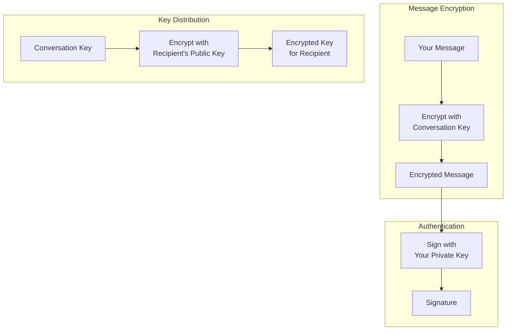
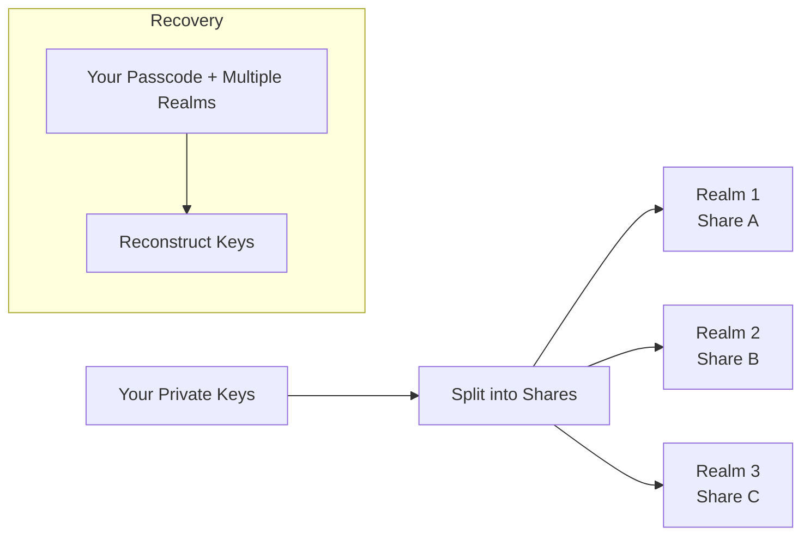

import { Button } from '/snippets/button.mdx';

このプライマーは、X Chat の背後にある暗号化のアイデアを概念レベルで説明します。構築するためにこの深さが必要というわけではありません — [Chat XDK](/xchat/xchat-xdk) が暗号化、復号、署名、鍵の保存を代行してくれます — が、このメンタルモデルはアプリを設計したり動作をデバッグしたりする際に役立ちます。

実装の準備ができたら、完全なウォークスルーとして [Getting Started](/xchat/getting-started) を、個別のルートについてはサイドバーの [API リファレンス](/x-api/chat/get-chat-conversations) を使用してください。

<Note>
**この暗号化を自分で実装する必要はありません。** Chat XDK が処理します。このページは理解のためのものであり、API チェックリストではありません。
</Note>

---

## 全体像

X Chat は次のような階層化された暗号化システムを使用します:

1. **メッセージ**は**会話鍵**で暗号化されます（高速な対称暗号化）
2. **会話鍵**は各参加者の **identity 公開鍵**を使って暗号化されます（非対称鍵交換）
3. **メッセージは**、**署名鍵**で**署名される**ので、受信者は誰が送信したのか、そして何も変更されていないことを検証できます

対称暗号化は大量のメッセージトラフィックに対して効率的です。非対称暗号化は、主に会話鍵を安全に**配布**するために使用されます。

製品フローにおいて、X は**暗号文と鍵エンベロープ**を転送します — 読み取り可能なメッセージ内容や生の会話鍵ではありません。あなたのアプリは暗号処理に Chat XDK を使い、鍵の登録や暗号化されたペイロードの送受信には [Chat API](/xchat/introduction)（Python/TypeScript の XDK 経由、または HTTPS）を使用します。これらのピースがどのように組み合わさるかは [Getting Started](/xchat/getting-started) を参照してください。

---

## 鍵の種類の説明

X Chat は 3 種類の鍵素材を使用しており、それぞれ特定の目的があります。

### 1. Identity キーペア

**目的:** ユーザー間で会話鍵を安全に交換すること

| 構成要素 | 説明 |
|:----------|:------------|
| **Identity 公開鍵** | 他のユーザーと共有；会話鍵を*あなた宛て*に暗号化するために使用 |
| **Identity 秘密鍵** | 秘密に保つ；*あなた宛て*に送られた会話鍵を復号するために使用 |

誰かが会話にあなたを追加するとき、彼らはあなたの identity 公開鍵を使って会話鍵を暗号化します。あなたの identity 秘密鍵だけがそれを復号できます。

公開鍵の半分はプラットフォームの**公開鍵**API を通じて登録および検出されます（API リファレンスの Encryption keys を参照）。秘密鍵の半分は Chat XDK 内に留まります（たとえば [安全な鍵バックアップ](#安全な鍵バックアップ-分散鍵ストレージ) や慎重に保護された鍵 blob 経由）。

### 2. 署名キーペア

**目的:** メッセージを作成したのがあなたであることを証明すること

| 構成要素 | 説明 |
|:----------|:------------|
| **署名公開鍵** | 他のユーザーと共有；あなたの署名を検証するために使用 |
| **署名秘密鍵** | 秘密に保つ；あなたのメッセージに署名するために使用 |

メッセージを送信するとき、あなたの署名秘密鍵で署名されます。受信者はあなたの署名公開鍵（同じく公開鍵 API を通じて公開されます）を使って検証します。Chat XDK はメッセージの暗号化の一部として署名を行い、送信者の公開鍵素材を渡した場合は復号時に検証することもできます。

### 3. 会話鍵

**目的:** 特定の会話内でメッセージ（およびメディア）を暗号化・復号すること

| プロパティ | 説明 |
|:---------|:------------|
| **対称** | 同じ鍵で暗号化と復号を行う |
| **会話ごと** | 各会話に独自の鍵がある |
| **参加者間で共有** | 会話を読むべき参加者全員がコピーを保持 |
| **バージョン付き** | 鍵はローテーション可能；アプリはバージョンを時間の経過とともに追跡すべき |

会話鍵は会話がセットアップされたときや、鍵がローテーションされたときに生成されます。各参加者は identity 公開鍵で暗号化された、鍵の**暗号化コピー**を受け取ります。自分のコピーを一度復号したら、**未加工の**会話鍵を保持し、高速なメッセージ（および[メディア](/xchat/media)）暗号化に使用します。会話のためにこれらのコピーをセットアップすることは、Chat XDK と会話**鍵**エンドポイントを組み合わせて行われます — [Getting Started](/xchat/getting-started#4-set-up-conversation-keys) で解説されています。

---

## 暗号化の仕組み（概念的に）

### メッセージの送信

<Steps>
  <Step title="平文から始める">
    あなたが入力: "Hello, how are you?"
  </Step>
  <Step title="会話鍵を取得する">
    アプリは、正しい鍵バージョンについて、このチャットの未加工の会話鍵（セットアップまたは以前の鍵配布イベントから）を使用します。
  </Step>
  <Step title="メッセージを暗号化する">
    Chat XDK は会話鍵でメッセージを暗号化します。結果はその鍵がなければ役に立たない暗号文です。
  </Step>
  <Step title="メッセージに署名する">
    Chat XDK は暗号化されたペイロードにあなたの署名秘密鍵で署名し、あなたがまさにこの内容を作成したことを証明します。
  </Step>
  <Step title="X に送信する">
    アプリは、Chat API の**メッセージ送信**エンドポイントを介して暗号化されたペイロードと署名を X に送信します。X は平文として読み取れないバイトを保存し配信します。
  </Step>
</Steps>

### メッセージの受信

<Steps>
  <Step title="暗号化されたデータを受信する">
    アプリは X から暗号文を受信します — [Webhook またはアクティビティストリーム](/xchat/real-time-events)経由、または履歴のために会話**イベント**を読み取ることで。
  </Step>
  <Step title="会話鍵を取得する">
    キャッシュされた未加工の鍵を使うか、これが新規または鍵ローテーション後の場合は鍵配布（鍵変更）イベントからあなたのコピーを復号して取得します。
  </Step>
  <Step title="署名を検証する">
    Chat XDK は送信者の署名公開鍵（および関連する identity バインディング）を使って署名をチェックするので、誰が送ったか、そして変更されていないことを知ることができます。
  </Step>
  <Step title="メッセージを復号する">
    Chat XDK は会話鍵で復号します。これで "Hello, how are you?" を読むことができます。
  </Step>
</Steps>

暗号化、送信、受信、復号の実装は [Getting Started](/xchat/getting-started) と [Chat XDK](/xchat/xchat-xdk) リファレンスにあります。

---

## 鍵配布の説明

エンドツーエンド暗号化における中心的な課題は**鍵配布**です: X（または観察者）が鍵を平文で見ることなく、参加者が会話鍵をどうやって受け取るか。

### 初期鍵セットアップ

会話がメッセージング用に準備される際:

1. ランダムな会話鍵が生成されます（Chat XDK 内）
2. **各参加者**について、その鍵は彼らの **identity 公開鍵**で暗号化されます
3. それらの暗号化コピーは X の Chat API 経由で保存および配信されます
4. 各参加者は**自分の**コピーを identity 秘密鍵で復号します（Chat XDK 内）

X が扱うのは**ラップされた**コピーだけで、生の会話鍵ではありません。

### 鍵変更イベント

会話鍵がローテーションされる（たとえばメンバーシップが変更された）とき、参加者は各メンバー用の新しい暗号化コピーを含む**鍵変更**イベントを受け取ります。

あなたのアプリは次のようにすべきです:

1. ライブイベントや会話履歴で鍵変更素材に気づく
2. 新しい会話鍵（およびバージョン）を復号して保存する
3. 以降の送信には最新バージョンを使用する

これらのイベントが実際にどこに現れるかは [Getting Started](/xchat/getting-started#6-receive-and-decrypt) と [リアルタイムイベント](/xchat/real-time-events) が説明しています。

---

## 安全な鍵バックアップ: 分散鍵ストレージ

あなたの **identity と署名の秘密鍵**は慎重に保存されなければなりません。X Chat には**安全な鍵バックアップ**システム（Juicebox で実装）が含まれており、単一のサーバーに完全な秘密を渡すことなく、パスコードを使ってデバイス間で鍵を復元できます。

### 従来の鍵ストレージの問題点

| アプローチ | 問題 |
|:---------|:--------|
| デバイスにのみ保存 | デバイスを紛失 = 鍵を失う = メッセージ履歴へのアクセスを失う |
| 通常のクラウドバックアップに保存 | プロバイダーが鍵素材にアクセスする可能性がある |
| 長い鍵を覚える | 人間は高エントロピーの鍵を確実に暗記できない |

### 安全な鍵バックアップがどう解決するか

安全な鍵バックアップは**秘密分散**と**パスコード保護**を組み合わせます:

1. 秘密鍵は**シェアに分割**されます
2. シェアは**独立した realm**（別々のサーバー）が保持します
3. **単一の realm** だけでは鍵を再構築するのに十分な情報がありません
4. 復元には**パスコード**と**十分な数の realm** の協力が必要です
5. 間違ったパスコードは**レート制限**されて推測を遅らせます

単一の当事者が秘密全体を保持することなく、復元可能性（新しいデバイス + パスコード）を得ることができます。

<Note>
通常のパスでは鍵バックアップサーバーを手動で設定する必要はありません。Chat XDK にはバックアップクライアントが含まれており、realm 設定は X API から公開鍵レコード上の **`juicebox_config`** として提供されます（このフィールド名は、基盤となる実装である Juicebox に由来します）。初回のパスコード保存と後のアンロックは Chat XDK 呼び出しです — Getting Started の [既存の鍵で初期化する](/xchat/getting-started#2-initialize-the-chat-xdk-with-existing-keys) および [鍵を作成して登録する](/xchat/getting-started#3-create-and-register-keys-first-time-setup) を参照してください。一部のアプリ（特にサーバーとボット）は安全な鍵バックアップの代わりにエクスポートされた鍵 blob を使用します；その素材はパスワードのように保護してください。
</Note>

---

## 署名の説明

すべての X Chat メッセージには、以下をサポートする**デジタル署名**が含まれます:

1. **真正性** — 送信者の署名秘密鍵で生成されたこと
2. **完全性** — 暗号化されたコンテンツが署名後に変更されていないこと

### 署名の仕組み（概念的に）

| アクション | 使用する鍵 | 結果 |
|:-------|:---------|:-------|
| **署名** | 送信者の署名秘密鍵 | この暗号化メッセージに正確にバインドされた署名 |
| **検証** | 送信者の署名公開鍵 | 署名がメッセージと鍵に一致することを確認 |

署名対象の何かが変更されると、検証は失敗します。その鍵の有効な署名を生成できるのは、署名秘密鍵を持つ人だけです。

### アプリでの利用

Chat XDK は送信メッセージを暗号化するときに署名し、受信メッセージを復号するときに（公開鍵 API からの）送信者の公開鍵素材に対して検証します。検証は**デフォルトで必須**です: SDK は明示的にチェックを無効にしない限り、検証されていない署名付きイベントを拒否します（推奨されません）。詳細は [Chat XDK](/xchat/xchat-xdk) リファレンスにあります。

署名は引用された内容もカバーします。返信には、引用している **署名済み** の元メッセージがそのまま埋め込まれます。Chat XDK が返信を復号する際、その埋め込まれた元メッセージを検証し、引用と比較して、その結果を `reply_preview_validation`（`Valid` / `Invalid`）として報告します。`Invalid` の結果は、引用が署名済みの元メッセージと一致しないことを意味します — 返信自体は別途検証されていても、引用された素材は信頼できないものとして扱ってください — これにより、どの参加者も他人にねつ造された言葉を帰属させることはできません。

### 署名付き状態変更（アクション署名）

メッセージだけが署名対象ではありません。会話の状態を変更するすべての呼び出し — 会話鍵の追加やローテーション、グループの作成、メンバーの追加 — は、1 つ以上の**アクション署名**を伴う必要があります: 送信者は変更が正確に何をするかを記述したペイロードに署名し（鍵変更の場合、そのペイロードには新しい会話鍵自体が含まれます）、署名が欠落または不正な形式の場合、API はリクエストを拒否します。

サーバーは平文の会話鍵を保持しないため、鍵変更の署名を暗号学的にチェックできません。受信したリクエストと、署名され、エンコードされた変更の説明が一致することを検証します。**暗号学的な**チェックはエッジで行われます: 各受信者の Chat XDK は、鍵変更イベントを復号する際に、送信者の署名公開鍵に対して署名を検証します。Chat XDK の `prepare` メソッドはこれらの署名を生成してくれます — グループの作成とメンバー追加は**2 つ**（鍵変更とグループアクション）を返し、両方を送信する必要があります。

署名はイベントの内容にバインドされ、不変です: 署名が検証できないイベントは、将来的に有効になることはありません。それらの扱い方については [トラブルシューティング](/xchat/troubleshooting) を参照してください。

---

## セキュリティプロパティ

### X Chat が保護する対象

| 脅威 | 保護 |
|:-------|:-----------|
| **X がメッセージ本文を読む** | コンテンツは X に送信される前に暗号化される |
| **ネットワーク盗聴者** | 転送セキュリティに加えてエンドツーエンド暗号化されたコンテンツ |
| **メッセージの改ざん** | 署名が変更を検出する |
| **単純な送信者なりすまし** | 有効な署名には送信者の署名秘密鍵が必要 |
| **単一サーバー鍵盗難（安全な鍵バックアップ使用時）** | シェアは realm 間で分散され、パスコードによってゲートされる |

### X Chat が**保護しない**対象

| 脅威 | なぜか |
|:-------|:--------|
| **侵害されたデバイス** | 平文と鍵がアンロックされたクライアントで露出する可能性がある |
| **メタデータ** | X は誰がいつ誰にメッセージを送ったかを知ることができる — メッセージ本文は知らない |
| **前方秘匿性** | identity 鍵の侵害により、それらの鍵にラップされた会話鍵が露出する可能性がある |
| **侵害後セキュリティ** | 鍵をローテーションしても履歴は書き換えられない |

---

## 用語集

| 用語 | 定義 |
|:-----|:-----------|
| **対称暗号化** | 同じ鍵で暗号化と復号を行う（メッセージとメディアストリームで使用） |
| **非対称暗号化** | 暗号化と復号で異なる鍵（会話鍵をラップするために使用） |
| **公開鍵** | 共有しても安全；誰かに*向けて*暗号化するか、彼らの署名を検証するために使用 |
| **秘密鍵** | 秘密のままにしなければならない；復号または署名に使用 |
| **キーペア** | リンクされた公開鍵と秘密鍵 |
| **ECDH / ECIES** | 会話鍵を identity 鍵にラップするときに使用するアルゴリズム |
| **ECDSA** | メッセージ作成者に使用される署名アルゴリズム |
| **P-256** | X Chat で使用される楕円曲線（secp256r1） |
| **会話鍵** | 1 つの会話の参加者間で共有される対称鍵（時間経過でバージョン化される） |
| **秘密分散** | 秘密を分割して、再構築するために複数のピースが必要になるようにすること |
| **Realm** | 鍵素材の 1 シェアを保持する独立した安全な鍵バックアップサーバー |

---

## 次のステップ

<CardGroup cols={2}>
  <Card title="Getting Started" icon="rocket" href="/xchat/getting-started">
    鍵、送信、受信をステップバイステップで実装
  </Card>
  <Card title="Chat XDK Reference" icon="code" href="/xchat/xchat-xdk">
    暗号化 SDK のメソッドと型
  </Card>
  <Card title="Introduction" icon="book" href="/xchat/introduction">
    製品概要とアーキテクチャ
  </Card>
  <Card title="Real-time events" icon="bolt" href="/xchat/real-time-events">
    暗号化イベントがどのように配信されるか
  </Card>
</CardGroup>
