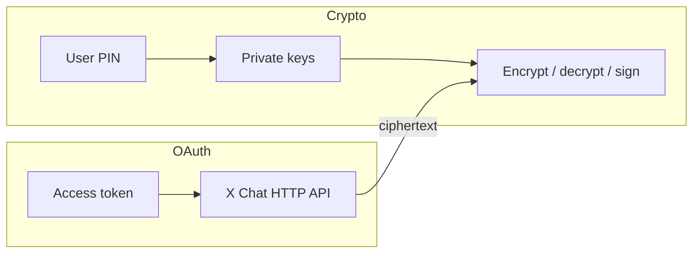

X Chat のアイデンティティと署名の**秘密鍵**は、ユーザーの暗号化メッセージングアイデンティティの根源です。それらを保有する者は、そのアイデンティティに配信された会話鍵をアンラップし、そのユーザーとしてチャットに署名できます。暗号化**PIN / パスコード**も同じように扱ってください:これはセキュアキーバックアップから鍵を復元するものです。

このページはすべてのアプリ種別に適用されるルールを扱います。推奨されるクライアントアーキテクチャについては、[WASM で UI アプリを構築する](/xchat/building-ui-apps-with-wasm) を参照してください。

---

## ユーザーとアプリ開発者への重要な警告

<Warning>
**エンドユーザーに対して、暗号化 PIN や秘密鍵をサードパーティのサーバー、サポート担当、あるいは「補助」アプリと共有するよう求めては、決していけません。**

PIN は**ルートアイデンティティ鍵**をアンロックします。PIN(または秘密鍵ブロブ)を取得した相手は次のことができます。

- そのアイデンティティ宛にラップされた会話鍵を復号する(したがって暗号文として取得できるメッセージ履歴も)
- その暗号アイデンティティとして送受信を継続する
- **後でユーザーがアプリの OAuth を取り消しても**、その能力を保持し続ける

OAuth の取り消しはそのアプリのトークンによる API アクセスを止めます。しかし、ユーザーが既に渡してしまった秘密鍵を**無効化することはありません**。PIN は**端末上の**暗号処理([ブラウザーの WASM](/xchat/building-ui-apps-with-wasm) または Chat XDK を使ったネイティブクライアント)にのみ入力される、そんなアーキテクチャを選んでください。
</Warning>

### プロダクトとドキュメントに掲載すべき文言

アプリが DM 関連の OAuth スコープ(`dm.read`、`dm.write`、および関連スコープ)を要求する場合、OAuth 同意画面には次のような明確なプロダクト文言を添えてください。

- 公式クライアント SDK 経路を使う場合、暗号鍵はユーザーの端末に留まります。
- ユーザーは X Chat の PIN を、それをバックエンドに転送する Web サイトに入力するべきではありません。
- 正当な統合は [Chat XDK](/xchat/xchat-xdk) を使い、PIN によるリカバリーと暗号処理をローカルで実行します(ブラウザーの場合:WASM + セキュアキーバックアップ)。
- 秘密鍵を取得した悪意あるアプリはそれらを持ち出せます。今日の時点で、純粋にクライアント側に保持されるルート鍵に対する「この鍵を取り消す」というサーバー側の仕組みは存在しません。ユーザーがルート鍵をあなたに渡す必要が生じないように設計してください。

---

## センシティブな鍵素材とみなされるもの

| 素材 | 機密度 | 備考 |
|:---------|:------------|:------|
| **暗号化 PIN / パスコード** | 重大 | [セキュアキーバックアップ](/xchat/cryptography-primer#secure-key-backup-distributed-key-storage) から秘密鍵を復元する |
| **アイデンティティ秘密鍵** | 重大 | このユーザー向けの会話鍵をアンラップする |
| **署名秘密鍵** | 重大 | メッセージと状態変更の作者を証明する |
| **`export_keys` ブロブ** | 重大 | Chat XDK からの不透明な秘密鍵状態一式。パスワードファイルのように扱う |
| **アンラップ済みの会話鍵** | 高 | 1 つの会話のメッセージを復号する(バージョン付きだが、依然としてセンシティブ) |
| **OAuth アクセス / リフレッシュトークン** | 高 | API アクセス専用。チャットの秘密鍵の代替にはならず、鍵を削除しても取り消されない |
| **Juicebox レルム認証トークン** | 中 | ユーザー/鍵バージョンごとにバックアッププロトコルを認可する。PIN ではない |
| **公開鍵** | 公開 | 取得・保存して問題なし |

---

## アプリ種別に応じた鍵の経路の選択

| アプリ種別 | 推奨される鍵の経路 | 避けるべきこと |
|:---------|:---------------------|:-------|
| **ユーザー向け Web UI** | ブラウザーの [WASM Chat XDK](/xchat/building-ui-apps-with-wasm) + `setup` / `unlock`(セキュアキーバックアップ) | PIN や秘密鍵をサーバーに送る;生の鍵ブロブを `localStorage` に保存する |
| **ネイティブモバイル / デスクトップクライアント** | 端末上の Chat XDK + セキュアキーバックアップまたは OS キーストアで裏付けられたブロブ | 暗号化されていない鍵ブロブを自社クラウドに同期する |
| **自社インフラ上のボット / 自動化** | **シークレットマネージャー**または HSM 内の `export_keys` ブロブ;`import_keys` でロード | ブロブを git にコミットする;ログに出す;クライアント側の JS に埋め込む |
| **暗号文だけを転送するサーバー** | 秘密鍵はまったく保持しない — 暗号化されたペイロードをプロキシする | UI ユーザー向けに「利便性のため」サーバー上で復号する |

クライアントアプリは**セキュアキーバックアップ**を優先すべきです。サーバーやボットではエクスポート済みの鍵ブロブがよく使われます。詳細は [はじめに](/xchat/getting-started#2-initialize-the-chat-xdk-with-existing-keys) を参照してください。

---

## 秘密鍵と PIN のルール

### やるべきこと

- **PIN は信頼できるクライアント UI 内でのみ収集**し、同じ端末上で Chat XDK(`unlock` / `setup`)に渡してください。
- **鍵はメモリ上に必要な期間だけ保持**してください。アンロック後は同じ Chat インスタンスをセッション中再利用し、ログアウト時には `lock()` または `free()` を呼び出します。
- **API が許すなら PIN のバッファをゼロクリア**してください(例:JS では `Uint8Array` として PIN を渡し、`unlock` の後にクリアできるようにする)。
- **ボットの鍵ブロブはシークレットマネージャー**(または HSM)に保管し、保存時に暗号化し、IAM を制限し、プロセスの認証情報を頻繁にローテーションしてください。
- **ログには注意**を払い、PIN、秘密鍵、鍵ブロブ、アンラップ済みの会話鍵、セキュアバックアップのフルレスポンスは決してログに残さないでください。
- **クライアントを守ってください:** XSS、悪意ある拡張機能、汚染された依存関係は、ネットワーク経路がクリーンでもメモリ上の鍵を読み取れます。

### やってはいけないこと

- PIN や鍵ブロブをメール、スクリーンショット、チケットに載せ**ないでください**。
- 秘密鍵や PIN をクエリ文字列、アナリティクス、エラートラッカー、CDN のログに置か**ないでください**。
- 「バックエンドを単純にするため」にエンドユーザーの秘密鍵を送信し**ないでください**。
- **OAuth の取り消し**と**鍵の取り消し**を混同し**ないでください**。アプリの接続解除は、ユーザーが既にエクスポート済みだったり、敵対的なクライアントに入力してしまった鍵を消去しません。
- 本番の UI アプリで、生の `export_keys` の出力を `localStorage` や暗号化されていない IndexedDB に保存し**ないでください**。

---

## ブラウザーのセッション永続化

本番のブラウザーアプリは、**セキュリティ第一**、その次に UX を最適化すべきです。

| 戦略 | セキュリティ | UX | 推奨度 |
|:---------|:---------|:---|:---------------|
| **ページロードごとに一度アンロック;Chat をメモリで保持** | 強い | フルリロード後は PIN 入力;メッセージごとの PIN 入力はなし | **既定の推奨** |
| **メッセージごとに PIN を再入力させる** | 強いがうるさい | 悪い | 避ける(デモ限定のアンチパターン) |
| **`localStorage` に平文または base64 の鍵ブロブ** | 弱い(XSS や共有端末で誰でも鍵を読める) | 便利 | **本番では使わない** |
| **PIN でゲートされたセキュアキーバックアップのみ**(Juicebox) | 強い;推測回数制限付きリカバリー | 新しい端末やリロード時に PIN 入力 | **推奨される永続的な保管方法** |

社内デモでは利便性のために `localStorage` に鍵をエクスポートすることがあります。使い捨てのプロトタイプでは問題ありませんが、本番のパターンでは**ありません**。次を優先してください。

1. リロード後の `createChat` + `unlock(pin)`。
2. SPA ナビゲーションのためにアンロック済みインスタンスを保持するモジュールレベルまたはフレームワークのコンテキスト。
3. タブがログアウトするか、ユーザーがアプリをロックしたときの `lock()`。

「この端末ではアンロックしたままにする」といった追加の挙動を実装する場合は、永続化する素材を **Web Crypto** でラップし(可能なら extractable でない鍵に)、ユーザーセッションに束縛し、それでもその素材を自分のサーバーにアップロードしては絶対にいけません。永続的なリカバリー経路は、あなたのインフラ上のルート鍵の二次コピーではなく、ユーザーの PIN とセキュアキーバックアップのままにしてください。

---

## OAuth スコープと暗号鍵

これらは別々のコントロールプレーンです。

- **OAuth** は API 呼び出しを認可します(会話一覧、暗号文の投稿、イベント取得)。
- **秘密鍵**はメッセージ内容への暗号アクセスを認可します。

完成度の高いプロダクトは次を満たすべきです。

1. 必要な DM スコープだけを要求する。
2. DM アクセスが必要な理由を説明する。
3. 暗号処理を**端末上**で実行し、OAuth が PIN 収集の経路にならないようにする。
4. ログアウト時にトークンの保持をやめる。別途 `lock()` でチャット鍵もクリアする。

---

## 運用チェックリスト

- [ ] UI フローのサーバーリクエストボディに PIN や秘密鍵のフィールドがないこと
- [ ] クライアントにはセキュアキーバックアップ(`setup` / `unlock`)、ボットのブロブにはシークレットマネージャー
- [ ] アンロック済みの Chat インスタンスを 1 ユーザーセッションにスコープし、ログアウト時にクリアする
- [ ] ロギングと APM からシークレットが除去されていること
- [ ] チャットをアンロックできるあらゆるページで CSP と XSS 対策を実施
- [ ] ユーザー向け文言:PIN をサードパーティと共有しないこと
- [ ] インシデント計画:ボットのブロブが漏えいした場合、鍵をローテーション/再登録し、過去の暗号文は古い鍵の保有者に露出したものとして扱う

---

## 関連ドキュメント

- [WASM で UI アプリを構築する](/xchat/building-ui-apps-with-wasm) — クライアントアーキテクチャ
- [暗号化入門](/xchat/cryptography-primer) — アイデンティティ鍵、会話鍵、セキュアキーバックアップ
- [はじめに](/xchat/getting-started) — 鍵を登録し、メッセージを送信する
- [Chat XDK](/xchat/xchat-xdk) — API リファレンス
- [基礎: セキュリティ](/fundamentals/security) — OAuth と API 認証情報の衛生管理
