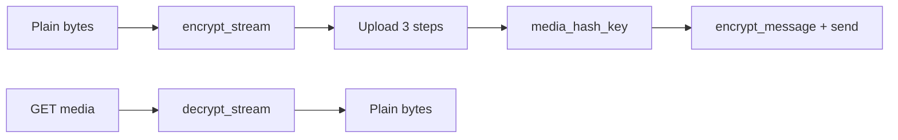

画像やその他のファイルは、テキストと**同じ会話鍵**を使用します。Chat XDK でバイト列を暗号化し(`encrypt_stream` / `decrypt_stream`)、**`/2/chat/media/upload`** ルート(サイドバー **API リファレンス → Media**)経由でアップロードし、`encrypt_message` に **`media_hash_key`** を添付します。

アップロード時は DM スコープに加え **`media.write`** を含めてください。パスにはハイフン付き会話 ID を使用します(`:` → `-`)。MIME/寸法は**復号後の**バイトから取得することが望ましいです。

このパスは Posts のメディアモデル(`expansions=attachments.media_keys`、`media.fields=variants` など)では**ありません**。それらのパラメーターは **Posts** に適用されます。E2EE の X Chat ブロブは **`media_hash_key`** と X Chat メディアダウンロードでアドレッシングされます。



---

## 暗号化

<Tabs>
  <Tab title="Python">
    ```python
    from chat_xdk import detect_mime_type, detect_image_dimensions

    with open("photo.jpg", "rb") as f:
        plaintext = f.read()

    mime = detect_mime_type(plaintext)
    dims = detect_image_dimensions(plaintext)
    width, height = dims if dims else (0, 0)

    encrypted_blob = chat.encrypt_stream(plaintext, raw_conv_key)
    ```
  </Tab>
  <Tab title="TypeScript">
    ```typescript
    import { detectMimeType, detectImageDimensions } from '@xdevplatform/chat-xdk';
    import { readFile } from 'fs/promises';

    const plaintext = await readFile('photo.jpg');
    const mime = detectMimeType(plaintext);
    const dims = detectImageDimensions(plaintext);
    const width = dims?.width ?? 0;
    const height = dims?.height ?? 0;

    const encryptedBlob = chat.encryptStream(plaintext, rawConvKey);
    ```
  </Tab>
  <Tab title="Rust">
    ```rust
    use chat_xdk_core::{detect_image_dimensions, detect_mime_type};

    let plaintext = std::fs::read("photo.jpg")?;
    let _mime = detect_mime_type(&plaintext);
    let dims = detect_image_dimensions(&plaintext);
    let (width, height) = dims.map(|d| (d.width as i64, d.height as i64)).unwrap_or((0, 0));
    // conv_key: &XChatConversationKey from extract_conversation_keys / decrypt_conversation_key
    let encrypted_blob = chat.encrypt_stream(&plaintext, &conv_key)?;
    ```
  </Tab>
  <Tab title="Go">
    ```go
    plaintext, err := os.ReadFile("photo.jpg")
    mime, _ := chatxdk.DetectMimeType(plaintext)
    dims, _ := chatxdk.DetectImageDimensions(plaintext)
    _ = mime
    encrypted, err := chat.EncryptStream(plaintext, rawConvKey)
    _ = dims
    _ = encrypted
    ```
  </Tab>
  <Tab title="C#">
    ```csharp
    using ChatXdk;

    byte[] plaintext = await File.ReadAllBytesAsync("photo.jpg");
    string? mime = ChatXdkUtilities.DetectMimeType(plaintext);
    var dims = ChatXdkUtilities.DetectImageDimensions(plaintext);
    int width = (int)(dims?.Width ?? 0);
    int height = (int)(dims?.Height ?? 0);
    byte[] encryptedBlob = chat.EncryptStream(plaintext, rawConvKey);
    ```
  </Tab>
  <Tab title="Java">
    ```java
    import com.x.chatxdk.ChatXdkUtilities;
    import com.x.chatxdk.Types.ImageDimensions;

    byte[] plaintext = Files.readAllBytes(Path.of("photo.jpg"));
    String mime = ChatXdkUtilities.detectMimeType(plaintext);
    ImageDimensions dims = ChatXdkUtilities.detectImageDimensions(plaintext);
    int width = dims != null ? (int) dims.width : 0;
    int height = dims != null ? (int) dims.height : 0;
    byte[] encryptedBlob = chat.encryptStream(plaintext, rawConvKey);
    ```
  </Tab>
</Tabs>

`encrypt_stream` / `decrypt_stream` はペイロード全体をメモリ内で処理します。大きなファイルの場合は、`stream_encryptor()` / `stream_decryptor()` が増分オブジェクト(`StreamEncryptor` / `StreamDecryptor`)を返します:`push` でチャンクを送り込み、最後に一度 `finish` を呼びます——ストリームが切り捨てられていた場合、`finish` はエラーになります。

---

## アップロード

| ステップ | メソッド | パス |
|:-----|:-------|:-----|
| 初期化 | `POST` | `/2/chat/media/upload/initialize` |
| 追加 | `POST` | `/2/chat/media/upload/{id}/append` |
| 完了 | `POST` | `/2/chat/media/upload/{id}/finalize` |

**API リファレンス → Media** の OpenAPI ページのリクエストボディを使用してください。サイズが必要な場合は**暗号化された**ブロブサイズを優先してください。Finalize は添付やダウンロードのための **`media_hash_key`** を返します。一時的な `5xx` はバックオフしてリトライしてください。Python/TypeScript ではメディアヘルパーが存在すれば XDK を使えます。そうでない場合はどの言語でも Bearer トークンで POST してください。

---

## 添付付きで送信する

メディア添付付きで暗号化し、send-message ボディを POST します([はじめに](/ja/xchat/getting-started#5-send-a-message) と同じフィールドマッピング)。SDK が `message_id` を生成してペイロード上で返します——その値を送信し、リトライ時は同じペイロードを再利用することで、ID が二度発行されないようにします。

<Tabs>
  <Tab title="Python">
    ```python
    from xdk.chat.models import SendMessageRequest

    # chat has keys loaded and set_identity called (see Getting Started)
    payload = chat.encrypt_message(
        conversation_id,
        caption or "",
        conversation_key=raw_conv_key,
        conversation_key_version=conversation_key_version,
        attachments=[{
            "attachment_type": "media",
            "media_hash_key": media_hash_key,
            "width": width,
            "height": height,
            "filesize_bytes": len(plaintext),
            "filename": "photo.jpg",
        }],
    )
    client.chat.send_message(
        conversation_id.replace(":", "-"),
        SendMessageRequest(
            message_id=payload.message_id,  # generated by the SDK
            encoded_message_create_event=payload.encrypted_content,
            encoded_message_event_signature=payload.encoded_event_signature,
        ),
    )
    ```
  </Tab>
  <Tab title="TypeScript">
    ```typescript
    // chat has keys loaded and setIdentity called (see Getting Started)
    const payload = chat.encryptMessage({
      conversationId,
      text: caption || '',
      conversationKey: rawConvKey,
      conversationKeyVersion,
      attachments: [{
        attachment_type: 'media',
        media_hash_key: mediaHashKey,
        width,
        height,
        filesize_bytes: plaintext.byteLength,
        filename: 'photo.jpg',
      }],
    });
    await client.chat.sendMessage(conversationId.replace(/:/g, '-'), {
      message_id: payload.messageId, // generated by the SDK
      encoded_message_create_event: payload.encryptedContent,
      encoded_message_event_signature: payload.encodedEventSignature,
    });
    ```
  </Tab>
  <Tab title="Rust">
    ```rust
    use chat_xdk_core::{AttachmentDescriptor, EncryptMessageParams};

    // chat has keys loaded and set_identity called (see Getting Started)
    let mut params = EncryptMessageParams::new(&conversation_id, caption)
        .with_conversation_key(conv_key.to_bytes(), &conversation_key_version);
    params.attachments = Some(vec![AttachmentDescriptor::Media {
        media_hash_key: media_hash_key.clone(),
        width,
        height,
        filesize_bytes: plaintext.len() as i64,
        filename: "photo.jpg".into(),
        media_type: None,
        duration_millis: None,
    }]);
    let payload = chat.encrypt_message(params)?;
    let body = serde_json::json!({
        "message_id": payload.message_id, // generated by the SDK
        "encoded_message_create_event": payload.encrypted_content,
        "encoded_message_event_signature": payload.encoded_event_signature,
    });
    let path_id = conversation_id.replace(':', "-");
    http.post(format!("https://api.x.com/2/chat/conversations/{path_id}/messages"))
        .header("Authorization", &auth)
        .json(&body)
        .send()?;
    ```
  </Tab>
  <Tab title="Go">
    ```go
    // chat has keys loaded and SetIdentity called (see Getting Started)
    payload, err := chat.EncryptMessage(chatxdk.EncryptMessageParams{
        ConversationID:         conversationID,
        Text:                   caption,
        ConversationKey:        rawConvKey,
        ConversationKeyVersion: conversationKeyVersion,
        Attachments: []chatxdk.AttachmentDescriptor{{
            AttachmentType: "media",
            MediaHashKey:   mediaHashKey,
            Width:          width,
            Height:         height,
            FilesizeBytes:  int64(len(plaintext)),
            Filename:       "photo.jpg",
        }},
    })
    // POST payload.MessageID (generated by the SDK), payload.EncryptedContent,
    // and payload.EncodedEventSignature to /2/chat/conversations/{id}/messages
    ```
  </Tab>
  <Tab title="C#">
    ```csharp
    // chat has keys loaded and SetIdentity called (see Getting Started)
    var payload = chat.EncryptMessage(new EncryptMessageParams(conversationId, caption ?? "")
    {
        ConversationKey = rawConvKey,
        ConversationKeyVersion = conversationKeyVersion,
        Attachments = new[]
        {
            AttachmentDescriptor.Media(mediaHashKey, width, height, plaintext.Length, "photo.jpg"),
        },
    });
    // POST payload.MessageId (generated by the SDK), payload.EncryptedContent,
    // and payload.EncodedEventSignature as for text messages
    ```
  </Tab>
  <Tab title="Java">
    ```java
    // chat has keys loaded and setIdentity called (see Getting Started)
    EncryptMessageParams params =
        new EncryptMessageParams(conversationId, caption != null ? caption : "");
    params.conversationKey = rawConvKey;
    params.conversationKeyVersion = conversationKeyVersion;
    params.attachments = List.of(AttachmentDescriptor.media(
        mediaHashKey, width, height, plaintext.length, "photo.jpg", null, null));
    SendPayload payload = chat.encryptMessage(params);
    // POST payload.messageId (generated by the SDK), payload.encryptedContent,
    // and payload.encodedEventSignature to /2/chat/conversations/{id}/messages
    ```
  </Tab>
</Tabs>

会話鍵のペアは完全に省略することもできます:`set_cache_keys(true)` が有効なら、`encrypt_message` は会話の最新の検証済み鍵変更から鍵とバージョンを解決します([はじめに](/ja/xchat/getting-started)を参照)。

---

## ダウンロードと復号

パス:[`GET /2/chat/media/{conversation_id}/{media_hash_key}`](/x-api/chat/download-chat-media)。レスポンスボディは暗号文です。受信メッセージでは、復号された添付ファイル/`media_hashes` から `media_hash_key` を読み取ります。

**イベントの鍵バージョンで鍵を選んでください。** 復号された各メッセージイベントには、そのコンテンツが暗号化された `keyVersion`(JS。他のバインディングでは `key_version`)が付いています。**その**バージョンに対応する会話鍵で添付を復号してください——最新の鍵ではなく `conversationKeys.keys[event.keyVersion]` を使います。鍵ローテーション後(たとえばメンバー追加の後)、最新の鍵では古いメッセージに添付されたメディアを復号できません。

<Tabs>
  <Tab title="Python">
    ```python
    keys = result["conversation_keys"]["keys"]
    key_for_media = keys[event["key_version"]]   # not the latest version
    plaintext = chat.decrypt_stream(encrypted_blob, key_for_media)
    ```
  </Tab>
  <Tab title="TypeScript">
    ```typescript
    const keys = result.conversationKeys.keys;
    const keyForMedia = keys[event.keyVersion]; // not the latest version
    const plaintext = chat.decryptStream(encryptedBlob, keyForMedia);
    ```
  </Tab>
</Tabs>

<Tabs>
  <Tab title="Python">
    ```python
    import requests
    from chat_xdk import detect_mime_type

    api_id = conversation_id.replace(":", "-")
    url = f"https://api.x.com/2/chat/media/{api_id}/{media_hash_key}"
    r = requests.get(url, headers={"Authorization": f"Bearer {access_token}"})
    r.raise_for_status()

    plaintext = chat.decrypt_stream(r.content, raw_conv_key)
    mime = detect_mime_type(plaintext) or "application/octet-stream"
    ```
  </Tab>
  <Tab title="TypeScript">
    ```typescript
    import { detectMimeType } from '@xdevplatform/chat-xdk';

    const apiId = conversationId.replace(/:/g, '-');
    const res = await fetch(
      `https://api.x.com/2/chat/media/${apiId}/${mediaHashKey}`,
      { headers: { Authorization: `Bearer ${accessToken}` } },
    );
    const encryptedBlob = new Uint8Array(await res.arrayBuffer());
    const plaintext = chat.decryptStream(encryptedBlob, rawConvKey);
    const mime = detectMimeType(plaintext) ?? 'application/octet-stream';
    ```
  </Tab>
  <Tab title="Rust">
    ```rust
    let api_id = conversation_id.replace(':', "-");
    let encrypted_blob = http
        .get(format!("https://api.x.com/2/chat/media/{api_id}/{media_hash_key}"))
        .header("Authorization", &auth)
        .send()?
        .bytes()?;
    // conv_key: &XChatConversationKey from extract_conversation_keys / decrypt_conversation_key
    let plaintext = chat.decrypt_stream(&encrypted_blob, &conv_key)?;
    ```
  </Tab>
  <Tab title="Go">
    ```go
    url := fmt.Sprintf("https://api.x.com/2/chat/media/%s/%s",
        strings.ReplaceAll(conversationID, ":", "-"), mediaHashKey)
    req, _ := http.NewRequest(http.MethodGet, url, nil)
    req.Header.Set("Authorization", "Bearer "+accessToken)
    resp, err := http.DefaultClient.Do(req)
    // read body into []byte → chat.DecryptStream(encryptedBlob, rawConvKey)
    _ = resp
    _ = err
    ```
  </Tab>
  <Tab title="C#">
    ```csharp
    var apiId = conversationId.Replace(':', '-');
    byte[] encryptedBlob = await http.GetByteArrayAsync(
        $"https://api.x.com/2/chat/media/{apiId}/{mediaHashKey}");
    byte[] plaintext = chat.DecryptStream(encryptedBlob, rawConvKey);
    string? mime = ChatXdkUtilities.DetectMimeType(plaintext);
    ```
  </Tab>
  <Tab title="Java">
    ```java
    String apiId = conversationId.replace(':', '-');
    HttpRequest req = HttpRequest.newBuilder()
        .uri(URI.create("https://api.x.com/2/chat/media/" + apiId + "/" + mediaHashKey))
        .header("Authorization", "Bearer " + accessToken)
        .GET()
        .build();
    byte[] encryptedBlob = http.send(req, HttpResponse.BodyHandlers.ofByteArray()).body();
    byte[] plaintext = chat.decryptStream(encryptedBlob, rawConvKey);
    String mime = ChatXdkUtilities.detectMimeType(plaintext);
    ```
  </Tab>
</Tabs>

---

## ヒント

- メディアが暗号化されたときと**同じ**会話鍵(およびバージョン)を使用してください
- 平文メディアや生の鍵をログに出力しないでください
- MIME は**復号後に**検出してください
- Web クライアント:可能な限りクライアントで暗号化/復号し、OAuth トークンはサーバー側に保持してください

各メディアルート(アップロード初期化、チャンク追加、アップロード完了、メディアダウンロード)の完全なリクエスト/レスポンススキーマは、サイドバーの **API リファレンス → Media** にあります。
