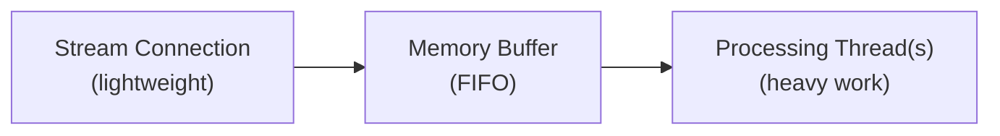

X 스트리밍 endpoint에서 데이터를 소비하는 견고한 클라이언트를 구축하는 방법을 배웁니다.

## 스트리밍 endpoint 개요

X 스트리밍 endpoint는 볼륨별로 분류됩니다:

| 카테고리 | Endpoint | 설명 |
|:---------|:----------|:------------|
| **고용량 스트림** | **Firehose**, [Volume Streams](/x-api/posts/volume-streams/introduction) (1% 및 10% 샘플링) | 필터링 없이 대량의 Post 데이터를 전송합니다. 플랫폼 활동에 대한 포괄적인 커버리지를 위해 설계되었습니다. |
| **저용량 스트림** | [Filtered Stream](/x-api/posts/filtered-stream/introduction) | 키워드나 조건을 지정하여 일치하는 Post만 받을 수 있습니다. 타겟팅된 모니터링에 이상적입니다. |
| **저지연 스트림** | [Powerstream](/x-api/powerstream/introduction) | 최소한의 지연으로 속도에 최적화됨. 실시간 데이터 전송이 필요한 사용 사례에 가장 적합합니다. |

## 데이터 전송 및 지연 시간

X API 스트리밍 endpoint는 **데이터 hydration 및 전송**을 우선시합니다. 모든 메타데이터가 포함된 hydrated Post 데이터를 확실히 받을 수 있도록, 이 스트림은 **P99 지연 시간이 약 6-7초**입니다.

### 전송 보장

| 지표 | 값 |
|:-------|:------|
| 재시도 전략 | 지수 백오프 |
| P99 지연 시간 | ~6-7초 |

### 고용량 스트림

Firehose 및 Sample (1% 및 10%) 스트림과 같은 고용량 스트림의 경우, **모든 Post의 99%가 생성 시간으로부터 1분 이내에 전송됩니다**. 이 보장은 전체 데이터 피드의 고용량, 연속적인 특성에 기반합니다.

### 저용량 스트림

Filtered Stream과 같이 상대적으로 저용량인 스트림의 경우, 필터의 구체성 및 일치하는 Post의 결과 볼륨에 따라 전송 시간이 달라질 수 있습니다.

<Note>
사용 사례에 더 낮은 지연 시간이 필요한 경우, 속도에 최적화되어 최소한의 지연으로 데이터를 전송하는 [Powerstream](/x-api/powerstream/introduction)을 고려하세요.
</Note>

<Warning>
장애 발생 시 지연 시간 및 데이터 전송이 부정적인 영향을 받을 수 있습니다. 문제가 발생하면 [status 페이지](https://developer.x.com/status)에서 업데이트를 확인하세요.
</Warning>

---

## 클라이언트 설계

스트리밍 endpoint로 솔루션을 구축할 때, 클라이언트는 다음을 수행해야 합니다:

1. **스트리밍 endpoint에 HTTPS 스트리밍 연결 설정**
2. **낮은 데이터 볼륨 처리** — 연결을 유지하면서 Post 객체와 keep-alive 신호를 감지
3. **높은 데이터 볼륨 처리** — 비동기 프로세스를 사용해 스트림 수신과 처리를 분리하고, 클라이언트 측 버퍼가 정기적으로 비워지도록 보장
4. **클라이언트 측 볼륨 추적 관리**
5. **연결 해제 감지** 및 자동 재연결

규칙이 있는 endpoint(Filtered Stream 및 Powerstream)의 경우, 클라이언트는 스트림 연결을 끊지 않고 규칙을 관리하기 위한 요청을 비동기로 보내야 합니다.

---

## 스트리밍 endpoint 연결

X API 스트리밍 endpoint에 연결한다는 것은 매우 오래 지속되는 HTTP 요청을 생성하고 응답을 점진적으로 파싱하는 것을 의미합니다. 개념적으로, HTTP를 통해 무한히 긴 파일을 다운로드하는 것으로 생각할 수 있습니다.

연결이 설정되면 X 서버는 연결이 열려 있는 동안 계속 연결을 통해 Post 이벤트를 전송합니다.

```python
import requests

def connect_to_stream(url, bearer_token):
    headers = {"Authorization": f"Bearer {bearer_token}"}
    
    response = requests.get(url, headers=headers, stream=True)
    
    for line in response.iter_lines():
        if line:
            # Process the Post
            print(line.decode("utf-8"))
```

---

## 데이터 소비

스트림의 JSON 객체는 field가 임의의 순서로 나타날 수 있으며, 모든 상황에서 모든 field가 존재하지는 않습니다. Post는 정렬된 순서로 전송되지 않으며, 중복 메시지가 발생할 수 있습니다. 시간이 지남에 따라 새로운 메시지 유형이 스트림에 추가될 수 있습니다.

클라이언트는 다음을 허용해야 합니다:

- field가 임의의 순서로 나타남
- 예기치 않거나 누락된 field
- 정렬되지 않은 Post
- 중복 메시지
- 언제든지 등장할 수 있는 새로운 메시지 유형

---

## 버퍼링

스트리밍 endpoint는 데이터가 사용 가능해지는 대로 빠르게 전송하며, 이는 높은 볼륨으로 이어질 수 있습니다. X 서버가 스트림에 새 데이터를 쓸 수 없는 경우(예: 클라이언트가 충분히 빨리 읽지 않는 경우), X 서버 측에서 콘텐츠를 버퍼링합니다. 그러나 이 버퍼가 가득 차면 연결이 끊어지고 버퍼링된 Post는 손실됩니다.

앱이 뒤처지고 있는지 식별하는 한 가지 방법은 수신된 Post의 타임스탬프를 현재 시간과 비교하고 시간 경과에 따라 추적하는 것입니다.

스트림 지연을 최소화하려면:

- **스트림을 빠르게 읽기** — 읽는 동안 처리 작업을 하지 마세요. 활동을 다른 스레드/프로세스/데이터 저장소로 넘겨 비동기 처리하세요
- **충분한 대역폭 확보** — 데이터 센터는 대규모의 지속적인 볼륨과 스파이크(정상 볼륨의 5-10배)에 대한 인바운드 대역폭이 필요합니다

---

## 시스템 메시지에 대한 응답

### Keep-alive 신호

최소 20초마다 스트림은 열려 있는 연결을 통해 `\r\n` 캐리지 리턴 형태의 keep-alive 신호(하트비트)를 보냅니다. 이는 클라이언트의 시간 초과를 방지합니다. 클라이언트는 이러한 문자를 허용해야 합니다.

HTTP 라이브러리에서 읽기 시간 초과를 구현하는 경우, 이 기간 내에 데이터가 읽히지 않으면 HTTP 프로토콜이 이벤트를 던지도록 의존할 수 있습니다. 이러한 시간 초과를 감지하고 재연결을 트리거하기 위해 HTTP 메서드를 오류/이벤트 핸들러로 래핑하는 것이 좋습니다.

### 오류 메시지

스트리밍 endpoint는 스트림 내 오류 메시지를 전달할 수 있습니다. 클라이언트는 변경되는 메시지 페이로드를 허용해야 합니다.

오류 메시지 형식 예시:

```json
{
  "errors": [{
    "title": "operational-disconnect",
    "disconnect_type": "UpstreamOperationalDisconnect",
    "detail": "This stream has been disconnected upstream for operational reasons.",
    "type": "https://api.x.com/2/problems/operational-disconnect"
  }]
}
```

<Note>
버퍼가 가득 차서 강제 연결 해제되었음을 나타내는 오류 메시지는 백업으로 인해 전달이 방해받는 경우 클라이언트에 도달하지 않을 수 있습니다. 재연결을 시작하기 위해 이러한 메시지에만 의존해서는 안 됩니다.
</Note>

---

## 사용량 추적

예기치 않은 편차에 대비해 스트림 데이터 볼륨을 모니터링하세요. 볼륨이 크게 감소하면 연결 해제 이외의 문제를 나타낼 수 있습니다 — 스트림은 여전히 keep-alive 신호와 일부 데이터를 받고 있지만, Post 볼륨이 감소하면 조사해야 합니다.

모니터링을 만들려면:

1. 설정된 시간대에 예상되는 Post 수를 추적하세요
2. 볼륨이 임계값 아래로 떨어지고 회복되지 않으면 알림을 시작하세요
3. 특히 규칙을 수정할 때나 Post 활동이 급증하는 이벤트 중에는 큰 증가도 모니터링하세요

<Note>
스트리밍 endpoint를 통해 전달된 Post는 월간 Post 볼륨에 포함됩니다. 사용을 최적화하려면 소비를 추적하고 조정하세요. 볼륨이 높은 경우, 규칙에 `sample:` 연산자를 추가하여 매칭을 100%에서 `sample:50` 또는 `sample:25`로 줄이는 것을 고려하세요.
</Note>

---

## 멀티스레드 처리

멀티스레드 애플리케이션을 구축하는 것은 고용량 스트림을 처리하는 데 핵심입니다. 모범 사례:

1. **스트림 스레드** — 연결을 설정하고 수신된 JSON을 메모리 구조나 버퍼링된 스트림 리더에 쓰는 경량 스레드
2. **처리 스레드** — 버퍼에서 소비하고 무거운 작업을 수행하는 별도의 스레드: JSON 파싱, 데이터베이스 쓰기 준비, 또는 기타 애플리케이션 로직

이 설계는 들어오는 Post 볼륨이 변경됨에 따라 서비스가 효율적으로 확장될 수 있도록 합니다.



---

## 다음 단계

<CardGroup cols={2}>
  <Card title="연결 해제 처리" icon="plug" href="/x-api/fundamentals/handling-disconnections">
    연결이 끊길 때 우아하게 재연결
  </Card>
  <Card title="고용량 처리" icon="gauge-high" href="/x-api/fundamentals/high-volume-capacity">
    고처리량 스트림 처리
  </Card>
  <Card title="복구 및 이중화" icon="/icons/xds/icon-shield-keyhole.svg" href="/x-api/fundamentals/recovery-and-redundancy">
    복원력 있는 스트리밍 애플리케이션 구축
  </Card>
</CardGroup>
