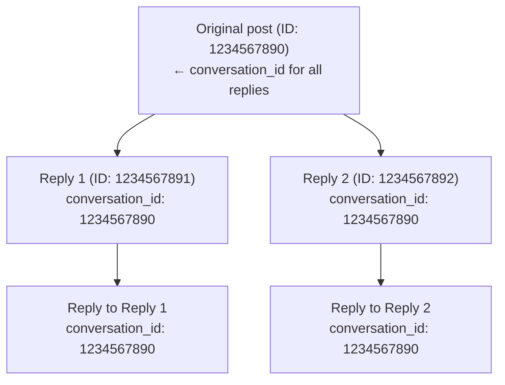

X의 모든 답글은 대화 스레드에 속합니다. `conversation_id` field를 사용하면 전체 대화 트리를 식별하고, 추적하며, 재구성할 수 있습니다.

---

## 작동 방식

누군가 Post를 하고 다른 사람들이 답글을 달면, 모든 답글은 동일한 `conversation_id`(대화를 시작한 원본 Post의 ID)를 공유합니다.



스레드가 얼마나 깊어지든, 모든 Post는 동일한 `conversation_id`를 공유합니다.

---

## conversation_id 요청

`tweet.fields`에 `conversation_id`를 추가하세요:

```bash
curl "https://api.x.com/2/tweets/1234567891?tweet.fields=conversation_id,in_reply_to_user_id,referenced_tweets" \
  -H "Authorization: Bearer $TOKEN"
```

응답:

```json title="Example response" lines wrap icon="/icons/xds/icon-brackets.svg"
{
  "data": {
    "id": "1234567891",
    "text": "@user Great point!",
    "conversation_id": "1234567890",
    "in_reply_to_user_id": "2244994945",
    "referenced_tweets": [{
      "type": "replied_to",
      "id": "1234567890"
    }]
  }
}
```

---

## 전체 대화 가져오기

스레드의 모든 Post를 조회하려면 `conversation_id`를 검색 연산자로 사용하세요:

```bash
curl "https://api.x.com/2/tweets/search/recent?\
query=conversation_id:1234567890&\
tweet.fields=author_id,created_at,in_reply_to_user_id&\
expansions=author_id" \
  -H "Authorization: Bearer $TOKEN"
```

이는 원본 Post에 대한 모든 답글을 최신순(역시간순)으로 반환합니다.

---

## 사용 사례

<Tabs>
  <Tab title="스레드 재구성">
전체 대화 트리 만들기:

```python title="Example" lines wrap icon="python"
import requests

conversation_id = "1234567890"
url = f"https://api.x.com/2/tweets/search/recent"
params = {
    "query": f"conversation_id:{conversation_id}",
    "tweet.fields": "author_id,in_reply_to_user_id,referenced_tweets,created_at",
    "max_results": 100
}

response = requests.get(url, headers=headers, params=params)
replies = response.json()["data"]

# Sort by created_at to get chronological order
replies.sort(key=lambda x: x["created_at"])
```
  </Tab>
  <Tab title="대화 모니터링">
특정 대화에 대한 답글을 실시간으로 스트리밍:

```bash
# Add a filtered stream rule for a conversation
curl -X POST "https://api.x.com/2/tweets/search/stream/rules" \
  -H "Authorization: Bearer $TOKEN" \
  -d '{"add": [{"value": "conversation_id:1234567890"}]}'
```
  </Tab>
  <Tab title="대화 분석">
대화 내 답글 수 계산:

```bash
curl "https://api.x.com/2/tweets/counts/recent?\
query=conversation_id:1234567890" \
  -H "Authorization: Bearer $TOKEN"
```
  </Tab>
</Tabs>

---

## 관련 field

| Field | 설명 |
|:------|:------------|
| `conversation_id` | 스레드를 시작한 원본 Post의 ID |
| `in_reply_to_user_id` | 답글이 달린 Post의 사용자 ID |
| `referenced_tweets` | `type: "replied_to"`와 부모 Post ID를 포함하는 배열 |

---

## 예시: 전체 스레드 조회

```json title="Example response" expandable lines wrap icon="/icons/xds/icon-brackets.svg"
{
  "data": [
    {
      "id": "1234567893",
      "text": "@user2 @user1 I agree with you both!",
      "conversation_id": "1234567890",
      "author_id": "3333333333",
      "created_at": "2024-01-15T12:05:00.000Z",
      "in_reply_to_user_id": "2222222222",
      "referenced_tweets": [{"type": "replied_to", "id": "1234567892"}]
    },
    {
      "id": "1234567892",
      "text": "@user1 That's interesting!",
      "conversation_id": "1234567890",
      "author_id": "2222222222",
      "created_at": "2024-01-15T12:03:00.000Z",
      "in_reply_to_user_id": "1111111111",
      "referenced_tweets": [{"type": "replied_to", "id": "1234567890"}]
    },
    {
      "id": "1234567891",
      "text": "@user1 Great point!",
      "conversation_id": "1234567890",
      "author_id": "4444444444",
      "created_at": "2024-01-15T12:02:00.000Z",
      "in_reply_to_user_id": "1111111111",
      "referenced_tweets": [{"type": "replied_to", "id": "1234567890"}]
    }
  ],
  "meta": {
    "result_count": 3
  }
}
```

---

## 참고 사항

- 원본 Post의 `conversation_id`는 자기 자신의 `id`와 동일합니다
- `conversation_id`는 Post를 반환하는 모든 v2 endpoint에서 사용 가능합니다
- [filtered stream](/x-api/posts/filtered-stream/introduction)과 함께 사용하여 실시간으로 대화를 모니터링하세요
- 큰 스레드의 경우 [페이지네이션](/x-api/fundamentals/pagination)과 결합하세요

---

## 다음 단계

<CardGroup cols={2}>
  <Card title="Post 검색" icon="/icons/xds/icon-search.svg" href="/x-api/posts/search/introduction">
    conversation_id로 검색.
  </Card>
  <Card title="Filtered stream" icon="signal-stream" href="/x-api/posts/filtered-stream/introduction">
    실시간으로 대화 모니터링.
  </Card>
</CardGroup>
