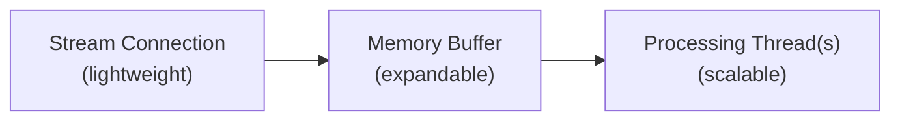

[Filtered Stream](/x-api/posts/filtered-stream/introduction), [Volume Streams](/x-api/posts/volume-streams/introduction), [Powerstream](/x-api/powerstream/introduction), [Compliance Streams](/x-api/compliance/streams/introduction)를 포함한 X 스트리밍 endpoint 사용 시 고용량 이벤트에 대비하는 방법을 배웁니다.

## 고용량 이벤트 계획

주요 국가 및 세계 이벤트는 종종 소셜 미디어 전반에서 사용자 활동의 극적인 급증을 동반합니다. 때로는 이러한 이벤트가 미리 알려져 있습니다:

- Super Bowl
- 정치 선거
- 전 세계 새해 축하

다른 때는 급증이 예기치 않게 발생합니다:

- 자연 재해
- 계획되지 않은 정치적 사건
- 대중 문화 순간
- 보건 비상 상황

이러한 급증은 짧을 수 있으며(수 초) 또는 몇 분에 걸쳐 지속될 수 있습니다. 적절한 준비를 통해 애플리케이션이 이러한 급증을 처리할 수 있습니다.

---

## 스트림 규칙 검토

고용량 이벤트 전에:

- 특정 키워드는 이벤트 중에 급증할 수 있습니다(예: 브랜드가 주요 스포츠 이벤트를 후원할 때 브랜드 언급)
- 과도한 활동 볼륨을 생성할 수 있는 불필요하거나 지나치게 일반적인 규칙을 제거하세요
- 이해관계자와 미리 알려진 고용량 이벤트에 대해 소통하여 적절히 계획할 수 있도록 도와주세요

---

## 애플리케이션 스트레스 테스트

버스트 볼륨은 **평균 일일 소비 수준의 5-10배**에 이를 수 있음을 예상하세요. 규칙에 따라 증가폭이 훨씬 더 클 수 있습니다.

실제 이벤트가 발생하기 전에 시뮬레이션된 고용량으로 애플리케이션을 테스트하여 병목 지점을 파악하세요.

---

## 전달 상한선 이해

흐름 및 전달 상한선은 액세스 수준을 기반으로 합니다:

| 액세스 수준 | 전달 상한선 |
|:-------------|:-------------|
| Academic | 초당 250 Post |
| Enterprise | 액세스 수준에서 설정된 초당 Post 수 |

---

## 연결 유지

스트림에서는 데이터 손실을 방지하기 위해 연결을 유지하는 것이 필수적입니다.

클라이언트 애플리케이션은 다음을 수행해야 합니다:

1. 연결 해제를 즉시 **감지**
2. 적절한 백오프 전략을 사용하여 **연결 재시도**
3. 재연결 시도가 실패하면 **지수 백오프 사용**

자세한 재연결 전략은 [연결 해제 처리](/x-api/fundamentals/handling-disconnections)를 참조하세요.

---

## 클라이언트 측 버퍼링 구축

멀티스레드 애플리케이션 구축은 고용량 스트림을 처리하는 데 핵심입니다:

### 권장 아키텍처

1. **스트림 스레드** (경량)
   - 스트리밍 연결 설정
   - 수신된 JSON을 메모리 구조나 버퍼링된 스트림 리더에 씁니다
   - 들어오는 데이터만 처리 — 처리 작업 없음

2. **메모리 버퍼**
   - 필요에 따라 커지고 작아짐
   - 볼륨 급증을 위한 완충 역할

3. **처리 스레드** (무거운 작업)
   - 버퍼에서 소비
   - JSON 파싱
   - 데이터베이스 쓰기 준비
   - 애플리케이션 로직 처리

---

## 시간대 고려

글로벌 이벤트는 글로벌 시간대에서 발생합니다. 이벤트는 다음에서 발생할 수 있습니다:

- 업무 시간 이후
- 주말
- 휴일

정상 업무 시간 외의 급증에 대비해 팀이 준비되어 있는지 확인하세요. 다음을 고려하세요:

- 자동 알림 시스템
- 온콜 로테이션
- 자동 확장 대응

---

## 모니터링 권장 사항

1. Post 볼륨을 실시간으로 **추적**
2. 볼륨 임계값(증가 및 감소 모두)에 대한 **알림 설정**
3. 처리가 뒤처지고 있는지 감지하기 위해 **버퍼 크기 모니터링**
4. 지연을 식별하기 위해 **Post 타임스탬프를 현재 시간과 비교**

---

## 비상 조치

극단적인 상황을 위한 안전 장치를 구현하세요:

- 볼륨이 사전 설정된 임계값을 넘을 때 **자동 알림**
- 과도한 데이터를 가져오는 규칙에 대한 **자동 규칙 삭제**
- 시스템을 보호하기 위해 극단적인 상황에서 **스트림 연결 해제**
- **샘플링 연산자** — 매칭 볼륨을 줄이기 위해 규칙에 `sample:` 추가

---

## 다음 단계

<CardGroup cols={2}>
  <Card title="스트리밍 데이터 소비" icon="stream" href="/x-api/fundamentals/consuming-streaming-data">
    견고한 스트리밍 클라이언트 구축
  </Card>
  <Card title="연결 해제 처리" icon="plug" href="/x-api/fundamentals/handling-disconnections">
    우아하게 재연결
  </Card>
  <Card title="복구 및 이중화" icon="/icons/xds/icon-shield-keyhole.svg" href="/x-api/fundamentals/recovery-and-redundancy">
    복원력 있는 애플리케이션 구축
  </Card>
</CardGroup>
