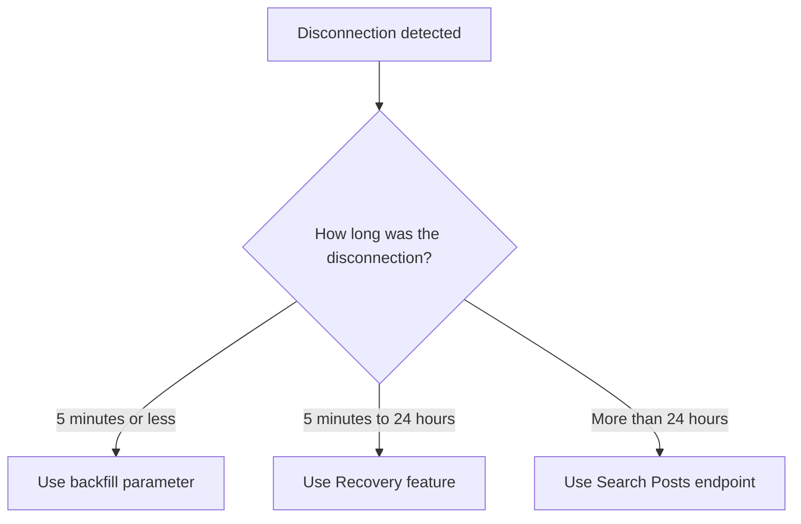

[Filtered Stream](/x-api/posts/filtered-stream/introduction), [Firehose Streams](/x-api/stream/stream-all-posts), [Volume Streams](/x-api/posts/volume-streams/introduction), [Powerstream](/x-api/powerstream/introduction), [Compliance Streams](/x-api/compliance/streams/introduction)를 포함한 X 스트리밍 endpoint 사용 시 연결 시간을 최대화하고 누락된 데이터를 복구하는 방법을 배웁니다.

## 개요

스트리밍 데이터를 소비할 때 연결 시간을 최대화하고 매칭된 모든 데이터를 수신하는 것이 기본 목표입니다. 이를 위해서는 다음이 필요합니다:

- 이중 연결 활용
- 자동으로 연결 해제 감지
- 빠른 재연결
- 손실된 데이터 복구 계획

---

## 이중 연결

이중 연결을 사용하면 스트림에 대해 두 개 이상의 동시 연결을 설정할 수 있습니다. 두 개의 별도 컨슈머로 연결하고 두 연결을 통해 동일한 데이터를 수신하여 이중화를 제공합니다.

이점:
- 한 스트림이 연결 해제되면 핫 페일오버
- 기본 서버가 실패해도 보호
- 재연결 중에도 지속적인 데이터 전송

### 사용 방법

두 번째 클라이언트로 동일한 스트림 URL에 연결하면 됩니다. 두 연결을 통해 데이터가 전송됩니다.

<Note>
이중 연결은 Enterprise 액세스에서 제공됩니다. Filtered Stream은 Enterprise 프로젝트에 대해 최대 두 개의 이중 연결을 허용합니다. Firehose Streams는 최대 20개의 동시 연결을 지원하기 위해 `partition` 파라미터를 사용하며, Sample10 (Decahose)는 최대 2개의 파티션을 지원합니다. 연결 한도는 사용 중인 endpoint 문서를 확인하세요.
</Note>

---

## Backfill

연결 해제를 감지한 후 시스템은 연결 해제가 얼마나 지속되었는지 추적하여 적절한 복구 방법을 결정해야 합니다.

### 5분 이하의 연결 해제

재연결 시 **backfill 파라미터**를 사용하여 연결 해제 기간 동안 매칭된 Post를 수신하세요.

| Endpoint | 파라미터 | 예시 |
|:---------|:----------|:--------|
| Filtered Stream | `backfill_minutes` | `?backfill_minutes=5` |
| Firehose Stream | `backfill_minutes` | `?backfill_minutes=5` |
| Sample Stream (1%) | `backfill_minutes` | `?backfill_minutes=5` |
| Sample10 Stream (Decahose) | `backfill_minutes` | `?backfill_minutes=5` |
| Powerstream | `backfillMinutes` | `?backfillMinutes=5` |

요청 예시:

**Filtered Stream:**

```bash
curl 'https://api.x.com/2/tweets/search/stream?backfill_minutes=5' \
  -H "Authorization: Bearer $ACCESS_TOKEN"
```

**Firehose Stream:**

```bash
curl 'https://api.x.com/2/tweets/firehose/stream?backfill_minutes=5&partition=1' \
  -H "Authorization: Bearer $ACCESS_TOKEN"
```

<Note>
**중요 고려사항:**
- 오래된 Post가 일반적으로 새로 매칭된 Post보다 먼저 전달됩니다
- Post는 중복 제거되지 **않습니다** — 90초 동안 연결이 끊겼는데 2분의 backfill을 요청하면 30초의 중복 Post를 받게 됩니다
- 시스템은 중복을 허용해야 합니다
- Backfill은 Enterprise 액세스에서 제공됩니다
</Note>

---

## 복구

**5분 이상** 지속되는 연결 해제의 경우, Recovery 기능을 사용하여 지난 24시간 이내의 누락된 데이터를 재생하세요.

### Recovery 작동 방식

1. `start_time`과 `end_time` 파라미터로 연결 요청
2. Recovery가 지정된 시간 기간을 다시 스트리밍
3. 완료되면 연결이 끊어집니다

### 파라미터

| 파라미터 | 유형 | 설명 |
|:----------|:-----|:------------|
| `start_time` | ISO 8601 날짜 | 복구 시작 시간(UTC) |
| `end_time` | ISO 8601 날짜 | 복구 종료 시간(UTC) |

### 요청 예시

**Filtered Stream:**

```bash
curl 'https://api.x.com/2/tweets/search/stream?start_time=2022-07-12T15:10:00Z&end_time=2022-07-12T15:20:00Z' \
  -H "Authorization: Bearer $ACCESS_TOKEN"
```

**Firehose Stream:**

```bash
curl 'https://api.x.com/2/tweets/firehose/stream?start_time=2022-07-12T15:10:00Z&end_time=2022-07-12T15:20:00Z&partition=1' \
  -H "Authorization: Bearer $ACCESS_TOKEN"
```

**Powerstream:**

```bash
curl 'https://api.x.com/2/powerstream?startTime=2022-07-12T15:10:00Z&endTime=2022-07-12T15:20:00Z' \
  -H "Authorization: Bearer $ACCESS_TOKEN"
```

<Note>
**Recovery 제한:**
- Enterprise 액세스에서 제공됩니다
- Recovery 창: 과거 최대 24시간
- Filtered Stream은 2개의 동시 recovery job을 허용합니다
- Firehose, Sample10 (Decahose), 언어별 firehose 스트림도 recovery를 지원합니다
- 기본 1% Sample Stream은 recovery를 지원하지 않습니다. 대신 Search endpoint를 사용하세요
</Note>

---

## 대체 복구: 검색

Backfill 또는 recovery 기능에 액세스할 수 없거나 연결 해제가 24시간을 초과한 경우, [Search Posts endpoint](/x-api/posts/search/introduction)를 사용하여 누락된 데이터를 요청할 수 있습니다.

<Warning>
**매칭 차이:**
Search Posts endpoint에는 `sample:`, `bio:`, `bio_name:`, `bio_location:` 연산자가 포함되지 않으며, 악센트 및 발음 구별 부호에 대한 매칭 동작에서 특정 차이가 있습니다. 이는 스트리밍 endpoint를 통해 수신되었을 모든 Post를 완전히 복구하지 못할 수 있음을 의미합니다.
</Warning>

---

## 복구 결정 트리



---

## 모범 사례

1. **연결 해제 지속 시간 추적** — 시스템은 연결 해제 발생 시점과 지속 시간을 기록해야 합니다

2. **자동 복구 구현** — 연결 해제 지속 시간에 따라 적절한 복구 방법을 자동으로 선택하세요

3. **중복 처리** — Backfill과 recovery 모두 중복 Post를 전달할 수 있습니다. 중복 제거 로직을 구현하세요

4. **이중 연결 사용** — 사용 가능한 경우 여러 연결을 유지하여 데이터 손실을 방지하세요

5. **Recovery job 모니터링** — Recovery 작업의 상태와 완료를 추적하세요

---

## 다음 단계

<CardGroup cols={2}>
  <Card title="연결 해제 처리" icon="plug" href="/x-api/fundamentals/handling-disconnections">
    연결 해제 감지 및 처리
  </Card>
  <Card title="스트리밍 데이터 소비" icon="stream" href="/x-api/fundamentals/consuming-streaming-data">
    견고한 스트리밍 클라이언트 구축
  </Card>
  <Card title="고용량 처리" icon="gauge-high" href="/x-api/fundamentals/high-volume-capacity">
    고처리량 스트림 처리
  </Card>
</CardGroup>
