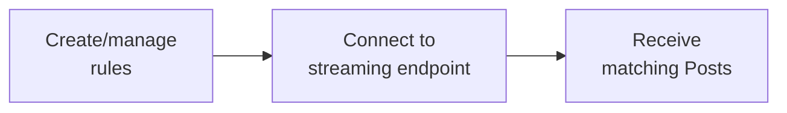

import { Button } from '/snippets/button.mdx';

Filtered Stream 엔드포인트를 사용하면 필터 규칙에 매칭되는 게시물을 거의 실시간으로 수신할 수 있습니다. 강력한 연산자로 규칙을 만들고 지속적인 스트림에 연결하여 게시물이 발행되는 대로 매칭되는 게시물을 수신하세요.

<Note>
Filtered Stream은 데이터 hydration과 전달을 우선하며, P99 지연 시간은 약 6-7초입니다. 더 낮은 지연 시간이 필요한 경우 [Powerstream](/x-api/powerstream/introduction)을 참고하세요.
</Note>

## 개요

<CardGroup cols={2}>
  <Card title="거의 실시간 전달" icon="bolt">
    게시물이 발행된 지 수 초 이내에 수신
  </Card>
  <Card title="지속적인 규칙" icon="/icons/xds/icon-filter.svg">
    연결을 끊지 않고 규칙 추가 및 제거
  </Card>
  <Card title="강력한 연산자" icon="/icons/xds/icon-search.svg">
    keywords, hashtags, users 등 다양한 항목으로 매칭
  </Card>
  <Card title="Webhook 전달" icon="webhook">
    선택적으로 게시물을 webhook으로 수신
  </Card>
</CardGroup>

---

## 동작 방식

1. **규칙 생성** — 연산자를 사용해 필터 규칙 정의
2. **스트림 연결** — 지속적인 HTTP 연결 수립
3. **게시물 수신** — 매칭 게시물을 거의 실시간으로 수신



---

## 엔드포인트

| Method | Endpoint | Description |
|:-------|:---------|:------------|
| GET | [`/2/tweets/search/stream`](/x-api/stream/stream-filtered-posts) | 스트림에 연결 |
| POST | [`/2/tweets/search/stream/rules`](/x-api/stream/update-stream-rules) | 규칙 추가 또는 삭제 |
| GET | [`/2/tweets/search/stream/rules`](/x-api/stream/get-stream-rules) | 현재 규칙 목록 조회 |

---

## 접근 등급

| Feature | Pay-per-use | Enterprise |
|:--------|:------------|:-----------|
| 프로젝트당 규칙 수 | 1,000 | 25,000+ |
| 규칙 길이 | 1,024 자 | 2,048 자 |
| 연결 수 | 1 | 여러 개 |
| Core operators | ✓ | ✓ |
| Semantic embedding operators | — | ✓ (Embedding 티어 필요) |

<Card title="Enterprise 문의" icon="/icons/xds/icon-bank.svg" href="https://developer.x.com/en/products/x-api/enterprise/enterprise-api-interest-form">
  더 높은 한도와 추가 기능 이용
</Card>

<Note>
일부 연산자는 특정 티어가 필요합니다. `embedding:` 시맨틱 연산자는 Embedding 티어 액세스가 포함된 Enterprise plan에서 **Filtered Stream에만** 제공됩니다. 표준 Pay-per-use 액세스에는 core operator만 포함됩니다.
</Note>

---

## 규칙 작성

규칙은 search 쿼리와 동일한 연산자를 사용합니다:

```
(AI OR "machine learning") lang:en -is:retweet
```

### 예시 규칙

| Rule | Matches |
|:-----|:--------|
| `#python` | #python 해시태그가 있는 게시물 |
| `from:elonmusk` | @elonmusk의 게시물 |
| `"breaking news" has:images` | 문구와 이미지가 함께 있는 게시물 |
| `(@XDevelopers OR @X) -is:retweet` | 멘션 (리트윗 제외) |
| `embedding:"climate change policy"` | 시맨틱적으로 기후 정책에 관한 게시물 (Enterprise + Embedding 티어) |

<Card title="규칙 작성" icon="/icons/xds/icon-filter.svg" href="/x-api/posts/filtered-stream/integrate/build-a-rule">
  규칙 구문 및 연산자 익히기
</Card>

---

## 스트림 연결

게시물을 수신하기 위해 지속적인 HTTP 연결을 수립합니다:

```python
import requests

def stream_posts(bearer_token):
    url = "https://api.x.com/2/tweets/search/stream"
    headers = {"Authorization": f"Bearer {bearer_token}"}
    
    response = requests.get(url, headers=headers, stream=True)
    
    for line in response.iter_lines():
        if line:
            print(line.decode("utf-8"))
```

### Keep-alive 신호

스트림은 연결을 유지하기 위해 20초마다 빈 줄(`\r\n`)을 보냅니다. 20초 동안 데이터나 keep-alive를 수신하지 않으면 재연결하세요.

<CardGroup cols={2}>
  <Card title="연결 끊김 처리" icon="plug" href="/x-api/fundamentals/handling-disconnections">
    원활하게 재연결하기
  </Card>
  <Card title="스트리밍 데이터 소비" icon="stream" href="/x-api/fundamentals/consuming-streaming-data">
    게시물을 효율적으로 처리
  </Card>
</CardGroup>

---

## Webhook 전달

지속적인 연결을 유지하는 대신, webhook을 통해 게시물을 수신할 수 있습니다:

<Card title="Webhook 전달" icon="webhook" href="/x-api/webhooks/stream/introduction">
  filtered stream용 webhook 전달 설정
</Card>

---

## 게시물 편집

스트림은 편집된 게시물을 편집 히스토리와 함께 전달합니다. 각 편집은 새로운 Post ID를 생성합니다:

```json
{
  "data": {
    "id": "1234567893",
    "text": "Hello world! (edited)",
    "edit_history_tweet_ids": ["1234567890", "1234567891", "1234567893"]
  }
}
```

<Card title="게시물 편집 기본" icon="/icons/xds/icon-history.svg" href="/x-api/fundamentals/edit-posts">
  게시물 편집에 대해 자세히 알아보기
</Card>

---

## 시작하기

<Note>
**사전 요구사항**

- 승인된 [developer account](https://developer.x.com/en/portal/petition/essential/basic-info)
- Developer Console 내의 [Project와 App](/resources/fundamentals/developer-apps)
- App의 [Bearer Token](/resources/fundamentals/authentication)
</Note>

<CardGroup cols={2}>
  <Card title="퀵스타트" icon="/icons/xds/icon-rocket.svg" href="/x-api/posts/filtered-stream/quickstart">
    몇 분 안에 스트림에 연결하기
  </Card>
  <Card title="규칙 작성" icon="/icons/xds/icon-filter.svg" href="/x-api/posts/filtered-stream/integrate/build-a-rule">
    규칙 구문 익히기
  </Card>
  <Card title="연산자 레퍼런스" icon="list-check" href="/x-api/posts/filtered-stream/integrate/operators">
    사용 가능한 모든 연산자
  </Card>
  <Card title="샘플 코드" icon="github" href="https://github.com/xdevplatform/Twitter-API-v2-sample-code">
    동작하는 코드 예제
  </Card>
</CardGroup>

---

## 고급 주제

<CardGroup cols={2}>
  <Card title="연결 끊김 처리" icon="plug" href="/x-api/fundamentals/handling-disconnections">
    원활하게 재연결하기
  </Card>
  <Card title="대용량 처리 능력" icon="gauge-high" href="/x-api/fundamentals/high-volume-capacity">
    높은 처리량 처리
  </Card>
  <Card title="복구 및 이중화" icon="/icons/xds/icon-shield-keyhole.svg" href="/x-api/fundamentals/recovery-and-redundancy">
    복원력 있는 애플리케이션 구축
  </Card>
  <Card title="반환된 게시물 매칭" icon="crosshairs" href="/x-api/posts/filtered-stream/integrate/matching-returned-tweets">
    어떤 규칙이 매칭되었는지 식별
  </Card>
</CardGroup>
