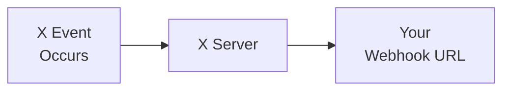

import { Button } from '/snippets/button.mdx';

V2 Webhooks API를 사용하면 개발자가 웹훅 기반 JSON 메시지를 통해 X 계정에서 실시간 이벤트 알림을 받을 수 있습니다. 이러한 API를 사용하면 웹훅을 등록 및 관리하고, 이벤트를 처리하기 위한 컨슈머 애플리케이션을 개발하며, challenge-response check (CRC)와 서명 헤더를 통해 안전한 통신을 보장할 수 있습니다.

## 개요

<CardGroup cols={2}>
  <Card title="실시간 전달" icon="bolt">
    이벤트가 발생하는 즉시 수신
  </Card>
  <Card title="Push 기반" icon="/icons/xds/icon-arrow-right.svg">
    폴링 없이 데이터가 직접 서버로 전송됨
  </Card>
  <Card title="보안" icon="/icons/xds/icon-shield-keyhole.svg">
    CRC 검증 및 서명 확인
  </Card>
  <Card title="신뢰성" icon="gauge">
    재시도 및 복구 지원
  </Card>
</CardGroup>

---

## 웹훅을 지원하는 제품

현재 웹훅을 통한 이벤트 전달을 지원하는 제품은 다음과 같습니다:

| 제품 | 설명 |
|:--------|:------------|
| [X Activity API (XAA)](/x-api/activity/introduction) | X에서 발생하는 활동에 대한 실시간 이벤트 수신 |
| [Account Activity API (AAA)](/x-api/account-activity/introduction) | 특정 사용자 계정에 연결된 실시간 이벤트 수신 |
| [Filtered Stream Webhooks](/x-api/webhooks/stream/introduction) | 웹훅 전달을 통해 filtered stream Post 수신 |

---

## 웹훅 작동 방식

1. **이벤트 발생** — 사용자가 게시, DM 전송, 팔로우 등을 함
2. **X가 POST 요청 전송** — JSON 이벤트 페이로드가 등록된 웹훅 URL로 전송됨
3. **이벤트 처리** — 서버가 이벤트 데이터를 처리
4. **200 OK로 응답** — 수신 확인을 위해 200 상태 반환

---

## 웹훅 요구 사항

| 요구 사항 | 설명 |
|:------------|:------------|
| **HTTPS** | 웹훅 URL은 HTTPS를 사용해야 함 |
| **공개 접근 가능** | URL은 인터넷에서 접근 가능해야 함 |
| **포트 지정 불가** | URL에 포트를 포함할 수 없음 (예: `https://mydomain.com:5000/webhook`은 작동하지 않음) |
| **빠른 응답** | 10초 이내 응답 |
| **200 OK** | 수신 확인을 위해 200 상태 반환 |
| **CRC 지원** | Challenge-Response Check GET 요청에 응답해야 함 ([자세히 알아보기](/x-api/webhooks/quickstart#2-the-crc-check)) |

---

## 엔드포인트

| Method | Endpoint | 설명 |
|:-------|:---------|:------------|
| POST | [`/2/webhooks`](/x-api/webhooks/create-webhook) | 새 웹훅 등록 |
| GET | [`/2/webhooks`](/x-api/webhooks/get-webhook) | 등록된 웹훅 목록 조회 |
| DELETE | [`/2/webhooks/:webhook_id`](/x-api/webhooks/delete-webhook) | 웹훅 삭제 |
| POST | [`/2/webhooks/replay`](/x-api/webhooks/create-replay-job-for-webhook) | 웹훅용 replay 작업 생성 |
| PUT | [`/2/webhooks/:webhook_id`](/x-api/webhooks/validate-webhook) | CRC 확인 트리거 및 웹훅 재활성화 |

모든 엔드포인트에는 **OAuth2 App Only Bearer Token** 인증이 필요합니다.

---

## 보안

X의 웹훅 기반 API는 웹훅 서버의 보안을 확인하기 위해 두 가지 방법을 제공합니다:

1. **Challenge-Response Check (CRC)** — X는 웹훅 URL에 주기적으로 GET 요청을 전송합니다. 여러분은 HMAC-SHA256 해시로 응답하여 엔드포인트를 제어하고 있음을 증명합니다. CRC 검사는 초기 등록 시, 매시간, 그리고 수동 재검증 시에 발생합니다.

2. **서명 검증** — X의 각 POST 요청에는 `x-twitter-webhooks-signature` 헤더가 포함됩니다. 이 서명을 확인하여 들어오는 이벤트의 출처가 X임을 확인할 수 있습니다.

<Card title="전체 구현 세부 정보 보기" icon="/icons/xds/icon-code.svg" href="/x-api/webhooks/quickstart">
  CRC 설정, 코드 예시, 서명 검증에 대한 단계별 안내
</Card>

---

## 웹훅 검증

다음 경우에 CRC 확인이 웹훅으로 전송됩니다:

- 생성 즉시
- 명시적 PUT 요청 시 (`PUT /2/webhooks/{id}`)
- 30분마다 주기적으로 (단, 지난 24시간 동안 성공적으로 검증되지 않은 경우에만)

웹훅은 다음의 경우 **invalid**로 표시됩니다:

- CRC 확인에 유효하지 않은 응답을 반환하는 경우
  - 2XX 상태 코드를 반환하지만 `response_token`이 올바르지 않음
  - 3XX 상태 코드를 반환
  - SSL 예외가 발생함
- 지속적인 일시적 오류로 인해 28시간 넘게 성공적으로 검증되지 않은 경우 (일시적 문제에 대한 4시간의 유예 기간 포함)
  - 다음 응답은 일시적 오류로 처리됩니다:
    - 4XX 상태 코드
    - 5XX 상태 코드
    - 요청 시간 초과
    - 채널 종료

`GET /2/webhooks` 엔드포인트를 사용하거나 개발자 콘솔의 툴박스를 통해 웹훅의 유효/무효 상태를 확인할 수 있습니다.

---

## 시작하기

<Note>
**사전 요구 사항**

- 승인된 [개발자 계정](https://developer.x.com/en/portal/petition/essential/basic-info)
- 개발자 콘솔의 [Project 및 App](/resources/fundamentals/developer-apps)
- 공개 접근 가능한 HTTPS 엔드포인트
- CRC 검증을 위한 앱의 **consumer secret** (API secret key)
</Note>

<CardGroup cols={2}>
  <Card title="빠른 시작" icon="/icons/xds/icon-rocket.svg" href="/x-api/webhooks/quickstart">
    웹훅을 처음부터 끝까지 설정
  </Card>
  <Card title="Filtered Stream Webhooks" icon="/icons/xds/icon-filter.svg" href="/x-api/webhooks/stream/introduction">
    웹훅을 통해 필터링된 Post 수신
  </Card>
  <Card title="Account Activity API" icon="/icons/xds/icon-bell.svg" href="/x-api/account-activity/introduction">
    웹훅을 통해 계정 이벤트 수신
  </Card>
  <Card title="샘플 앱" icon="github" href="/x-api/webhooks/quickstart#sample-apps">
    작동하는 코드 예제
  </Card>
</CardGroup>
