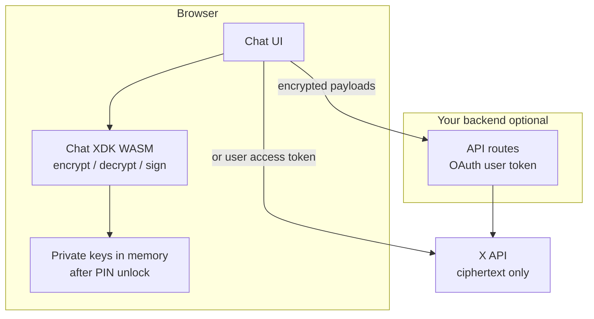

**사용자 대상 채팅 UI**의 경우, [Chat XDK](/xchat/xchat-xdk)를 JavaScript/WASM 패키지(`@xdevplatform/chat-xdk`)를 통해 **브라우저에서** 실행하세요. 개인 신원 및 서명 키는 사용자의 기기에 머무릅니다. 서버(그리고 X)는 오직 **암호문**, 공개 키, OAuth 토큰만 볼 수 있으며, 메시지를 암호화하고 서명하는 데 사용되는 PIN이나 개인 키 자료는 결코 볼 수 없습니다.

이 페이지는 클라이언트 앱을 위한 권장 아키텍처입니다. 모든 앱 유형에 적용되는 PIN 및 키 취급 규칙은 [개인 키 다루기](/xchat/handling-private-keys)를 참고하세요.

---

## 왜 UI 앱에 WASM인가

| 접근 방식 | 암호화 실행 위치 | 개인 키 | 적합한 용도 |
|:---------|:------------------|:-------------|:----|
| **브라우저의 WASM** (`createChat`) | 사용자 기기 | PIN으로 WASM 메모리로 복구; 백엔드로 전송되지 않음 | **채팅 UI에 권장** |
| **서버의 네이티브 Chat XDK** | 서버 | 서버에 키 blob 또는 패스코드 기반 복구 | 봇 및 자동화 — 최종 사용자 채팅 클라이언트에는 부적합 |

최종 사용자는 자신의 암호화 PIN을 **절대** 백엔드에 붙여 넣어서는 안 되며, 백엔드는 그들의 신원 개인 키를 **절대** 보유해서는 안 됩니다. 서드파티 서버가 사용자의 PIN이나 루트 개인 키를 받게 되면, 해당 서드파티는 그 신원에 감싸진 대화 키를 **사용자가 OAuth 접근을 취소한 후에도** 복호화할 수 있습니다. 클라이언트 사이드 WASM은 정상적인 앱에서 이러한 종류의 실패를 방지합니다.

<Warning>
PIN이나 개인 키를 서드파티와 공유하는 것은 암호화 DM의 비밀번호를 공유하는 것과 같습니다. OAuth 연결 해제는 앱이 이미 획득한 키를 **취소하지 않습니다**. 키가 브라우저를 떠나지 않도록 WASM을 우선하세요; 그럴 수 없는 경우에는 위험을 명확히 문서화하세요. [개인 키 다루기](/xchat/handling-private-keys)를 참고하세요.
</Warning>

---

## 권장 아키텍처

**암호화**(브라우저)와 **API 전송**(백엔드 또는 사용자 토큰이 있는 직접 X API)을 분리하세요:



| 계층 | 역할 |
|:------|:---------------|
| **브라우저 UI** | 대화 렌더링; **클라이언트에서만** PIN 수집; 암호화/복호화/서명을 위해 Chat XDK WASM 호출 |
| **Chat XDK WASM** | 키 생성, 보안 키 백업(`setup` / `unlock`), 메시지 암호화 |
| **백엔드(선택)** | OAuth 액세스 토큰 보유, X Chat REST 프록시, Juicebox realm 인증 토큰 발급 — **결코** PIN이나 개인 키를 받지 않음 |
| **X API** | 공개 키, 감싸진 대화 키, 암호화된 이벤트 및 미디어 |

일반적인 패턴(브라우저 채팅 클라이언트와 같은 내부 데모에서 사용)은 다음과 같습니다: **프런트엔드의 WASM + React(또는 유사한 것)**, **Next.js(또는 다른) API 라우트의 TypeScript [XDK](/xdks/typescript/overview)**로 브라우저가 원한다면 장기 시크릿으로 `api.x.com`에 직접 접근하지 않도록 합니다. 암호화는 여전히 브라우저에서만 실행됩니다.

---

## 브라우저 패키지 설치

```bash
npm install @xdevplatform/chat-xdk
npm install juicebox-sdk   # required for setup() / unlock() secure key backup
```

컴파일된 WASM 엔진은 `@xdevplatform/chat-xdk` 내부에 포함되어 있어 소비자를 위한 별도의 Rust 툴체인은 없습니다. 최신 브라우저(SSR과 코드를 공유하는 경우 Node.js 18+; 암호화는 오직 클라이언트에서만 실행)가 필요합니다.

---

## 세션 흐름 (PIN 한 번, 키는 메모리에 유지)

메시지마다 PIN을 요청하지 **마세요**. **브라우저 세션당 한 번** 잠금 해제하고, `Chat` 인스턴스를 메모리에 유지한 다음(모듈 싱글턴, React context 등), 잠금 해제된 해당 인스턴스에 대해 암호화하고 복호화하세요.

```typescript
import { createChat } from '@xdevplatform/chat-xdk';

// 1) Create once per page load (client component / browser only)
const chat = await createChat({
  juiceboxConfig: JSON.stringify(record.juicebox_config), // from GET public keys for the user
  getAuthToken: async (realmId) => {
    // Your backend mints a Juicebox realm token for this user + key version.
    // Do not send the user's PIN here—only realm auth for secure key backup.
    const res = await fetch(`/api/juicebox/token?realm=${encodeURIComponent(realmId)}`);
    if (!res.ok) throw new Error('Juicebox token fetch failed');
    return res.text();
  },
});

// 2) First-time identity: generate → register public keys with X → backup with PIN
// const payload = chat.generateKeypairs();
// await registerPublicKeysWithX(payload);  // POST /2/users/:id/public_keys
// await chat.setup(pin);                   // PIN never leaves the browser

// 3) Returning session: recover keys with PIN (once)
await chat.unlock(pin);
chat.setIdentity(userId, signingKeyVersion);
chat.setCacheKeys(true);
// Fetch participants' public keys from X, then:
chat.setSigningKeys(signingKeys);

// 4) Use for the whole SPA session—no more PIN prompts
const result = chat.decryptEvents(rawEvents);
const sendBody = chat.encryptMessage({ conversationId, text: 'Hello' });
// POST sendBody to your backend or X Chat send-message endpoint

// 5) On logout or "lock chat"
chat.lock(); // clears key material from the WASM instance
// chat.free(); // if you will not reuse this instance
```

### UX 기대치

| 이벤트 | 수행할 작업 |
|:------|:-----------|
| **앱 열기 / 하드 리로드** | 사용자가 PIN 입력 → `unlock` → SPA 내 탐색을 위해 인스턴스 유지 |
| **전송 / 수신 / 미디어** | **이미 잠금 해제된** 인스턴스에서 암호화/복호화 호출 |
| **로그아웃 / 계정 전환** | `lock()` 또는 `free()`; 참조 해제; 세션 상태 정리 |
| **PIN을 잊음 / 잠금** | 보안 키 백업이 시도 한도를 강제합니다; 복구에 키 재설정(새 키페어 + 재등록)이 필요할 수 있습니다. [암호화 기초](/xchat/cryptography-primer#secure-key-backup-distributed-key-storage) 참고 |

<Tip>
**모든 액션마다 PIN을 다시 요청하지 마세요.** 데모 앱은 단순함을 위해 종종 `unlock`을 반복 호출합니다. 프로덕션 UI는 한 번만 잠금 해제하고, 인스턴스를 메모리에 유지하며, 리로드, 로그아웃 또는 `lock()` 이후에만 PIN을 다시 요청해야 합니다.
</Tip>

---

## 서버가 볼 수 있는 것

| 서버에서 허용됨 | 서버에 절대 보내지 말 것 |
|:----------------------|:-------------------------|
| OAuth 2.0 사용자 액세스 토큰 | 암호화 PIN / 패스코드 |
| Juicebox **realm 인증 토큰**(단명, 백업 프로토콜용) | 신원 또는 서명 **개인** 키 |
| 공개 키 등록 페이로드 | 최종 사용자 신원에 대한 원시 `export_keys` blob(브라우저 앱) |
| 암호화된 메시지 및 미디어 페이로드 | 평문 메시지 본문(사용자가 UI에서 작성 중일 때만 예외) |
| 대화 ID, 이벤트 ID, X가 이미 저장하는 메타데이터 | 사용자의 루트 키 자료를 재구성할 수 있는 것은 무엇이든 |

Juicebox의 realm 토큰은 사용자의 PIN이 **아닙니다**. 해당 사용자 및 키 버전에 대한 백업 프로토콜을 인가합니다. 이미 사용자 OAuth 컨텍스트를 보유한 백엔드에서 계속 발급하세요.

---

## 브라우저의 보안 키 백업

클라이언트 앱은 원시 키 파일이 아닌 **보안 키 백업**(패스코드를 사용하는 `setup` / `unlock`)을 사용해야 합니다:

1. 사용자의 공개 키 레코드(`public_key.fields=juicebox_config`)에서 `juicebox_config`를 로드합니다.
2. `createChat({ juiceboxConfig, getAuthToken })`.
3. 최초: `generateKeypairs` → X에 공개 키 등록 → `setup(pin)`.
4. 이후: 이 기기에서(또는 동일한 PIN을 사용하는 새 기기에서) `unlock(pin)`.

Chat XDK의 브라우저 경로는 키를 WASM으로 복구하며 **원시 개인 키 내보내기를 공개 `createChat` 표면에 노출하지 않으므로**, 애플리케이션 JavaScript가 루트 키 바이트를 페이지로 끌어오도록 권장되지 않습니다. 손수 작성한 `localStorage` 키 덤프보다 이 모델을 선호하세요.

전체 등록 및 잠금 해제 단계: [시작하기](/xchat/getting-started). 개념: [암호화 기초](/xchat/cryptography-primer).

---

## 브라우저 하드닝 체크리스트

- Chat XDK는 오직 **클라이언트** 번들에서만 실행하세요(잠금 해제된 키의 SSR 금지).
- 잠금 해제된 `Chat` 인스턴스를 라이브 세션 시크릿처럼 취급하세요: `window`에 두지 말고, 로그로 남기지 말며, 분석에 게시하지 마세요.
- **XSS**로부터 방어하세요: CSP, 신중한 `dangerouslySetInnerHTML` / 마크다운 렌더링, 의존성 위생. 채팅 앱의 XSS는 키가 네트워크에 도달하지 않더라도 메모리에 있는 키에 접근할 수 있습니다.
- 모든 곳에서 **HTTPS**를 사용하세요; 암호화 페이지를 안전하지 않은 스크립트와 혼합하지 마세요.
- **최소 OAuth 스코프**를 선호하세요; 필요할 때만 DM 스코프를 요청하고 제품 UI에서 설명하세요.
- 로그아웃 시 **`lock()`** / **`free()`**를 호출하고 인스턴스를 폐기하세요.

저장 권장사항(어떤 것을 `localStorage`에 두지 말아야 하는지, 세션 지속성에 대해 어떻게 생각해야 하는지)은 [개인 키 다루기](/xchat/handling-private-keys#browser-session-persistence)에 있습니다.

---

## 다음 단계

1. [개인 키 다루기](/xchat/handling-private-keys) — PIN 경고, 저장, 봇 대 UI 앱  
2. [시작하기](/xchat/getting-started) — 전체 키 등록과 첫 메시지  
3. [Chat XDK](/xchat/xchat-xdk) — `createChat`, encrypt, decrypt의 API 참조  
4. [실시간 이벤트](/xchat/real-time-events) — 로컬 복호화를 위한 암호문을 클라이언트에 전달  
