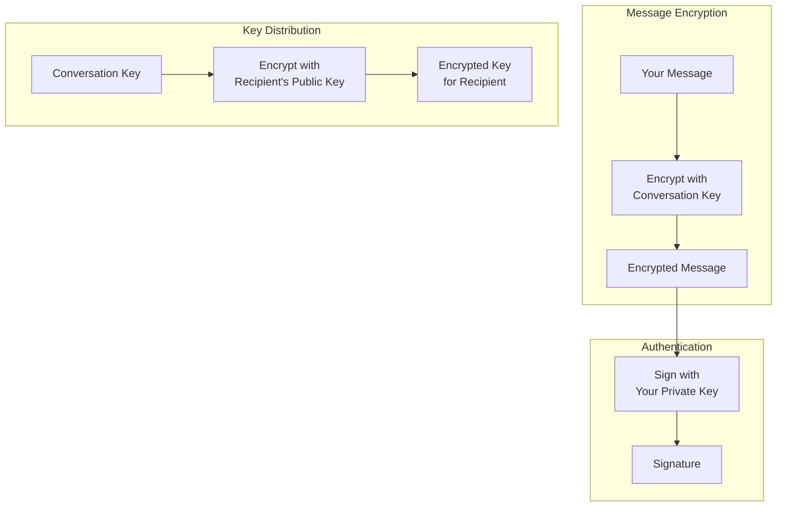
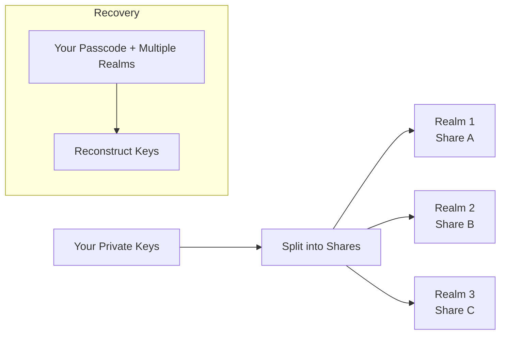

import { Button } from '/snippets/button.mdx';

이 입문서는 X Chat 이면의 암호화 아이디어를 개념적 수준에서 설명합니다. 앱을 구축하기 위해 이 정도의 깊이가 필요한 것은 아니며—[Chat XDK](/ko/xchat/xchat-xdk)가 암호화, 복호화, 서명, 키 저장을 대신 수행합니다—하지만 이 멘탈 모델은 앱을 설계하거나 동작을 디버깅할 때 도움이 됩니다.

구현할 준비가 되면 전체 안내를 위해 [시작하기](/ko/xchat/getting-started)를 사용하고, 개별 경로에 대해서는 사이드바의 [API 레퍼런스](/x-api/chat/get-chat-conversations)를 참고하세요.

<Note>
**이 암호화를 직접 구현하지 않습니다.** Chat XDK가 처리합니다. 이 페이지는 API 체크리스트가 아니라 이해를 위한 것입니다.
</Note>

---

## 전체 그림

X Chat은 계층화된 암호화 시스템을 사용합니다:

1. **메시지**는 **대화 키**로 암호화됩니다(빠른 대칭 암호화).
2. **대화 키**는 각 참여자의 **아이덴티티 공개 키**를 사용해 암호화됩니다(비대칭 키 교환).
3. **메시지는 서명 키**로 **서명**되어, 수신자가 발신자를 확인하고 내용이 변경되지 않았음을 검증할 수 있습니다.

대칭 암호화는 많은 메시지 트래픽에 효율적이며, 비대칭 암호화는 주로 대화 키를 안전하게 **배포**하는 데 사용됩니다.

제품 흐름에서 X가 전달하는 것은 **암호문과 키 봉투**이며, 읽을 수 있는 메시지 내용이나 원시 대화 키가 아닙니다. 앱은 암호화를 위해 Chat XDK를 사용하고, 키 등록 및 암호화된 페이로드 송수신을 위해 [Chat API](/ko/xchat/introduction)(Python/TypeScript의 XDK 또는 HTTPS 통해)를 사용합니다. 이 구성 요소들이 어떻게 맞물리는지는 [시작하기](/ko/xchat/getting-started)를 참고하세요.

---

## 키 유형 설명

X Chat은 세 가지 종류의 키 자료를 사용하며 각각 특정 목적이 있습니다.

### 1. 아이덴티티 키쌍

**목적:** 사용자 간에 대화 키를 안전하게 교환

| 구성 요소 | 설명 |
|:----------|:------------|
| **아이덴티티 공개 키** | 타인과 공유; 대화 키를 *당신에게* 암호화하는 데 사용 |
| **아이덴티티 개인 키** | 비밀로 유지; *당신에게* 보내진 대화 키를 복호화하는 데 사용 |

누군가 당신을 대화에 추가할 때, 그들은 당신의 아이덴티티 공개 키로 대화 키를 암호화합니다. 오직 당신의 아이덴티티 개인 키만 이를 복호화할 수 있습니다.

공개 절반은 플랫폼의 **공개 키(public-key)** API를 통해 등록 및 조회됩니다(API 레퍼런스의 Encryption keys 참고). 개인 절반은 Chat XDK 안에 남습니다(예: [보안 키 백업](#secure-key-backup-distributed-key-storage) 또는 신중히 보호된 키 blob을 통해).

### 2. 서명 키쌍

**목적:** 메시지를 당신이 작성했음을 증명

| 구성 요소 | 설명 |
|:----------|:------------|
| **서명 공개 키** | 타인과 공유; 당신의 서명을 검증하는 데 사용 |
| **서명 개인 키** | 비밀로 유지; 메시지에 서명하는 데 사용 |

메시지를 보낼 때 서명 개인 키로 서명이 이루어집니다. 수신자는 당신의 서명 공개 키(공개 키 API를 통해 게시된)를 사용하여 검증합니다. Chat XDK는 메시지를 암호화하는 과정의 일부로 서명하고, 발신자의 공개 키 자료를 제공하면 복호화 시 검증도 수행합니다.

### 3. 대화 키

**목적:** 특정 대화 내에서 메시지(및 [미디어](/ko/xchat/media))를 암호화하고 복호화

| 속성 | 설명 |
|:---------|:------------|
| **대칭** | 동일한 키로 암호화와 복호화 수행 |
| **대화별** | 각 대화는 자체 키를 가짐 |
| **참여자 간 공유** | 대화를 읽어야 하는 모든 참여자가 사본을 보유 |
| **버전 관리** | 키는 순환될 수 있으며, 앱은 시간에 따른 버전을 추적해야 함 |

대화 키는 대화가 설정되거나 키가 순환될 때 생성됩니다. 각 참여자는 자신의 아이덴티티 공개 키로 만들어진 **암호화된 사본**을 받습니다. 자신의 사본을 한 번 복호화한 후에는 **원시** 대화 키를 보관하고 이를 빠른 메시지(및 [미디어](/ko/xchat/media)) 암호화에 사용합니다. 대화를 위한 이러한 사본 설정은 Chat XDK와 대화 **키** 엔드포인트를 함께 사용하여 수행되며, 자세한 내용은 [시작하기](/ko/xchat/getting-started#4-set-up-conversation-keys)에 있습니다.

---

## 암호화 동작 방식(개념적)

### 메시지 보내기

<Steps>
  <Step title="평문으로 시작">
    "안녕, 어떻게 지내?"라고 입력합니다.
  </Step>
  <Step title="대화 키 가져오기">
    앱은 해당 채팅의 원시 대화 키(설정 시 또는 이전 키 배포 이벤트에서 얻은)를 올바른 키 버전으로 사용합니다.
  </Step>
  <Step title="메시지 암호화">
    Chat XDK가 대화 키로 메시지를 암호화합니다. 결과는 그 키 없이는 쓸모없는 암호문입니다.
  </Step>
  <Step title="메시지 서명">
    Chat XDK가 서명 개인 키로 암호화된 페이로드에 서명하여, 당신이 정확히 이 내용을 작성했음을 증명합니다.
  </Step>
  <Step title="X로 전송">
    앱은 Chat API의 **send message** 엔드포인트를 통해 암호화된 페이로드와 서명을 X로 전송합니다. X는 평문으로는 읽을 수 없는 바이트를 저장하고 전달합니다.
  </Step>
</Steps>

### 메시지 받기

<Steps>
  <Step title="암호화된 데이터 수신">
    앱은 [웹훅 또는 활동 스트림](/ko/xchat/real-time-events)을 통해, 혹은 히스토리를 위해 대화 **events**를 읽어 X로부터 암호문을 받습니다.
  </Step>
  <Step title="대화 키 가져오기">
    캐시된 원시 키를 사용하거나, 새롭거나 순환된 경우 키 배포(키 변경) 이벤트에서 자신의 사본을 복호화하여 얻습니다.
  </Step>
  <Step title="서명 검증">
    Chat XDK가 발신자의 서명 공개 키(및 관련 아이덴티티 바인딩)를 사용해 서명을 확인하므로, 누가 보냈고 변조되지 않았음을 알 수 있습니다.
  </Step>
  <Step title="메시지 복호화">
    Chat XDK가 대화 키로 복호화합니다. 이제 "안녕, 어떻게 지내?"를 읽을 수 있습니다.
  </Step>
</Steps>

암호화, 전송, 수신, 복호화의 구현은 [시작하기](/ko/xchat/getting-started)와 [Chat XDK](/ko/xchat/xchat-xdk) 레퍼런스에 있습니다.

---

## 키 배포 설명

종단 간 암호화의 핵심 과제는 **키 배포**입니다: 참여자들이 X(또는 관찰자)가 평문으로 그 키를 볼 수 **없이** 어떻게 대화 키를 얻는가입니다.

### 초기 키 설정

메시징을 위해 대화가 준비될 때:

1. Chat XDK가 임의의 대화 키를 생성합니다
2. Chat XDK가 그 키를 **각 참여자의 아이덴티티 공개 키**로 암호화합니다
3. 앱이 그 암호화된 사본들을 X의 Chat API를 통해 게시합니다
4. 각 참여자는 자신의 아이덴티티 개인 키로 **자신의** 사본을 (Chat XDK 안에서) 복호화합니다

X는 오직 **감싼(wrapped)** 사본만 다루며, 원시 대화 키는 다루지 않습니다.

### 키 변경 이벤트

대화 키가 순환될 때(예: 멤버십이 변경될 때) 참여자들은 각 멤버에 대한 새 암호화된 사본이 포함된 **키 변경** 이벤트를 받습니다.

앱은 다음을 수행해야 합니다:

1. 실시간 이벤트 또는 대화 히스토리에서 키 변경 자료를 감지
2. 새 대화 키(및 버전)를 복호화하고 저장
3. 이후 전송에는 최신 버전 사용

[시작하기](/ko/xchat/getting-started#6-receive-and-decrypt)와 [실시간 이벤트](/ko/xchat/real-time-events)에서 이러한 이벤트가 실제로 어디에 나타나는지를 설명합니다.

---

## 보안 키 백업: 분산 키 저장소

**개인** 아이덴티티 및 서명 키는 신중하게 저장되어야 합니다. X Chat에는 어떤 단일 서버에도 전체 비밀을 주지 않고, 기기 간 패스코드로 키를 복구할 수 있도록 하는 **보안 키 백업** 시스템이 포함되어 있습니다.

### 전통적인 키 저장소의 문제점

| 접근 방식 | 문제점 |
|:---------|:--------|
| 기기에만 저장 | 기기를 잃으면 키를 잃고 = 메시지 기록에 접근 불가 |
| 일반 클라우드 백업에 저장 | 제공자가 키 자료에 접근할 수 있음 |
| 긴 키를 기억 | 사람은 고엔트로피 키를 안정적으로 기억할 수 없음 |

### 보안 키 백업이 해결하는 방법

보안 키 백업은 **비밀 공유(secret sharing)**와 **패스코드 보호**를 결합합니다:

1. 개인 키가 **여러 조각(share)로 분할**됩니다
2. 조각들은 **독립된 realm**(별개 서버)이 보관합니다
3. **어떤 단일 realm**도 단독으로 키를 재구성하기에 충분한 정보를 갖지 않습니다
4. 복구는 **패스코드**와 **충분한 수의 realm** 협조가 필요합니다
5. 잘못된 패스코드는 추측을 지연시키기 위해 **속도 제한**됩니다

단일 당사자가 전체 비밀을 보유하지 않으면서도 복구 가능성(새 기기 + 패스코드)을 얻을 수 있습니다.

<Note>
일반 경로에서는 키 백업 서버를 손수 구성하지 않습니다. Chat XDK에 백업 클라이언트가 포함되어 있으며, realm 구성은 공개 키 레코드의 **`juicebox_config`** 필드로 X API에서 제공됩니다. 최초 패스코드 저장 및 이후 잠금 해제는 Chat XDK 호출입니다—시작하기의 [기존 키로 초기화](/ko/xchat/getting-started#2-initialize-the-chat-xdk-with-existing-keys) 및 [키 생성 및 등록](/ko/xchat/getting-started#3-create-and-register-keys-first-time-setup)을 참고하세요. 일부 앱(특히 서버와 봇)은 보안 키 백업 대신 내보낸 키 blob을 사용합니다. 그 자료는 비밀번호처럼 보호하세요.
</Note>

---

## 서명 설명

모든 X Chat 메시지에는 다음을 지원하는 **디지털 서명**이 포함됩니다:

1. **진위성** — 발신자의 서명 개인 키로 생성되었음
2. **무결성** — 서명 후 암호화된 내용이 수정되지 않았음

### 서명 동작 방식(개념적)

| 동작 | 사용된 키 | 결과 |
|:-------|:---------|:-------|
| **서명** | 발신자의 서명 개인 키 | 정확히 이 암호화된 메시지에 결합된 서명 |
| **검증** | 발신자의 서명 공개 키 | 서명이 메시지 및 키와 일치함을 확인 |

서명 대상 자료 중 하나라도 변경되면 검증에 실패합니다. 오직 서명 개인 키를 가진 사람만이 해당 키에 대한 유효한 서명을 생성할 수 있습니다.

### 앱에서

Chat XDK는 발신 메시지를 암호화할 때 서명하며, 수신 메시지를 복호화할 때 (공개 키 API에서 얻은) 발신자의 공개 키 자료에 대해 검증합니다. 검증은 기본적으로 **필수**입니다: SDK는 명시적으로 검사를 비활성화하지 않는 한(권장하지 않음) 검증되지 않은 서명 이벤트를 거부합니다. 자세한 내용은 [Chat XDK](/ko/xchat/xchat-xdk) 레퍼런스에 있습니다.

서명은 인용된 내용에도 적용됩니다. 답장은 인용하는 원본 **서명된** 메시지를 원시 형태로 포함합니다. Chat XDK가 답장을 복호화할 때 그 포함된 원본을 검증하고 인용을 이에 대조하여 결과를 `reply_preview_validation`(`Valid` / `Invalid`)으로 보고합니다. `Invalid` 결과는 인용이 서명된 원본과 일치하지 않는다는 의미입니다—답장 자체는 별도로 검증되지만, 인용된 자료는 신뢰할 수 없는 것으로 취급하세요—따라서 어떤 참여자도 다른 사람에게 조작된 말을 귀속시킬 수 없습니다.

### 서명된 상태 변경(액션 서명)

메시지만이 서명 대상은 아닙니다. 대화 상태를 변경하는 모든 호출—대화 키 추가 또는 순환, 그룹 생성, 멤버 추가—은 하나 이상의 **액션 서명(action signature)**을 포함해야 합니다: 발신자는 변경 사항이 정확히 무엇을 하는지를 기술하는 페이로드에 서명하며(키 변경의 경우 그 페이로드에는 새로운 대화 키 자체가 포함됨), 서명이 없거나 잘못된 형식이면 API는 요청을 거부합니다.

서버는 평문 대화 키를 결코 보관하지 않으므로 키 변경의 서명을 암호학적으로 검사할 수 없습니다. 서버는 서명된, 인코딩된 변경 설명이 수신한 요청과 일치하는지를 검증합니다. **암호학적** 검사는 경계에서 이루어집니다: 각 수신자의 Chat XDK가 키 변경 이벤트를 복호화할 때 발신자의 서명 공개 키에 대해 서명을 검증합니다. Chat XDK의 `prepare` 메서드가 이러한 서명을 생성해 줍니다—그룹 생성과 멤버 추가는 **두 개**를 반환하며(키 변경과 그룹 액션), 둘 모두를 전송해야 합니다.

서명은 이벤트 내용에 결합되어 있으며 불변입니다: 서명이 검증되지 않는 이벤트는 결코 나중에 유효해질 수 없습니다. 이를 어떻게 다룰지는 [문제 해결](/ko/xchat/troubleshooting)을 참고하세요.

---

## 보안 속성

### X Chat이 방어하는 위협

| 위협 | 보호 |
|:-------|:-----------|
| **X가 메시지 본문을 읽음** | 내용은 X로 전송되기 전에 암호화됨 |
| **네트워크 도청자** | 전송 계층 보안과 종단 간 암호화된 내용 |
| **메시지 변조** | 서명이 수정을 감지 |
| **간단한 발신자 위장** | 유효한 서명은 발신자의 서명 개인 키가 필요 |
| **단일 서버 키 도난(보안 키 백업 사용 시)** | 조각들이 realm 간에 분할되고 패스코드로 보호 |

### X Chat이 **방어하지 않는** 위협

| 위협 | 이유 |
|:-------|:--------|
| **손상된 기기** | 잠금 해제된 클라이언트에서 평문과 키가 노출될 수 있음 |
| **메타데이터** | X는 누가 누구에게 언제 메시지를 보냈는지 알 수 있음—메시지 텍스트는 아님 |
| **전방향 비밀성(forward secrecy)** | 아이덴티티 키가 손상되면 그 키로 감싸진 대화 키가 노출될 수 있음 |
| **포스트-컴프로마이즈 보안** | 키 순환은 히스토리를 다시 쓰지 않음 |

---

## 용어집

| 용어 | 정의 |
|:-----|:-----------|
| **대칭 암호화** | 동일 키로 암호화와 복호화(메시지와 미디어 스트림에 사용) |
| **비대칭 암호화** | 암호화와 복호화에 서로 다른 키(대화 키 교환에 사용) |
| **공개 키** | 공유해도 안전; 누군가에게 *암호화*하거나 그들의 서명을 검증할 때 사용 |
| **개인 키** | 비밀로 유지해야 함; 복호화 또는 서명에 사용 |
| **키쌍** | 연결된 공개 키와 개인 키 |
| **ECDH / ECIES** | 아이덴티티 키를 통해 대화 키를 교환할 때 사용되는 알고리즘 |
| **ECDSA** | 메시지 작성 증명에 사용되는 서명 알고리즘 |
| **P-256** | X Chat에서 사용되는 타원 곡선(secp256r1) |
| **대화 키** | 하나의 대화에서 참여자들이 공유하는 대칭 키(시간에 따라 버전 관리됨) |
| **비밀 공유** | 재구성을 위해 여러 조각이 필요하도록 비밀을 분할 |
| **Realm** | 키 자료의 한 조각을 보관하는 독립된 보안 키 백업 서버 |

---

## 다음 단계

<CardGroup cols={2}>
  <Card title="시작하기" icon="rocket" href="/ko/xchat/getting-started">
    키, 전송, 수신을 단계별로 구현하기
  </Card>
  <Card title="Chat XDK 레퍼런스" icon="code" href="/ko/xchat/xchat-xdk">
    암호화 SDK 메서드와 타입
  </Card>
  <Card title="소개" icon="book" href="/ko/xchat/introduction">
    제품 개요 및 아키텍처
  </Card>
  <Card title="실시간 이벤트" icon="bolt" href="/ko/xchat/real-time-events">
    암호화된 이벤트가 전달되는 방식
  </Card>
</CardGroup>
