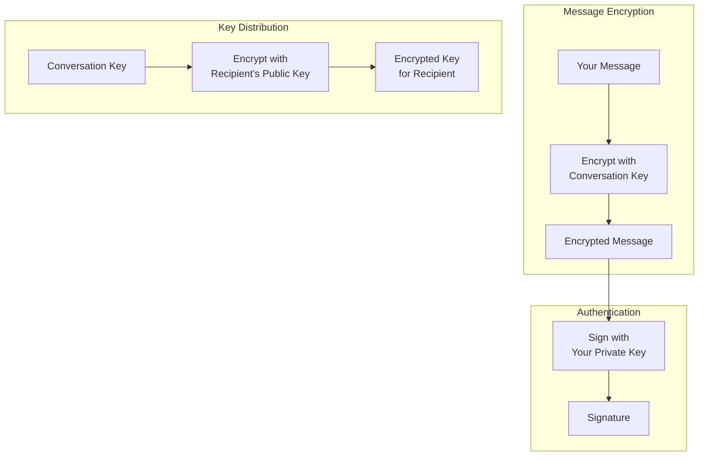
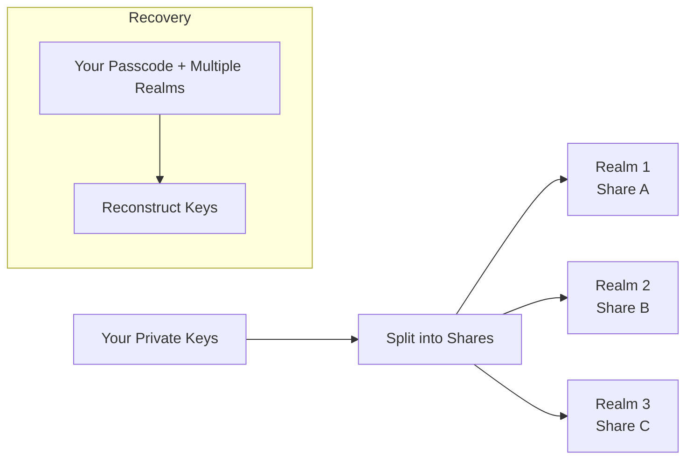

import { Button } from '/snippets/button.mdx';

이 기초 문서는 X Chat의 뒤에 있는 암호화 아이디어를 개념적 수준에서 설명합니다. 개발을 위해 이 정도의 깊이가 반드시 필요한 것은 아닙니다—[Chat XDK](/xchat/xchat-xdk)가 암호화, 복호화, 서명, 키 저장을 대신 수행합니다—하지만 앱을 설계하거나 동작을 디버그할 때 이러한 멘탈 모델이 도움이 됩니다.

구현할 준비가 되면 전체 안내를 위해 [시작하기](/xchat/getting-started)를, 개별 경로를 위해 사이드바의 [API 참조](/x-api/chat/get-chat-conversations)를 사용하세요.

<Note>
**이 암호화를 직접 구현하지 않습니다.** Chat XDK가 처리합니다. 이 페이지는 이해를 위한 것이며 API 체크리스트가 아닙니다.
</Note>

---

## 큰 그림

X Chat은 계층화된 암호화 시스템을 사용하며, 다음과 같이 동작합니다:

1. **메시지**는 **대화 키**로 암호화됩니다 (빠른 대칭 암호화)
2. **대화 키**는 각 참가자의 **신원 공개 키**로 암호화됩니다 (비대칭 키 교환)
3. **메시지는** **서명 키**로 **서명**되어 수신자가 누가 보냈는지, 그리고 변조되지 않았는지 검증할 수 있습니다

대칭 암호화는 대량의 메시지 트래픽에 효율적이며, 비대칭 암호화는 주로 대화 키를 **안전하게 배포**하는 데 사용됩니다.

제품 흐름상 X는 읽을 수 있는 메시지 내용이나 원시 대화 키가 아닌 **암호문과 키 봉투**를 전송합니다. 앱은 암호화에 Chat XDK를, 키 등록 및 이 암호화된 페이로드의 송수신에는 [Chat API](/xchat/introduction)(Python/TypeScript의 XDK 또는 HTTPS 사용)를 사용합니다. 이러한 구성 요소가 어떻게 조합되는지는 [시작하기](/xchat/getting-started)를 참조하세요.

---

## 키 유형 설명

X Chat은 각각 특정한 목적을 가진 세 가지 유형의 키 재료를 사용합니다.

### 1. 신원 키페어

**용도:** 사용자 간에 대화 키를 안전하게 교환

| 구성 요소 | 설명 |
|:----------|:------------|
| **신원 공개 키** | 다른 사람과 공유되며, 대화 키를 사용자에게 *암호화*하는 데 사용됩니다 |
| **신원 개인 키** | 비밀로 유지되며, 사용자에게 전송된 대화 키를 복호화하는 데 사용됩니다 |

누군가 사용자를 대화에 추가하면 사용자의 신원 공개 키를 사용하여 대화 키를 암호화합니다. 오직 사용자의 신원 개인 키만이 이를 복호화할 수 있습니다.

공개 키는 플랫폼의 **공개 키** API를 통해 등록 및 조회됩니다 (API 참조의 암호화 키 참조). 개인 키는 Chat XDK 내부에 유지됩니다 (예: [보안 키 백업](#보안-키-백업-분산-키-저장) 또는 신중하게 보호된 키 blob).

### 2. 서명 키페어

**용도:** 메시지를 사용자가 작성했음을 증명

| 구성 요소 | 설명 |
|:----------|:------------|
| **서명 공개 키** | 다른 사람과 공유되며, 사용자의 서명을 검증하는 데 사용됩니다 |
| **서명 개인 키** | 비밀로 유지되며, 사용자의 메시지에 서명하는 데 사용됩니다 |

메시지를 보내면 사용자의 서명 개인 키로 서명됩니다. 수신자는 사용자의 서명 공개 키(공개 키 API를 통해서도 게시됨)를 사용하여 검증합니다. Chat XDK는 메시지를 암호화하는 과정에서 서명하며, 발신자의 공개 키 자료를 제공하면 복호화 시 검증할 수 있습니다.

### 3. 대화 키

**용도:** 특정 대화 내에서 메시지(및 미디어)를 암호화 및 복호화

| 속성 | 설명 |
|:---------|:------------|
| **대칭** | 동일한 키로 암호화 및 복호화 |
| **대화별** | 각 대화마다 자체 키가 있음 |
| **참가자 간 공유** | 대화를 읽어야 하는 모든 참가자가 사본을 가짐 |
| **버전 관리됨** | 키는 교체될 수 있으며, 앱은 시간 경과에 따라 버전을 추적해야 함 |

대화 키는 대화가 설정될 때 또는 키가 교체될 때 생성됩니다. 각 참가자는 자신의 신원 공개 키로 만들어진 **암호화된 사본**을 받습니다. 자신의 사본을 한 번 복호화하면 **원시** 대화 키를 보관해 두고 빠른 메시지 (및 [미디어](/xchat/media)) 암호화에 사용합니다. 대화의 이러한 사본 설정은 Chat XDK와 대화 **키** 엔드포인트를 함께 사용하여 수행되며, [시작하기](/xchat/getting-started#4-set-up-conversation-keys)에서 자세히 다룹니다.

---

## 암호화가 개념적으로 작동하는 방식

### 메시지 보내기

<Steps>
  <Step title="평문에서 시작">
    "Hello, how are you?"라고 입력합니다.
  </Step>
  <Step title="대화 키 가져오기">
    앱은 이 채팅의 원시 대화 키(설정 또는 이전 키 배포 이벤트로부터)를 올바른 키 버전으로 사용합니다.
  </Step>
  <Step title="메시지 암호화">
    Chat XDK가 대화 키로 메시지를 암호화합니다. 결과는 해당 키 없이는 쓸모없는 암호문입니다.
  </Step>
  <Step title="메시지 서명">
    Chat XDK가 사용자의 서명 개인 키로 암호화된 페이로드에 서명하여, 사용자가 이 정확한 내용을 작성했음을 증명합니다.
  </Step>
  <Step title="X로 전송">
    앱은 암호화된 페이로드와 서명을 Chat API의 **메시지 전송** 엔드포인트를 통해 X로 보냅니다. X는 평문으로 읽을 수 없는 바이트를 저장하고 전달합니다.
  </Step>
</Steps>

### 메시지 받기

<Steps>
  <Step title="암호화된 데이터 수신">
    앱은 [웹훅 또는 활동 스트림](/xchat/real-time-events)을 통해, 또는 이력을 위한 대화 **이벤트**를 읽어 X로부터 암호문을 수신합니다.
  </Step>
  <Step title="대화 키 가져오기">
    캐시된 원시 키를 사용하거나, 이것이 신규이거나 교체된 경우 키 배포(키 변경) 이벤트에서 사본을 복호화하여 획득합니다.
  </Step>
  <Step title="서명 검증">
    Chat XDK가 발신자의 서명 공개 키(및 관련 신원 바인딩)를 사용하여 서명을 확인하므로, 누가 보냈고 수정되지 않았음을 알 수 있습니다.
  </Step>
  <Step title="메시지 복호화">
    Chat XDK가 대화 키로 복호화합니다. 이제 "Hello, how are you?"를 읽을 수 있습니다.
  </Step>
</Steps>

암호화, 전송, 수신, 복호화 구현은 [시작하기](/xchat/getting-started)와 [Chat XDK](/xchat/xchat-xdk) 참조에 있습니다.

---

## 키 배포 설명

종단 간 암호화의 핵심 과제는 **키 배포**입니다. 즉, X(또는 관찰자)가 해당 키를 평문으로 볼 수 **없도록** 참가자가 어떻게 대화 키를 얻는가입니다.

### 초기 키 설정

메시지 전달을 위해 대화가 준비될 때:

1. 임의의 대화 키가 (Chat XDK 내에서) 생성됩니다
2. **각 참가자**에 대해 해당 키는 참가자의 **신원 공개 키**로 암호화됩니다
3. 이 암호화된 사본은 X의 Chat API를 통해 저장 및 전송됩니다
4. 각 참가자는 (Chat XDK 내에서) 자신의 신원 개인 키로 **자신의** 사본을 복호화합니다

X는 원시 대화 키가 아닌 **래핑된** 사본만 처리합니다.

### 키 변경 이벤트

대화 키가 교체되면(예: 멤버십이 변경될 때) 참가자는 각 멤버에 대한 새로운 암호화된 사본과 함께 **키 변경** 이벤트를 수신합니다.

앱은 다음을 수행해야 합니다:

1. 실시간 이벤트 또는 대화 이력에서 키 변경 자료를 감지
2. 새 대화 키(및 버전)를 복호화하고 저장
3. 이후 전송에는 최신 버전을 사용

[시작하기](/xchat/getting-started#6-receive-and-decrypt)와 [실시간 이벤트](/xchat/real-time-events)는 이러한 이벤트가 실제로 어디에 나타나는지 설명합니다.

---

## 보안 키 백업: 분산 키 저장

**개인** 신원 및 서명 키는 신중하게 저장되어야 합니다. X Chat에는 **보안 키 백업** 시스템(Juicebox로 구현됨)이 포함되어 있어, 어떤 단일 서버에도 전체 비밀을 제공하지 않고도 여러 기기에서 패스코드로 키를 복구할 수 있습니다.

### 전통적인 키 저장의 문제

| 접근 방식 | 문제 |
|:---------|:--------|
| 기기에만 저장 | 기기 분실 = 키 분실 = 메시지 이력 접근 상실 |
| 일반 클라우드 백업에 저장 | 공급자가 키 자료에 접근할 수 있음 |
| 긴 키를 기억 | 사람은 엔트로피가 높은 키를 안정적으로 기억할 수 없음 |

### 보안 키 백업의 해결 방식

보안 키 백업은 **비밀 공유**와 **패스코드 보호**를 결합합니다:

1. 개인 키는 **여러 조각으로 나뉩니다**
2. 조각은 **독립적인 realm**(별도의 서버)에 보관됩니다
3. **어떤 단일 realm**도 혼자서 키를 재구성할 충분한 정보를 갖지 않습니다
4. 복구에는 사용자의 **패스코드**와 **충분한 realm**의 협력이 필요합니다
5. 잘못된 패스코드는 추측을 늦추기 위해 **속도 제한**됩니다

단일 주체가 전체 비밀을 보유하지 않고도 복구 가능성(새 기기 + 패스코드)을 얻을 수 있습니다.

<Note>
일반적인 경로에서는 키 백업 서버를 직접 구성하지 않습니다. Chat XDK에는 백업 클라이언트가 포함되어 있으며, realm 구성은 공개 키 레코드의 **`juicebox_config`**로 X API에서 반환됩니다 (이 필드 이름은 기반 구현인 Juicebox에서 따온 것입니다). 최초 패스코드 저장과 이후 잠금 해제는 Chat XDK 호출입니다—시작하기의 [기존 키로 초기화](/xchat/getting-started#2-initialize-the-chat-xdk-with-existing-keys) 및 [키 생성 및 등록](/xchat/getting-started#3-create-and-register-keys-first-time-setup)을 참조하세요. 일부 앱(특히 서버와 봇)은 보안 키 백업 대신 내보낸 키 blob을 사용합니다. 그 자료는 비밀번호처럼 보호하세요.
</Note>

---

## 서명 설명

모든 X Chat 메시지에는 다음을 지원하는 **디지털 서명**이 포함됩니다:

1. **진위성** — 발신자의 서명 개인 키로 생성되었음
2. **무결성** — 서명 후에 암호화된 내용이 수정되지 않았음

### 서명이 개념적으로 작동하는 방식

| 동작 | 사용된 키 | 결과 |
|:-------|:---------|:-------|
| **서명** | 발신자의 서명 개인 키 | 이 정확한 암호화된 메시지에 바인딩된 서명 |
| **검증** | 발신자의 서명 공개 키 | 서명이 메시지 및 키와 일치함을 확인 |

서명된 자료의 무엇이든 변경되면 검증이 실패합니다. 오직 서명 개인 키를 가진 사람만이 해당 키에 대한 유효한 서명을 생성할 수 있습니다.

### 앱에서

Chat XDK는 발신 메시지를 암호화할 때 서명하고, 수신 메시지를 복호화할 때 발신자의 공개 키 자료(공개 키 API에서 가져옴)로 검증합니다. 검증은 **기본적으로 필수**입니다: 명시적으로 검사를 비활성화(권장하지 않음)하지 않는 한 SDK는 검증되지 않은 서명 이벤트를 거부합니다. 세부 사항은 [Chat XDK](/xchat/xchat-xdk) 참조에 있습니다.

### 서명된 상태 변경 (action signatures)

메시지만 서명되는 자료가 아닙니다. 대화 상태를 변경하는 모든 호출(대화 키 추가 또는 교체, 그룹 생성, 멤버 추가)에는 하나 이상의 **action signatures**가 포함되어야 합니다: 발신자는 변경 사항이 정확히 무엇을 하는지 설명하는 페이로드에 서명하고(키 변경의 경우 이 페이로드에는 새 대화 키 자체가 포함됨), API는 서명이 누락되거나 잘못된 형식이면 요청을 거부합니다.

서버는 평문 대화 키를 보유하지 않으므로 키 변경의 서명을 암호학적으로 검사할 수 없습니다. 대신 서명된, 인코딩된 변경 설명이 받은 요청과 일치하는지 검증합니다. **암호학적** 검사는 가장자리에서 발생합니다: 각 수신자의 Chat XDK가 키 변경 이벤트를 복호화할 때 발신자의 서명 공개 키에 대해 서명을 검증합니다. Chat XDK의 `prepare` 메서드는 이러한 서명을 자동으로 생성합니다—그룹 생성 및 멤버 추가는 **두 개**(키 변경과 그룹 액션)를 반환하며, 둘 다 전송되어야 합니다.

서명은 이벤트 내용에 바인딩되며 불변입니다: 서명이 검증되지 않는 이벤트는 나중에 유효해질 수 없습니다. 처리 방법은 [문제 해결](/xchat/troubleshooting)을 참조하세요.

---

## 보안 속성

### X Chat이 방어하는 것

| 위협 | 보호 |
|:-------|:-----------|
| **X가 메시지 본문을 읽는 것** | 콘텐츠는 X로 전송되기 전에 암호화됩니다 |
| **네트워크 도청자** | 전송 보안과 종단 간 암호화된 콘텐츠 |
| **메시지 변조** | 서명이 수정을 감지합니다 |
| **사소한 발신자 사칭** | 유효한 서명에는 발신자의 서명 개인 키가 필요합니다 |
| **단일 서버 키 도난 (보안 키 백업 사용 시)** | 조각이 realm 전체에 분산되고 패스코드로 보호됩니다 |

### X Chat이 방어하지 **않는** 것

| 위협 | 이유 |
|:-------|:--------|
| **손상된 기기** | 잠금 해제된 클라이언트에서 평문과 키가 노출될 수 있습니다 |
| **메타데이터** | X는 누가 누구에게 언제 메시지를 보냈는지 알 수 있습니다—메시지 텍스트는 알지 못합니다 |
| **순방향 비밀성** | 신원 키의 손상은 그 키로 래핑된 대화 키를 노출할 수 있습니다 |
| **손상 후 보안** | 키를 교체해도 이력을 다시 쓰지는 않습니다 |

---

## 용어집

| 용어 | 정의 |
|:-----|:-----------|
| **대칭 암호화** | 동일한 키로 암호화 및 복호화 (메시지 및 미디어 스트림에 사용) |
| **비대칭 암호화** | 암호화와 복호화를 위한 서로 다른 키 (대화 키 래핑에 사용) |
| **공개 키** | 공유해도 안전; 누군가에게 *암호화*하거나 그들의 서명을 검증하는 데 사용 |
| **개인 키** | 비밀로 유지되어야 함; 복호화 또는 서명에 사용 |
| **키페어** | 연결된 공개 키와 개인 키 |
| **ECDH / ECIES** | 대화 키를 신원 키로 래핑할 때 사용되는 알고리즘 |
| **ECDSA** | 메시지 작성자 확인에 사용되는 서명 알고리즘 |
| **P-256** | X Chat에서 사용되는 타원 곡선 (secp256r1) |
| **대화 키** | 하나의 대화 참가자가 공유하는 대칭 키 (시간 경과에 따라 버전 관리됨) |
| **비밀 공유** | 재구성하기 위해 여러 조각이 필요하도록 비밀을 분할하는 것 |
| **Realm** | 키 자료의 한 조각을 보관하는 독립적인 보안 키 백업 서버 |

---

## 다음 단계

<CardGroup cols={2}>
  <Card title="시작하기" icon="rocket" href="/xchat/getting-started">
    단계별로 키 구현, 전송, 수신
  </Card>
  <Card title="Chat XDK 참조" icon="code" href="/xchat/xchat-xdk">
    암호화 SDK 메서드 및 타입
  </Card>
  <Card title="소개" icon="book" href="/xchat/introduction">
    제품 개요 및 아키텍처
  </Card>
  <Card title="실시간 이벤트" icon="bolt" href="/xchat/real-time-events">
    암호화된 이벤트가 전달되는 방식
  </Card>
</CardGroup>
