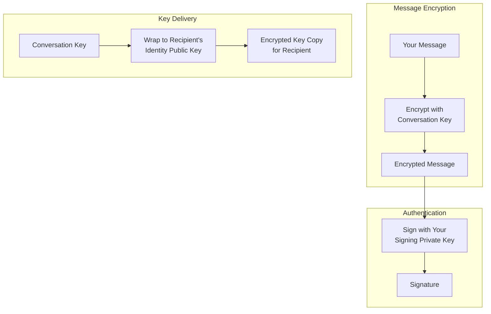
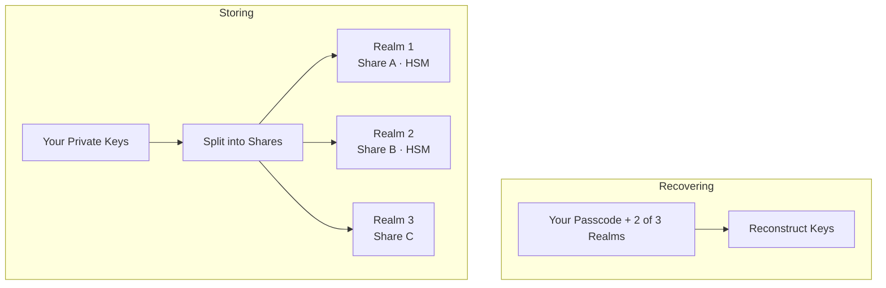

X Chat은 종단 간 암호화되어 있습니다. 사용자의 메시지는 평문 형태로는 오직 사용자의 기기에만 존재합니다. 이 페이지는 그 동작 방식을 설명합니다.

<Note>
**이 페이지는 참고용입니다. 앱을 구축하기 위해 이 지식이 반드시 필요하지는 않습니다([Chat XDK](/xchat/xchat-xdk)가 여기의 모든 작업을 대신 수행합니다).**
</Note>

---

## 전체 그림

계정 생성부터 메시지 송수신에 이르는 전체 흐름을 살펴보겠습니다.

<Steps>
  <Step title="계정 생성">
    이 단계에서 Chat XDK는 사용자의 기기에서 두 개의 키페어를 생성합니다:

    - 비밀을 수신하기 위한 **아이덴티티 키페어(identity keypair)**
    - 작성자임을 증명하기 위한 **서명 키페어(signing keypair)**

    개인 키 부분은 [보안 키 백업](#secure-key-backup-distributed-key-storage)으로 전달되며, 이는 뒤에서 자세히 설명합니다. 여기서 중요한 점은 이 키들이 오직 사용자의 패스코드로만 복구 가능하다는 것입니다. X는 이를 복구할 수 없습니다.

    공개 키 부분은 아이덴티티 키와 서명 키를 서로 묶는 서명과 함께 **public key** API를 통해 X 백엔드에 게시됩니다.
  </Step>
  <Step title="대화 생성">
    사용자에게 메시지를 보내려면, 발신자는 메시지를 암호화할 대칭 키인 새로운 **대화 키(conversation key)**를 생성합니다.

    발신자는 X 백엔드에서 사용자의 공개 키를 가져와 서명을 검증한 후, 사용자의 아이덴티티 키로 대화 키를 암호화합니다.

    이것은 공개 키 암호화의 결정적 특성입니다. 누구나 사용자의 공개 키로 암호화할 수 있지만, **오직 사용자의 개인 키만이 복호화할 수 있으며, 그 키는 사용자만이 보유합니다**. 따라서 X는 암호화된 사본을 저장하고 전달할 수는 있지만 결코 열어볼 수 없습니다. (사용된 정확한 방식은 [용어집](#glossary)을 참고하세요.)

    왜 메시지를 사용자의 공개 키로 직접 암호화하지 않을까요? 속도 때문입니다. 공개 키 암호화는 대칭 키 암호화보다 훨씬 비용이 크므로, 키를 교환하면 이후 메시지들의 효율성이 높아집니다.
  </Step>
  <Step title="메시징">
    누군가 사용자에게 메시지를 보내면, 사용자는 아이덴티티 공개 키로 암호화된 대화 키와, 그 대화 키로 암호화된 메시지들을 받게 됩니다.

    사용자는 아이덴티티 개인 키로 대화 키를 복호화하고(다시 강조하지만, 이 키는 오직 사용자만 보유합니다), 얻어낸 대화 키로 메시지를 복호화합니다.

    이따금 여러 이유로 대화의 키가 회전됩니다(새로운 대칭 키가 공유됩니다). 따라서 각 대화 키에는 버전이 있어 참여자들이 항상 올바른 키를 사용하고 있음을 확인할 수 있습니다.
  </Step>
  <Step title="서명">
    암호화는 누구든 사용자에게 메시지를 보낼 수 있고 오직 사용자만 복호화할 수 있게 해줍니다. 서명은 어떤 의미에서 그 반대로, 사용자(그리고 오직 사용자만)가 메시지에 서명할 수 있고, 누구든 그 서명을 검증할 수 있게 해줍니다. 실무적으로 서명에는 개인 키가 필요하며, 검증에는 공개 키를 사용할 수 있습니다.

    X Chat에서는 모든 발신자가 자신의 메시지에 서명합니다. 서명은 누가 메시지에 서명했는지와 서명된 정확한 바이트를 모두 증명하므로, 모든 수신자는 이 메시지가 발신자가 입력한 바로 그 메시지임을 검증할 수 있습니다. 다시 말하지만, XDK가 이를 대신 처리합니다. 세부 사항은 [서명 설명](#signatures-explained)에서 다룹니다.
  </Step>
</Steps>

---

## 종합하기

X Chat은 세 가지 표준 암호화 도구를 조합하며, 각 도구는 자신이 잘하는 한 가지 일을 담당합니다:

1. **대화 키**는 메시지를 암호화합니다. 대칭 방식이며, 모든 메시지 및 미디어 트래픽에 충분히 빠릅니다.
2. **아이덴티티 키페어**는 다른 누구(X 포함)도 볼 수 없도록 각 참가자에게 대화 키를 전달합니다.
3. **서명 키페어**는 작성자를 증명합니다. 모든 메시지는 수신자가 검증하는 서명을 가집니다.

X는 오직 **암호문과 감싸진 키(wrapped keys)**만 전송하고 저장하며, X 자신이 열 수 있는 것은 없습니다. XDK가 암호화를 수행하고, [Chat API](/xchat/introduction)는 키를 등록하고 암호화된 페이로드를 이동시킵니다([시작하기](/xchat/getting-started)).

전체 등장 인물:

| 키 | 누가 보유하는가 | 하는 일 |
|:----|:-------------|:-------------|
| **Identity keypair** | 개인 키 부분: 사용자만. 공개 키 부분: 게시됨 | 감싸진 대화 키를 수신 |
| **Signing keypair** | 개인 키 부분: 사용자만. 공개 키 부분: 게시됨 | 메시지와 상태 변경에 서명. 다른 사람이 검증 |
| **Conversation key** | 한 대화의 모든 참가자 | 메시지와 미디어를 암호화. 버전 관리되며 회전됨 |

---

## 실제 사례

Bob과 Carol이 있는 그룹을 생성할 때 실제로 어떤 일이 일어나는지 살펴보겠습니다.

<Steps>
  <Step title="대화 키 생성">
    XDK가 새로운 랜덤 대화 키를 생성합니다. 지금까지 이 키는 오직 사용자의 기기 메모리에만 존재합니다.
  </Step>
  <Step title="참가자 키 조회 및 검증">
    앱이 X 백엔드에서 Bob과 Carol의 공개 키를 가져와 각 키의 서명을 검증합니다. 서명이 유효하지 않으면 진행을 중단합니다. 검증할 수 없는 키로는 절대 암호화하지 마세요.
  </Step>
  <Step title="각 참가자에게 키 감싸기">
    XDK는 대화 키를 세 번 감쌉니다: Bob의 아이덴티티 공개 키로, Carol의 것으로, 그리고 사용자 자신의 것으로(사용자의 다른 기기에서도 읽을 수 있도록).
  </Step>
  <Step title="변경 사항 서명">
    XDK는 정확히 이 변경 사항—그룹, 그 멤버, 감싸진 키—을 기술하는 페이로드에 서명합니다. 그룹 생성은 **두 개**의 [액션 서명](#signed-state-changes-action-signatures)이 필요하며, XDK가 둘 다 생성해 줍니다.
  </Step>
  <Step title="게시">
    앱이 감싸진 사본과 서명을 X에 POST합니다. 서버는 자신이 열 수 없는 세 개의 암호화된 blob을 저장합니다. 이 과정 어디에서도 원시 대화 키가 사용자의 기기를 떠난 적이 없습니다!
  </Step>
  <Step title="Bob의 읽기">
    Bob의 XDK가 자신의 아이덴티티 개인 키로 자신의 사본을 풀고, 키 변경이 사용자로부터 온 것임을 검증한 뒤, 원시 대화 키를 보유합니다.
  </Step>
</Steps>

이것은 일회성 설정입니다. 여기서부터 모든 메시지는 동일한 두 흐름을 따릅니다:

**보내기.** XDK가 현재 대화 키로 메시지를 암호화하고 서명하며, 앱이 **send message** 엔드포인트에 둘 다 POST합니다. X는 자신이 읽을 수 없는 바이트를 저장하고 전달합니다.

**받기.** 암호문은 [웹훅 또는 활동 스트림](/xchat/real-time-events)을 통해, 혹은 이력 조회를 위한 대화 **events**를 통해 도착합니다. XDK는 먼저 발신자의 서명을 검증한 뒤, 저장된 대화 키로 복호화합니다(키가 회전된 경우, **key change** 이벤트가 새로 감싸진 사본을 전달합니다). 검증에 실패하면 메시지는 거부됩니다.

구현 내용은 [시작하기](/xchat/getting-started)와 [Chat XDK](/xchat/xchat-xdk) 레퍼런스에 있습니다.

---

## 보안 키 백업: 분산 키 저장

앞서 사용자의 개인 키는 **보안 키 백업**에 저장되며 오직 패스코드로만 복구할 수 있다고 말했습니다. 이제 그 동작 방식을 살펴보겠습니다. 이것이 사람들이 가장 회의적으로 여기는 부분이기 때문입니다. X가 읽을 수 없으면서 어떻게 키를 백업할 수 있을까요?

### 전통적 키 저장 방식의 문제점

| 접근 방식 | 문제점 |
|:---------|:--------|
| 기기에만 저장 | 기기를 잃으면 = 키를 잃고 = 메시지 이력에 대한 접근을 잃음 |
| 일반 클라우드 백업에 저장 | 제공자가 키 자료에 접근할 수 있음 |
| 긴 키를 암기 | 사람은 엔트로피가 높은 비밀을 외울 수 없음 |

### 보안 키 백업이 이를 해결하는 방식

X Chat은 오픈소스 [**Juicebox**](https://juicebox.xyz) 프로토콜을 사용하며, 이는 **임계 비밀 공유(threshold secret sharing)**와 패스코드 보호를 결합합니다. 전체 프로토콜은 해당 사이트에 명세가 있으며, 짧게 요약하면 다음과 같습니다:

**저장(계정 생성 시 한 번).** XDK가 사용자의 개인 키를 여러 조각(share)으로 나누고, 이를 서로 격리된 별개의 서비스인 세 개의 **realm**에 분산 저장합니다. 세 realm 모두 X가 운영하므로 격리만으로는 큰 의미가 없을 것입니다. 여기서 하드웨어가 역할을 합니다. 세 realm 중 두 개는 **하드웨어 보안 모듈(HSM)** 내부에서 동작하며, 이는 자신의 조각을 그 누구에게도—심지어 서버 접근 권한을 가진 X 관리자에게도—내놓지 않는 변조 방지 하드웨어입니다. 조각 하나만으로는 아무것도 드러나지 않으며, 복구에는 세 realm 중 **두 개**의 조각이 필요하므로, 가능한 모든 복구는 최소한 하나의 HSM을 거치게 됩니다. 즉, 사용자의 키에 도달하는 소프트웨어만의 경로는 존재하지 않습니다. HSM 소프트웨어와 이를 프로비저닝한 **키 세리머니(key ceremony)**는 공개 문서화되어 있습니다.

**복구(새 기기).** 사용자가 패스코드를 입력하면, XDK가 각 realm에 그것을 안다는 것을 증명합니다. Juicebox 프로토콜은 패스코드가 기기를 떠나지 않고도 이것이 가능하게 합니다. 사용자를 검증한 각 realm이 자신의 키 조각을 내놓고, 세 realm 중 두 개가 응답하면 XDK가 사용자의 기기에서 키를 다시 조립합니다.

**추측 제한.** 각 realm은 최대 **20회의 잘못된 패스코드 시도**를 허용합니다. 20번째 잘못된 시도 시, 사용자의 키 조각이 해당 realm에서 삭제됩니다. 이는 HSM에 의해 하드웨어로 강제되며, 모든 무차별 대입 공격을 막아줍니다.

결과적으로: 사용자는 패스코드만으로 새 기기에서 자신의 키를 복구할 수 있고, 어떤 단일 realm도 전체 비밀을 보유하지 않으며, 하드웨어 기반 realm은 X 자신에 대해서도 그 제한을 강제합니다.

<Note>
이 중 어떤 것도 사용자가 직접 구성할 필요가 없습니다. Chat XDK가 백업 클라이언트를 포함하고 있으며, realm 구성은 사용자의 공개 키 레코드와 함께 X 백엔드에서 전달됩니다. 패스코드 저장 및 잠금 해제는 Chat XDK 호출입니다. [기존 키로 초기화하기](/xchat/getting-started#2-initialize-the-chat-xdk-with-existing-keys)와 [키 생성 및 등록](/xchat/getting-started#3-create-and-register-keys-first-time-setup)을 참고하세요. 서버와 봇은 종종 백업을 건너뛰고 대신 내보낸 키 blob을 사용합니다. 이를 비밀번호처럼 보호하세요.
</Note>

---

## 서명 설명

모든 메시지의 서명은 수신자에게 두 가지 보장을 제공합니다:

1. **진위성(Authenticity)**: 발신자의 서명 개인 키 보유자가 생성한 것임
2. **무결성(Integrity)**: 서명 이후 암호화된 내용이 수정되지 않았음

서명된 내용 중 어떤 것이 변경되면 검증은 실패합니다. 물론 이 보장은 서명 키의 비밀성 만큼만 강력하며, 그렇기에 [키 저장](#secure-key-backup-distributed-key-storage)이 그토록 중요합니다.

**앱에서.** XDK는 암호화할 때 서명하고 복호화할 때 검증합니다. 거부는 양쪽 끝에서 일어납니다. X Chat 자체가 검증할 수 없는 이벤트를 거부하고, 수신 시 XDK도 동일하게 처리하며, 이는 **기본적으로 필수**입니다(이를 비활성화하는 것은 권장하지 않습니다). 세부 사항은 [Chat XDK](/xchat/xchat-xdk)에 있습니다.

### 서명된 상태 변경(액션 서명)

서명되는 것은 메시지만이 아닙니다. 대화의 모든 변경(그룹 생성, 멤버 추가, 키 회전)도 **액션 서명(action signatures)**을 포함해야 합니다. 발신자는 그 변경이 정확히 무엇을 하는지 기술하는 페이로드에 서명하며, API는 이 서명이 누락되거나 형식이 잘못된 요청을 거부합니다. XDK가 이를 대신 생성해 줍니다.

**서버가 키 변경을 완전히 검증할 수 없는 이유.** 서버는 원시 대화 키를 결코 보유하지 않으므로(그것이 핵심입니다), 자신이 볼 수 없는 자료에 대한 서명을 확인할 수 없습니다. 서버는 확인할 수 있는 것—서명된 설명이 요청과 일치하는지—을 확인하며, 수신자가 키 변경을 풀 때 실제 암호학적 확인을 수행합니다.

이벤트는 불변입니다. 검증에 실패한 이벤트는 영구적으로 무효입니다. [문제 해결](/xchat/troubleshooting)을 참고하세요.

---

## 보안 특성

X Chat이 무엇에 대해 보호하는지, 그리고 그만큼 중요한, 무엇에 대해 보호하지 않는지 살펴봅니다.

### X Chat이 보호하는 것

| 위협 | 보호 | 근거 |
|:-------|:-----------|:-----------|
| **X가 메시지 본문을 읽는 것** | 내용은 X에 도달하기 전에 암호화됨 | 대화 키는 참가자의 기기를 감싸지지 않은 상태로 떠나지 않음 |
| **네트워크 도청자** | 전송 계층 보안과 종단 간 암호화된 내용 | 표준 TLS와 위의 모든 것 |
| **메시지 변조** | 서명이 모든 수정을 감지함 | 모든 이벤트에 대한 서명 검증 |
| **발신자 위장** | 유효한 서명에는 발신자의 서명 개인 키가 필요함 | 서명 키의 비밀성과 사용자가 검증한 키 바인딩 |
| **백업 서버로부터의 키 도난** | 조각이 realm에 분산 저장되고 패스코드로 게이팅되며, 강한 추측 제한이 있음 | 어떤 단일 realm도 키를 재구성할 수 없음. HSM이 추측 제한을 하드웨어로 강제함 |

### X Chat이 보호하지 않는 것, 그리고 그 이유

| 한계 | 정직한 설명 |
|:-----------|:-------------------|
| **손상된 기기** | 잠금 해제된 클라이언트는 평문과 원시 키를 보유합니다. 어떤 종단 간 설계도 손상된 엔드포인트에서는 살아남지 못합니다. |
| **메타데이터** | X는 암호문을 라우팅하기 위해 누가 누구에게 언제 메시지를 보냈는지 알아야 합니다. 암호화는 *무엇을*은 숨기지만, *누가* 또는 *언제*는 숨기지 못합니다. |
| **전방 비밀성(forward secrecy) 없음** | 대화 키는 수명이 긴 아이덴티티 키로 감싸집니다. 사용자의 아이덴티티 개인 키를 가진 공격자는 이전에 가로챈 봉투를 풀 수 있고, 그것으로 과거 암호문도 풀 수 있습니다. |
| **자동 사후 손상 회복 없음** | 회복은 가능하지만 자동이 아니라 의도적으로 이루어집니다. 공격자를 제거하면 대화 키가 회전되고, 손상된 기기를 복구할 때는 보통 새로운 아이덴티티 키와 새 대화 키를 생성하는 과정이 포함되므로, 훔친 키로도 새로운 것을 읽을 수 없습니다. 어떤 회전도 할 수 없는 것은 과거를 다시 쓰는 것이며, 손상이 처리되기 전 기간에는 사용자를 보호할 수 없습니다. |

---

## 용어집

| 용어 | 정의 |
|:-----|:-----------|
| **Symmetric encryption** | 동일한 키로 암호화하고 복호화(메시지와 미디어에 사용) |
| **Asymmetric encryption** | 공개 키로 암호화, 개인 키로 복호화(대화 키 전달에 사용) |
| **Public key** | 게시해도 안전. 누군가에게 *암호화하거나* 그들의 서명을 검증하는 데 사용 |
| **Private key** | 비밀로 유지되어야 함. 복호화 또는 서명에 사용 |
| **ECDH** | 키 *합의*: 두 당사자가 한쪽의 개인 키와 다른 쪽의 공개 키로부터 공유 비밀을 유도 |
| **ECIES** | ECDH 위에 구축된 하이브리드 암호화: 공유 비밀을 유도한 뒤 그 아래에서 대칭적으로 암호화. 대화 키를 감싸는 방식 |
| **ECDSA** | 메시지와 액션 서명에 사용되는 타원 곡선 서명 알고리즘 |
| **P-256** | 모든 X Chat 키페어가 사용하는 타원 곡선(secp256r1) |
| **Key binding** | 사용자의 아이덴티티 키를 서명 키에 묶는 게시된 서명. 조회한 레코드에 무언가를 감싸기 전에 검증됨 |
| **Conversation key** | 한 대화의 참가자들이 공유하는 대칭 키. 시간이 지남에 따라 버전이 관리됨 |
| **Wrapping** | 하나의 키를 다른 키 아래에서 암호화하는 것. 여기서는 아이덴티티 공개 키 아래에서 대화 키를 감싸는 것 |
| **Threshold secret sharing** | 비밀을 조각으로 나누어 충분한 부분집합만이 재구성할 수 있게 하는 것. 임계값 미만은 아무것도 알지 못함 |
| **Juicebox** | 보안 키 백업 뒤에 있는 오픈소스 프로토콜: 패스코드로 게이팅되고 강한 추측 제한을 가진 임계값 복구 |
| **HSM** | 하드웨어 보안 모듈: realm의 조각을 보유하고 추측 제한을 강제하는 변조 방지 하드웨어 |
| **Realm** | 사용자의 키 자료 조각 하나를 보유하는, 분리되고 격리된 보안 키 백업 서비스 |

---

## 다음 단계

<CardGroup cols={2}>
  <Card title="시작하기" icon="rocket" href="/xchat/getting-started">
    키를 구현하고, 단계별로 메시지를 보내고 받기
  </Card>
  <Card title="Chat XDK 레퍼런스" icon="code" href="/xchat/xchat-xdk">
    암호화 SDK 메서드와 타입
  </Card>
  <Card title="소개" icon="book" href="/xchat/introduction">
    제품 개요 및 아키텍처
  </Card>
  <Card title="실시간 이벤트" icon="bolt" href="/xchat/real-time-events">
    암호화된 이벤트가 전달되는 방식
  </Card>
</CardGroup>
