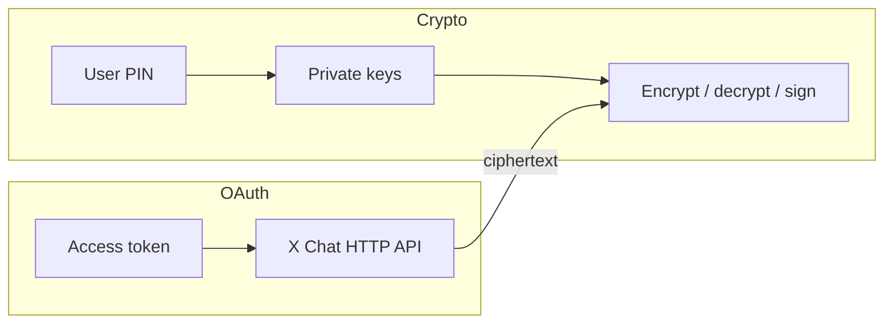

X Chat의 신원 및 서명 **개인 키**는 사용자의 암호화된 메시징 신원의 뿌리입니다. 이를 보유한 누구든 그 신원에 전달되는 대화 키를 언랩할 수 있고, 채팅에서 그 사용자로 서명할 수 있습니다. 암호화 **PIN / 패스코드**도 동일하게 취급하세요: 보안 키 백업으로부터 그러한 키를 복구합니다.

이 페이지는 모든 앱 유형에 대한 규칙을 다룹니다. 권장 클라이언트 아키텍처는 [WASM으로 UI 앱 구축](/xchat/building-ui-apps-with-wasm)을 참고하세요.

---

## 사용자와 앱 빌더를 위한 중대한 경고

<Warning>
**최종 사용자에게 자신의 암호화 PIN이나 개인 키를 서드파티 서버, 지원 상담원, 또는 "도우미" 앱과 공유하도록 요청하지 마세요.**

PIN은 **루트 신원 키**를 잠금 해제합니다. PIN(또는 개인 키 blob)을 획득한 당사자는 다음을 할 수 있습니다:

- 해당 신원에 감싸진 대화 키를 복호화(따라서 암호문으로 얻을 수 있는 메시지 이력)
- 해당 암호학적 신원으로 계속 송수신
- **사용자가 나중에 OAuth를 취소하더라도** 그 능력을 유지

OAuth를 취소하면 그 앱의 토큰에 대한 API 접근이 중단됩니다. 그러나 사용자가 이미 넘겨준 개인 키를 **무효화하지 않습니다**. PIN이 **기기 내부** 암호화([브라우저의 WASM](/xchat/building-ui-apps-with-wasm) 또는 Chat XDK를 사용하는 네이티브 클라이언트)에만 입력되는 아키텍처를 선호하세요.
</Warning>

### 표시해야 할 제품 및 문서 문구

앱이 DM 관련 OAuth 스코프(`dm.read`, `dm.write` 및 관련 스코프)를 요청하는 경우, OAuth 동의 화면과 함께 명확한 제품 언어를 짝지으세요:

- 공식 클라이언트 SDK 경로를 사용하면 암호화 키가 사용자 기기에 머무릅니다.
- 사용자는 X Chat PIN을 이를 백엔드로 전달하는 웹사이트에 결코 입력해서는 안 됩니다.
- 정상적인 통합은 [Chat XDK](/xchat/xchat-xdk)를 사용해 PIN 기반 복구와 암호화가 로컬에서 실행되도록 합니다(브라우저의 경우: WASM + 보안 키 백업).
- 개인 키를 얻은 악성 앱은 이를 유출할 수 있습니다; 오늘날 순수한 클라이언트 보유 루트 키에 대한 서버 측 "이 키 취소"는 없습니다 — 사용자가 루트 키를 여러분에게 넘길 필요가 없도록 설계하세요.

---

## 민감한 키 자료로 간주되는 것

| 자료 | 민감도 | 참고 |
|:---------|:------------|:------|
| **암호화 PIN / 패스코드** | 치명적 | [보안 키 백업](/xchat/cryptography-primer#secure-key-backup-distributed-key-storage)에서 개인 키를 복구 |
| **신원 개인 키** | 치명적 | 이 사용자의 대화 키를 언랩 |
| **서명 개인 키** | 치명적 | 메시지와 상태 변경의 작성자를 증명 |
| **`export_keys` blob** | 치명적 | Chat XDK의 불투명한 전체 개인 키 상태; 비밀번호 파일처럼 취급 |
| **언랩된 대화 키** | 높음 | 한 대화의 메시지 복호화(버전이 있지만 여전히 민감함) |
| **OAuth 액세스 / 리프레시 토큰** | 높음 | API 접근 전용 — 채팅 개인 키의 대체가 아니며, 키를 삭제해도 취소되지 않음 |
| **Juicebox realm 인증 토큰** | 중간 | 사용자/키 버전에 대한 백업 프로토콜을 인가; PIN이 아님 |
| **공개 키** | 공개 | 조회 및 저장 안전 |

---

## 앱 유형별로 올바른 키 경로 선택

| 앱 유형 | 권장 키 경로 | 하지 말 것 |
|:---------|:---------------------|:-------|
| **사용자 대상 웹 UI** | 브라우저 [WASM Chat XDK](/xchat/building-ui-apps-with-wasm) + `setup` / `unlock`(보안 키 백업) | PIN이나 개인 키를 서버로 전송; 원시 키 blob을 `localStorage`에 저장 |
| **네이티브 모바일 / 데스크톱 클라이언트** | 기기의 Chat XDK + 보안 키 백업 또는 OS 키스토어 기반 blob | 암호화되지 않은 키 blob을 클라우드에 동기화 |
| **인프라의 봇 / 자동화** | **시크릿 관리자**나 HSM의 `export_keys` blob; `import_keys`로 로드 | blob을 git에 커밋; 로그로 남김; 클라이언트 사이드 JS에 임베드 |
| **암호문만 이동시키는 서버** | 개인 키 없음 — 암호화된 페이로드를 프록시 | UI 사용자를 위해 "편의상" 서버에서 복호화 |

클라이언트 앱은 **보안 키 백업**을 선호해야 합니다. 서버와 봇은 종종 내보낸 키 blob을 사용합니다. 자세한 내용: [시작하기](/xchat/getting-started#2-initialize-the-chat-xdk-with-existing-keys).

---

## 개인 키와 PIN 규칙

### 해야 할 것

- **PIN은 신뢰할 수 있는 클라이언트 UI에서만 수집**하여 동일 기기의 Chat XDK(`unlock` / `setup`)에 공급하세요.
- **필요할 때만 키를 메모리에 유지**하세요. 잠금 해제 후에는 세션 내내 동일한 Chat 인스턴스를 재사용하고, 로그아웃 시 `lock()` 또는 `free()`를 호출하세요.
- **API가 허용하는 경우 PIN 버퍼를 제로화**하세요(예: JS에서 PIN을 `Uint8Array`로 전달하여 `unlock` 후 지울 수 있도록).
- **봇 키 blob은 시크릿 관리자**(또는 HSM)에 저장하고, 저장 시 암호화하며, IAM을 제한하고, 프로세스 자격 증명을 자주 순환하세요.
- **로그에 주의하세요:** PIN, 개인 키, 키 blob, 언랩된 대화 키, 또는 전체 보안 백업 응답을 결코 로그로 남기지 마세요.
- **클라이언트를 방어하세요:** XSS, 악성 확장 프로그램, 손상된 의존성은 네트워크 경로가 깨끗하더라도 메모리에 있는 키를 읽을 수 있습니다.

### 하지 말아야 할 것

- PIN이나 키 blob을 이메일, 스크린샷, 티켓으로 전송하지 **마세요**.
- 개인 키나 PIN을 쿼리 문자열, 분석, 오류 추적기, 또는 CDN 로그에 두지 **마세요**.
- "백엔드를 단순하게 만들기 위해" 최종 사용자 개인 키를 전송하지 **마세요**.
- **OAuth 취소**를 **키 취소**와 혼동하지 **마세요**. 앱 연결을 해제해도 사용자가 이미 내보냈거나 적대적 클라이언트에 입력한 키는 삭제되지 않습니다.
- 프로덕션 UI 앱에서 원시 `export_keys` 출력을 `localStorage`나 암호화되지 않은 IndexedDB에 저장하지 **마세요**.

---

## 브라우저 세션 지속성

프로덕션 브라우저 앱은 **보안을 먼저** 최적화하고, 그다음 UX를 최적화해야 합니다:

| 전략 | 보안 | UX | 권장 |
|:---------|:---------|:---|:---------------|
| **페이지 로드당 한 번 잠금 해제; Chat을 메모리에 유지** | 강력 | 전체 리로드마다 PIN; 메시지당 PIN 없음 | **기본 권장 사항** |
| **모든 메시지마다 PIN 재요청** | 강력하지만 번잡 | 나쁨 | 피하세요(데모 전용 안티패턴) |
| **`localStorage`의 평문 또는 base64 키 blob** | 약함(XSS나 공유 기기에서 키를 읽음) | 편리 | **프로덕션에서 사용하지 마세요** |
| **PIN 게이트 보안 키 백업만**(Juicebox) | 강력; 시도 제한 복구 | 새 기기 / 리로드에서 PIN | **선호되는 내구성 있는 저장소** |

내부 데모는 편의상 키를 `localStorage`로 내보내기도 합니다. 그것은 일회성 프로토타입에는 괜찮지만, 프로덕션 패턴은 **아닙니다**. 다음을 선호하세요:

1. 리로드 후 `createChat` + `unlock(pin)`.
2. SPA 탐색을 위해 잠금 해제된 인스턴스를 보유하는 모듈 수준 또는 프레임워크 컨텍스트.
3. 탭이 로그아웃하거나 사용자가 앱을 잠글 때 `lock()`.

"이 기기에서 잠금 해제 상태 유지" 동작을 추가한다면, 지속된 자료를 **Web Crypto**로 감싸고(가능한 경우 추출 불가능한 키), 사용자 세션에 바인딩하며, 여전히 해당 자료를 서버에 결코 업로드하지 마세요. 내구성 있는 복구 경로는 사용자의 PIN과 보안 키 백업으로 유지되며, 인프라에 있는 루트 키의 두 번째 사본이 아닙니다.

---

## OAuth 스코프 대 암호화 키

이들은 별도의 제어 평면입니다:

- **OAuth**는 API 호출을 인가합니다(대화 목록, 암호문 게시, 이벤트 조회).
- **개인 키**는 메시지 내용에 대한 암호학적 접근을 인가합니다.

완전한 제품은 다음을 해야 합니다:

1. 필요한 DM 스코프만 요청합니다.
2. DM 접근이 필요한 이유를 설명합니다.
3. OAuth가 PIN 수집 채널이 되지 않도록 암호화를 **기기 내부**에서 실행합니다.
4. 로그아웃 시 토큰 보유를 중단하고, 별도로 채팅 키에 대해 `lock()`을 수행합니다.

---

## 운영 체크리스트

- [ ] UI 흐름의 서버 요청 본문에 PIN이나 개인 키 필드가 없음  
- [ ] 클라이언트용 보안 키 백업(`setup` / `unlock`); 봇 blob용 시크릿 관리자  
- [ ] 잠금 해제된 Chat 인스턴스가 한 사용자 세션으로 범위 지정; 로그아웃 시 정리  
- [ ] 로깅과 APM이 시크릿을 스크러빙  
- [ ] 채팅을 잠금 해제할 수 있는 모든 페이지에 CSP와 XSS 통제  
- [ ] 사용자 대상 문구: PIN을 서드파티와 결코 공유하지 말 것  
- [ ] 사고 대응 계획: 봇 blob이 유출되면 키를 순환/재등록하고 과거 암호문은 이전 키 보유자에게 노출된 것으로 취급  

---

## 관련 자료

- [WASM으로 UI 앱 구축](/xchat/building-ui-apps-with-wasm) — 클라이언트 아키텍처  
- [암호화 기초](/xchat/cryptography-primer) — 신원 키, 대화 키, 보안 키 백업  
- [시작하기](/xchat/getting-started) — 키 등록 및 메시지 전송  
- [Chat XDK](/xchat/xchat-xdk) — API 참조  
- [기초: 보안](/fundamentals/security) — OAuth 및 API 자격 증명 위생  
