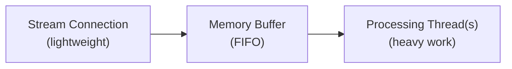

Aprenda a construir clientes robustos que consomem dados dos endpoints de streaming do X.

## Visão geral dos endpoints de streaming

Os endpoints de streaming do X são categorizados por volume:

| Categoria | Endpoints | Descrição |
|:---------|:----------|:------------|
| **Streams de alto volume** | **Firehose**, [Volume Streams](/x-api/posts/volume-streams/introduction) (amostrados a 1% e 10%) | Entregam grandes volumes de dados de Posts sem filtragem. Projetados para cobertura abrangente da atividade da plataforma. |
| **Streams de menor volume** | [Filtered Stream](/x-api/posts/filtered-stream/introduction) | Permitem que você especifique palavras-chave ou critérios para receber apenas Posts correspondentes. Ideal para monitoramento direcionado. |
| **Streams de baixa latência** | [Powerstream](/x-api/powerstream/introduction) | Otimizado para velocidade com atraso mínimo. Melhor para casos de uso que exigem entrega de dados em tempo real. |

## Entrega de dados e latência

Os endpoints de streaming da API do X priorizam a **hidratação e entrega de dados**. Para garantir que você receba dados de Post hidratados com todos os metadados, esses streams têm uma **latência P99 de aproximadamente 6-7 segundos**.

### Garantias de entrega

| Métrica | Valor |
|:-------|:------|
| Estratégia de retry | Exponential back-off |
| Latência P99 | ~6-7 segundos |

### Streams de alto volume

Para streams de alto volume, como Firehose e streams Sample (1% e 10%), **99% de todos os Posts são entregues em até 1 minuto** de seu horário de criação. Essa garantia se baseia na natureza contínua e de alto volume do feed completo de dados.

### Streams de menor volume

Para streams com volume potencialmente menor, como o Filtered Stream, os tempos de entrega podem variar com base na especificidade de seus filtros e no volume resultante de Posts correspondentes.

<Note>
Se seu caso de uso exigir menor latência, considere o [Powerstream](/x-api/powerstream/introduction), que é otimizado para velocidade e entrega dados com atraso mínimo.
</Note>

<Warning>
A latência e a entrega de dados podem ser afetadas negativamente durante interrupções. Consulte a [página de status](https://developer.x.com/status) para atualizações quando ocorrerem problemas.
</Warning>

---

## Design do cliente

Ao criar uma solução com endpoints de streaming, seu cliente precisa:

1. **Estabelecer uma conexão HTTPS de streaming** com o endpoint de streaming
2. **Lidar com volumes baixos de dados** — Manter a conexão, detectando objetos de Post e sinais de keep-alive
3. **Lidar com volumes altos de dados** — Desacoplar a ingestão de stream do processamento usando processos assíncronos e garantir que os buffers do lado do cliente sejam esvaziados regularmente
4. **Gerenciar o rastreamento de volume** no lado do cliente
5. **Detectar desconexões** e reconectar automaticamente

Para endpoints com regras (como Filtered Stream e Powerstream), seu cliente também deve enviar solicitações de forma assíncrona para gerenciar regras sem desconectar do stream.

---

## Conectando a um endpoint de streaming

Estabelecer uma conexão com endpoints de streaming da API do X significa fazer uma solicitação HTTP muito longa e analisar a resposta de forma incremental. Conceitualmente, você pode pensar nisso como baixar um arquivo infinitamente longo por HTTP.

Uma vez que uma conexão é estabelecida, o servidor do X entregará eventos de Post pela conexão enquanto ela permanecer aberta.

```python
import requests

def connect_to_stream(url, bearer_token):
    headers = {"Authorization": f"Bearer {bearer_token}"}
    
    response = requests.get(url, headers=headers, stream=True)
    
    for line in response.iter_lines():
        if line:
            # Process the Post
            print(line.decode("utf-8"))
```

---

## Consumindo dados

Objetos JSON do stream podem ter campos em qualquer ordem, e nem todos os campos estarão presentes em todas as circunstâncias. Posts não são entregues em ordem classificada, e podem ocorrer mensagens duplicadas. Com o tempo, novos tipos de mensagens podem ser adicionados ao stream.

Seu cliente deve tolerar:

- Campos aparecendo em qualquer ordem
- Campos inesperados ou ausentes
- Posts não ordenados
- Mensagens duplicadas
- Novos tipos de mensagem aparecendo a qualquer momento

---

## Buffering

Endpoints de streaming enviam dados assim que ficam disponíveis, o que pode resultar em altos volumes. Se o servidor do X não conseguir gravar novos dados no stream (por exemplo, se seu cliente não estiver lendo rápido o suficiente), ele armazenará conteúdo em buffer do seu lado. No entanto, quando esse buffer estiver cheio, a conexão será interrompida e os Posts em buffer serão perdidos.

Uma forma de identificar quando seu app está ficando para trás é comparar o timestamp dos Posts recebidos com o horário atual e rastrear isso ao longo do tempo.

Para minimizar acúmulos no stream:

- **Leia o stream rapidamente** — Não faça trabalho de processamento enquanto lê. Passe as atividades para outra thread/processo/data store para processamento assíncrono
- **Garanta largura de banda suficiente** — Seu data center precisa de largura de banda de entrada para grandes volumes sustentados, bem como picos (5-10x o volume normal)

---

## Respondendo a mensagens do sistema

### Sinais de keep-alive

Pelo menos a cada 20 segundos, o stream envia um sinal de keep-alive (heartbeat) na forma de um `\r\n` (carriage return) pela conexão aberta. Isso impede que seu cliente sofra timeout. Seu cliente deve ser tolerante a esses caracteres.

Se seu cliente implementa um read timeout em sua biblioteca HTTP, ele pode confiar no protocolo HTTP para lançar um evento se nenhum dado for lido dentro desse período. É recomendado encapsular métodos HTTP com manipuladores de erro/evento para detectar esses timeouts e acionar uma reconexão.

### Mensagens de erro

Endpoints de streaming podem entregar mensagens de erro dentro do stream. Seu cliente deve tolerar mudanças nos payloads das mensagens.

Exemplo de formato de mensagem de erro:

```json
{
  "errors": [{
    "title": "operational-disconnect",
    "disconnect_type": "UpstreamOperationalDisconnect",
    "detail": "This stream has been disconnected upstream for operational reasons.",
    "type": "https://api.x.com/2/problems/operational-disconnect"
  }]
}
```

<Note>
Mensagens de erro indicando uma desconexão forçada devido a um buffer cheio podem nunca chegar ao seu cliente se o acúmulo impedir a entrega. Seu app não deve depender exclusivamente dessas mensagens para iniciar a reconexão.
</Note>

---

## Rastreamento de uso

Monitore os volumes de dados do seu stream em busca de desvios inesperados. Uma diminuição significativa no volume pode indicar um problema diferente da desconexão — o stream ainda receberia sinais de keep-alive e alguns dados, mas a redução do volume de Posts deve motivar uma investigação.

Para criar monitoramento:

1. Rastreie o número de Posts esperados em um período de tempo definido
2. Se o volume cair abaixo de um limite e não se recuperar, dispare alertas
3. Também monitore grandes aumentos, especialmente ao modificar regras ou durante eventos que causam picos na atividade de Posts

<Note>
Posts entregues por endpoints de streaming contam para o seu volume mensal de Posts. Rastreie e ajuste o consumo para otimizar o uso. Se o volume for alto, considere adicionar um operador `sample:` às regras para reduzir a correspondência de 100% para `sample:50` ou `sample:25`.
</Note>

---

## Processamento multi-thread

Construir uma aplicação multi-thread é a chave para lidar com streams de alto volume. Uma boa prática:

1. **Stream thread** — Uma thread leve que estabelece a conexão e grava o JSON recebido em uma estrutura de memória ou stream reader com buffer
2. **Processing thread(s)** — Threads separadas que consomem do buffer e fazem o trabalho pesado: analisar JSON, preparar gravações no banco de dados ou outra lógica da aplicação

Esse design permite que seu serviço escale de forma eficiente conforme os volumes de Posts recebidos mudam.



---

## Próximos passos

<CardGroup cols={2}>
  <Card title="Lidando com desconexões" icon="plug" href="/x-api/fundamentals/handling-disconnections">
    Reconecte-se de forma elegante quando as conexões caírem
  </Card>
  <Card title="Capacidade de alto volume" icon="gauge-high" href="/x-api/fundamentals/high-volume-capacity">
    Lidar com streams de alta taxa de transferência
  </Card>
  <Card title="Recuperação e redundância" icon="/icons/xds/icon-shield-keyhole.svg" href="/x-api/fundamentals/recovery-and-redundancy">
    Construa aplicações de streaming resilientes
  </Card>
</CardGroup>
