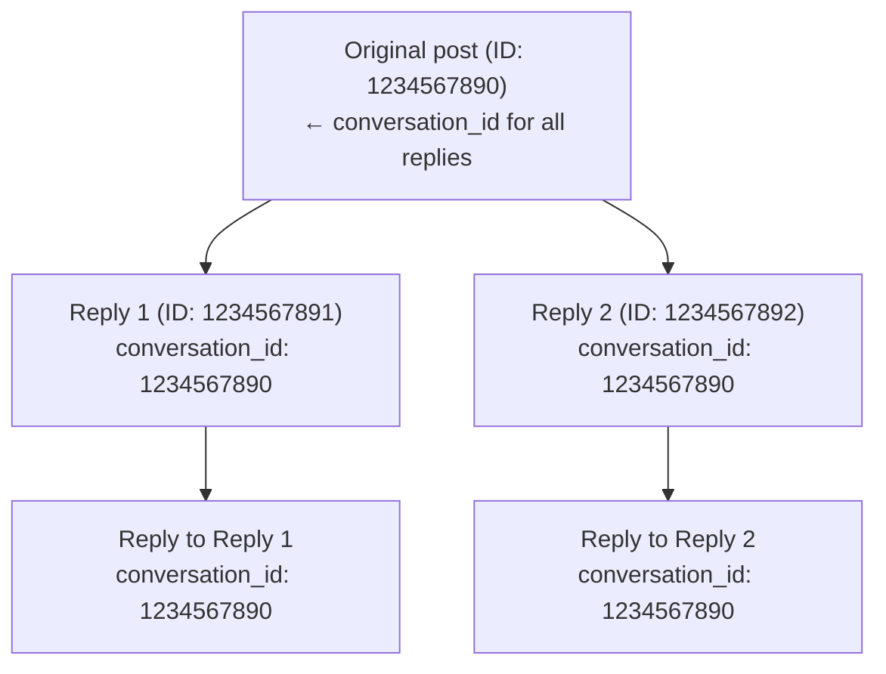

Toda resposta no X pertence a um thread de conversa. O campo `conversation_id` permite identificar, rastrear e reconstruir árvores inteiras de conversa.

---

## Como funciona

Quando alguém publica e outros respondem, todas as respostas compartilham o mesmo `conversation_id` — o ID do post original que iniciou a conversa.



Não importa a profundidade do thread, todos os posts compartilham o mesmo `conversation_id`.

---

## Solicitando conversation_id

Adicione `conversation_id` ao seu `tweet.fields`:

```bash
curl "https://api.x.com/2/tweets/1234567891?tweet.fields=conversation_id,in_reply_to_user_id,referenced_tweets" \
  -H "Authorization: Bearer $TOKEN"
```

Resposta:

```json title="Exemplo de resposta" lines wrap icon="/icons/xds/icon-brackets.svg"
{
  "data": {
    "id": "1234567891",
    "text": "@user Great point!",
    "conversation_id": "1234567890",
    "in_reply_to_user_id": "2244994945",
    "referenced_tweets": [{
      "type": "replied_to",
      "id": "1234567890"
    }]
  }
}
```

---

## Obtendo uma conversa completa

Use `conversation_id` como operador de pesquisa para recuperar todos os posts em um thread:

```bash
curl "https://api.x.com/2/tweets/search/recent?\
query=conversation_id:1234567890&\
tweet.fields=author_id,created_at,in_reply_to_user_id&\
expansions=author_id" \
  -H "Authorization: Bearer $TOKEN"
```

Isso retorna todas as respostas ao post original, ordenadas em ordem cronológica reversa.

---

## Casos de uso

<Tabs>
  <Tab title="Reconstrução de thread">
Construa a árvore completa da conversa:

```python title="Exemplo" lines wrap icon="python"
import requests

conversation_id = "1234567890"
url = f"https://api.x.com/2/tweets/search/recent"
params = {
    "query": f"conversation_id:{conversation_id}",
    "tweet.fields": "author_id,in_reply_to_user_id,referenced_tweets,created_at",
    "max_results": 100
}

response = requests.get(url, headers=headers, params=params)
replies = response.json()["data"]

# Sort by created_at to get chronological order
replies.sort(key=lambda x: x["created_at"])
```
  </Tab>
  <Tab title="Monitoramento de conversa">
Faça streaming de respostas para conversas específicas em tempo real:

```bash
# Add a filtered stream rule for a conversation
curl -X POST "https://api.x.com/2/tweets/search/stream/rules" \
  -H "Authorization: Bearer $TOKEN" \
  -d '{"add": [{"value": "conversation_id:1234567890"}]}'
```
  </Tab>
  <Tab title="Análise de conversa">
Conte respostas em uma conversa:

```bash
curl "https://api.x.com/2/tweets/counts/recent?\
query=conversation_id:1234567890" \
  -H "Authorization: Bearer $TOKEN"
```
  </Tab>
</Tabs>

---

## Campos relacionados

| Field | Descrição |
|:------|:------------|
| `conversation_id` | ID do post original que iniciou o thread |
| `in_reply_to_user_id` | User ID do post que está sendo respondido |
| `referenced_tweets` | Array com `type: "replied_to"` e o ID do post pai |

---

## Exemplo: recuperação completa do thread

```json title="Exemplo de resposta" expandable lines wrap icon="/icons/xds/icon-brackets.svg"
{
  "data": [
    {
      "id": "1234567893",
      "text": "@user2 @user1 I agree with you both!",
      "conversation_id": "1234567890",
      "author_id": "3333333333",
      "created_at": "2024-01-15T12:05:00.000Z",
      "in_reply_to_user_id": "2222222222",
      "referenced_tweets": [{"type": "replied_to", "id": "1234567892"}]
    },
    {
      "id": "1234567892",
      "text": "@user1 That's interesting!",
      "conversation_id": "1234567890",
      "author_id": "2222222222",
      "created_at": "2024-01-15T12:03:00.000Z",
      "in_reply_to_user_id": "1111111111",
      "referenced_tweets": [{"type": "replied_to", "id": "1234567890"}]
    },
    {
      "id": "1234567891",
      "text": "@user1 Great point!",
      "conversation_id": "1234567890",
      "author_id": "4444444444",
      "created_at": "2024-01-15T12:02:00.000Z",
      "in_reply_to_user_id": "1111111111",
      "referenced_tweets": [{"type": "replied_to", "id": "1234567890"}]
    }
  ],
  "meta": {
    "result_count": 3
  }
}
```

---

## Observações

- O `conversation_id` do post original é igual ao seu próprio `id`
- `conversation_id` está disponível em todos os endpoints v2 que retornam posts
- Use com o [filtered stream](/x-api/posts/filtered-stream/introduction) para monitorar conversas em tempo real
- Combine com [paginação](/x-api/fundamentals/pagination) para threads grandes

---

## Próximos passos

<CardGroup cols={2}>
  <Card title="Pesquisar posts" icon="/icons/xds/icon-search.svg" href="/x-api/posts/search/introduction">
    Pesquise por conversation_id.
  </Card>
  <Card title="Filtered stream" icon="signal-stream" href="/x-api/posts/filtered-stream/introduction">
    Monitore conversas em tempo real.
  </Card>
</CardGroup>
