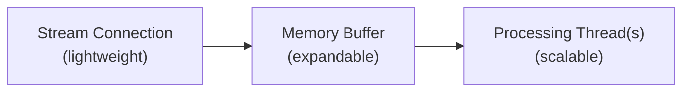

Aprenda a se preparar para eventos de alto volume ao usar endpoints de streaming do X, incluindo [Filtered Stream](/x-api/posts/filtered-stream/introduction), [Volume Streams](/x-api/posts/volume-streams/introduction), [Powerstream](/x-api/powerstream/introduction) e [Compliance Streams](/x-api/compliance/streams/introduction).

## Planejando para eventos de alto volume

Grandes eventos nacionais e globais são frequentemente acompanhados de picos dramáticos na atividade dos usuários nas redes sociais. Às vezes esses eventos são conhecidos com antecedência:

- Super Bowl
- Eleições políticas
- Comemorações de Ano-Novo pelo mundo

Em outras vezes, os picos são inesperados:

- Desastres naturais
- Eventos políticos não planejados
- Momentos da cultura pop
- Emergências de saúde

Essas rajadas podem ser breves (segundos) ou sustentadas por vários minutos. A preparação adequada ajuda suas aplicações a lidar com esses picos.

---

## Revise suas regras de stream

Antes de eventos de alto volume:

- Certas palavras-chave podem explodir durante eventos (ex.: menções de marca quando uma marca patrocina um grande evento esportivo)
- Remova regras desnecessárias ou muito genéricas que possam gerar volumes de atividade excessivos
- Comunique-se com stakeholders antes de eventos de alto volume conhecidos para ajudá-los a planejar adequadamente

---

## Teste sua aplicação sob estresse

Antecipe que volumes de burst podem chegar a **5-10x os níveis médios de consumo diário**. Dependendo de suas regras, o aumento pode ser muito maior.

Teste sua aplicação com volumes altos simulados para identificar gargalos antes que eventos reais ocorram.

---

## Entenda os limites de entrega

Limites de fluxo e entrega são baseados no seu nível de acesso:

| Nível de acesso | Limite de entrega |
|:-------------|:-------------|
| Academic | 250 Posts/segundo |
| Enterprise | Posts/segundo definido no nível de acesso |

---

## Mantenha-se conectado

Com streams, manter-se conectado é essencial para não perder dados.

Sua aplicação cliente deve:

1. **Detectar desconexões** imediatamente
2. **Tentar reconectar** usando estratégias de backoff apropriadas
3. **Usar backoff exponencial** se as tentativas de reconexão falharem

Consulte [Lidando com desconexões](/x-api/fundamentals/handling-disconnections) para estratégias detalhadas de reconexão.

---

## Construa buffering do lado do cliente

Construir uma aplicação multi-thread é a chave para lidar com streams de alto volume:

### Arquitetura recomendada

1. **Stream thread** (leve)
   - Estabelece a conexão de streaming
   - Grava o JSON recebido em uma estrutura de memória ou stream reader com buffer
   - Manipula apenas os dados de entrada — sem processamento

2. **Memory buffer**
   - Cresce e diminui conforme necessário
   - Atua como um amortecedor para picos de volume

3. **Processing thread(s)** (trabalho pesado)
   - Consome do buffer
   - Analisa JSON
   - Prepara gravações no banco de dados
   - Lida com a lógica da aplicação

---

## Considere fusos horários

Eventos globais acontecem em fusos horários globais. Os eventos podem ocorrer:

- Fora do horário comercial
- Nos fins de semana
- Durante feriados

Certifique-se de que sua equipe esteja preparada para picos fora do horário comercial normal. Considere:

- Sistemas de alertas automatizados
- Escalas de plantão
- Respostas de escalonamento automatizadas

---

## Recomendações de monitoramento

1. **Rastreie o volume de Posts** em tempo real
2. **Configure alertas** para limites de volume (aumentos e diminuições)
3. **Monitore o tamanho do buffer** para detectar quando seu processamento está atrasado
4. **Compare timestamps de Posts** com o horário atual para identificar atraso

---

## Medidas de emergência

Implemente proteções para circunstâncias extremas:

- **Alertas automatizados** quando o volume passar limites predefinidos
- **Exclusão automática de regras** para regras que trazem dados em excesso
- **Desconexão do stream** em circunstâncias extremas para proteger seus sistemas
- **Operadores de amostragem** — adicione `sample:` às regras para reduzir o volume correspondente

---

## Próximos passos

<CardGroup cols={2}>
  <Card title="Consumindo dados de streaming" icon="stream" href="/x-api/fundamentals/consuming-streaming-data">
    Construa clientes de streaming robustos
  </Card>
  <Card title="Lidando com desconexões" icon="plug" href="/x-api/fundamentals/handling-disconnections">
    Reconecte-se de forma elegante
  </Card>
  <Card title="Recuperação e redundância" icon="/icons/xds/icon-shield-keyhole.svg" href="/x-api/fundamentals/recovery-and-redundancy">
    Construa aplicações resilientes
  </Card>
</CardGroup>
