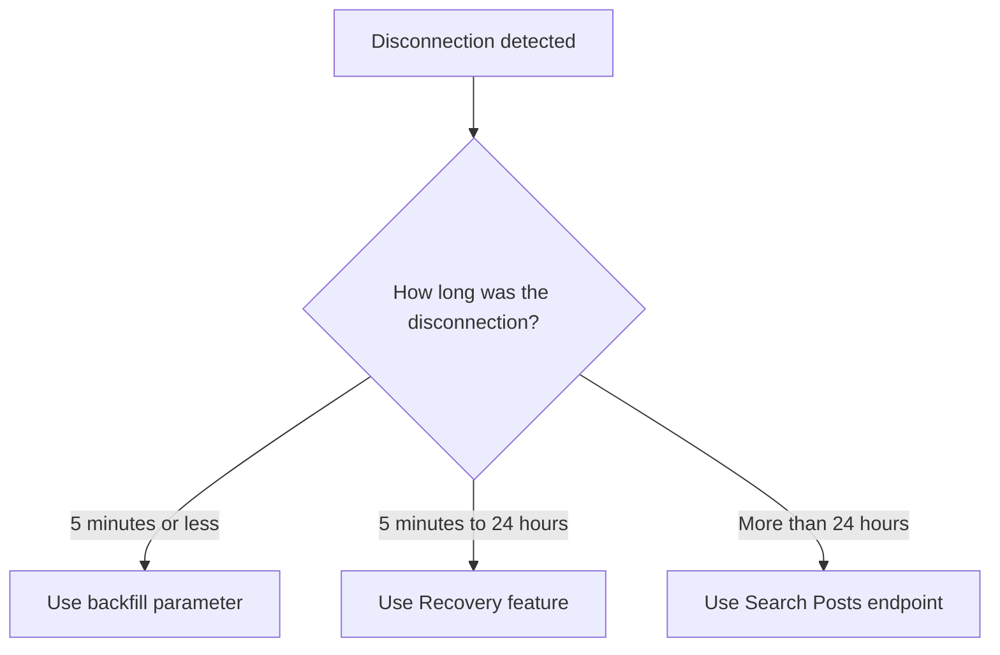

Aprenda a maximizar o tempo de conexão e recuperar dados perdidos ao usar endpoints de streaming do X, incluindo [Filtered Stream](/x-api/posts/filtered-stream/introduction), [Firehose Streams](/x-api/stream/stream-all-posts), [Volume Streams](/x-api/posts/volume-streams/introduction), [Powerstream](/x-api/powerstream/introduction) e [Compliance Streams](/x-api/compliance/streams/introduction).

## Visão geral

Ao consumir dados de streaming, maximizar o tempo de conexão e receber todos os dados correspondentes é um objetivo fundamental. Isso requer:

- Aproveitar conexões redundantes
- Detectar desconexões automaticamente
- Reconectar rapidamente
- Ter um plano para recuperar dados perdidos

---

## Conexões redundantes

Uma conexão redundante permite estabelecer mais de uma conexão simultânea a um stream. Isso fornece redundância ao conectar-se com dois consumidores separados, recebendo os mesmos dados por ambas as conexões.

Benefícios:
- Failover rápido se um stream desconectar
- Proteção se seu servidor primário falhar
- Entrega contínua de dados durante a reconexão

### Como usar

Basta conectar-se à mesma URL do stream com um segundo cliente. Os dados serão enviados por ambas as conexões.

<Note>
Conexões redundantes estão disponíveis para o acesso Enterprise. O Filtered Stream permite até duas conexões redundantes para projetos Enterprise. Firehose Streams usam um parâmetro `partition` para suportar até 20 conexões simultâneas, enquanto o Sample10 (Decahose) suporta até 2 partições. Verifique a documentação do seu endpoint específico para os limites de conexão.
</Note>

---

## Backfill

Depois de detectar uma desconexão, seu sistema deve rastrear quanto tempo a desconexão durou para determinar o método de recuperação apropriado.

### Para desconexões de 5 minutos ou menos

Use o **parâmetro backfill** ao reconectar para receber Posts correspondidos durante o período de desconexão.

| Endpoint | Parâmetro | Exemplo |
|:---------|:----------|:--------|
| Filtered Stream | `backfill_minutes` | `?backfill_minutes=5` |
| Firehose Stream | `backfill_minutes` | `?backfill_minutes=5` |
| Sample Stream (1%) | `backfill_minutes` | `?backfill_minutes=5` |
| Sample10 Stream (Decahose) | `backfill_minutes` | `?backfill_minutes=5` |
| Powerstream | `backfillMinutes` | `?backfillMinutes=5` |

Exemplos de solicitações:

**Filtered Stream:**

```bash
curl 'https://api.x.com/2/tweets/search/stream?backfill_minutes=5' \
  -H "Authorization: Bearer $ACCESS_TOKEN"
```

**Firehose Stream:**

```bash
curl 'https://api.x.com/2/tweets/firehose/stream?backfill_minutes=5&partition=1' \
  -H "Authorization: Bearer $ACCESS_TOKEN"
```

<Note>
**Considerações importantes:**
- Posts mais antigos geralmente são entregues primeiro, antes dos Posts recém-correspondidos
- Posts **não** são deduplicados — se você ficou desconectado por 90 segundos mas solicita 2 minutos de backfill, você receberá 30 segundos de Posts duplicados
- Seu sistema deve tolerar duplicatas
- Backfill está disponível com acesso Enterprise
</Note>

---

## Recovery

Para desconexões que duram **mais de 5 minutos**, use o recurso Recovery para reproduzir dados perdidos das últimas 24 horas.

### Como o Recovery funciona

1. Faça uma solicitação de conexão com os parâmetros `start_time` e `end_time`
2. O Recovery re-transmite o período de tempo especificado
3. Ao concluir, a conexão é desconectada

### Parâmetros

| Parâmetro | Tipo | Descrição |
|:----------|:-----|:------------|
| `start_time` | data ISO 8601 | Horário de início para recuperar (UTC) |
| `end_time` | data ISO 8601 | Horário de fim para recuperar (UTC) |

### Exemplo de solicitação

**Filtered Stream:**

```bash
curl 'https://api.x.com/2/tweets/search/stream?start_time=2022-07-12T15:10:00Z&end_time=2022-07-12T15:20:00Z' \
  -H "Authorization: Bearer $ACCESS_TOKEN"
```

**Firehose Stream:**

```bash
curl 'https://api.x.com/2/tweets/firehose/stream?start_time=2022-07-12T15:10:00Z&end_time=2022-07-12T15:20:00Z&partition=1' \
  -H "Authorization: Bearer $ACCESS_TOKEN"
```

**Powerstream:**

```bash
curl 'https://api.x.com/2/powerstream?startTime=2022-07-12T15:10:00Z&endTime=2022-07-12T15:20:00Z' \
  -H "Authorization: Bearer $ACCESS_TOKEN"
```

<Note>
**Limites do Recovery:**
- Disponível para acesso Enterprise
- Janela de recuperação: até 24 horas no passado
- O Filtered Stream permite 2 jobs de recuperação simultâneos
- Firehose, Sample10 (Decahose) e streams firehose específicos por idioma também suportam recovery
- O Sample Stream básico de 1% não suporta recovery; use o endpoint Search em vez disso
</Note>

---

## Recuperação alternativa: Search

Se você não tem acesso aos recursos de backfill ou recovery, ou se a desconexão excedeu 24 horas, use o [endpoint Search Posts](/x-api/posts/search/introduction) para solicitar dados perdidos.

<Warning>
**Diferenças de correspondência:**
O endpoint Search Posts não inclui os operadores `sample:`, `bio:`, `bio_name:` ou `bio_location:`, e tem certas diferenças no comportamento de correspondência com acentos e diacríticos. Isso significa que você pode não recuperar totalmente todos os Posts que teriam sido recebidos pelos endpoints de streaming.
</Warning>

---

## Árvore de decisão para recuperação



---

## Boas práticas

1. **Rastreie a duração da desconexão** — Seu sistema deve registrar quando ocorrem desconexões e por quanto tempo duram

2. **Implemente recuperação automática** — Com base na duração da desconexão, escolha automaticamente o método de recuperação apropriado

3. **Trate duplicatas** — Tanto o backfill quanto o recovery podem entregar Posts duplicados; implemente lógica de deduplicação

4. **Use conexões redundantes** — Evite perda de dados mantendo múltiplas conexões quando disponíveis

5. **Monitore jobs de recuperação** — Rastreie o status e a conclusão das operações de recuperação

---

## Próximos passos

<CardGroup cols={2}>
  <Card title="Lidando com desconexões" icon="plug" href="/x-api/fundamentals/handling-disconnections">
    Detecte e trate desconexões
  </Card>
  <Card title="Consumindo dados de streaming" icon="stream" href="/x-api/fundamentals/consuming-streaming-data">
    Construa clientes de streaming robustos
  </Card>
  <Card title="Capacidade de alto volume" icon="gauge-high" href="/x-api/fundamentals/high-volume-capacity">
    Lidar com streams de alta taxa de transferência
  </Card>
</CardGroup>
