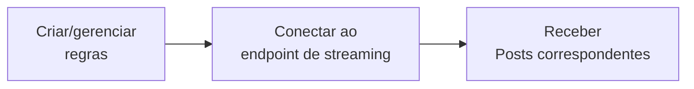

import { Button } from '/snippets/button.mdx';

Os endpoints do Filtered Stream permitem receber Posts em quase tempo real que correspondam às suas regras de filtro. Crie regras usando operadores poderosos e depois conecte-se a um stream persistente para receber Posts correspondentes à medida que são publicados.

<Note>
O Filtered Stream prioriza a hidratação e entrega de dados, com aproximadamente 6-7 segundos de latência P99. Para requisitos de latência menor, veja [Powerstream](/x-api/powerstream/introduction).
</Note>

## Visão geral

<CardGroup cols={2}>
  <Card title="Entrega em quase tempo real" icon="bolt">
    Receba Posts em segundos após a publicação
  </Card>
  <Card title="Regras persistentes" icon="/icons/xds/icon-filter.svg">
    Adicione e remova regras sem desconectar
  </Card>
  <Card title="Operadores poderosos" icon="/icons/xds/icon-search.svg">
    Corresponda a palavras-chave, hashtags, usuários e muito mais
  </Card>
  <Card title="Entrega via webhook" icon="webhook">
    Opcionalmente receba Posts via webhooks
  </Card>
</CardGroup>

---

## Como funciona

1. **Crie regras** — Defina regras de filtro usando operadores
2. **Conecte-se ao stream** — Estabeleça uma conexão HTTP persistente
3. **Receba Posts** — Obtenha Posts correspondentes em quase tempo real



---

## Endpoints

| Método | Endpoint | Descrição |
|:-------|:---------|:------------|
| GET | [`/2/tweets/search/stream`](/x-api/stream/stream-filtered-posts) | Conectar-se ao stream |
| POST | [`/2/tweets/search/stream/rules`](/x-api/stream/update-stream-rules) | Adicionar ou excluir regras |
| GET | [`/2/tweets/search/stream/rules`](/x-api/stream/get-stream-rules) | Listar regras atuais |

---

## Níveis de acesso

| Recurso | Pay-per-use | Enterprise |
|:--------|:------------|:-----------|
| Regras por project | 1.000 | 25.000+ |
| Tamanho da regra | 1.024 chars | 2.048 chars |
| Conexões | 1 | Múltiplas |
| Operadores core | ✓ | ✓ |
| Operadores de embedding semântico | — | ✓ (requer tier Embedding) |

<Card title="Contato para Enterprise" icon="/icons/xds/icon-bank.svg" href="https://developer.x.com/en/products/x-api/enterprise/enterprise-api-interest-form">
  Obtenha limites mais altos e recursos adicionais
</Card>

<Note>
Alguns operadores exigem tiers específicos. O operador semântico `embedding:` está disponível **apenas para o Filtered Stream** em planos Enterprise com acesso ao tier Embedding. O acesso Pay-per-use padrão inclui apenas os operadores core.
</Note>

---

## Criando regras

As regras usam os mesmos operadores que as queries de busca:

```
(AI OR "machine learning") lang:en -is:retweet
```

### Exemplos de regras

| Regra | Corresponde a |
|:-----|:--------|
| `#python` | Posts com a hashtag #python |
| `from:elonmusk` | Posts de @elonmusk |
| `"breaking news" has:images` | Posts com a frase e imagens |
| `(@XDevelopers OR @X) -is:retweet` | Menções, excluindo retweets |
| `embedding:"climate change policy"` | Posts semanticamente sobre política climática (Enterprise + tier Embedding) |

<Card title="Criar uma regra" icon="/icons/xds/icon-filter.svg" href="/x-api/posts/filtered-stream/integrate/build-a-rule">
  Aprenda a sintaxe de regras e os operadores
</Card>

---

## Conectando-se ao stream

Estabeleça uma conexão HTTP persistente para receber Posts:

```python
import requests

def stream_posts(bearer_token):
    url = "https://api.x.com/2/tweets/search/stream"
    headers = {"Authorization": f"Bearer {bearer_token}"}
    
    response = requests.get(url, headers=headers, stream=True)
    
    for line in response.iter_lines():
        if line:
            print(line.decode("utf-8"))
```

### Sinais keep-alive

O stream envia linhas em branco (`\r\n`) a cada 20 segundos para manter a conexão. Se você não receber dados ou um keep-alive por 20 segundos, reconecte.

<CardGroup cols={2}>
  <Card title="Lidando com desconexões" icon="plug" href="/x-api/fundamentals/handling-disconnections">
    Reconecte com elegância
  </Card>
  <Card title="Consumindo dados de streaming" icon="stream" href="/x-api/fundamentals/consuming-streaming-data">
    Processe Posts com eficiência
  </Card>
</CardGroup>

---

## Entrega via webhook

Em vez de manter uma conexão persistente, você pode receber Posts via webhooks:

<Card title="Entrega via webhook" icon="webhook" href="/x-api/webhooks/stream/introduction">
  Configure a entrega via webhook para o filtered stream
</Card>

---

## Edições de Post

O stream entrega Posts editados com seu histórico de edições. Cada edição cria um novo Post ID:

```json
{
  "data": {
    "id": "1234567893",
    "text": "Hello world! (edited)",
    "edit_history_tweet_ids": ["1234567890", "1234567891", "1234567893"]
  }
}
```

<Card title="Fundamentos de edição de Posts" icon="/icons/xds/icon-history.svg" href="/x-api/fundamentals/edit-posts">
  Saiba mais sobre edições de Posts
</Card>

---

## Introdução

<Note>
**Pré-requisitos**

- Uma [conta de desenvolvedor](https://developer.x.com/en/portal/petition/essential/basic-info) aprovada
- Um [Project e App](/resources/fundamentals/developer-apps) no Developer Console
- O [Bearer Token](/resources/fundamentals/authentication) do seu App
</Note>

<CardGroup cols={2}>
  <Card title="Quickstart" icon="/icons/xds/icon-rocket.svg" href="/x-api/posts/filtered-stream/quickstart">
    Conecte-se ao stream em minutos
  </Card>
  <Card title="Criar uma regra" icon="/icons/xds/icon-filter.svg" href="/x-api/posts/filtered-stream/integrate/build-a-rule">
    Aprenda a sintaxe de regras
  </Card>
  <Card title="Referência de operadores" icon="list-check" href="/x-api/posts/filtered-stream/integrate/operators">
    Todos os operadores disponíveis
  </Card>
  <Card title="Código de exemplo" icon="github" href="https://github.com/xdevplatform/Twitter-API-v2-sample-code">
    Exemplos de código funcionais
  </Card>
</CardGroup>

---

## Tópicos avançados

<CardGroup cols={2}>
  <Card title="Lidando com desconexões" icon="plug" href="/x-api/fundamentals/handling-disconnections">
    Reconecte com elegância
  </Card>
  <Card title="Capacidade de alto volume" icon="gauge-high" href="/x-api/fundamentals/high-volume-capacity">
    Lide com alto throughput
  </Card>
  <Card title="Recuperação e redundância" icon="/icons/xds/icon-shield-keyhole.svg" href="/x-api/fundamentals/recovery-and-redundancy">
    Construa aplicações resilientes
  </Card>
  <Card title="Correspondência de Posts retornados" icon="crosshairs" href="/x-api/posts/filtered-stream/integrate/matching-returned-tweets">
    Identifique quais regras corresponderam
  </Card>
</CardGroup>
