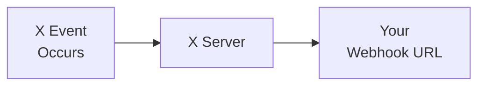

import { Button } from '/snippets/button.mdx';

A V2 Webhooks API permite que desenvolvedores recebam notificações de eventos em tempo real de contas do X por meio de mensagens JSON baseadas em webhook. Essas APIs permitem registrar e gerenciar webhooks, desenvolver aplicações consumidoras para processar eventos e garantir uma comunicação segura por meio de challenge-response checks (CRC) e headers de assinatura.

## Visão geral

<CardGroup cols={2}>
  <Card title="Entrega em tempo real" icon="bolt">
    Receba eventos instantaneamente conforme ocorrem
  </Card>
  <Card title="Baseado em push" icon="/icons/xds/icon-arrow-right.svg">
    Dados enviados diretamente ao seu servidor — sem polling
  </Card>
  <Card title="Seguro" icon="/icons/xds/icon-shield-keyhole.svg">
    Validação CRC e verificação de assinatura
  </Card>
  <Card title="Confiável" icon="gauge">
    Suporte a retry e recovery
  </Card>
</CardGroup>

---

## Produtos que suportam webhooks

Estes são os produtos que atualmente suportam a entrega de eventos via webhook:

| Produto | Descrição |
|:--------|:------------|
| [X Activity API (XAA)](/x-api/activity/introduction) | Receba eventos em tempo real sobre atividades no X |
| [Account Activity API (AAA)](/x-api/account-activity/introduction) | Receba eventos em tempo real vinculados a contas de usuários específicas |
| [Filtered Stream Webhooks](/x-api/webhooks/stream/introduction) | Receba Posts do filtered stream via entrega por webhook |

---

## Como os webhooks funcionam

1. **Ocorre um evento** — Um usuário publica, envia uma DM, é seguido, etc.
2. **X envia uma requisição POST** — Payload JSON do evento enviado para sua URL de webhook registrada
3. **Você processa o evento** — Seu servidor lida com os dados do evento
4. **Responde com 200 OK** — Retorne um status 200 para confirmar o recebimento

---

## Requisitos de webhook

| Requisito | Descrição |
|:------------|:------------|
| **HTTPS** | A URL do webhook deve usar HTTPS |
| **Publicamente acessível** | A URL deve estar acessível pela internet |
| **Sem especificação de porta** | A URL não pode incluir uma porta (por exemplo, `https://mydomain.com:5000/webhook` não funcionará) |
| **Resposta rápida** | Responda dentro de 10 segundos |
| **200 OK** | Retorne status 200 para confirmar o recebimento |
| **Suporte a CRC** | Deve responder a requisições GET de Challenge-Response Check ([saiba mais](/x-api/webhooks/quickstart#2-the-crc-check)) |

---

## Endpoints

| Método | Endpoint | Descrição |
|:-------|:---------|:------------|
| POST | [`/2/webhooks`](/x-api/webhooks/create-webhook) | Registrar um novo webhook |
| GET | [`/2/webhooks`](/x-api/webhooks/get-webhook) | Listar webhooks registrados |
| DELETE | [`/2/webhooks/:webhook_id`](/x-api/webhooks/delete-webhook) | Excluir um webhook |
| POST | [`/2/webhooks/replay`](/x-api/webhooks/create-replay-job-for-webhook) | Criar um replay job para o webhook |
| PUT | [`/2/webhooks/:webhook_id`](/x-api/webhooks/validate-webhook) | Disparar CRC check e reativar um webhook |

Todos os endpoints requerem autenticação com **OAuth2 App Only Bearer Token**.

---

## Segurança

As APIs baseadas em webhook do X fornecem dois métodos para confirmar a segurança do seu servidor de webhook:

1. **Challenge-Response Check (CRC)** — O X envia requisições GET periódicas para sua URL de webhook. Você responde com um hash HMAC-SHA256 para provar que controla o endpoint. Os CRC checks ocorrem no registro inicial, a cada hora e em revalidações manuais.

2. **Verificação de assinatura** — Cada requisição POST do X inclui um header `x-twitter-webhooks-signature`. Você pode verificar essa assinatura para confirmar que o X é a origem dos eventos recebidos.

<Card title="Ver detalhes completos de implementação" icon="/icons/xds/icon-code.svg" href="/x-api/webhooks/quickstart">
  Configuração passo a passo do CRC, exemplos de código e verificação de assinatura
</Card>

---

## Validação de webhook

Um CRC check é enviado ao seu webhook nos seguintes casos:

- Imediatamente após a criação
- Em uma requisição PUT explícita (`PUT /2/webhooks/{id}`)
- Periodicamente a cada 30 minutos, mas somente se o webhook não tiver sido validado com sucesso nas últimas 24 horas

Um webhook é marcado como **inválido** quando:

- Ele retorna uma resposta inválida para um CRC check
  - Retorna um código de status 2XX, mas o `response_token` está incorreto
  - Retorna um código de status 3XX
  - Resulta em uma exceção SSL
- Ele apresenta erros transitórios persistentes tais que não tenha sido validado com sucesso por mais de 28 horas (inclui um período de tolerância de 4 horas para problemas transitórios)
  - As seguintes respostas são tratadas como erros transitórios:
    - Código de status 4XX
    - Código de status 5XX
    - Timeout da requisição
    - Canal fechado

Você pode verificar o status válido/inválido de um webhook usando o endpoint `GET /2/webhooks` ou por meio do toolbox no Developer Console.

---

## Primeiros passos

<Note>
**Pré-requisitos**

- Uma [conta de desenvolvedor](https://developer.x.com/en/portal/petition/essential/basic-info) aprovada
- Um [Projeto e App](/resources/fundamentals/developer-apps) no Developer Console
- Um endpoint HTTPS publicamente acessível
- O **consumer secret** (API secret key) do seu app para validação CRC
</Note>

<CardGroup cols={2}>
  <Card title="Início rápido" icon="/icons/xds/icon-rocket.svg" href="/x-api/webhooks/quickstart">
    Configure seu webhook de ponta a ponta
  </Card>
  <Card title="Filtered Stream Webhooks" icon="/icons/xds/icon-filter.svg" href="/x-api/webhooks/stream/introduction">
    Receba Posts filtrados via webhook
  </Card>
  <Card title="Account Activity API" icon="/icons/xds/icon-bell.svg" href="/x-api/account-activity/introduction">
    Receba eventos de conta via webhook
  </Card>
  <Card title="Apps de exemplo" icon="github" href="/x-api/webhooks/quickstart#sample-apps">
    Exemplos de código funcionais
  </Card>
</CardGroup>
