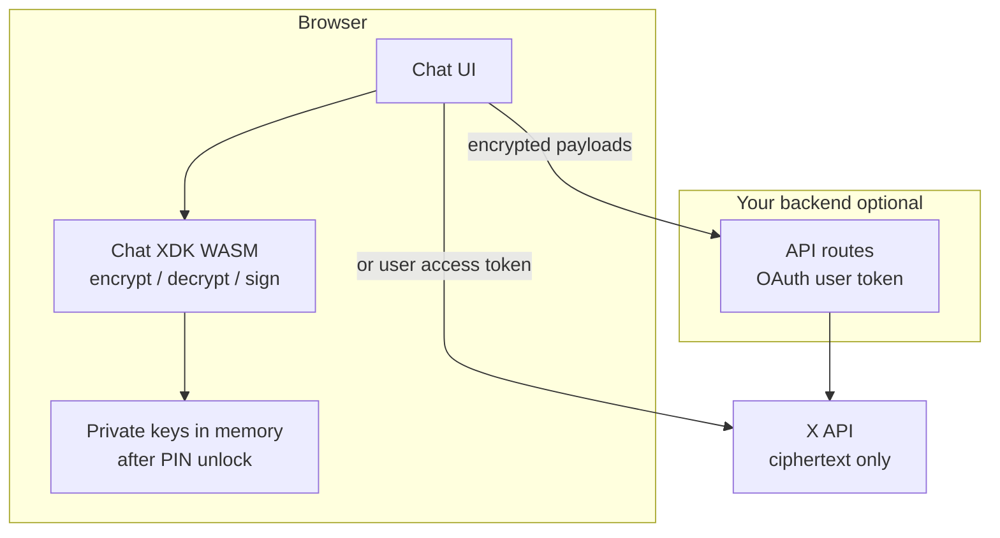

Para **UIs de chat voltadas ao usuário**, rode o [Chat XDK](/xchat/xchat-xdk) **no navegador** via seu pacote JavaScript/WASM (`@xdevplatform/chat-xdk`). As chaves privadas de identidade e de assinatura ficam no dispositivo do usuário. Seus servidores (e o X) só enxergam **texto cifrado**, chaves públicas e tokens OAuth — nunca o PIN nem o material de chave privada usado para criptografar e assinar mensagens.

Esta página é a arquitetura recomendada para apps cliente. Para regras de PIN e manuseio de chaves aplicáveis a todo tipo de app, veja [Gerenciamento de chaves privadas](/xchat/handling-private-keys).

---

## Por que WASM para apps de UI

| Abordagem | Onde a criptografia roda | Chaves privadas | Encaixe |
|:----------|:-------------------------|:----------------|:--------|
| **WASM no navegador** (`createChat`) | Dispositivo do usuário | Recuperadas com o PIN para a memória do WASM; não são enviadas ao seu backend | **Recomendado para UIs de chat** |
| **Chat XDK nativo em um servidor** | Seus servidores | Blob de chave ou recuperação com código de acesso no servidor | Bots e automação — não para clientes de chat de usuário final |

Usuários finais **nunca** devem colar o PIN de criptografia no seu backend, e seu backend **nunca** deve manter as chaves privadas de identidade deles. Se um servidor de terceiros recebe o PIN ou as chaves privadas raiz do usuário, essa parte consegue descriptografar as chaves de conversa envelopadas para aquela identidade **mesmo depois que o usuário revoga o acesso OAuth**. O WASM no cliente evita essa classe de falha para apps legítimos.

<Warning>
Compartilhar um PIN ou uma chave privada com terceiros é como compartilhar uma senha para DMs criptografadas. A desconexão do OAuth **não** revoga chaves que o app já obteve. Prefira WASM para que as chaves nunca saiam do navegador; documente os riscos com clareza quando não puder. Veja [Gerenciamento de chaves privadas](/xchat/handling-private-keys).
</Warning>

---

## Arquitetura recomendada

Separe **criptografia** (navegador) do **transporte da API** (seu backend ou a X API diretamente com um token de usuário):



| Camada | Responsabilidade |
|:-------|:-----------------|
| **UI no navegador** | Renderizar as conversas; coletar o PIN **apenas no cliente**; chamar o Chat XDK WASM para criptografar/descriptografar/assinar |
| **Chat XDK WASM** | Geração de chaves, backup seguro de chaves (`setup` / `unlock`), criptografia de mensagens |
| **Seu backend (opcional)** | Guardar o token de acesso OAuth, fazer proxy do REST do X Chat, emitir tokens de auth para o realm do Juicebox — **nunca** receber PIN nem chaves privadas |
| **X API** | Chaves públicas, chaves de conversa envelopadas, eventos e mídia criptografados |

Um padrão comum (usado por demos internos, como clientes de chat no navegador) é: **WASM + React (ou similar) no frontend**, **[XDK](/xdks/typescript/overview) em TypeScript nas rotas de API do Next.js (ou outro)** para que o navegador nunca converse com `api.x.com` usando um segredo de longa duração, se você preferir evitar isso. A criptografia continua rodando apenas no navegador.

---

## Instale o pacote para navegador

```bash
npm install @xdevplatform/chat-xdk
npm install juicebox-sdk   # required for setup() / unlock() secure key backup
```

O mecanismo WASM compilado é entregue dentro de `@xdevplatform/chat-xdk`; não há uma toolchain Rust separada para os consumidores. Requer um navegador moderno (e Node.js 18+ se você compartilha código com SSR — rode a criptografia apenas no cliente).

---

## Fluxo de sessão (PIN uma vez, chaves permanecem em memória)

**Não** peça o PIN a cada mensagem. Desbloqueie **uma vez por sessão do navegador**, mantenha a instância `Chat` em memória (singleton de módulo, contexto React, etc.) e depois criptografe e descriptografe usando essa instância desbloqueada.

```typescript
import { createChat } from '@xdevplatform/chat-xdk';

// 1) Create once per page load (client component / browser only)
const chat = await createChat({
  juiceboxConfig: JSON.stringify(record.juicebox_config), // from GET public keys for the user
  getAuthToken: async (realmId) => {
    // Your backend mints a Juicebox realm token for this user + key version.
    // Do not send the user's PIN here—only realm auth for secure key backup.
    const res = await fetch(`/api/juicebox/token?realm=${encodeURIComponent(realmId)}`);
    if (!res.ok) throw new Error('Juicebox token fetch failed');
    return res.text();
  },
});

// 2) First-time identity: generate → register public keys with X → backup with PIN
// const payload = chat.generateKeypairs();
// await registerPublicKeysWithX(payload);  // POST /2/users/:id/public_keys
// await chat.setup(pin);                   // PIN never leaves the browser

// 3) Returning session: recover keys with PIN (once)
await chat.unlock(pin);
chat.setIdentity(userId, signingKeyVersion);
chat.setCacheKeys(true);
// Fetch participants' public keys from X, then:
chat.setSigningKeys(signingKeys);

// 4) Use for the whole SPA session—no more PIN prompts
const result = chat.decryptEvents(rawEvents);
const sendBody = chat.encryptMessage({ conversationId, text: 'Hello' });
// POST sendBody to your backend or X Chat send-message endpoint

// 5) On logout or "lock chat"
chat.lock(); // clears key material from the WASM instance
// chat.free(); // if you will not reuse this instance
```

### Expectativas de UX

| Evento | O que fazer |
|:-------|:------------|
| **Abertura do app / recarga completa** | Usuário digita o PIN → `unlock` → mantenha a instância durante a navegação dentro da SPA |
| **Enviar / receber / mídia** | Chame encrypt/decrypt na instância **já desbloqueada** |
| **Logout / troca de conta** | `lock()` ou `free()`; descarte referências; limpe qualquer estado de sessão |
| **Esqueceu o PIN / bloqueio** | O backup seguro de chaves impõe um limite de tentativas; a recuperação pode exigir reset de chave (novos pares de chaves + novo registro). Veja [Primer de criptografia](/xchat/cryptography-primer#secure-key-backup-distributed-key-storage) |

<Tip>
**Evite pedir o PIN de novo a cada ação.** Apps de demonstração às vezes chamam `unlock` repetidamente por simplicidade. UIs de produção devem desbloquear uma vez, manter a instância em memória e só pedir o PIN de novo após recarga, logout ou `lock()`.
</Tip>

---

## O que seu servidor pode ver

| Permitido no servidor | Nunca envie ao servidor |
|:----------------------|:------------------------|
| Token de acesso de usuário OAuth 2.0 | PIN / código de acesso de criptografia |
| **Tokens de auth de realm** do Juicebox (curta duração, para o protocolo de backup) | Chaves **privadas** de identidade ou de assinatura |
| Payloads de registro de chave pública | Blobs brutos de `export_keys` para identidades de usuário final (apps de navegador) |
| Payloads criptografados de mensagens e mídia | Corpos de mensagens em texto simples (a menos que o usuário os esteja compondo apenas na UI) |
| IDs de conversa, IDs de evento, metadados que o X já armazena | Qualquer coisa que reconstrua o material de chave raiz do usuário |

Tokens de realm para o Juicebox **não** são o PIN do usuário. Eles autorizam o protocolo de backup para aquele usuário e versão de chave. Continue emitindo-os em um backend que já mantém o contexto OAuth do usuário.

---

## Backup seguro de chaves no navegador

Apps cliente devem usar **backup seguro de chaves** (`setup` / `unlock` com um código de acesso), não um arquivo de chave em bruto:

1. Carregue `juicebox_config` do registro de chave pública do usuário (`public_key.fields=juicebox_config`).
2. `createChat({ juiceboxConfig, getAuthToken })`.
3. Na primeira vez: `generateKeypairs` → registre as chaves públicas com o X → `setup(pin)`.
4. Depois: `unlock(pin)` neste dispositivo (ou em um novo dispositivo com o mesmo PIN).

O caminho de navegador do Chat XDK recupera as chaves para dentro do WASM e **não expõe a exportação bruta de chave privada na superfície pública de `createChat`**, então o JavaScript da aplicação não é incentivado a puxar bytes de chave raiz para dentro da página. Prefira esse modelo a despejos manuais de chave em `localStorage`.

Passos completos de registro e unlock: [Guia de introdução](/xchat/getting-started). Conceitos: [Primer de criptografia](/xchat/cryptography-primer).

---

## Checklist de hardening no navegador

- Rode o Chat XDK apenas em bundles de **cliente** (sem SSR de chaves desbloqueadas).
- Trate a instância `Chat` desbloqueada como um segredo de sessão vivo: não a coloque em `window`, não a registre em log, não a envie para analytics.
- Defenda-se contra **XSS**: CSP, uso cuidadoso de `dangerouslySetInnerHTML` / renderização de markdown, higiene de dependências. Um XSS em um app de chat consegue alcançar chaves em memória mesmo quando as chaves nunca vão para a rede.
- Use **HTTPS** em todo lugar; nunca misture páginas com criptografia e scripts inseguros.
- Prefira **escopos OAuth mínimos**; solicite escopos de DM apenas quando necessário e explique-os na UI do seu produto.
- No logout, chame **`lock()`** / **`free()`** e descarte a instância.

Recomendações de armazenamento (o que não colocar em `localStorage`, como pensar sobre persistência de sessão) estão em [Gerenciamento de chaves privadas](/xchat/handling-private-keys#browser-session-persistence).

---

## Próximos passos

1. [Gerenciamento de chaves privadas](/xchat/handling-private-keys) — avisos sobre PIN, armazenamento, bots vs apps de UI
2. [Guia de introdução](/xchat/getting-started) — registro completo de chaves e primeira mensagem
3. [Chat XDK](/xchat/xchat-xdk) — referência da API para `createChat`, encrypt, decrypt
4. [Eventos em tempo real](/xchat/real-time-events) — entrega de texto cifrado ao cliente para descriptografia local
