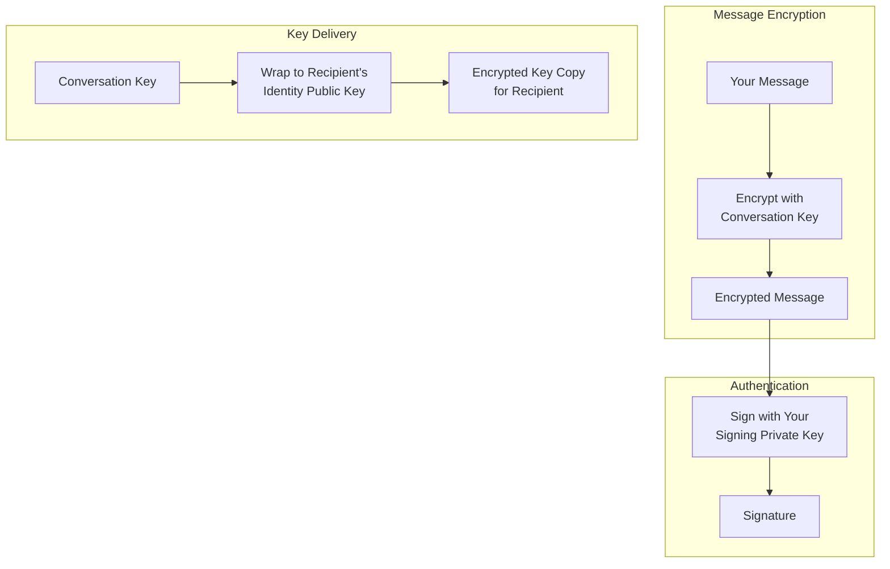
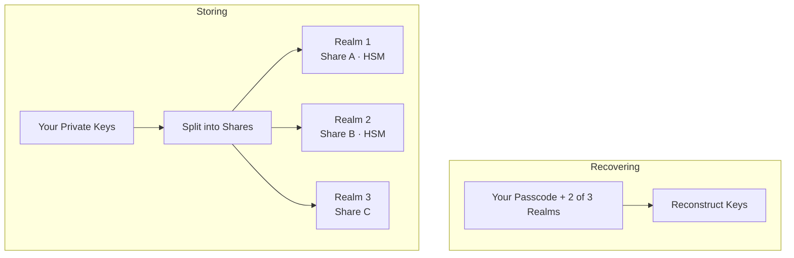

O X Chat é criptografado de ponta a ponta: as mensagens de um usuário, em texto simples, existem apenas em seus dispositivos. Esta página explica como isso funciona.

<Note>
**Esta página é informativa. Você não precisa desse conhecimento para desenvolver (o [Chat XDK](/xchat/xchat-xdk) executa cada operação aqui descrita para você).**
</Note>

---

## O panorama geral

Vamos examinar todo o fluxo, desde a criação da conta até o envio e recebimento de mensagens.

<Steps>
  <Step title="Criação da conta">
    Aqui o Chat XDK gera dois pares de chaves no seu dispositivo:

    - um **par de chaves de identidade**, para receber segredos
    - um **par de chaves de assinatura**, para provar autoria

    As metades privadas vão para o [backup seguro de chaves](#secure-key-backup-distributed-key-storage), que detalhamos mais adiante. O importante aqui é que elas só podem ser recuperadas com o seu código de acesso; o X não consegue recuperá-las.

    As metades públicas são publicadas no backend do X através da API de **chave pública**, com uma assinatura amarrando as chaves de identidade e de assinatura entre si.
  </Step>
  <Step title="Criação da conversa">
    Para enviar uma mensagem a você, um remetente gera uma nova **chave de conversa**, uma chave simétrica que criptografará as mensagens.

    Ele busca sua chave pública no backend do X, verifica a assinatura sobre ela e criptografa a chave de conversa para a sua chave de identidade.

    Esta é uma propriedade crucial da criptografia de chave pública: qualquer pessoa pode criptografar para sua chave pública; **apenas sua chave privada pode descriptografar, e somente você a detém**. Portanto, o X pode armazenar e entregar a cópia criptografada, mas nunca abri-la. (Para os esquemas exatos utilizados, veja o [glossário](#glossary).)

    Por que não simplesmente criptografar as mensagens diretamente para sua chave pública? Velocidade: a criptografia de chave pública é muito mais custosa do que a criptografia de chave simétrica, então trocar uma chave permite melhor eficiência para as mensagens subsequentes.
  </Step>
  <Step title="Troca de mensagens">
    Quando alguém envia uma mensagem para você, você receberá a chave de conversa, criptografada com sua chave pública de identidade, e as mensagens criptografadas com a chave de conversa.

    Você usa sua chave privada de identidade para descriptografar a chave de conversa (novamente, apenas você detém essa chave) e, em seguida, usa a chave de conversa resultante para descriptografar as mensagens.

    De tempos em tempos, as chaves em uma conversa são rotacionadas (uma nova chave simétrica é compartilhada), por diferentes motivos. Portanto, cada chave de conversa tem uma versão, para que os participantes sempre saibam que estão usando a chave correta.
  </Step>
  <Step title="Assinatura">
    A criptografia permite que qualquer pessoa envie uma mensagem que somente você possa descriptografar. A assinatura é, em certo sentido, o oposto: permite que você (e somente você) assine uma mensagem, e que qualquer pessoa verifique a assinatura. Na prática, a chave privada é necessária para assinar, e a chave pública pode ser usada para verificar.

    No X Chat, todo remetente assina sua mensagem. As assinaturas provam tanto quem assinou a mensagem quanto os bytes exatos assinados, então todos os destinatários podem verificar que exatamente essa mensagem foi o que o remetente digitou. Novamente, o XDK cuida disso para você; cobrimos os detalhes em [Assinaturas explicadas](#signatures-explained).
  </Step>
</Steps>

---

## Juntando tudo

O X Chat combina três ferramentas criptográficas padrão, cada uma fazendo a única tarefa que faz bem:

1. Uma **chave de conversa** criptografa mensagens: simétrica, rápida o suficiente para todo o tráfego de mensagens e mídia.
2. Um **par de chaves de identidade** entrega chaves de conversa a cada participante sem que mais ninguém (incluindo o X) as veja.
3. Um **par de chaves de assinatura** prova autoria: cada mensagem carrega uma assinatura que os destinatários verificam.

O X transporta e armazena apenas **texto cifrado e chaves encapsuladas**, nada que ele possa abrir. O XDK faz a criptografia; a [Chat API](/xchat/introduction) registra chaves e movimenta payloads criptografados ([Primeiros passos](/xchat/getting-started)).

O elenco completo:

| Chave | Quem a detém | O que ela faz |
|:----|:-------------|:-------------|
| **Identity keypair** | Metade privada: somente você. Metade pública: publicada | Recebe chaves de conversa encapsuladas |
| **Signing keypair** | Metade privada: somente você. Metade pública: publicada | Assina mensagens e mudanças de estado; outros verificam |
| **Conversation key** | Cada participante de uma conversa | Criptografa mensagens e mídia; versionada, rotacionada |

---

## Um exemplo prático

Vamos percorrer o que realmente acontece quando você cria um grupo com Bob e Carol.

<Steps>
  <Step title="Gerar a chave de conversa">
    O XDK gera uma nova chave de conversa aleatória. Até aqui ela existe apenas na memória do seu dispositivo.
  </Step>
  <Step title="Buscar e verificar as chaves dos participantes">
    Seu app busca as chaves públicas de Bob e Carol no backend do X e verifica a assinatura em cada uma. Se uma assinatura não confere, você para; nunca criptografe para uma chave que você não conseguiu verificar.
  </Step>
  <Step title="Encapsular a chave para cada participante">
    O XDK encapsula a chave de conversa três vezes: para a chave pública de identidade de Bob, para a de Carol e para a sua (para que seus outros dispositivos também possam lê-la).
  </Step>
  <Step title="Assinar a mudança">
    O XDK assina um payload que descreve exatamente esta mudança: o grupo, seus membros, as chaves encapsuladas. Criar um grupo requer **duas** [assinaturas de ação](#signed-state-changes-action-signatures); o XDK produz ambas para você.
  </Step>
  <Step title="Publicar">
    Seu app envia via POST as cópias encapsuladas e assinaturas para o X. O servidor armazena três blobs criptografados que ele não pode abrir. Em nenhum momento a chave de conversa em bruto saiu do seu dispositivo!
  </Step>
  <Step title="Bob lê">
    O XDK de Bob desencapsula sua cópia com sua chave privada de identidade, verifica que a mudança de chave veio de você e mantém a chave de conversa em bruto.
  </Step>
</Steps>

Essa é a configuração única. A partir daqui, cada mensagem segue os mesmos dois fluxos:

**Envio.** O XDK criptografa sua mensagem com a chave de conversa atual, assina-a, e seu app envia via POST ambas ao endpoint **send message**. O X armazena e entrega bytes que ele não pode ler.

**Recebimento.** O texto cifrado chega via [webhooks ou um stream de atividades](/xchat/real-time-events), ou lendo os **eventos** da conversa para obter o histórico. O XDK verifica primeiro a assinatura do remetente e então descriptografa com sua chave de conversa armazenada (se a chave foi rotacionada, um evento **key change** entrega sua nova cópia encapsulada). Se a verificação falhar, a mensagem é rejeitada.

A implementação está em [Primeiros passos](/xchat/getting-started) e na referência do [Chat XDK](/xchat/xchat-xdk).

---

## Backup seguro de chaves: armazenamento distribuído de chaves

Dissemos anteriormente que suas chaves privadas são salvas no **backup seguro de chaves**, recuperáveis somente com seu código de acesso. Vamos ver como isso funciona, porque é a parte sobre a qual as pessoas mais se mostram céticas: como podem chaves ser copiadas em backup sem que o X seja capaz de lê-las?

### O problema com o armazenamento tradicional de chaves

| Abordagem | Problema |
|:---------|:--------|
| Armazenar somente no dispositivo | Perder o dispositivo = perder as chaves = perder acesso ao histórico de mensagens |
| Armazenar em um backup em nuvem comum | O provedor pode acessar o material da chave |
| Memorizar uma chave longa | As pessoas não conseguem memorizar segredos de alta entropia |

### Como o backup seguro de chaves resolve isso

O X Chat utiliza o protocolo open-source [**Juicebox**](https://juicebox.xyz), que combina **compartilhamento de segredo com limiar** (threshold secret sharing) com proteção por código de acesso. O protocolo completo está especificado lá; a versão resumida:

**Armazenando (uma vez, na criação da conta).** O XDK divide suas chaves privadas em partes (shares) e as distribui a três **realms**, serviços separados isolados uns dos outros. Todos os três são operados pelo X, então o isolamento por si só não significaria muito. É aí que entra o hardware: dois dos realms residem dentro de **hardware security modules** (HSMs), hardware resistente a violações que não entregará sua parte a ninguém, nem mesmo a um administrador do X com acesso total ao servidor. Uma parte sozinha não revela nada, e a recuperação requer partes de **dois dos três** realms, então toda recuperação possível passa por pelo menos um HSM: não há caminho apenas por software até suas chaves. O software do HSM e a **key ceremony** que o provisionou são publicamente documentados.

**Recuperando (novo dispositivo).** Você digita seu código de acesso, e o XDK prova a cada realm que você o conhece. O protocolo Juicebox torna isso possível sem que o código de acesso jamais saia do seu dispositivo. Cada realm que verifica você libera sua parte de suas chaves e, quando dois dos três respondem, o XDK reconstrói suas chaves no seu dispositivo.

**Limites de tentativas.** Cada realm permite no máximo **20 tentativas incorretas de código de acesso**. Na 20ª tentativa incorreta, sua parte da chave é excluída do realm. Isso é imposto por hardware pelos HSMs e protege contra qualquer ataque de força bruta.

O resultado: você pode recuperar suas chaves em um novo dispositivo com apenas seu código de acesso, nenhum realm sozinho detém o segredo inteiro, e os realms apoiados em hardware impõem seus limites até mesmo contra o próprio X.

<Note>
Você não configura nada disso manualmente. O Chat XDK inclui o cliente de backup, e a configuração dos realms chega do backend do X junto com o seu registro de chave pública. O armazenamento e o desbloqueio via código de acesso são chamadas do Chat XDK; veja [inicializar com chaves existentes](/xchat/getting-started#2-initialize-the-chat-xdk-with-existing-keys) e [criar e registrar chaves](/xchat/getting-started#3-create-and-register-keys-first-time-setup). Servidores e bots frequentemente pulam o backup e usam um blob de chave exportado; proteja-o como uma senha.
</Note>

---

## Assinaturas explicadas

A assinatura de cada mensagem oferece aos destinatários duas garantias:

1. **Autenticidade**: produzida pelo detentor da chave privada de assinatura do remetente
2. **Integridade**: o conteúdo criptografado não foi modificado após a assinatura

Se qualquer coisa no conteúdo assinado mudar, a verificação falha. Claro, essa garantia é forte apenas na medida em que a chave de assinatura permaneça secreta, e é por isso que o [armazenamento de chaves](#secure-key-backup-distributed-key-storage) importa tanto.

**No seu app.** O XDK assina quando você criptografa e verifica quando você descriptografa. A rejeição acontece em ambas as extremidades: o próprio X Chat rejeita eventos que não consegue verificar, e o XDK faz o mesmo no recebimento, **obrigatório por padrão** (desabilitar isso não é recomendado). Detalhes: [Chat XDK](/xchat/xchat-xdk).

### Mudanças de estado assinadas (assinaturas de ação)

Mensagens não são a única coisa assinada. Toda mudança em uma conversa (criar um grupo, adicionar membros, rotacionar uma chave) também deve carregar **assinaturas de ação**: o remetente assina um payload descrevendo exatamente o que a mudança faz, e a API rejeita solicitações onde estas estejam ausentes ou malformadas. O XDK as produz para você.

**Por que o servidor não pode verificar totalmente uma mudança de chave.** O servidor nunca detém a chave de conversa em bruto (esse é o ponto), então ele não pode verificar uma assinatura sobre material que ele não pode ver. Ele verifica o que pode, que a descrição assinada corresponde à solicitação, e os destinatários fazem a verificação criptográfica de verdade quando desencapsulam a mudança de chave.

Os eventos são imutáveis: um que falhe na verificação é permanentemente inválido. Veja [Solução de problemas](/xchat/troubleshooting).

---

## Propriedades de segurança

Aqui está do que o X Chat protege e, tão importante quanto, do que ele não protege.

### Do que o X Chat protege

| Ameaça | Proteção | Baseado em |
|:-------|:-----------|:-----------|
| **X lendo corpos de mensagens** | O conteúdo é criptografado antes de chegar ao X | Chaves de conversa nunca saem desencapsuladas dos dispositivos dos participantes |
| **Bisbilhoteiros de rede** | Segurança de transporte mais conteúdo criptografado de ponta a ponta | TLS padrão, mais tudo acima |
| **Adulteração de mensagens** | Assinaturas detectam qualquer modificação | Verificação de assinatura em todo evento |
| **Falsificação de identidade do remetente** | Uma assinatura válida requer a chave privada de assinatura do remetente | Sigilo da chave de assinatura, mais o key binding que você verificou |
| **Roubo de chave em um servidor de backup** | As partes são divididas entre realms e protegidas por código de acesso, com um limite rígido de tentativas | Nenhum realm sozinho pode reconstruir as chaves; HSMs impõem o limite de tentativas em hardware |

### Do que o X Chat não protege, e por quê

| Limitação | A versão honesta |
|:-----------|:-------------------|
| **Um dispositivo comprometido** | Um cliente desbloqueado detém texto simples e chaves em bruto. Nenhum design de ponta a ponta sobrevive a um endpoint comprometido. |
| **Metadados** | O X precisa saber quem enviou mensagem para quem, e quando, para rotear texto cifrado. A criptografia esconde o *o quê*, não o *quem* ou *quando*. |
| **Sem forward secrecy** | Chaves de conversa são encapsuladas para chaves de identidade de longa duração: um atacante com sua chave privada de identidade pode desencapsular envelopes previamente capturados e, com eles, texto cifrado passado. |
| **Sem cicatrização automática pós-comprometimento** | A recuperação funciona, mas é deliberada, não automática: remover um atacante rotaciona a chave de conversa, e recuperar um dispositivo comprometido geralmente inclui gerar uma nova chave de identidade e novas chaves de conversa, de modo que mesmo chaves roubadas não leem nada novo. O que nenhuma rotação pode fazer é reescrever o passado, ou protegê-lo na janela antes de o comprometimento ser tratado. |

---

## Glossário

| Termo | Definição |
|:-----|:-----------|
| **Symmetric encryption** | A mesma chave criptografa e descriptografa (usada para mensagens e mídia) |
| **Asymmetric encryption** | Chave pública para criptografar, chave privada para descriptografar (usada para entregar chaves de conversa) |
| **Public key** | Segura para publicar; usada para criptografar *para* alguém ou verificar suas assinaturas |
| **Private key** | Deve permanecer secreta; usada para descriptografar ou assinar |
| **ECDH** | *Acordo* de chaves: duas partes derivam um segredo compartilhado da chave privada de uma e da chave pública da outra |
| **ECIES** | Criptografia híbrida construída sobre ECDH: deriva um segredo compartilhado, criptografa simetricamente sob ele. Como as chaves de conversa são encapsuladas |
| **ECDSA** | O algoritmo de assinatura de curvas elípticas usado para mensagens e assinaturas de ação |
| **P-256** | A curva elíptica (secp256r1) que todos os pares de chaves do X Chat usam |
| **Key binding** | A assinatura publicada que amarra a chave de identidade de um usuário à sua chave de assinatura; verificada antes de encapsular qualquer coisa para um registro buscado |
| **Conversation key** | Chave simétrica compartilhada pelos participantes de uma conversa, versionada ao longo do tempo |
| **Wrapping** | Criptografar uma chave sob outra; aqui, uma chave de conversa sob uma chave pública de identidade |
| **Threshold secret sharing** | Dividir um segredo em partes de modo que apenas um subconjunto suficiente possa reconstruí-lo; menos que o limiar não aprende nada |
| **Juicebox** | O protocolo open-source por trás do backup seguro de chaves: recuperação com limiar protegida por código de acesso, com limites rígidos de tentativas |
| **HSM** | Hardware security module: hardware resistente a violações que detém a parte de um realm e impõe seu limite de tentativas |
| **Realm** | Um serviço de backup seguro de chaves separado e isolado que detém uma parte do seu material de chave |

---

## Próximos passos

<CardGroup cols={2}>
  <Card title="Primeiros passos" icon="rocket" href="/xchat/getting-started">
    Implemente chaves, envio e recebimento passo a passo
  </Card>
  <Card title="Referência do Chat XDK" icon="code" href="/xchat/xchat-xdk">
    Métodos e tipos do SDK de criptografia
  </Card>
  <Card title="Introdução" icon="book" href="/xchat/introduction">
    Visão geral do produto e arquitetura
  </Card>
  <Card title="Eventos em tempo real" icon="bolt" href="/xchat/real-time-events">
    Como eventos criptografados são entregues
  </Card>
</CardGroup>
