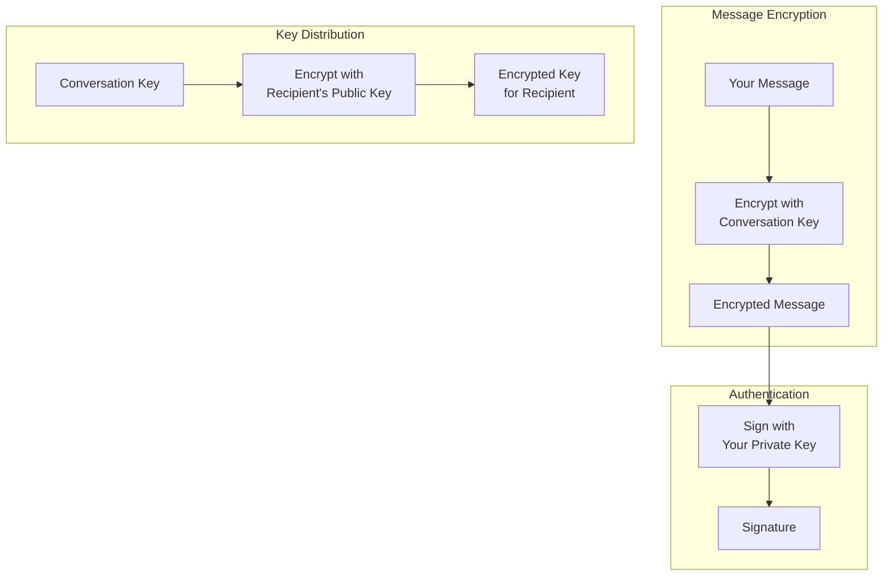
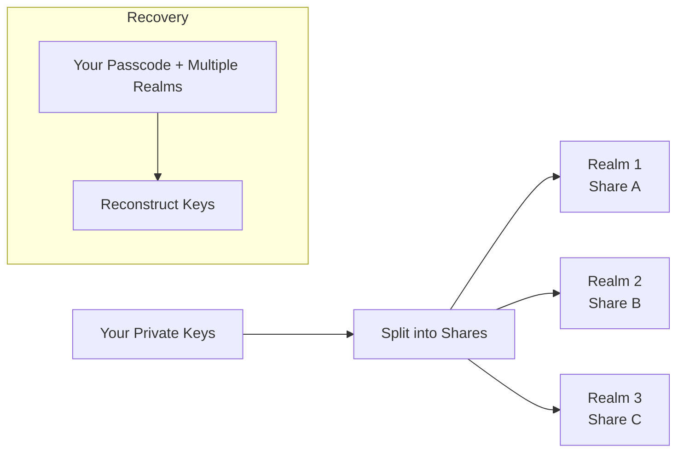

import { Button } from '/snippets/button.mdx';

Este primer explica as ideias criptográficas por trás do X Chat em nível conceitual. Você não precisa dessa profundidade para desenvolver — o [Chat XDK](/xchat/xchat-xdk) realiza a criptografia, descriptografia, assinatura e armazenamento de chaves para você — mas o modelo mental ajuda ao projetar seu app ou depurar comportamentos.

Quando estiver pronto para implementar, use o [Guia de introdução](/xchat/getting-started) para um passo a passo completo e a [Referência da API](/x-api/chat/get-chat-conversations) na barra lateral para rotas individuais.

<Note>
**Você não implementa essa criptografia por conta própria.** O Chat XDK cuida disso. Esta página é para entendimento, não uma checklist de API.
</Note>

---

## O panorama geral

O X Chat usa um sistema de criptografia em camadas onde:

1. **Mensagens** são criptografadas com uma **chave de conversa** (criptografia simétrica rápida)
2. **Chaves de conversa** são criptografadas para cada participante usando sua **chave pública de identidade** (troca de chaves assimétrica)
3. **Mensagens são assinadas** com a **chave de assinatura** para que os destinatários possam verificar quem as enviou e que nada foi alterado

A criptografia simétrica é eficiente para muito tráfego de mensagens; a assimétrica é usada principalmente para **distribuir** chaves de conversa com segurança.

No fluxo do produto, o X transporta **texto cifrado e envelopes de chaves** — não conteúdo legível de mensagens nem a chave de conversa em bruto. Seu app usa o Chat XDK para a criptografia e a [Chat API](/xchat/introduction) (via XDK em Python/TypeScript, ou HTTPS) para registrar chaves e enviar ou receber esses payloads criptografados. Veja o [Guia de introdução](/xchat/getting-started) para como essas peças se encaixam.

---

## Tipos de chave explicados

O X Chat usa três tipos de material de chave, cada um com um propósito específico.

### 1. Par de chaves de identidade

**Propósito:** Trocar chaves de conversa entre usuários com segurança

| Componente | Descrição |
|:-----------|:----------|
| **Chave pública de identidade** | Compartilhada com outros; usada para criptografar chaves de conversa *para* você |
| **Chave privada de identidade** | Mantida em segredo; usada para descriptografar chaves de conversa enviadas *a* você |

Quando alguém adiciona você a uma conversa, essa pessoa criptografa a chave de conversa usando sua chave pública de identidade. Somente sua chave privada de identidade pode descriptografá-la.

As metades públicas são registradas e descobertas por meio das APIs de **chaves públicas** da plataforma (veja Chaves de criptografia na Referência da API). As metades privadas ficam no Chat XDK (por exemplo via [backup seguro de chaves](#backup-seguro-de-chaves-armazenamento-distribuido-de-chaves) ou um blob de chave cuidadosamente protegido).

### 2. Par de chaves de assinatura

**Propósito:** Provar que você é o autor de uma mensagem

| Componente | Descrição |
|:-----------|:----------|
| **Chave pública de assinatura** | Compartilhada com outros; usada para verificar suas assinaturas |
| **Chave privada de assinatura** | Mantida em segredo; usada para assinar suas mensagens |

Quando você envia uma mensagem, ela é assinada com sua chave privada de assinatura. Os destinatários verificam usando sua chave pública de assinatura (também publicada pelas APIs de chaves públicas). O Chat XDK assina como parte da criptografia de uma mensagem e pode verificar na descriptografia quando você fornece o material de chave pública do remetente.

### 3. Chave de conversa

**Propósito:** Criptografar e descriptografar mensagens (e mídia) dentro de uma conversa específica

| Propriedade | Descrição |
|:------------|:----------|
| **Simétrica** | A mesma chave criptografa e descriptografa |
| **Por conversa** | Cada conversa tem sua própria chave |
| **Compartilhada entre participantes** | Todos os participantes que devem ler a conversa têm uma cópia |
| **Versionada** | As chaves podem ser rotacionadas; apps devem acompanhar versões ao longo do tempo |

As chaves de conversa são geradas quando uma conversa é configurada ou quando as chaves são rotacionadas. Cada participante recebe uma **cópia criptografada** da chave, produzida com sua chave pública de identidade. Depois de descriptografar sua cópia uma vez, você mantém a chave de conversa **em bruto** e a usa para criptografia rápida de mensagens (e [mídia](/xchat/media)). Configurar essas cópias para uma conversa é feito por meio do Chat XDK junto com os endpoints de **chaves** de conversa — passo a passo em [Guia de introdução](/xchat/getting-started#4-set-up-conversation-keys).

---

## Como a criptografia funciona (conceitualmente)

### Enviando uma mensagem

<Steps>
  <Step title="Comece com texto simples">
    Você digita: "Olá, como você está?"
  </Step>
  <Step title="Obtenha a chave de conversa">
    Seu app usa a chave de conversa em bruto para este chat (da configuração ou de um evento anterior de distribuição de chave), na versão correta da chave.
  </Step>
  <Step title="Criptografe a mensagem">
    O Chat XDK criptografa sua mensagem com a chave de conversa. O resultado é texto cifrado que é inútil sem essa chave.
  </Step>
  <Step title="Assine a mensagem">
    O Chat XDK assina o payload criptografado com sua chave privada de assinatura, provando que você é o autor exato deste conteúdo.
  </Step>
  <Step title="Envie ao X">
    Seu app envia o payload criptografado e a assinatura ao X pelo endpoint **send message** da Chat API. O X armazena e entrega bytes que não consegue ler em texto simples.
  </Step>
</Steps>

### Recebendo uma mensagem

<Steps>
  <Step title="Receba os dados criptografados">
    Seu app recebe texto cifrado do X — via [webhooks ou um stream de atividades](/xchat/real-time-events), ou lendo **eventos** de conversa para o histórico.
  </Step>
  <Step title="Obtenha a chave de conversa">
    Use sua chave em bruto em cache, ou obtenha-a descriptografando sua cópia de um evento de distribuição (mudança) de chave se esta for nova ou rotacionada.
  </Step>
  <Step title="Verifique a assinatura">
    O Chat XDK verifica a assinatura usando a chave pública de assinatura do remetente (e o vínculo de identidade relacionado), para que você saiba quem enviou e que não foi modificado.
  </Step>
  <Step title="Descriptografe a mensagem">
    O Chat XDK descriptografa com a chave de conversa. Agora você pode ler: "Olá, como você está?"
  </Step>
</Steps>

A implementação de criptografar, enviar, receber e descriptografar está em [Guia de introdução](/xchat/getting-started) e na referência do [Chat XDK](/xchat/xchat-xdk).

---

## Distribuição de chaves explicada

Um desafio central na criptografia de ponta a ponta é a **distribuição de chaves**: como os participantes obtêm a chave de conversa **sem** que o X (ou um observador) veja essa chave em claro.

### Configuração inicial de chaves

Quando uma conversa é preparada para mensagens:

1. Uma chave de conversa aleatória é gerada (no Chat XDK)
2. Para **cada participante**, essa chave é criptografada para sua **chave pública de identidade**
3. Essas cópias criptografadas são armazenadas e entregues por meio das APIs de Chat do X
4. Cada participante descriptografa **sua** cópia com sua chave privada de identidade (no Chat XDK)

O X só lida com as cópias **envelopadas**, nunca com a chave de conversa em bruto.

### Eventos de mudança de chave

Quando a chave de conversa é rotacionada (por exemplo, quando a composição muda), os participantes recebem um evento de **mudança de chave** com novas cópias criptografadas para cada membro.

Seu app deve:

1. Notar material de mudança de chave em eventos ao vivo ou no histórico da conversa
2. Descriptografar e armazenar a nova chave de conversa (e versão)
3. Usar a versão mais recente para envios subsequentes

[Guia de introdução](/xchat/getting-started#6-receive-and-decrypt) e [Eventos em tempo real](/xchat/real-time-events) descrevem onde esses eventos aparecem na prática.

---

## Backup seguro de chaves: armazenamento distribuído de chaves

Suas chaves **privadas** de identidade e de assinatura precisam ser armazenadas com cuidado. O X Chat inclui um sistema de **backup seguro de chaves** (implementado com Juicebox) para que as chaves possam ser recuperadas com um código de acesso entre dispositivos sem dar a nenhum servidor o segredo completo.

### O problema com o armazenamento tradicional de chaves

| Abordagem | Problema |
|:----------|:---------|
| Armazenar apenas no dispositivo | Perder o dispositivo = perder as chaves = perder acesso ao histórico de mensagens |
| Armazenar em um backup em nuvem comum | O provedor pode acessar o material da chave |
| Memorizar uma chave longa | As pessoas não conseguem memorizar chaves de alta entropia de forma confiável |

### Como o backup seguro de chaves resolve isso

O backup seguro de chaves combina **compartilhamento de segredos** com **proteção por código de acesso**:

1. As chaves privadas são **divididas em partes**
2. As partes são mantidas por **realms independentes** (servidores separados)
3. **Nenhum realm sozinho** tem informações suficientes para reconstruir as chaves
4. A recuperação requer seu **código de acesso** e cooperação de **realms suficientes**
5. Códigos de acesso incorretos têm **limite de taxa** para retardar tentativas

Você obtém recuperabilidade (novo dispositivo + código de acesso) sem que um único agente detenha o segredo inteiro.

<Note>
Você não configura os servidores de backup de chaves à mão no fluxo normal. O Chat XDK inclui o cliente de backup; a configuração do realm vem da X API como **`juicebox_config`** no seu registro de chave pública (o campo tem esse nome por causa do Juicebox, a implementação subjacente). O armazenamento inicial do código de acesso e o desbloqueio posterior são chamadas do Chat XDK — veja [inicializar com chaves existentes](/xchat/getting-started#2-initialize-the-chat-xdk-with-existing-keys) e [criar e registrar chaves](/xchat/getting-started#3-create-and-register-keys-first-time-setup) no Guia de introdução. Alguns apps (especialmente servidores e bots) usam um blob de chave exportado em vez do backup seguro de chaves; proteja esse material como uma senha.
</Note>

---

## Assinaturas explicadas

Toda mensagem do X Chat inclui uma **assinatura digital** que oferece:

1. **Autenticidade** — foi produzida com a chave privada de assinatura do remetente  
2. **Integridade** — o conteúdo criptografado não foi modificado após a assinatura  

### Como as assinaturas funcionam (conceitualmente)

| Ação | Chave usada | Resultado |
|:-----|:------------|:----------|
| **Assinar** | Chave privada de assinatura do remetente | Uma assinatura vinculada a esta mensagem criptografada exata |
| **Verificar** | Chave pública de assinatura do remetente | Confirma que a assinatura corresponde à mensagem e à chave |

Se algo no material assinado muda, a verificação falha. Somente alguém com a chave privada de assinatura pode produzir uma assinatura válida para essa chave.

### No seu app

O Chat XDK assina quando você criptografa mensagens de saída e verifica quando você descriptografa as de entrada, contra o material de chave pública do remetente (das APIs de chaves públicas). A verificação é **obrigatória por padrão**: o SDK rejeita eventos assinados não verificados a menos que você desative explicitamente a checagem (não recomendado). Detalhes na referência do [Chat XDK](/xchat/xchat-xdk).

### Mudanças de estado assinadas (assinaturas de ação)

Mensagens não são o único material assinado. Toda chamada que muda o estado da conversa — adicionar ou rotacionar chaves de conversa, criar um grupo, adicionar membros — deve carregar uma ou mais **assinaturas de ação**: o remetente assina um payload descrevendo exatamente o que a mudança faz (para uma mudança de chave, esse payload inclui a nova chave de conversa em si), e a API rejeita a requisição se as assinaturas estiverem ausentes ou malformadas.

Como o servidor nunca detém a chave de conversa em texto simples, ele não pode verificar criptograficamente a assinatura de uma mudança de chave; ele valida que a descrição assinada e codificada da mudança corresponde à requisição recebida. A verificação **criptográfica** acontece nas extremidades: o Chat XDK de cada destinatário verifica a assinatura contra a chave pública de assinatura do remetente ao descriptografar o evento de mudança de chave. Os métodos `prepare` do Chat XDK produzem essas assinaturas para você — criações de grupo e adições de membros retornam **duas** (a mudança de chave mais a ação de grupo), e ambas precisam ser enviadas.

Assinaturas são vinculadas ao conteúdo do evento e são imutáveis: um evento cuja assinatura não verifica nunca poderá se tornar válido depois. Veja [Solução de problemas](/xchat/troubleshooting) para saber como tratá-los.

---

## Propriedades de segurança

### Contra o que o X Chat protege

| Ameaça | Proteção |
|:-------|:---------|
| **X lendo corpos de mensagens** | O conteúdo é criptografado antes de ser enviado ao X |
| **Escutas na rede** | Segurança de transporte mais conteúdo criptografado de ponta a ponta |
| **Adulteração de mensagens** | Assinaturas detectam modificações |
| **Personificação trivial de remetente** | Assinaturas válidas requerem a chave privada de assinatura do remetente |
| **Roubo de chave em servidor único (com backup seguro de chaves)** | As partes são divididas entre realms e protegidas por código de acesso |

### Contra o que o X Chat **não** protege

| Ameaça | Por que não |
|:-------|:------------|
| **Dispositivo comprometido** | Texto simples e chaves podem ser expostos em um cliente desbloqueado |
| **Metadados** | O X pode saber quem enviou mensagem para quem e quando — não o texto da mensagem |
| **Sigilo direto (forward secrecy)** | O comprometimento das chaves de identidade pode expor chaves de conversa que foram envelopadas para essas chaves |
| **Segurança pós-comprometimento** | Rotacionar chaves não reescreve o histórico |

---

## Glossário

| Termo | Definição |
|:------|:----------|
| **Criptografia simétrica** | Mesma chave criptografa e descriptografa (usada para mensagens e streams de mídia) |
| **Criptografia assimétrica** | Chaves diferentes para criptografar vs. descriptografar (usada para envelopar chaves de conversa) |
| **Chave pública** | Segura para compartilhar; usada para criptografar *para* alguém ou verificar suas assinaturas |
| **Chave privada** | Deve permanecer secreta; usada para descriptografar ou assinar |
| **Par de chaves** | Uma chave pública e uma chave privada vinculadas |
| **ECDH / ECIES** | Algoritmos usados ao envelopar chaves de conversa para chaves de identidade |
| **ECDSA** | Algoritmo de assinatura usado para autoria de mensagens |
| **P-256** | Curva elíptica usada no X Chat (secp256r1) |
| **Chave de conversa** | Chave simétrica compartilhada pelos participantes de uma conversa (versionada ao longo do tempo) |
| **Compartilhamento de segredos** | Dividir um segredo de forma que várias partes sejam necessárias para reconstruí-lo |
| **Realm** | Um servidor independente de backup seguro de chaves que detém uma parte do seu material de chave |

---

## Próximos passos

<CardGroup cols={2}>
  <Card title="Guia de introdução" icon="rocket" href="/xchat/getting-started">
    Implemente chaves, envio e recebimento passo a passo
  </Card>
  <Card title="Referência do Chat XDK" icon="code" href="/xchat/xchat-xdk">
    Métodos e tipos do SDK de criptografia
  </Card>
  <Card title="Introdução" icon="book" href="/xchat/introduction">
    Visão geral do produto e arquitetura
  </Card>
  <Card title="Eventos em tempo real" icon="bolt" href="/xchat/real-time-events">
    Como eventos criptografados são entregues
  </Card>
</CardGroup>
