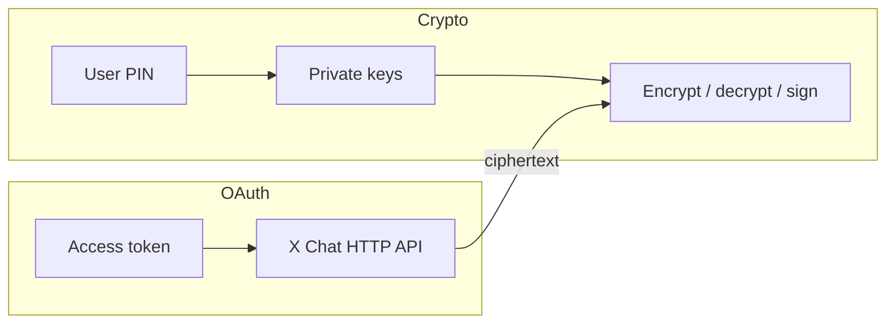

As **chaves privadas** de identidade e de assinatura do X Chat são a raiz da identidade de mensagens criptografadas de um usuário. Quem as detém consegue desembrulhar as chaves de conversa entregues a essa identidade e assinar como aquele usuário no chat. Trate o **PIN / código de acesso** de criptografia da mesma forma: ele recupera essas chaves a partir do backup seguro de chaves.

Esta página cobre regras para todo tipo de app. Para a arquitetura de cliente recomendada, veja [Criando apps de UI com WASM](/xchat/building-ui-apps-with-wasm).

---

## Aviso crítico para usuários e desenvolvedores de apps

<Warning>
**Nunca peça aos usuários finais que compartilhem o PIN de criptografia ou as chaves privadas com um servidor de terceiros, um agente de suporte ou um app "auxiliar".**

O PIN desbloqueia as **chaves raiz de identidade**. Uma parte que obtenha o PIN (ou o blob de chave privada) pode:

- Descriptografar chaves de conversa envelopadas para aquela identidade (e, portanto, o histórico de mensagens que ela consiga obter como texto cifrado)
- Continuar enviando e recebendo como aquela identidade criptográfica
- Manter essa capacidade **mesmo que o usuário revogue depois o OAuth** para o app

Revogar o OAuth interrompe o acesso à API para os tokens daquele app. Isso **não** invalida chaves privadas que o usuário já entregou. Prefira arquiteturas em que o PIN é digitado apenas na criptografia **no dispositivo** ([WASM no navegador](/xchat/building-ui-apps-with-wasm) ou um cliente nativo usando o Chat XDK).
</Warning>

### Texto de produto e docs que você deve exibir

Se o seu app solicita escopos OAuth relacionados a DM (`dm.read`, `dm.write` e escopos correlatos), acompanhe a tela de consentimento OAuth com uma linguagem de produto clara:

- As chaves de criptografia permanecem no dispositivo do usuário quando você usa o caminho oficial do SDK de cliente.
- Usuários nunca devem digitar o PIN do X Chat em um site que o encaminhe para um backend.
- Integrações legítimas usam o [Chat XDK](/xchat/xchat-xdk) para que a recuperação apoiada em PIN e a criptografia rodem localmente (para navegadores: WASM + backup seguro de chaves).
- Um app malicioso que obtenha chaves privadas pode exfiltrá-las; hoje não existe um "revogar essa chave" do lado do servidor para uma chave raiz mantida puramente no cliente — projete de forma que os usuários nunca precisem entregar chaves raiz a você.

---

## O que conta como material de chave sensível

| Material | Sensibilidade | Notas |
|:---------|:--------------|:------|
| **PIN / código de acesso de criptografia** | Crítica | Recupera chaves privadas do [backup seguro de chaves](/xchat/cryptography-primer#secure-key-backup-distributed-key-storage) |
| **Chave privada de identidade** | Crítica | Desembrulha as chaves de conversa deste usuário |
| **Chave privada de assinatura** | Crítica | Prova a autoria de mensagens e mudanças de estado |
| **Blob de `export_keys`** | Crítica | Estado privado completo e opaco do Chat XDK; trate como um arquivo de senhas |
| **Chaves de conversa desembrulhadas** | Alta | Descriptografam mensagens em uma conversa (versionadas; ainda sensíveis) |
| **Tokens OAuth de acesso / refresh** | Alta | Apenas acesso à API — não substituem as chaves privadas do chat e não são revogados ao deletar chaves |
| **Tokens de auth de realm do Juicebox** | Média | Autorizam o protocolo de backup para um usuário/versão de chave; não são o PIN |
| **Chaves públicas** | Pública | Seguras para buscar e armazenar |

---

## Escolha o caminho de chave certo por tipo de app

| Tipo de app | Caminho de chave recomendado | Não faça |
|:------------|:-----------------------------|:---------|
| **UI web voltada ao usuário** | [Chat XDK WASM](/xchat/building-ui-apps-with-wasm) no navegador + `setup` / `unlock` (backup seguro de chaves) | Enviar PIN ou chaves privadas aos seus servidores; armazenar blobs de chave em bruto no `localStorage` |
| **Cliente nativo mobile / desktop** | Chat XDK no dispositivo + backup seguro de chaves ou blob apoiado no keystore do SO | Sincronizar blobs de chave não criptografados para a sua nuvem |
| **Bot / automação na sua infraestrutura** | Blob de `export_keys` em um **secret manager** ou HSM; carregue com `import_keys` | Commitar blobs no git; registrá-los em log; embutir em JS do lado do cliente |
| **Servidor que só movimenta texto cifrado** | Nenhuma chave privada — apenas faça proxy dos payloads criptografados | Descriptografar "por conveniência" no servidor para usuários de UI |

Apps cliente devem preferir **backup seguro de chaves**. Servidores e bots costumam usar um blob de chave exportado. Detalhes: [Guia de introdução](/xchat/getting-started#2-initialize-the-chat-xdk-with-existing-keys).

---

## Regras para chaves privadas e PINs

### Faça

- **Colete o PIN apenas em uma UI cliente confiável** que alimente o Chat XDK (`unlock` / `setup`) no mesmo dispositivo.
- **Mantenha as chaves em memória apenas enquanto forem necessárias.** Após o unlock, reutilize a mesma instância Chat durante a sessão; chame `lock()` ou `free()` no logout.
- **Zere os buffers de PIN quando a API permitir** (por exemplo, passe um PIN como `Uint8Array` em JS para poder limpá-lo após o `unlock`).
- **Armazene blobs de chave de bots em um secret manager** (ou HSM), criptografe em repouso, restrinja IAM, rotacione credenciais de processo com frequência.
- **Registre logs com cuidado:** nunca registre PINs, chaves privadas, blobs de chave, chaves de conversa desembrulhadas ou respostas completas de backup seguro.
- **Defenda o cliente:** XSS, extensões maliciosas e dependências comprometidas podem ler chaves em memória mesmo quando o caminho de rede está limpo.

### Não faça

- **Não** envie por e-mail, tire prints ou abra ticket com um PIN ou blob de chave.
- **Não** coloque chaves privadas ou PINs em query strings, analytics, rastreadores de erro ou logs de CDN.
- **Não** envie chaves privadas de usuário final "para simplificar o backend".
- **Não** confunda **revogação de OAuth** com **revogação de chave**. Desconectar um app não apaga chaves que o usuário já exportou ou digitou em um cliente hostil.
- **Não** armazene a saída bruta de `export_keys` em `localStorage` ou IndexedDB não criptografado em apps de UI de produção.

---

## Persistência de sessão no navegador

Apps de navegador em produção devem otimizar primeiro pela **segurança** e depois pela UX:

| Estratégia | Segurança | UX | Recomendação |
|:-----------|:----------|:---|:-------------|
| **Desbloquear uma vez por carregamento de página; manter Chat em memória** | Forte | PIN após cada recarga completa; sem PIN por mensagem | **Recomendação padrão** |
| **Pedir PIN novamente a cada mensagem** | Forte, mas ruidosa | Ruim | Evite (antipadrão só de demonstração) |
| **Blob de chave em texto simples ou base64 em `localStorage`** | Fraca (qualquer XSS ou dispositivo compartilhado lê as chaves) | Conveniente | **Não use em produção** |
| **Apenas backup seguro de chaves com PIN** (Juicebox) | Forte; recuperação com limite de tentativas | PIN em novo dispositivo / recarga | **Armazenamento durável preferido** |

Demos internos às vezes exportam chaves para o `localStorage` por conveniência. Isso é aceitável para protótipos descartáveis; **não** é um padrão de produção. Prefira:

1. `createChat` + `unlock(pin)` após a recarga.
2. Contexto em nível de módulo ou de framework guardando a instância desbloqueada para navegação na SPA.
3. `lock()` quando a aba fizer logout ou o usuário bloquear o app.

Se você adicionar um comportamento extra de "manter desbloqueado neste dispositivo", envolva qualquer material persistido com **Web Crypto** (chaves não extraíveis sempre que possível), vincule-o à sessão do usuário e, ainda assim, nunca envie esse material aos seus servidores. O caminho de recuperação durável continua sendo o PIN do usuário e o backup seguro de chaves — não uma segunda cópia da chave raiz na sua infraestrutura.

---

## Escopos OAuth vs chaves de criptografia

Estes são planos de controle separados:

- **OAuth** autoriza chamadas de API (listar conversas, publicar texto cifrado, buscar eventos).
- **Chaves privadas** autorizam o acesso criptográfico ao conteúdo das mensagens.

Um produto completo deve:

1. Solicitar apenas os escopos de DM de que precisa.
2. Explicar por que o acesso a DM é necessário.
3. Rodar a criptografia **no dispositivo**, para que o OAuth nunca se torne um canal para coletar PINs.
4. Parar de manter tokens no logout; separadamente, chamar `lock()` nas chaves do chat.

---

## Checklist operacional

- [ ] Sem campos de PIN ou chave privada nos corpos de requisição do servidor para fluxos de UI
- [ ] Backup seguro de chaves (`setup` / `unlock`) para clientes; secret manager para blobs de bots
- [ ] Instância Chat desbloqueada com escopo de uma única sessão de usuário; limpa no logout
- [ ] Logging e APM sem segredos
- [ ] Controles de CSP e XSS em qualquer página que possa desbloquear o chat
- [ ] Texto voltado ao usuário: nunca compartilhar o PIN com terceiros
- [ ] Plano de incidentes: se um blob de bot vazar, rotacionar chaves / registrar novamente e tratar o texto cifrado histórico como exposto ao detentor da chave antiga

---

## Leituras relacionadas

- [Criando apps de UI com WASM](/xchat/building-ui-apps-with-wasm) — arquitetura de cliente
- [Primer de criptografia](/xchat/cryptography-primer) — chaves de identidade, chaves de conversa, backup seguro de chaves
- [Guia de introdução](/xchat/getting-started) — registrar chaves e enviar uma mensagem
- [Chat XDK](/xchat/xchat-xdk) — referência da API
- [Fundamentos: Segurança](/fundamentals/security) — OAuth e higiene de credenciais de API
