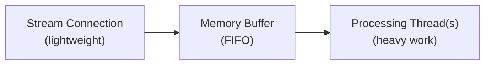

Learn how to build robust clients that consume data from X streaming endpoints.

## Streaming endpoints overview

X streaming endpoints are categorized by volume:

| Category | Endpoints | Description |
|:---------|:----------|:------------|
| **High-volume streams** | **Firehose**, [Volume Streams](/x-api/posts/volume-streams/introduction) (1% and 10% sampled) | Deliver large volumes of Post data without filtering. Designed for comprehensive coverage of platform activity. |
| **Lower-volume streams** | [Filtered Stream](/x-api/posts/filtered-stream/introduction) | Allow you to specify keywords or criteria to receive only matching Posts. Ideal for targeted monitoring. |
| **Low-latency streams** | [Powerstream](/x-api/powerstream/introduction) | Optimized for speed with minimal delay. Best for use cases requiring real-time data delivery. |

## Data delivery and latency

X API streaming endpoints prioritize **data hydration and delivery**. To ensure you receive hydrated Post data with all metadata, these streams have a **P99 latency of approximately 6-7 seconds**.

### Delivery guarantees

| Metric | Value |
|:-------|:------|
| Retry strategy | Exponential back-off |
| P99 latency | ~6-7 seconds |

### High-volume streams

For high-volume streams like Firehose and Sample (1% and 10%) streams, **99% of all Posts are delivered within 1 minute** of their creation time. This guarantee is based on the high-volume, continuous nature of the full data feed.

### Lower-volume streams

For streams with potentially lower-volume like Filtered Stream, delivery times may vary based on the specificity of your filters and the resulting volume of matching Posts.

<Note>
If your use case requires lower latency, consider [Powerstream](/x-api/powerstream/introduction), which is optimized for speed and delivers data with minimal delay.
</Note>

<Warning>
Latency and data delivery may be negatively impacted during outages. Refer to the [status page](https://docs.x.com/status) for updates when issues occur.
</Warning>

---

## Client design

When building a solution with streaming endpoints, your client needs to:

1. **Establish an HTTPS streaming connection** to the streaming endpoint
2. **Handle low data volumes** — Maintain the connection, detecting Post objects and keep-alive signals
3. **Handle high data volumes** — Decouple stream ingestion from processing using asynchronous processes, and ensure client-side buffers are flushed regularly
4. **Manage volume tracking** on the client side
5. **Detect disconnections** and reconnect automatically

For endpoints with rules (like Filtered Stream and Powerstream), your client should also asynchronously send requests to manage rules without disconnecting from the stream.

---

## Connecting to a streaming endpoint

Establishing a connection to X API streaming endpoints means making a very long-lived HTTP request and parsing the response incrementally. Conceptually, you can think of it as downloading an infinitely long file over HTTP.

Once a connection is established, the X server will deliver Post events through the connection as long as it remains open.

```python
import requests

def connect_to_stream(url, bearer_token):
    headers = {"Authorization": f"Bearer {bearer_token}"}
    
    response = requests.get(url, headers=headers, stream=True)
    
    for line in response.iter_lines():
        if line:
            # Process the Post
            print(line.decode("utf-8"))
```

---

## Consuming data

JSON objects from the stream may have fields in any order, and not all fields will be present in all circumstances. Posts are not delivered in sorted order, and duplicate messages may occur. Over time, new message types may be added to the stream.

Your client must tolerate:

- Fields appearing in any order
- Unexpected or missing fields
- Non-sorted Posts
- Duplicate messages
- New message types appearing at any time

---

## Buffering

Streaming endpoints send data as quickly as it becomes available, which can result in high volumes. If the X server cannot write new data to the stream (for example, if your client is not reading fast enough), it will buffer content on its end. However, when this buffer is full, the connection will be dropped and buffered Posts will be lost.

One way to identify when your app is falling behind is to compare the timestamp of received Posts with the current time and track this over time.

To minimize stream backups:

- **Read the stream quickly** — Don't do processing work as you read. Hand activities to another thread/process/data store for asynchronous processing
- **Ensure sufficient bandwidth** — Your data center needs inbound bandwidth for large sustained volumes as well as spikes (5-10x normal volume)

---

## Responding to system messages

### Keep-alive signals

At least every 20 seconds, the stream sends a keep-alive signal (heartbeat) in the form of a `\r\n` carriage return through the open connection. This prevents your client from timing out. Your client should be tolerant of these characters.

If your client implements a read timeout on your HTTP library, it can rely on the HTTP protocol to throw an event if no data is read within this period. It's recommended to wrap HTTP methods with error/event handlers to detect these timeouts and trigger a reconnect.

### Error messages

Streaming endpoints may deliver in-stream error messages. Your client should be tolerant of changing message payloads.

Example error message format:

```json
{
  "errors": [{
    "title": "operational-disconnect",
    "disconnect_type": "UpstreamOperationalDisconnect",
    "detail": "This stream has been disconnected upstream for operational reasons.",
    "type": "https://api.x.com/2/problems/operational-disconnect"
  }]
}
```

<Note>
Error messages indicating a force disconnect due to a full buffer may never reach your client if the backup prevents delivery. Your app should not depend solely on these messages to initiate reconnection.
</Note>

---

## Usage tracking

Monitor your stream data volumes for unexpected deviations. A significant decrease in volume may indicate an issue other than disconnection — the stream would still receive keep-alive signals and some data, but reduced Post volume should prompt investigation.

To create monitoring:

1. Track the number of Posts expected in a set time period
2. If volume falls below a threshold and doesn't recover, initiate alerts
3. Also monitor for large increases, especially when modifying rules or during events that spike Post activity

<Note>
Posts delivered through streaming endpoints count towards your monthly Post volume. Track and adjust consumption to optimize usage. If volume is high, consider adding a `sample:` operator to rules to reduce matching from 100% to `sample:50` or `sample:25`.
</Note>

---

## Multi-threaded processing

Building a multi-threaded application is key for handling high-volume streams. A best practice:

1. **Stream thread** — A lightweight thread that establishes the connection and writes received JSON to a memory structure or buffered stream reader
2. **Processing thread(s)** — Separate threads that consume from the buffer and do the heavy lifting: parsing JSON, preparing database writes, or other application logic

This design allows your service to scale efficiently as incoming Post volumes change.



---

## Next steps

<CardGroup cols={2}>
  <Card title="Handling disconnections" icon="plug" href="/x-api/fundamentals/handling-disconnections">
    Reconnect gracefully when connections drop
  </Card>
  <Card title="High volume capacity" icon="gauge-high" href="/x-api/fundamentals/high-volume-capacity">
    Handle high throughput streams
  </Card>
  <Card title="Recovery and redundancy" icon="shield" href="/x-api/fundamentals/recovery-and-redundancy">
    Build resilient streaming applications
  </Card>
</CardGroup>
