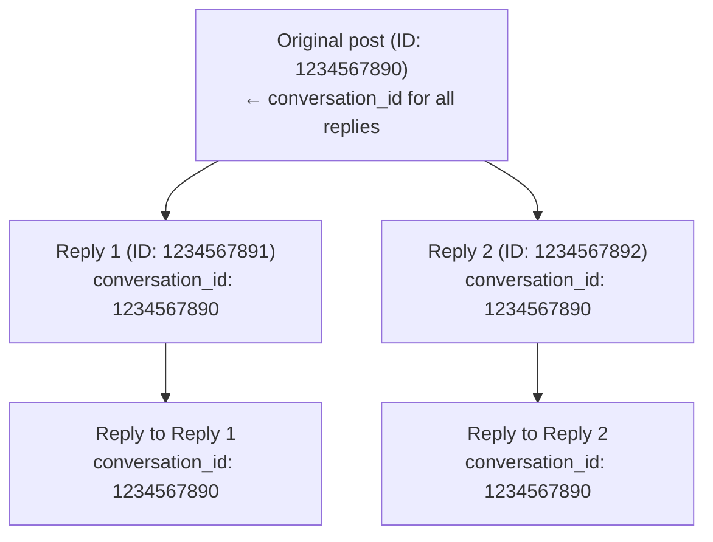

Every reply on X belongs to a conversation thread. The `conversation_id` field lets you identify, track, and reconstruct entire conversation trees.

---

## How it works

When someone posts and others reply, all replies share the same `conversation_id`—the ID of the original post that started the conversation.



No matter how deep the thread goes, all posts share the same `conversation_id`.

---

## Requesting conversation_id

Add `conversation_id` to your `tweet.fields`:

```bash
curl "https://api.x.com/2/tweets/1234567891?tweet.fields=conversation_id,in_reply_to_user_id,referenced_tweets" \
  -H "Authorization: Bearer $TOKEN"
```

Response:

```json
{
  "data": {
    "id": "1234567891",
    "text": "@user Great point!",
    "conversation_id": "1234567890",
    "in_reply_to_user_id": "2244994945",
    "referenced_tweets": [{
      "type": "replied_to",
      "id": "1234567890"
    }]
  }
}
```

---

## Getting a full conversation

Use `conversation_id` as a search operator to retrieve all posts in a thread:

```bash
curl "https://api.x.com/2/tweets/search/recent?\
query=conversation_id:1234567890&\
tweet.fields=author_id,created_at,in_reply_to_user_id&\
expansions=author_id" \
  -H "Authorization: Bearer $TOKEN"
```

This returns all replies to the original post, sorted reverse-chronologically.

---

## Use cases

<Tabs>
  <Tab title="Thread reconstruction">
Build the full conversation tree:

```python
import requests

conversation_id = "1234567890"
url = f"https://api.x.com/2/tweets/search/recent"
params = {
    "query": f"conversation_id:{conversation_id}",
    "tweet.fields": "author_id,in_reply_to_user_id,referenced_tweets,created_at",
    "max_results": 100
}

response = requests.get(url, headers=headers, params=params)
replies = response.json()["data"]

# Sort by created_at to get chronological order
replies.sort(key=lambda x: x["created_at"])
```
  </Tab>
  <Tab title="Conversation monitoring">
Stream replies to specific conversations in real-time:

```bash
# Add a filtered stream rule for a conversation
curl -X POST "https://api.x.com/2/tweets/search/stream/rules" \
  -H "Authorization: Bearer $TOKEN" \
  -d '{"add": [{"value": "conversation_id:1234567890"}]}'
```
  </Tab>
  <Tab title="Conversation analytics">
Count replies in a conversation:

```bash
curl "https://api.x.com/2/tweets/counts/recent?\
query=conversation_id:1234567890" \
  -H "Authorization: Bearer $TOKEN"
```
  </Tab>
</Tabs>

---

## Related fields

| Field | Description |
|:------|:------------|
| `conversation_id` | ID of the original post that started the thread |
| `in_reply_to_user_id` | User ID of the post being replied to |
| `referenced_tweets` | Array with `type: "replied_to"` and the parent post ID |

---

## Example: Full thread retrieval

```json
{
  "data": [
    {
      "id": "1234567893",
      "text": "@user2 @user1 I agree with you both!",
      "conversation_id": "1234567890",
      "author_id": "3333333333",
      "created_at": "2024-01-15T12:05:00.000Z",
      "in_reply_to_user_id": "2222222222",
      "referenced_tweets": [{"type": "replied_to", "id": "1234567892"}]
    },
    {
      "id": "1234567892",
      "text": "@user1 That's interesting!",
      "conversation_id": "1234567890",
      "author_id": "2222222222",
      "created_at": "2024-01-15T12:03:00.000Z",
      "in_reply_to_user_id": "1111111111",
      "referenced_tweets": [{"type": "replied_to", "id": "1234567890"}]
    },
    {
      "id": "1234567891",
      "text": "@user1 Great point!",
      "conversation_id": "1234567890",
      "author_id": "4444444444",
      "created_at": "2024-01-15T12:02:00.000Z",
      "in_reply_to_user_id": "1111111111",
      "referenced_tweets": [{"type": "replied_to", "id": "1234567890"}]
    }
  ],
  "meta": {
    "result_count": 3
  }
}
```

---

## Notes

- The original post's `conversation_id` equals its own `id`
- `conversation_id` is available on all v2 endpoints that return posts
- Use with [filtered stream](/x-api/posts/filtered-stream/introduction) to monitor conversations in real-time
- Combine with [pagination](/x-api/fundamentals/pagination) for large threads

---

## Next steps

<CardGroup cols={2}>
  <Card title="Search posts" icon="magnifying-glass" href="/x-api/posts/search/introduction">
    Search by conversation_id.
  </Card>
  <Card title="Filtered stream" icon="signal-stream" href="/x-api/posts/filtered-stream/introduction">
    Monitor conversations in real-time.
  </Card>
</CardGroup>
