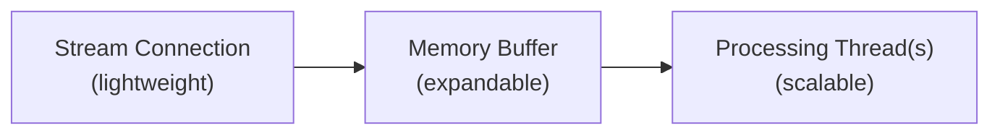

Learn how to prepare for high-volume events when using X streaming endpoints including [Filtered Stream](/x-api/posts/filtered-stream/introduction), [Volume Streams](/x-api/posts/volume-streams/introduction), [Powerstream](/x-api/powerstream/introduction), and [Compliance Streams](/x-api/compliance/streams/introduction).

## Planning for high-volume events

Major national and global events are often accompanied by dramatic spikes in user activity across social media. Sometimes these events are known in advance:

- Super Bowl
- Political elections
- New Year's celebrations worldwide

Other times, spikes are unexpected:

- Natural disasters
- Unplanned political events
- Pop culture moments
- Health emergencies

These bursts may be short-lived (seconds) or sustained over several minutes. Proper preparation helps your applications handle these spikes.

---

## Review your stream rules

Before high-volume events:

- Certain keywords can skyrocket during events (e.g., brand mentions when a brand sponsors a major sporting event)
- Remove unnecessary or overly generic rules that may generate excessive activity volumes
- Communicate with stakeholders prior to known high-volume events to help them plan appropriately

---

## Stress test your application

Anticipate that burst volumes may reach **5-10x average daily consumption levels**. Depending on your rules, the increase may be much higher.

Test your application with simulated high volumes to identify bottlenecks before real events occur.

---

## Understand delivery caps

Flow and delivery caps are based on your access level:

| Access Level | Delivery Cap |
|:-------------|:-------------|
| Academic | 250 Posts/second |
| Enterprise | Posts/second set at access level |

---

## Stay connected

With streams, staying connected is essential to avoid missing data.

Your client application should:

1. **Detect disconnects** immediately
2. **Retry connections** using appropriate backoff strategies
3. **Use exponential backoff** if reconnect attempts fail

See [Handling disconnections](/x-api/fundamentals/handling-disconnections) for detailed reconnection strategies.

---

## Build client-side buffering

Building a multi-threaded application is key for handling high-volume streams:

### Recommended architecture

1. **Stream thread** (lightweight)
   - Establishes the streaming connection
   - Writes received JSON to a memory structure or buffered stream reader
   - Handles incoming data only — no processing

2. **Memory buffer**
   - Grows and shrinks as needed
   - Acts as a shock absorber for volume spikes

3. **Processing thread(s)** (heavy lifting)
   - Consumes from the buffer
   - Parses JSON
   - Prepares database writes
   - Handles application logic

---

## Consider time zones

Global events happen in global time zones. Events may occur:

- After business hours
- Over weekends
- During holidays

Ensure your team is prepared for spikes outside normal business hours. Consider:

- Automated alerting systems
- On-call rotations
- Automated scaling responses

---

## Monitoring recommendations

1. **Track Post volume** in real-time
2. **Set up alerts** for volume thresholds (both increases and decreases)
3. **Monitor buffer sizes** to detect when your processing is falling behind
4. **Compare Post timestamps** to current time to identify lag

---

## Emergency measures

Implement safeguards for extreme circumstances:

- **Automated alerts** when volume passes preset thresholds
- **Automated rule deletion** for rules bringing in excessive data
- **Stream disconnection** in extreme circumstances to protect your systems
- **Sampling operators** — add `sample:` to rules to reduce matching volume

---

## Next steps

<CardGroup cols={2}>
  <Card title="Consuming streaming data" icon="stream" href="/x-api/fundamentals/consuming-streaming-data">
    Build robust streaming clients
  </Card>
  <Card title="Handling disconnections" icon="plug" href="/x-api/fundamentals/handling-disconnections">
    Reconnect gracefully
  </Card>
  <Card title="Recovery and redundancy" icon="shield" href="/x-api/fundamentals/recovery-and-redundancy">
    Build resilient applications
  </Card>
</CardGroup>
