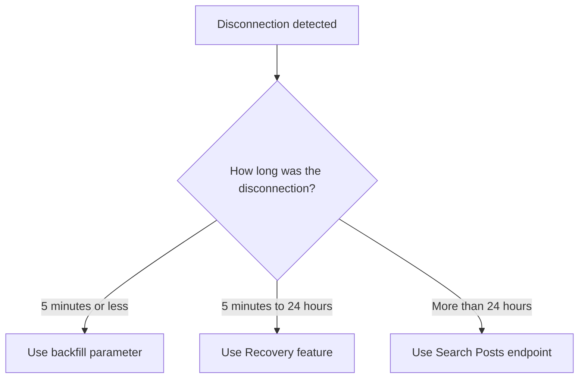

Learn how to maximize connection time and recover missed data when using X streaming endpoints including [Filtered Stream](/x-api/posts/filtered-stream/introduction), [Volume Streams](/x-api/posts/volume-streams/introduction), [Powerstream](/x-api/powerstream/introduction), and [Compliance Streams](/x-api/compliance/streams/introduction).

## Overview

When consuming streaming data, maximizing connection time and receiving all matched data is a fundamental goal. This requires:

- Taking advantage of redundant connections
- Automatically detecting disconnections
- Reconnecting quickly
- Having a plan for recovering lost data

---

## Redundant connections

A redundant connection allows you to establish more than one simultaneous connection to a stream. This provides redundancy by connecting with two separate consumers, receiving the same data through both connections.

Benefits:
- Hot failover if one stream disconnects
- Protection if your primary server fails
- Continuous data delivery during reconnection

### How to use

Simply connect to the same stream URL with a second client. Data will be sent through both connections.

<Note>
Redundant connections are available for Enterprise access. Filtered Stream allows up to two redundant connections for Enterprise projects. Check your specific endpoint documentation for connection limits.
</Note>

---

## Backfill

After detecting a disconnection, your system should track how long the disconnection lasted to determine the appropriate recovery method.

### For disconnections of 5 minutes or less

Use the **backfill parameter** when reconnecting to receive Posts matched during the disconnection period.

| Endpoint | Parameter | Example |
|:---------|:----------|:--------|
| Filtered Stream | `backfill_minutes` | `?backfill_minutes=5` |
| Powerstream | `backfillMinutes` | `?backfillMinutes=5` |

Example request:

```bash
curl 'https://api.x.com/2/tweets/search/stream?backfill_minutes=5' \
  -H "Authorization: Bearer $ACCESS_TOKEN"
```

<Note>
**Important considerations:**
- Older Posts are generally delivered first, before newly matched Posts
- Posts are **not** deduplicated — if you were disconnected for 90 seconds but request 2 minutes of backfill, you'll receive 30 seconds of duplicate Posts
- Your system should be tolerant of duplicates
- Backfill is available with Enterprise access
</Note>

---

## Recovery

For disconnections lasting **longer than 5 minutes**, use the Recovery feature to replay missed data from within the last 24 hours.

### How Recovery works

1. Make a connection request with `start_time` and `end_time` parameters
2. Recovery re-streams the specified time period
3. Once complete, the connection disconnects

### Parameters

| Parameter | Type | Description |
|:----------|:-----|:------------|
| `start_time` | ISO 8601 date | Start time to recover from (UTC) |
| `end_time` | ISO 8601 date | End time to recover to (UTC) |

### Example request

**Filtered Stream:**

```bash
curl 'https://api.x.com/2/tweets/search/stream?start_time=2022-07-12T15:10:00Z&end_time=2022-07-12T15:20:00Z' \
  -H "Authorization: Bearer $ACCESS_TOKEN"
```

**Powerstream:**

```bash
curl 'https://api.x.com/2/powerstream?startTime=2022-07-12T15:10:00Z&endTime=2022-07-12T15:20:00Z' \
  -H "Authorization: Bearer $ACCESS_TOKEN"
```

<Note>
**Recovery limits:**
- Available for Enterprise access
- Recovery window: up to 24 hours in the past
- Filtered Stream allows 2 concurrent recovery jobs
</Note>

---

## Alternative recovery: Search

If you don't have access to backfill or recovery features, or if the disconnection exceeded 24 hours, you can use the [Search Posts endpoint](/x-api/posts/search/introduction) to request missed data.

<Warning>
**Matching differences:**
The Search Posts endpoint does not include the `sample:`, `bio:`, `bio_name:`, or `bio_location:` operators, and has certain differences in matching behavior with accents and diacritics. This means you may not fully recover all Posts that would have been received via streaming endpoints.
</Warning>

---

## Recovery decision tree



---

## Best practices

1. **Track disconnection duration** — Your system should note when disconnections occur and how long they last

2. **Implement automatic recovery** — Based on disconnection duration, automatically choose the appropriate recovery method

3. **Handle duplicates** — Both backfill and recovery may deliver duplicate Posts; implement deduplication logic

4. **Use redundant connections** — Prevent data loss by maintaining multiple connections when available

5. **Monitor recovery jobs** — Track the status and completion of recovery operations

---

## Next steps

<CardGroup cols={2}>
  <Card title="Handling disconnections" icon="plug" href="/x-api/fundamentals/handling-disconnections">
    Detect and handle disconnections
  </Card>
  <Card title="Consuming streaming data" icon="stream" href="/x-api/fundamentals/consuming-streaming-data">
    Build robust streaming clients
  </Card>
  <Card title="High volume capacity" icon="gauge-high" href="/x-api/fundamentals/high-volume-capacity">
    Handle high throughput streams
  </Card>
</CardGroup>
