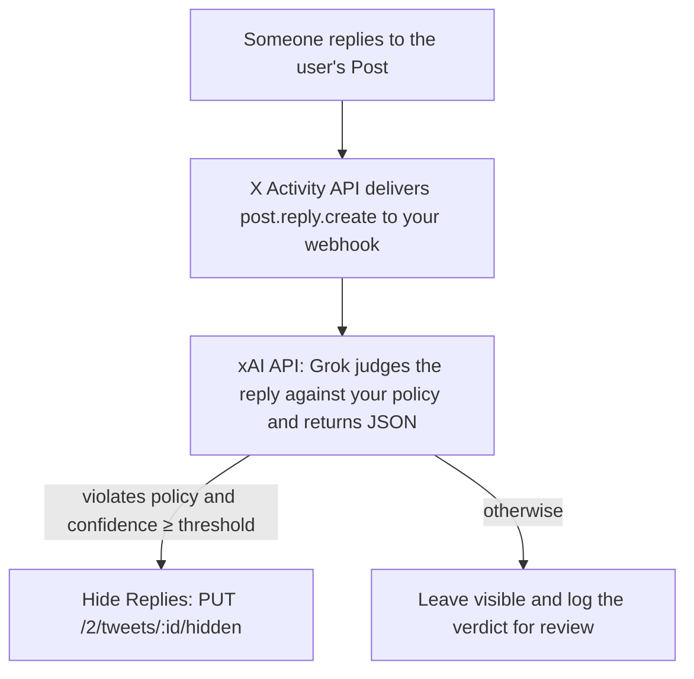

With the Hide Replies endpoint, you can build a workflow that hides replies to a user's Posts as soon as they arrive, when there is a very high probability that the reply breaks the rules the user set for their conversation.

This guide combines three APIs:

1. The [X Activity API](/x-api/activity/introduction) delivers a `post.reply.create` event to your webhook each time someone replies to one of the user's Posts.
2. The [xAI API](https://docs.x.ai) asks Grok to judge the reply against a moderation policy you write in plain language, and to return its verdict as structured JSON.
3. The [Hide Replies](/x-api/posts/hide-reply) endpoint hides the reply when Grok's verdict crosses your confidence threshold.



<Note>
An earlier version of this guide used Google Jigsaw's Perspective API for toxicity scoring and the Account Activity API for delivery. Perspective has been deprecated, and the [Account Activity API](/x-api/account-activity/introduction) is being replaced by the X Activity API. The approach below uses Grok, which lets you describe your own policy and have the reply judged in the context of the Post it answers.
</Note>

## Prerequisites

- A [developer account](https://developer.x.com/en/portal/petition/essential/basic-info) with a Project and App that has the X Activity API and Webhooks enabled.
- An xAI API key from [console.x.ai](https://console.x.ai). Purchases of X API credits earn [free xAI API credits](/x-api/getting-started/pricing#free-xai-api-credits).
- A publicly reachable HTTPS endpoint to receive webhook events. See the [Webhooks quickstart](/x-api/webhooks/quickstart) for URL requirements.

---

## How the app works

<Steps>
  <Step title="Ask the user for permission" icon="/icons/xds/icon-key.svg">
    Authorize the user with the [OAuth 2.0 Authorization Code Flow with PKCE](/fundamentals/authentication/oauth-2-0/authorization-code) and request these scopes:

    | Scope | Why it is needed |
    |:------|:-----------------|
    | `tweet.read` | Required by the `post.reply.create` event and by Hide Replies. |
    | `users.read` | Required by Hide Replies. |
    | `tweet.moderate.write` | Hide and unhide replies to the user's Posts. |
    | `offline.access` | Issues a refresh token so your app keeps working after the two-hour access token expires. |

    Store the user's access token, refresh token, and user ID. You can read the ID from `GET /2/users/me`:

    ```bash
    curl "https://api.x.com/2/users/me" \
      -H "Authorization: Bearer $USER_ACCESS_TOKEN"
    ```
  </Step>

  <Step title="Register a webhook" icon="webhook">
    The X Activity API delivers events to a webhook you host. Register it once per environment with your app's Bearer Token and keep the returned `webhook_id`.

    ```bash
    curl -X POST "https://api.x.com/2/webhooks" \
      -H "Authorization: Bearer $BEARER_TOKEN" \
      -H "Content-Type: application/json" \
      -d '{"url": "https://yourdomain.com/webhook"}'
    ```

    X immediately sends a Challenge-Response Check (CRC) to the URL and repeats it hourly. Your endpoint must answer the CRC and should verify the `X-Twitter-Webhooks-Signature-OAuth2` header on every event. Both are implemented in the [full example](#put-it-together) below; the [Webhooks quickstart](/x-api/webhooks/quickstart) explains them in detail.
  </Step>

  <Step title="Subscribe to the user's replies" icon="/icons/xds/icon-bell.svg">
    Create one `post.reply.create` subscription per user. This is a private event, so the request uses the user's access token, and `filter.user_id` must be that user's ID.

    ```bash
    curl -X POST "https://api.x.com/2/activity/subscriptions" \
      -H "Authorization: Bearer $USER_ACCESS_TOKEN" \
      -H "Content-Type: application/json" \
      -d '{
        "event_type": "post.reply.create",
        "filter": { "user_id": "1111111111111111111" },
        "webhook_id": "2090847910112202752",
        "tag": "reply-moderation"
      }'
    ```

    ```json title="Response" lines wrap icon="/icons/xds/icon-brackets.svg"
    {
      "data": {
        "subscription": {
          "subscription_id": "1998240115200000001",
          "event_type": "post.reply.create",
          "filter": { "user_id": "1111111111111111111" },
          "webhook_id": "2090847910112202752",
          "tag": "reply-moderation",
          "created_at": "2026-10-01T14:30:00.000Z",
          "updated_at": "2026-10-01T14:30:00.000Z"
        }
      }
    }
    ```

    From now on, each direct reply to one of the user's Posts arrives at your webhook as a `post.reply.create` event. The `payload` is the reply Post; `includes.tweets` may contain the Post being replied to.

    ```json title="post.reply.create" expandable lines wrap icon="/icons/xds/icon-brackets.svg"
    {
      "data": {
        "event_uuid": "3091827364059182736",
        "filter": { "user_id": "1111111111111111111" },
        "event_type": "post.reply.create",
        "tag": "reply-moderation",
        "payload": {
          "id": "2090000000000000001",
          "author_id": "2222222222222222222",
          "conversation_id": "2080761390344937796",
          "in_reply_to_tweet_id": "2080761390344937796",
          "in_reply_to_user_id": "1111111111111111111",
          "text": "@ExampleUser nobody asked, delete your account you worthless clown",
          "lang": "en",
          "created_at": "2026-10-01T18:00:00.000Z"
        },
        "includes": {
          "tweets": [
            {
              "id": "2080761390344937796",
              "author_id": "1111111111111111111",
              "text": "We just shipped the new API dashboard. Let us know what you think!"
            }
          ]
        }
      }
    }
    ```
  </Step>

  <Step title="Ask Grok whether the reply breaks the policy" icon="brain">
    Send the reply, together with the Post it answers, to the xAI [Responses API](https://docs.x.ai/developers/model-capabilities/text/generate-text). The system prompt carries the moderation policy. A [structured output](https://docs.x.ai/developers/model-capabilities/text/structured-outputs) schema guarantees that the answer is JSON your code can act on without parsing free text.

    ```bash
    curl "https://api.x.ai/v1/responses" \
      -H "Authorization: Bearer $XAI_API_KEY" \
      -H "Content-Type: application/json" \
      -d '{
        "model": "grok-4.7",
        "reasoning": { "effort": "low" },
        "store": false,
        "input": [
          {
            "role": "system",
            "content": "You review replies to a user on X and decide whether each reply violates their moderation policy. Policy: hide harassment, hateful or demeaning language, sexual content, threats of violence, spam, and scams. Do not flag disagreement, criticism, casual profanity, or reclaimed terms used within a community. Judge the reply in the context of the Post it answers."
          },
          {
            "role": "user",
            "content": "Original Post: We just shipped the new API dashboard. Let us know what you think!\n\nReply: @ExampleUser nobody asked, delete your account you worthless clown"
          }
        ],
        "text": {
          "format": {
            "type": "json_schema",
            "name": "reply_moderation",
            "strict": true,
            "schema": {
              "type": "object",
              "properties": {
                "violates_policy": { "type": "boolean", "description": "True if the reply should be hidden under the policy." },
                "confidence": { "type": "number", "minimum": 0, "maximum": 1, "description": "How certain the verdict is, from 0 to 1." },
                "categories": {
                  "type": "array",
                  "items": { "type": "string", "enum": ["harassment", "hate", "sexual", "violence", "spam", "scam", "none"] }
                },
                "reason": { "type": "string", "maxLength": 200, "description": "One sentence a moderator can read." }
              },
              "required": ["violates_policy", "confidence", "categories", "reason"],
              "additionalProperties": false
            }
          }
        }
      }'
    ```

    The verdict is the `output_text` item of the `message` in `output`. Other fields in the response are omitted here.

    ```json title="Response (abbreviated)" lines wrap icon="/icons/xds/icon-brackets.svg"
    {
      "id": "ad5663da-63e6-86c6-e0be-ff15effa8357",
      "object": "response",
      "model": "grok-4.7",
      "status": "completed",
      "output": [
        {
          "type": "message",
          "role": "assistant",
          "status": "completed",
          "content": [
            {
              "type": "output_text",
              "text": "{\"violates_policy\":true,\"confidence\":0.96,\"categories\":[\"harassment\"],\"reason\":\"Personal insult aimed at the author with no substantive feedback.\"}"
            }
          ]
        }
      ]
    }
    ```

    Three request fields matter for this use case:

    - `store: false` tells the xAI API not to retain the reply text and verdict for later retrieval. Responses are otherwise stored for 30 days.
    - `reasoning.effort: "low"` keeps latency and token usage down for a short classification task.
    - `text.format` with `strict: true` constrains the output to the schema, so a malformed answer cannot slip through to the hide step.
  </Step>

  <Step title="Hide the reply when confidence is high" icon="eye-slash">
    Hide only when `violates_policy` is `true` **and** `confidence` meets a high threshold (this guide uses `0.9`). The request uses the subscribed user's access token because only the author of the conversation can hide replies in it.

    <CodeGroup dropdown>

    ```bash cURL
    curl -X PUT "https://api.x.com/2/tweets/2090000000000000001/hidden" \
      -H "Authorization: Bearer $USER_ACCESS_TOKEN" \
      -H "Content-Type: application/json" \
      -d '{"hidden": true}'
    ```

    ```python title="Python SDK" lines wrap icon="python"
    from xdk import Client

    # OAuth 2.0 user access token for the subscribed user
    client = Client(bearer_token=user_access_token)

    response = client.posts.hide_reply("2090000000000000001", hidden=True)
    print(f"Hidden: {response.data.hidden}")
    ```

    ```javascript title="JavaScript SDK" lines wrap icon="square-js"
    import { Client } from "@xdevplatform/xdk";

    // OAuth 2.0 user access token for the subscribed user
    const client = new Client({ accessToken: userAccessToken });

    const response = await client.posts.hideReply("2090000000000000001", {
      hidden: true,
    });
    console.log(`Hidden: ${response.data?.hidden}`);
    ```

    </CodeGroup>

    ```json title="Response" lines wrap icon="/icons/xds/icon-brackets.svg"
    {
      "data": {
        "hidden": true
      }
    }
    ```

    Record every verdict, including the ones you did not act on, so the user can see what the app decided and reverse it. Unhiding is the same request with `"hidden": false`.
  </Step>
</Steps>

---

## Put it together

The examples below are complete webhook servers. Each one answers the CRC, verifies the event signature, deduplicates events by `event_uuid`, classifies the reply with Grok, and hides it when the verdict crosses the threshold. The in-memory stores stand in for the database you would use in production.

<CodeGroup dropdown>

```python title="Python (Flask)" expandable lines wrap icon="python"
import base64
import hashlib
import hmac
import json
import os
import threading

import requests
from flask import Flask, jsonify, request

app = Flask(__name__)

X_CLIENT_SECRET = os.environ["X_OAUTH2_CLIENT_SECRET"]  # signs CRC and event payloads
XAI_API_KEY = os.environ["XAI_API_KEY"]
HIDE_THRESHOLD = 0.90

# Replace these in-memory stores with a database.
user_tokens: dict[str, str] = {}  # user_id -> OAuth 2.0 user access token
seen_events: set[str] = set()  # event_uuid values already processed
decisions: list[dict] = []  # every verdict, so the user can review and undo

SYSTEM_PROMPT = (
    "You review replies to a user on X and decide whether each reply violates "
    "their moderation policy. Policy: hide harassment, hateful or demeaning "
    "language, sexual content, threats of violence, spam, and scams. Do not flag "
    "disagreement, criticism, casual profanity, or reclaimed terms used within a "
    "community. Judge the reply in the context of the Post it answers."
)

MODERATION_SCHEMA = {
    "type": "object",
    "properties": {
        "violates_policy": {"type": "boolean"},
        "confidence": {"type": "number", "minimum": 0, "maximum": 1},
        "categories": {
            "type": "array",
            "items": {
                "type": "string",
                "enum": ["harassment", "hate", "sexual", "violence", "spam", "scam", "none"],
            },
        },
        "reason": {"type": "string", "maxLength": 200},
    },
    "required": ["violates_policy", "confidence", "categories", "reason"],
    "additionalProperties": False,
}


def sign(secret: str, message: bytes) -> str:
    digest = hmac.new(secret.encode("utf-8"), message, hashlib.sha256).digest()
    return "sha256=" + base64.b64encode(digest).decode("utf-8")


def classify_reply(reply_text: str, parent_text: str | None) -> dict:
    user_content = f"Reply: {reply_text}"
    if parent_text:
        user_content = f"Original Post: {parent_text}\n\n{user_content}"

    response = requests.post(
        "https://api.x.ai/v1/responses",
        headers={"Authorization": f"Bearer {XAI_API_KEY}"},
        json={
            "model": "grok-4.7",
            "reasoning": {"effort": "low"},
            "store": False,
            "input": [
                {"role": "system", "content": SYSTEM_PROMPT},
                {"role": "user", "content": user_content},
            ],
            "text": {
                "format": {
                    "type": "json_schema",
                    "name": "reply_moderation",
                    "strict": True,
                    "schema": MODERATION_SCHEMA,
                }
            },
        },
        timeout=30,
    )
    response.raise_for_status()

    message = next(item for item in response.json()["output"] if item["type"] == "message")
    text = next(part for part in message["content"] if part["type"] == "output_text")["text"]
    return json.loads(text)


def hide_reply(reply_id: str, user_token: str) -> None:
    response = requests.put(
        f"https://api.x.com/2/tweets/{reply_id}/hidden",
        headers={"Authorization": f"Bearer {user_token}"},
        json={"hidden": True},
        timeout=30,
    )
    response.raise_for_status()


def moderate(event: dict) -> None:
    reply = event["payload"]
    user_id = event["filter"]["user_id"]

    parent_text = next(
        (
            tweet["text"]
            for tweet in event.get("includes", {}).get("tweets", [])
            if tweet["id"] == reply.get("in_reply_to_tweet_id")
        ),
        None,
    )

    verdict = classify_reply(reply["text"], parent_text)
    decision = {"user_id": user_id, "reply_id": reply["id"], "hidden": False, **verdict}
    decisions.append(decision)

    if verdict["violates_policy"] and verdict["confidence"] >= HIDE_THRESHOLD:
        hide_reply(reply["id"], user_tokens[user_id])
        decision["hidden"] = True


@app.route("/webhook", methods=["GET", "POST"])
def webhook():
    if request.method == "GET":
        # Challenge-Response Check
        crc_token = request.args.get("crc_token", "")
        return jsonify({"response_token": sign(X_CLIENT_SECRET, crc_token.encode("utf-8"))})

    raw_body = request.get_data()
    signature = request.headers.get("X-Twitter-Webhooks-Signature-OAuth2", "")
    if not hmac.compare_digest(sign(X_CLIENT_SECRET, raw_body), signature):
        return "Invalid signature", 401

    event = json.loads(raw_body).get("data", {})
    if event.get("event_type") == "post.reply.create" and event["event_uuid"] not in seen_events:
        seen_events.add(event["event_uuid"])
        # Return 200 right away; classify and hide in the background.
        threading.Thread(target=moderate, args=(event,), daemon=True).start()

    return "", 200


if __name__ == "__main__":
    app.run(port=3000)
```

```javascript title="Node.js (Express)" expandable lines wrap icon="square-js"
import crypto from "node:crypto";
import express from "express";

const app = express();

const X_CLIENT_SECRET = process.env.X_OAUTH2_CLIENT_SECRET; // signs CRC and event payloads
const XAI_API_KEY = process.env.XAI_API_KEY;
const HIDE_THRESHOLD = 0.9;

// Replace these in-memory stores with a database.
const userTokens = new Map(); // user_id -> OAuth 2.0 user access token
const seenEvents = new Set(); // event_uuid values already processed
const decisions = []; // every verdict, so the user can review and undo

const SYSTEM_PROMPT =
  "You review replies to a user on X and decide whether each reply violates " +
  "their moderation policy. Policy: hide harassment, hateful or demeaning " +
  "language, sexual content, threats of violence, spam, and scams. Do not flag " +
  "disagreement, criticism, casual profanity, or reclaimed terms used within a " +
  "community. Judge the reply in the context of the Post it answers.";

const MODERATION_SCHEMA = {
  type: "object",
  properties: {
    violates_policy: { type: "boolean" },
    confidence: { type: "number", minimum: 0, maximum: 1 },
    categories: {
      type: "array",
      items: {
        type: "string",
        enum: ["harassment", "hate", "sexual", "violence", "spam", "scam", "none"],
      },
    },
    reason: { type: "string", maxLength: 200 },
  },
  required: ["violates_policy", "confidence", "categories", "reason"],
  additionalProperties: false,
};

const sign = (secret, message) =>
  "sha256=" + crypto.createHmac("sha256", secret).update(message).digest("base64");

async function classifyReply(replyText, parentText) {
  const userContent = parentText
    ? `Original Post: ${parentText}\n\nReply: ${replyText}`
    : `Reply: ${replyText}`;

  const response = await fetch("https://api.x.ai/v1/responses", {
    method: "POST",
    headers: {
      Authorization: `Bearer ${XAI_API_KEY}`,
      "Content-Type": "application/json",
    },
    body: JSON.stringify({
      model: "grok-4.7",
      reasoning: { effort: "low" },
      store: false,
      input: [
        { role: "system", content: SYSTEM_PROMPT },
        { role: "user", content: userContent },
      ],
      text: {
        format: {
          type: "json_schema",
          name: "reply_moderation",
          strict: true,
          schema: MODERATION_SCHEMA,
        },
      },
    }),
  });
  if (!response.ok) throw new Error(`xAI API error: ${response.status}`);

  const data = await response.json();
  const message = data.output.find((item) => item.type === "message");
  const text = message.content.find((part) => part.type === "output_text").text;
  return JSON.parse(text);
}

async function hideReply(replyId, userToken) {
  const response = await fetch(`https://api.x.com/2/tweets/${replyId}/hidden`, {
    method: "PUT",
    headers: {
      Authorization: `Bearer ${userToken}`,
      "Content-Type": "application/json",
    },
    body: JSON.stringify({ hidden: true }),
  });
  if (!response.ok) throw new Error(`X API error: ${response.status}`);
}

async function moderate(event) {
  const reply = event.payload;
  const userId = event.filter.user_id;

  const parent = (event.includes?.tweets ?? []).find(
    (tweet) => tweet.id === reply.in_reply_to_tweet_id,
  );

  const verdict = await classifyReply(reply.text, parent?.text);
  const decision = { userId, replyId: reply.id, hidden: false, ...verdict };
  decisions.push(decision);

  if (verdict.violates_policy && verdict.confidence >= HIDE_THRESHOLD) {
    await hideReply(reply.id, userTokens.get(userId));
    decision.hidden = true;
  }
}

// Challenge-Response Check
app.get("/webhook", (req, res) => {
  res.json({ response_token: sign(X_CLIENT_SECRET, String(req.query.crc_token ?? "")) });
});

app.post("/webhook", express.raw({ type: "application/json" }), (req, res) => {
  const expected = Buffer.from(sign(X_CLIENT_SECRET, req.body));
  const received = Buffer.from(req.get("X-Twitter-Webhooks-Signature-OAuth2") ?? "");
  if (expected.length !== received.length || !crypto.timingSafeEqual(expected, received)) {
    return res.status(401).send("Invalid signature");
  }

  const event = JSON.parse(req.body.toString("utf-8")).data ?? {};
  if (event.event_type === "post.reply.create" && !seenEvents.has(event.event_uuid)) {
    seenEvents.add(event.event_uuid);
    // Return 200 right away; classify and hide in the background.
    moderate(event).catch(console.error);
  }

  res.sendStatus(200);
});

app.listen(3000);
```

</CodeGroup>

---

## Tune the policy

The system prompt is where your app's judgment lives, and it is the main thing that changes from one deployment to the next.

- **Write the policy for the account it protects.** A brand account might hide competitor spam and off-topic promotion; an individual might only want slurs and threats gone. Say what to hide and, just as importantly, what to leave alone.
- **Give Grok the conversation.** Including the original Post lets the model tell a hostile reply from a blunt but relevant one. Use the Post from `includes.tweets` when it is present, or fetch it with [Post lookup](/x-api/posts/lookup/introduction) when it is not.
- **Keep the schema small.** The fields in `reply_moderation` are enough to decide, explain, and audit. Add a category to the `enum` when the policy grows a new rule; avoid open-ended fields that your code cannot act on.
- **Set the threshold high and review the rest.** Hide automatically only at high confidence. Route lower-confidence violations to a review queue in your app so a person makes the call, and use those decisions to refine the prompt.
- **Test with real replies before switching on auto-hide.** Run the classifier in log-only mode for a while, compare verdicts against what the user would have done, and adjust the policy text until the two agree.

---

## Keep the user in control

Regardless of the model or the approach you use, make the best possible effort to ensure that your users understand what your app has hidden and can change it.

- Trust the user and give them full control over their decisions. Your interface should list every reply the app hid, show the `reason` Grok returned, and offer a one-click undo that calls Hide Replies with `"hidden": false`.
- Hide only at a very high confidence threshold. A reply left visible for a moment costs little; a reply hidden by mistake can silence a legitimate voice.
- Not everybody uses the same words. Reclaimed words, slang, and in-group humor can look like violations out of context. Tell the model about them in the policy, and let users add their own exceptions.
- Be clear with reply authors and readers. Hidden replies are still reachable through "View hidden replies", and the reply author is not notified. Your app should not imply otherwise.

---

## Operational notes

- **Answer the webhook quickly.** Return `200 OK` as soon as you have verified the signature and queued the event. Call the xAI API and Hide Replies in the background, as the examples do.
- **Deduplicate.** Keep the `event_uuid` of processed events and skip repeats.
- **Direct replies only.** `post.reply.create` fires for direct replies to the user's Posts, and does not fire for replies to replies. Hide Replies can hide any reply in a conversation the user started, so pair this guide with [Manage replies by topic](/x-api/posts/hide-replies/integrate/manage-replies-by-topic) to sweep deeper threads with recent search and `conversation_id`.
- **Protected accounts.** Posts from protected accounts are not delivered through the X Activity API, so replies from protected accounts will not reach your webhook.
- **Token lifetime.** OAuth 2.0 access tokens expire after two hours. Use the refresh token from `offline.access` to obtain a new one before calling Hide Replies.
- **Revocation.** A user-context subscription is removed when the user revokes your app. Subscribe to the `oauth.revoke` event to clean up your stored tokens and decisions at the same time.
- **Billing.** Each delivered `post.reply.create` event is billed as a Post under your X API plan, and each classification consumes xAI API tokens; see [xAI pricing](https://docs.x.ai/developers/pricing). X API credit purchases earn [free xAI API credits](/x-api/getting-started/pricing#free-xai-api-credits).

---

## Next steps

<CardGroup cols={2}>
  <Card title="Manage replies by topic" icon="tags" href="/x-api/posts/hide-replies/integrate/manage-replies-by-topic">
    Moderate an existing conversation with recent search and Post annotations
  </Card>
  <Card title="X Activity API" icon="bolt" href="/x-api/activity/introduction">
    Event types, filters, and authentication for real-time delivery
  </Card>
  <Card title="Webhooks quickstart" icon="webhook" href="/x-api/webhooks/quickstart">
    CRC validation, signature verification, and webhook registration
  </Card>
  <Card title="xAI structured outputs" icon="/icons/xds/icon-brackets.svg" href="https://docs.x.ai/developers/model-capabilities/text/structured-outputs">
    Schema rules and SDK helpers for JSON responses from Grok
  </Card>
</CardGroup>
