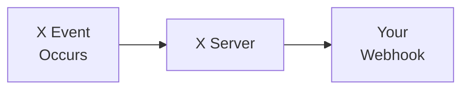

import { Button } from '/snippets/button.mdx';

Webhooks enable real-time data delivery to your server. Instead of polling for updates, receive data as events occur.

## Overview

<CardGroup cols={2}>
  <Card title="Real-time delivery" icon="bolt">
    Receive events instantly
  </Card>
  <Card title="Push-based" icon="arrow-right">
    Data sent to your server
  </Card>
  <Card title="Efficient" icon="gauge">
    No polling required
  </Card>
  <Card title="Reliable" icon="shield">
    Retry and recovery support
  </Card>
</CardGroup>

---

## Webhook types

| Type | Description |
|:-----|:------------|
| [Filtered Stream Webhooks](/x-api/webhooks/stream/introduction) | Receive filtered stream Posts via webhook |
| [Account Activity API](/x-api/account-activity/introduction) | Receive account activity events |

---

## How webhooks work



1. **Event occurs** — A user posts, sends a DM, etc.
2. **X sends request** — POST request to your webhook URL
3. **You process** — Your server handles the event
4. **Respond 200** — Return 200 OK to acknowledge

---

## Webhook requirements

| Requirement | Description |
|:------------|:------------|
| **HTTPS** | Webhook URL must use HTTPS |
| **Public** | URL must be publicly accessible |
| **Fast response** | Respond within 10 seconds |
| **200 OK** | Return 200 status to acknowledge |

---

## Security

### Challenge-Response Check (CRC)

X validates your webhook by sending a CRC request. Respond with an HMAC-SHA256 hash:

```python
import hmac
import hashlib
import base64

def handle_crc(crc_token, consumer_secret):
    sha256_hash = hmac.new(
        consumer_secret.encode(),
        crc_token.encode(),
        hashlib.sha256
    ).digest()
    
    return {
        "response_token": "sha256=" + base64.b64encode(sha256_hash).decode()
    }
```

### Signature verification

Verify webhook authenticity using the `x-twitter-webhooks-signature` header.

---

## Getting started

<Note>
**Prerequisites**

- An approved [developer account](https://developer.x.com/en/portal/petition/essential/basic-info)
- A [Project and App](/resources/fundamentals/developer-apps) in the Developer Console
- A publicly accessible HTTPS endpoint
</Note>

<CardGroup cols={2}>
  <Card title="Filtered Stream Webhooks" icon="filter" href="/x-api/webhooks/stream/introduction">
    Receive filtered Posts via webhook
  </Card>
  <Card title="Account Activity API" icon="bell" href="/x-api/account-activity/introduction">
    Receive account events via webhook
  </Card>
</CardGroup>
