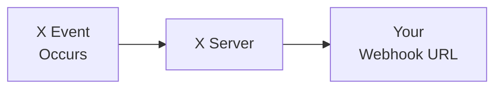

import { Button } from '/snippets/button.mdx';

The V2 Webhooks API enables developers to receive real-time event notifications from X accounts via webhook-based JSON messages. These APIs allow you to register and manage webhooks, develop consumer applications to process events, and ensure secure communication through challenge-response checks (CRC) and signature headers.

## Overview

<CardGroup cols={2}>
  <Card title="Real-time delivery" icon="bolt">
    Receive events instantly as they occur
  </Card>
  <Card title="Push-based" icon="arrow-right">
    Data sent directly to your server — no polling
  </Card>
  <Card title="Secure" icon="shield">
    CRC validation and signature verification
  </Card>
  <Card title="Reliable" icon="gauge">
    Retry and recovery support
  </Card>
</CardGroup>

---

## Products that support webhooks

These are the products that currently support delivering events via webhook:

| Product | Description |
|:--------|:------------|
| [Account Activity API (AAA)](/x-api/account-activity/introduction) | Receive real-time account activity events (posts, DMs, follows, likes, etc.) |
| [Filtered Stream Webhooks](/x-api/webhooks/stream/introduction) | Receive filtered stream Posts via webhook delivery |

---

## How webhooks work

1. **Event occurs** — A user posts, sends a DM, gets followed, etc.
2. **X sends a POST request** — JSON event payload sent to your registered webhook URL
3. **You process the event** — Your server handles the event data
4. **Respond with 200 OK** — Return a 200 status to acknowledge receipt

---

## Webhook requirements

| Requirement | Description |
|:------------|:------------|
| **HTTPS** | Webhook URL must use HTTPS |
| **Publicly accessible** | URL must be reachable from the internet |
| **No port specification** | The URL cannot include a port (e.g., `https://mydomain.com:5000/webhook` will not work) |
| **Fast response** | Respond within 10 seconds |
| **200 OK** | Return 200 status to acknowledge receipt |
| **CRC support** | Must respond to Challenge-Response Check GET requests ([learn more](/x-api/webhooks/quickstart#2-the-crc-check)) |

---

## Endpoints

| Method | Endpoint | Description |
|:-------|:---------|:------------|
| POST | [`/2/webhooks`](/x-api/webhooks/create-webhook) | Register a new webhook |
| GET | [`/2/webhooks`](/x-api/webhooks/get-webhook) | List registered webhooks |
| DELETE | [`/2/webhooks/:webhook_id`](/x-api/webhooks/delete-webhook) | Delete a webhook |
| PUT | [`/2/webhooks/:webhook_id`](/x-api/webhooks/validate-webhook) | Trigger CRC check and re-enable a webhook |

All endpoints require **OAuth2 App Only Bearer Token** authentication.

---

## Security

X's webhook-based APIs provide two methods for confirming the security of your webhook server:

1. **Challenge-Response Check (CRC)** — X sends periodic GET requests to your webhook URL. You respond with an HMAC-SHA256 hash to prove you control the endpoint. CRC checks happen on initial registration, hourly, and on manual re-validation.

2. **Signature verification** — Each POST request from X includes an `x-twitter-webhooks-signature` header. You can verify this signature to confirm X is the source of incoming events.

<Card title="See full implementation details" icon="code" href="/x-api/webhooks/quickstart">
  Step-by-step CRC setup, code examples, and signature verification
</Card>

---

## Getting started

<Note>
**Prerequisites**

- An approved [developer account](https://developer.x.com/en/portal/petition/essential/basic-info)
- A [Project and App](/resources/fundamentals/developer-apps) in the Developer Console
- A publicly accessible HTTPS endpoint
- Your app's **consumer secret** (API secret key) for CRC validation
</Note>

<CardGroup cols={2}>
  <Card title="Quickstart" icon="rocket" href="/x-api/webhooks/quickstart">
    Set up your webhook end-to-end
  </Card>
  <Card title="Filtered Stream Webhooks" icon="filter" href="/x-api/webhooks/stream/introduction">
    Receive filtered Posts via webhook
  </Card>
  <Card title="Account Activity API" icon="bell" href="/x-api/account-activity/introduction">
    Receive account events via webhook
  </Card>
  <Card title="Sample apps" icon="github" href="/x-api/webhooks/quickstart#sample-apps">
    Working code examples
  </Card>
</CardGroup>
